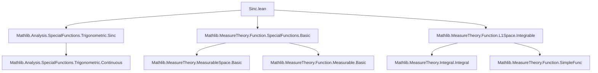
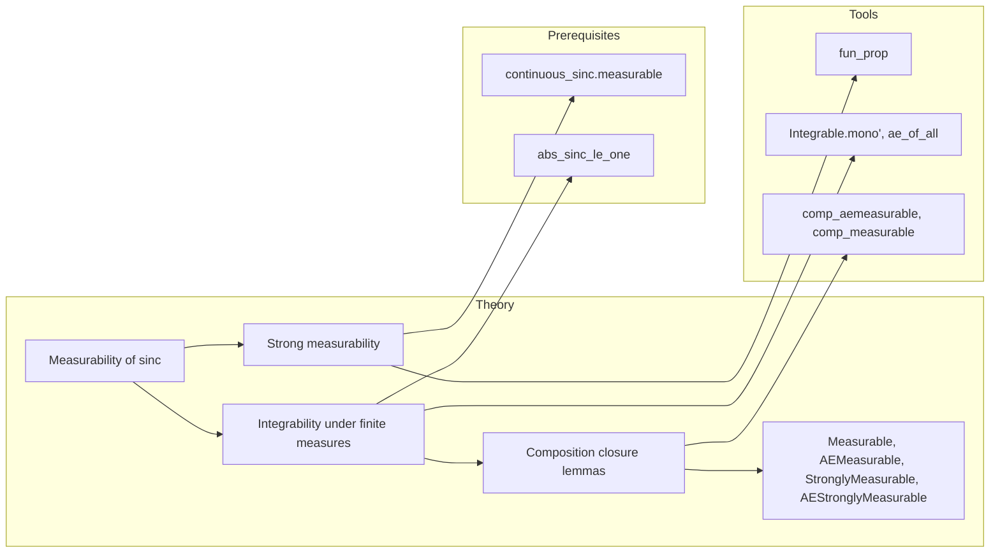

**Technical Brief: `Sinc.lean` — Measurability and Integrability of the Sinc Function**

---

### 1. **Key Definitions & Theorems**

| Name | Type / Signature | Purpose |
|------|------------------|---------|
| `sinc` | `ℝ → ℝ` | Standard sinc function: `sinc x = sin x / x` for `x ≠ 0`, `sinc 0 = 1` |
| `measurable_sinc` | `Measurable sinc` | Proves the sinc function is measurable (via continuity ⇒ measurability) |
| `stronglyMeasurable_sinc` | `StronglyMeasurable sinc` | Follows from `measurable_sinc` (in SEPARABLE target space, which `ℝ` is) |
| `integrable_sinc` | `{μ : Measure ℝ} → [IsFiniteMeasure μ] → Integrable sinc μ` | Shows sinc is integrable w.r.t. any finite measure on `ℝ`, using `|sinc x| ≤ 1` |
| `Measurable.sinc` | `Measurable f → Measurable (sinc ∘ f)` | Closure under composition: measurable preimage ⇒ measurable sinc-composition |
| `AEMeasurable.sinc` | `AEMeasurable f μ → AEMeasurable (sinc ∘ f) μ` | Same for almost-everywhere measurable functions |
| `StronglyMeasurable.sinc` | `StronglyMeasurable f → StronglyMeasurable (sinc ∘ f)` | Closure under composition for strongly measurable functions |
| `AEStronglyMeasurable.sinc` | `AEStronglyMeasurable f μ → AEStronglyMeasurable (sinc ∘ f) μ` | Closure for a.e. strongly measurable functions |

---

### 2. **Naming Conventions**

- **Prefixes**:
  - `measurable_`, `stronglyMeasurable_`, `integrable_`: standard `fun_prop`-style property lemmas.
  - `Real.`: namespace for real-valued results.
- **Suffixes**:
  - `_sinc`: applied to lemmas about the sinc function itself.
  - `.sinc`: applied to closure properties under composition (instance method style).
- **Pattern**: `protected theorem [Class].sinc` for instance methods in typeclass-based closure.

---

### 3. **Tactic Stack**

- `fun_prop`: used repeatedly to prove `Measurable`, `StronglyMeasurable`, etc., via functoriality.
- `aesop`: implied by `fun_prop` (used internally by `fun_prop` for automated propagation).
- `rw [Real.norm_eq_abs]`: rewrites norm in `ℝ` as absolute value.
- `exact abs_sinc_le_one x`: applies known bound `|sinc x| ≤ 1`.
- `refine ... <| ae_of_all _ fun x ↦ ?_`: constructs integrability via domination by integrable function (`1`), using almost-everywhere domination.
- `rw [aestronglyMeasurable_iff_aemeasurable]`: equivalence between a.e. strongly measurable and a.e. measurable in SEPARABLE Banach spaces (here `ℝ`).

---

### 4. **Proof Logic**

- **Main integrability proof** (`integrable_sinc`):
  1. Reduce to showing `|sinc x| ≤ 1` a.e. (actually everywhere).
  2. Use domination: `sinc` bounded by integrable function `x ↦ 1` (constant function).
  3. Apply `Integrable.mono'` with `g = 1`, which is integrable under finite measure.
  4. Use `abs_sinc_le_one` (a known lemma from `Mathlib.Analysis.SpecialFunctions.Trigonometric.Sinc`) to fill the goal.

- **Composition lemmas**:
  - Use standard closure properties: composition of measurable/strongly measurable functions is measurable/strongly measurable.
  - For a.e. variants, use `comp_aemeasurable` / `aestronglyMeasurable_iff_aemeasurable`.

- **Induction or case analysis**: *not used* — all proofs are direct or rely on pre-established closure lemmas.

---

### 5. **Imports**

| Module | Role |
|--------|------|
| `Mathlib.Analysis.SpecialFunctions.Trigonometric.Sinc` | Defines `sinc`, proves continuity, `abs_sinc_le_one`, etc. |
| `Mathlib.MeasureTheory.Function.SpecialFunctions.Basic` | Basic facts about measurable/strongly measurable functions, `fun_prop` infrastructure |
| `Mathlib.MeasureTheory.Function.L1Space.Integrable` | Definitions and lemmas about `Integrable`, domination, `Integrable.mono'` |

---

### 6. **Mermaid Diagrams**

#### Dependency Graph (Module-Level)

#### Overview of File Structure

---

### 7. **Summary**

This module establishes foundational measure-theoretic properties of the sinc function: it is measurable, strongly measurable, and integrable against any finite measure on `ℝ`. It leverages the boundedness of sinc (`|sinc x| ≤ 1`) and standard closure properties of measurable functions under composition. The proofs are concise and rely heavily on `fun_prop` and existing lemmas from `Mathlib`.
