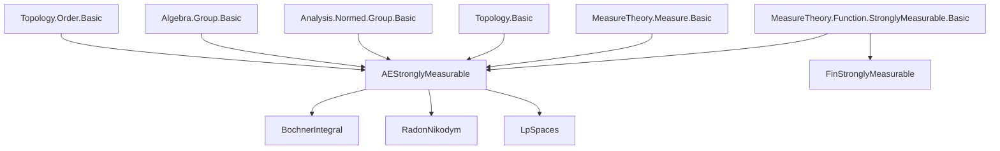
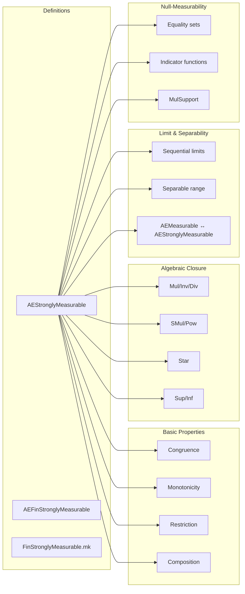

**Technical Brief: AEStronglyMeasurable.lean**

---

### 1. KEY DEFINITIONS & THEOREMS

| Name | Type | Purpose |
|------|------|---------|
| `AEStronglyMeasurable f μ` | `Prop` | `f` is almost everywhere equal to a `StronglyMeasurable` function (i.e., sequential limit of simple functions). |
| `AEFinStronglyMeasurable f μ` | `Prop` | `f` is a.e. equal to a `FinStronglyMeasurable` function (simple functions with finite-measure support). |
| `AEStronglyMeasurable.mk f hf` | `α → β` | A canonical representative: the `StronglyMeasurable` function a.e. equal to `f`. |
| `StronglyMeasurable.mk` | `hf : AEStronglyMeasurable f μ → α → β` | Same as above; used internally. |
| `aestronglyMeasurable_congr` | `f =ᵐ[μ] g → AEStronglyMeasurable f μ ↔ AEStronglyMeasurable g μ` | Congruence under a.e. equality. |
| `aestronglyMeasurable_iff_aemeasurable_separable` | `AEStronglyMeasurable f μ ↔ AEMeasurable f μ ∧ ∃ t, IsSeparable t ∧ ∀ᵐ x ∂μ, f x ∈ t` | Characterization: a.e. strongly measurable ⇔ a.e. measurable + separable range (up to null set). |
| `aestronglyMeasurable_of_tendsto_ae` | Limit of a.e. strongly measurable functions (under a.e. convergence) is a.e. strongly measurable. | Closure under a.e. sequential limits. |
| `exists_stronglyMeasurable_limit_of_tendsto_ae` | Under a.e. convergence of a sequence of a.e. strongly measurable functions, there exists a *strongly* measurable limit. | Refinement of previous: existence of a *strongly* measurable version of the a.e. limit. |
| `nullMeasurableSet_eq_fun`, `nullMeasurableSet_lt`, `nullMeasurableSet_le` | `NullMeasurableSet {x | f x = g x} μ`, etc. | Equality/inequality sets of a.e. strongly measurable functions are null-measurable. |
| `aestronglyMeasurable_indicator_iff` | `AEStronglyMeasurable (indicator s f) μ ↔ AEStronglyMeasurable f (μ.restrict s)` | Indicator functions preserve/reflect a.e. strong measurability w.r.t. restricted measure. |
| `isSeparable_ae_range` | `∃ t, IsSeparable t ∧ ∀ᵐ x ∂μ, f x ∈ t` | Range of a.e. strongly measurable function is essentially separable. |

---

### 2. NAMING CONVENTIONS

- **Prefixes**:
  - `aestronglyMeasurable_`: properties of `AEStronglyMeasurable`.
  - `aefinStronglyMeasurable`: for `AEFinStronglyMeasurable`.
  - `StronglyMeasurable.`: for `StronglyMeasurable` (e.g., `StronglyMeasurable.const`, `StronglyMeasurable.indicator`).
  - `hf.`, `hg.`: local hypotheses (e.g., `hf : AEStronglyMeasurable f μ`).
- **Suffixes**:
  - `_mk`: canonical representative (e.g., `mk`, `stronglyMeasurable_mk`, `measurable_mk`).
  - `__iff`: equivalence statements (e.g., `aestronglyMeasurable_indicator_iff`).
  - `_congr`: congruence under a.e. equality.
  - `_comp`: composition lemmas (e.g., `comp_aemeasurable`, `comp_quasiMeasurePreserving`).
- **Notation**:
  - `AEStronglyMeasurable[m] f μ`: scoped notation for `AEStronglyMeasurable[m] f μ`.
  - `→ₛ`: infix for `SimpleFunc`.

---

### 3. TACTIC STACK

Frequently used tactics in proofs:

| Tactic | Purpose |
|--------|---------|
| `fun_prop` | Propagates `fun_prop` attributes (e.g., for measurability/strong measurability). |
| `aesop` | Automated reasoning for propositional logic, measurability, and a.e. statements. |
| `simp_rw`, `simp` | Simplification using definitional equalities and lemmas (e.g., `ae_eq_mk`, `indicator_ae_eq_restrict`). |
| `filter_upwards` | Reasoning about almost-everywhere statements (e.g., lifting pointwise facts to a.e. facts). |
| `nontriviality`, `inhabited` | Handling empty/empty-type edge cases. |
| `rw`, `apply`, `exact` | Basic proof scripting. |
| `borelize` | Introduce Borel space structure on a topological space. |
| `rcases`, `obtain`, `cases'` | Decompose existential/universal hypotheses. |
| `measurability` | Automatic measurability solving (via `fun_prop` rules). |
| `ring`, `abel` | For algebraic simplifications (e.g., in additive groups). |

---

### 4. PROOF LOGIC

**Typical proof structure**:

1. **Existential witness construction**:
   - Use `hf.choose` to pick a `StronglyMeasurable` representative `g` with `f =ᵐ[μ] g`.
   - Prove properties of `g` (e.g., measurability, continuity, algebraic closure), then lift to `f` via a.e. equality.

2. **A.e. equality reasoning**:
   - Use `filter_upwards [h1, h2, …]` to combine a.e. facts.
   - Use `ae_of_ae_restrict_of_ae_restrict_compl` to glue facts on `s` and `sᶜ`.

3. **Reduction to known classes**:
   - Reduce to `StronglyMeasurable` via `hf.mk`.
   - Use `StronglyMeasurable.*` lemmas (e.g., `StronglyMeasurable.indicator`, `StronglyMeasurable.comp_measurable`).

4. **Separability arguments**:
   - Use `isSeparable_range` for `StronglyMeasurable` functions.
   - Extend to `AEStronglyMeasurable` via a.e. equality and closure under limits.

5. **Limit arguments**:
   - For `aestronglyMeasurable_of_tendsto_ae`, extract a sequence `v : ℕ → ι` (using `IsCountablyGenerated`), pick separable sets for each `f (v n)`, and take closure of their union.

6. **Null-measurability**:
   - Lift equality/inequality sets from measurable to null-measurable via `nullMeasurableSet_congr` and a.e. equality.

---

### 5. IMPORTS & DEPENDENCIES

**Primary imports**:
- `Mathlib.MeasureTheory.Function.StronglyMeasurable.Basic`
  - Defines `StronglyMeasurable`, `SimpleFunc`, `FinStronglyMeasurable`.
- `Mathlib.MeasureTheory.Measure.Basic`
  - Measures, restrictions, pushforwards, absolute continuity.
- `Mathlib.Topology.Basic`, `Mathlib.Topology.Sequences`
  - Topological spaces, continuity, convergence, filters.
- `Mathlib.MeasureTheory.MeasurableSpace.Basic`
  - Measurable spaces, restrictions, monotonicity, trimming.
- `Mathlib.Analysis.Normed.Group.Basic`, `Mathlib.Analysis.InnerProductSpace.Basic`
  - For normed spaces, metric structures, `dist`, `norm`, `nnnorm`, `enorm`, `edist`.
- `Mathlib.Algebra.Group.Basic`, `Mathlib.Algebra.Ring.Basic`
  - For multiplicative/additive structures, `mul`, `inv`, `div`, `pow`, `smul`.
- `Mathlib.Topology.Order.Basic`
  - For `sup`, `inf`, `lt`, `le` sets.

**Key typeclass assumptions**:
- `[TopologicalSpace β]`, `[PseudoMetrizableSpace β]`, `[SecondCountableTopology β]`, `[BorelSpace β]`
- `[MeasurableSpace α]`, `[Countable ι]`
- `[Zero β]`, `[Mul β]`, `[ContinuousMul β]`, `[ContinuousInv β]`, etc., for algebraic closure.

---

### 6. MERMAID DIAGRAMS

#### Dependency Graph (High-Level)

#### Overview of File Structure

---

### 7. SUMMARY

This file formalizes the theory of **almost everywhere strongly measurable functions**, a cornerstone for the Bochner integral in infinite-dimensional settings. It provides:

- A robust API for `AEStronglyMeasurable`, including closure under algebraic operations, composition, limits, and separability.
- A characterization in terms of a.e. measurability + separable range.
- Tools for handling null-measurable sets and indicator functions.
- A bridge to `AEMeasurable` and `StronglyMeasurable`, enabling transfer of results.

It is foundational for integration theory in Banach spaces, especially in modern probability and stochastic analysis (e.g., as in Hytönen et al., *Analysis in Banach Spaces*).
