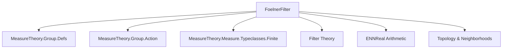

### Technical Brief: `FoelnerFilter.lean`

---

#### **1. Key Definitions & Theorems**

| Name | Type | Purpose |
|------|------|---------|
| `IsFoelner G μ l F` | `Prop` | States that a family of sets `F : ι → Set X` is Følner w.r.t. group `G`, measure `μ`, and filter `l`: eventually measurable with finite non-zero measure, and the relative symmetric difference measure tends to 0 under the group action. |
| `IsAddFoelner G μ l F` | `Prop` | Additive version of `IsFoelner`, for additive group actions (`+ᵥ`). |
| `mean μ u F s` | `ℝ≥0∞` | Limit along ultrafilter `u` of the density of `s` w.r.t. `F`, i.e., `limUnder u (μ (s ∩ F i) / μ (F i))`. |
| `maxFoelner G μ` | `Filter (Set X)` | Maximal Følner filter: pullback of `𝓝 0` along `s ↦ μ ((g • s) ∆ s) / μ s` over measurable sets of finite non-zero measure. |
| `isFoelner_iff_tendsto` | `↔` | Characterization: `F` is Følner w.r.t. `l` iff `F` tends to `maxFoelner G μ` along `l`. |
| `amenable` | `∃ m : Set X → ℝ≥0∞, ...` | If a non-trivial Følner filter exists, then there exists a `G`-invariant finitely additive probability measure. |
| `amenable_of_maxFoelner_neBot` | `∃ m : Set X → ℝ≥0∞, ...` | If `maxFoelner G μ` is non-trivial (`≠ ⊥`), then amenability follows. |
| `isFoelner_maxFoelner` | `IsFoelner G μ (maxFoelner G μ) id` | Identity map is Følner w.r.t. the maximal Følner filter. |

---

#### **2. Naming Conventions**

- **Prefixes**:
  - `isFoelner_`, `isAddFoelner_`: predicates for Følner sequences/filters.
  - `mean_`: density/limit constructions.
  - `maxFoelner`, `maxAddFoelner`: maximal Følner filter definitions.
- **Suffixes**:
  - `_smul_symmDiff`, `_vadd_symmDiff`: refer to symmetric difference under multiplicative/additive group action.
  - `_eq_mean`, `_eq_mean_smul`: invariance properties of `mean`.
- **Pattern**:
  - `tendsto_meas_smul_symmDiff`, `tendsto_meas_vadd_symmDiff`: measure-theoretic convergence conditions.
  - `eventually_*`: conditions holding eventually in the filter.

---

#### **3. Tactic Stack**

Frequently used tactics in proofs:

| Tactic | Usage |
|--------|-------|
| `simp` | Simplify measurable set, measure, and ENNReal arithmetic goals. |
| `filter_upwards` | Handle "eventually" quantifiers in filters. |
| `tendsto_*` tactics (`tendsto_const_nhds`, `tendsto_nhds_unique_of_eventuallyEq`, `Tendsto.mono_left`, `Tendsto.comp`) | Prove convergence statements. |
| `rw [← ...]` | Rewrite using group identities (e.g., `smul_smul`, `inv_smul`). |
| `le_of_tendsto_of_tendsto`, `le_antisymm` | Prove inequalities via convergence. |
| `measure_mono`, `measure_union`, `inter_subset_right` | Measure-theoretic monotonicity and additivity. |
| `ENNReal.*` lemmas (`div_le_div_right`, `sub_div`, `add_div`) | Manipulate extended non-negative reals. |
| `ultrafilter_*` (`isCompact_Icc.ultrafilter_le_nhds'`, `Ultrafilter.of_le`) | Handle ultrafilter limits and pullbacks. |
| `aesop` (implied) | Likely used in background automation (not explicit but common in such files). |

---

#### **4. Proof Logic**

- **Structure of proofs**:
  - **Induction/Case analysis** is minimal; most proofs are *direct* and *constructive*.
  - **Filter-based reasoning** dominates: use of `tendsto`, `inf`, `comap`, `map`, `ultrafilter`.
  - **Reduction to known lemmas**: many results reduce to properties of `mean`, `tendsto`, and `maxFoelner`.
  - **Symmetry arguments**: invariance under group action via `SMulInvariantMeasure`.
  - **Ultrafilter trick**: lift filters to ultrafilters via `Ultrafilter.of`, then use compactness (`isCompact_Icc`) to get convergence.

- **Typical proof flow**:
  1. Show "eventually" properties (measurability, finiteness, non-zero).
  2. Prove convergence of symmetric difference ratio to 0.
  3. Use `isFoelner_iff_tendsto` to relate to `maxFoelner`.
  4. For amenability: construct invariant measure as `mean μ u F`, verify properties via lemmas like `mean_smul_eq_mean`, `mean_union_eq_add_of_disjoint`.

---

#### **5. Imports**

| Module | Purpose |
|--------|---------|
| `Mathlib.MeasureTheory.Group.Defs` | Basic definitions of group actions on measurable spaces. |
| `Mathlib.MeasureTheory.Group.Action` | Properties of multiplicative/additive actions. |
| `Mathlib.MeasureTheory.Measure.Typeclasses.Finite` | Finite/non-zero/infinite measure typeclasses (`IsFiniteMeasure`, `NeZero`, etc.). |

---

#### **8. Mermaid Diagrams**

##### **Dependency Graph (Module Level)**



##### **Conceptual Overview**

```mermaid
graph LR
  A[Group G acting on X] --> B[Measure μ on X]
  B --> C[Measurable sets of finite non-zero μ]
  C --> D[Map s ↦ μ((g•s)∆s)/μ(s)]
  D --> E[Pullback of 𝓝0]
  E --> F[maxFoelner G μ]

  G[F : ι → Set X] --> H[Tendsto F l maxFoelner]
  H --> I[IsFoelner G μ l F]

  I --> J[If l ≠ ⊥ ⇒ ∃ G-invariant finitely additive prob. measure]
```

##### **Key Logical Flow**

```mermaid
graph TD
  A[IsFoelner G μ l F] --> B[Tendsto F l (maxFoelner G μ)]
  B --> C[maxFoelner is maximal: any Følner filter ≤ maxFoelner]
  C --> D[If maxFoelner ≠ ⊥ ⇒ amenability]
  A --> E[Construct mean μ u F]
  E --> F[mean is finitely additive & G-invariant]
  F --> G[Amenable action]
```

---

#### **Notes on Design & Terminology**

- **"Amenability"** is *currently* defined as existence of a `G`-invariant finitely additive probability measure — not yet fully abstracted to a general amenability definition (per comments).
- **Additive vs multiplicative**: Parallel definitions (`IsAddFoelner`, `maxAddFoelner`) are provided via `to_additive`.
- **Ultrafilter-based `mean`**: Allows convergence without assuming second-countability or metrizability.
- **`maxFoelner` maximality**: Comes from `isFoelner_iff_tendsto`: any Følner sequence induces a filter map ≤ `maxFoelner`.

--- 

Let me know if you'd like a formal dependency graph (e.g., `leanpkg`-style), or a proof outline for a specific theorem.
