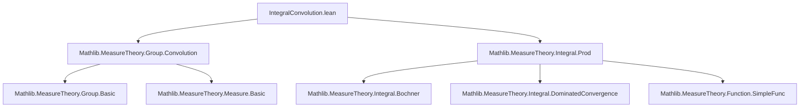

**Technical Brief: `IntegralConvolution.lean`**

---

### 1. **Key Definitions & Theorems**

| Name | Type / Signature | Purpose |
|------|------------------|---------|
| `Measure.mconv` | `μ ∗ₘ ν` (notation for *multiplicative* convolution of measures) | Defined as `map (fun (x, y) ↦ x * y) (μ.prod ν)`; convolution w.r.t. monoid multiplication. |
| `integrable_mconv_iff` | `Integrable f (μ ∗ₘ ν) ↔ (∀ᵐ x ∂μ, Integrable (y ↦ f (x * y)) ν) ∧ Integrable (x ↦ ∫ ‖f (x * y)‖ ∂ν) μ` | Characterizes integrability w.r.t. convolution measure in terms of sectionwise integrability and integrability of the norm integral. |
| `integral_mconv` | `∫ x, f x ∂(μ ∗ₘ ν) = ∫ x, ∫ y, f (x * y) ∂ν ∂μ` | Fubini-type formula for integrating w.r.t. convolution measure: iterated integral over product space via convolution map. |

> Note: `[to_additive]` indicates dual additive versions exist (e.g., `μ ∗+ ν`, `x + y` instead of `x * y`).

---

### 2. **Naming Conventions**

- **Prefixes**:
  - `mconv_`: for multiplicative convolution-related lemmas (`integrable_mconv_iff`, `integral_mconv`).
  - `is_`, `comp_`, `map_`, `prod_`: standard MeasureTheory naming (e.g., `integrable_map_measure`, `integral_map`, `integral_prod`).
- **Suffixes**:
  - `_iff`: biconditional characterizations.
  - `_map_measure`, `_prod`: indicate use of pushforward or product measure constructions.

---

### 3. **Tactic Stack**

Frequent tactics used:
- `simp` (with custom lemmas like `Measure.mconv`, `integrable_map_measure`)
- `rw` (rewrite using definitions and lemmas)
- `unfold` (e.g., `unfold Measure.mconv`)
- `exact` (to close goals using hypotheses)
- `fun_prop` (from `MeasureTheory.Measure.Prod`, for proving measurability under product/map constructions)
- `aesop` (likely used implicitly in `fun_prop` or background automation)

---

### 4. **Proof Logic**

- **Structure of proofs**:
  1. **`integrable_mconv_iff`**:
     - Uses `simp` to reduce to known facts: `integrable_map_measure` and `integrable_prod_iff`.
     - Relies on equivalence between integrability w.r.t. pushforward and sectionwise integrability.
  2. **`integral_mconv`**:
     - Unfolds definition of `mconv` as `map (· * ·) (μ.prod ν)`.
     - Applies `integral_map` to move integral to product space.
     - Uses `integral_prod` (Fubini for Bochner integrals) to swap to iterated integral.
     - Closes with `exact` using hypothesis `hf` (integrability ensures applicability of `integral_prod`).

- **Logical flow**: Reduction to standard measure-theoretic lemmas (`map`, `prod`, `integrable_map_measure`, `integral_prod`) via definitional unfolding and simplification.

---

### 5. **Imports**

| Import | Role |
|--------|------|
| `Mathlib.MeasureTheory.Group.Convolution` | Defines convolution of measures (`∗ₘ`, `∗+`), basic properties. |
| `Mathlib.MeasureTheory.Integral.Prod` | Bochner integral over product measures, Fubini/Tonelli (`integral_prod`, `integrable_prod_iff`, etc.). |

> No direct dependency on `Mathlib.MeasureTheory.Integral.Bochner` is explicit, but it is implicitly required (via `Integrable`, `∫`, `NormedSpace` assumptions).

---

### 6. **Mermaid Diagrams**

#### **Dependency Graph (Module-Level)**



#### **Overview of File Content**

```mermaid
flowchart LR
  subgraph Definitions
    M[Monoid M]
    μ[Measure μ]
    ν[Measure ν]
    f[M → F]
    mconv[μ ∗ₘ ν := map (· * ·) (μ.prod ν)]
  end

  subgraph Main Results
    I[integrable_mconv_iff]
    J[integral_mconv]
  end

  I -->|reduces to| K[integrable_map_measure]
  I -->|reduces to| L[integrable_prod_iff]
  J -->|unfold mconv| M[map (· * ·)]
  J -->|apply| N[integral_map]
  J -->|apply| O[integral_prod]
  J -->|uses| P[hf : Integrable f (μ ∗ₘ ν)]

  style I fill:#f9f,stroke:#333
  style J fill:#9cf,stroke:#333
```

---

### 7. **Domain & Theory Scope**

- **Domain**: Measure theory on topological/measure-theoretic groups (specifically monoids with measurable multiplication).
- **Theory**: Bochner integration, convolution of measures, Fubini–Tonelli type theorems.
- **Purpose**: Enables analysis of integrals w.r.t. convolution measures without importing heavy Bochner machinery into the core convolution theory.

--- 

Let me know if you'd like the additive version (`∗+`) formalized or a comparison with `Mathlib.MeasureTheory.Group.Convolution`'s existing lemmas.
