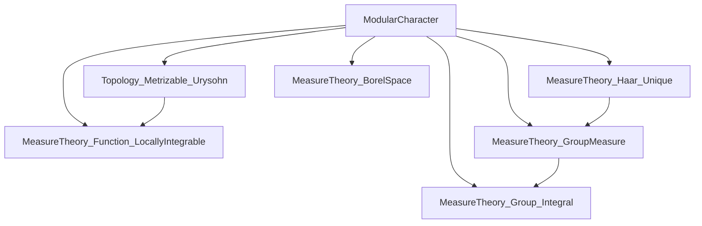

### Technical Brief: Modular Character in Lean 4 (from `ModularCharacter.lean`)

---

#### **1. Key Definitions & Theorems**

| Name | Type / Signature | Purpose |
|------|------------------|---------|
| `modularCharacterFun` | `G → ℝ≥0` | Defines the modular character as a function: for $ g \in G $, it is the Radon–Nikodym derivative $ \frac{d(\mu \circ R_g)}{d\mu} $, where $ R_g(x) = x \cdot g $ and $ \mu $ is a left Haar measure. |
| `modularCharacterFun_eq_haarScalarFactor` | `∀ μ [IsHaarMeasure μ], modularCharacterFun g = haarScalarFactor (map (· * g) μ) μ` | Proves independence of the definition from the choice of Haar measure. |
| `map_right_mul_eq_modularCharacterFun_smul` | `∀ μ [IsHaarMeasure μ] [InnerRegular μ], map (· * g) μ = modularCharacterFun g • μ` | Shows that pushing forward $ \mu $ along right multiplication by $ g $ scales $ \mu $ by $ \Delta(g) $. |
| `modularCharacterFun_pos` | `∀ g, 0 < modularCharacterFun g` | Positivity of the modular character. |
| `modularCharacterFun_map_one` | `modularCharacterFun 1 = 1` | Normalization at identity. |
| `modularCharacterFun_map_mul` | `modularCharacterFun (g * h) = modularCharacterFun g * modularCharacterFun h` | Multiplicativity — key step to show it's a group homomorphism. |
| `modularCharacter` | `G →* ℝ≥0` | The modular character as a *group homomorphism*, with underlying function `modularCharacterFun`. |

---

#### **2. Naming Conventions**

- **Prefixes**:
  - `modularCharacterFun_`: for lemmas about the functional version.
  - `haarScalarFactor_`: for properties of the scalar factor between two Haar measures.
  - `map_`: for pushforward measures under maps (e.g., `map_right_mul`, `map_mul`).
- **Suffixes**:
  - `_eq_integral_div`: used when expressing a scalar factor via integrals of test functions.
  - `_smul`: indicates a measure equality up to scalar multiplication.
  - `_pos`, `_map_one`, `_map_mul`: standard for algebraic properties.

---

#### **3. Tactic Stack**

Frequently used tactics in proofs:

| Tactic | Role |
|--------|------|
| `borelize G` | Converts topological assumptions into measurable ones (e.g., `MeasurableSpace G`, `BorelSpace G`). |
| `rw [...]` / `simp [...]` | Rewriting using definitions (`modularCharacterFun`, `haarScalarFactor`, `map`), lemmas (`integral_map`, `integral_smul_nnreal_measure`), and algebraic identities. |
| `have`, `let`, `set` | Introducing intermediate variables or hypotheses (e.g., `ν := haar`, `j : f ∘ ... = ...`). |
| `calc` | Structured chain of equalities (used heavily in `modularCharacterFun_map_mul`, `modularCharacterFun_eq_haarScalarFactor`). |
| `exact`, `apply`, `refine` | Goal-directed proof construction, especially for existence/uniqueness. |
| `div_self`, `mul_div_mul_comm`, `one_mul` | Algebraic simplifications in `ℝ≥0`. |
| `ne_of_gt`, `ne_of_lt` | Converting inequalities to inequalities ≠ 0 (needed for division). |
| `rfl` | Reflexivity for definitional equalities (e.g., after `borelize`). |

---

#### **4. Proof Logic**

The logical flow follows a standard pattern for Haar measure uniqueness arguments:

1. **Define** the modular character via the Radon–Nikodym derivative (via `haarScalarFactor`).
2. **Show independence** from the Haar measure:
   - Fix a test function $ f \in C_c(G) $ with $ f(1) \ne 0 $.
   - Express both scalar factors using integrals of $ f $.
   - Use change-of-variables (`integral_map`) and invariance properties (`integral_isMulLeftInvariant_eq_smul`) to relate integrals under different measures.
   - Cancel common terms (e.g., $ \frac{a}{a} = 1 $) to conclude equality.
3. **Prove algebraic properties**:
   - Use `calc` chains and known lemmas (`haarScalarFactor_eq_mul`, `map_map`, `comp_mul_right`) to show multiplicativity.
   - Identity follows from `haarScalarFactor_self`.
4. **Lift to homomorphism**:
   - Package the function and lemmas into `→*` using `noncomputable def`.

Induction is *not* used — the proofs rely on measure-theoretic uniqueness and continuity of group operations.

---

#### **5. Imports & Dependencies**

| Module | Role |
|--------|------|
| `MeasureTheory.Function.LocallyIntegrable` | For integrability and approximation tools. |
| `MeasureTheory.Group.Integral` | Change-of-variables, invariance under group actions. |
| `MeasureTheory.Group.Measure` | Pushforwards, invariance, Haar measure basics. |
| `Topology.Metrizable.Urysohn` | (Indirectly) for constructing test functions; used via `exists_continuous_nonneg_pos`. |
| `MeasureTheory.Measure.Haar.Unique` | Uniqueness of Haar measure up to scalar — core to defining `modularCharacterFun`. |
| `MeasureTheory.Constructions.BorelSpace.Basic` | Ensures Borel structure and measurability of group operations. |

---

#### **6. Mermaid Diagrams**

##### **Dependency Graph (Module-Level)**



##### **Overview of Theoretical Flow**

```mermaid
flowchart LR
  A[Locally Compact Group G] --> B[Existence of Left Haar Measure μ]
  B --> C[Right translation R_g pushes μ to ν = μ ∘ R_g]
  C --> D[ν is also left Haar ⇒ ν = Δ(g) • μ]
  D --> E[Define Δ(g) = haarScalarFactor(ν, μ)]
  E --> F[Show Δ(g) independent of μ]
  F --> G[Prove Δ(g h) = Δ(g) Δ(h), Δ(1) = 1]
  G --> H[Define modularCharacter : G →* ℝ≥0]
```

##### **Proof Structure of `modularCharacterFun_eq_haarScalarFactor`**

```mermaid
flowchart LR
  Start[Fix f ∈ C_c(G), f(1) ≠ 0] --> IntFne0[∫ f dμ ≠ 0]
  IntFne0 --> UseF[Express scalar factor via ∫ f]
  UseF --> MapInt[Change variables: ∫ f(x·g) dμ = ∫ f d(map (·*g) μ)]
  MapInt --> SmulInt[Relate integrals under different Haar measures via smul]
  SmulInt --> Cancel[Cancel common scalar (e.g., haarScalarFactor ν μ)]
  Cancel --> Eq[Conclude equality of definitions]
```

---

#### **7. Summary**

This file formalizes the **modular character** — a fundamental homomorphism from a locally compact group $ G $ to the multiplicative positive reals $ \mathbb{R}_{>0} $ — in Lean 4. It leverages:
- **Uniqueness of Haar measure** (up to scalar),
- **Radon–Nikodym derivatives** (encoded via `haarScalarFactor`),
- **Integration against test functions** (via `C_c(G)`),
- **Group-theoretic properties** (continuity, multiplicativity).

The development is clean, modular, and aligns with standard mathematical treatments (e.g., in Folland’s *A Course in Abstract Harmonic Analysis*). The `TODO` item — proving continuity — remains a natural next step, likely requiring tools from `MeasureTheory.Function.ContinuousMap` and topological group theory.

--- 

Let me know if you'd like a formalized version of the continuity proof or a tactic-level trace of `modularCharacterFun_map_mul`.
