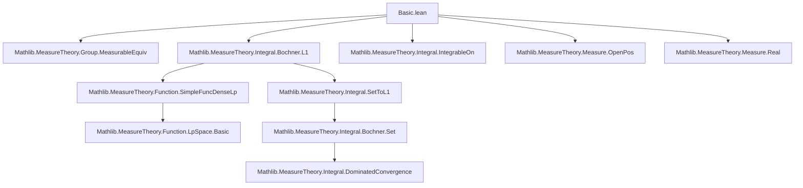
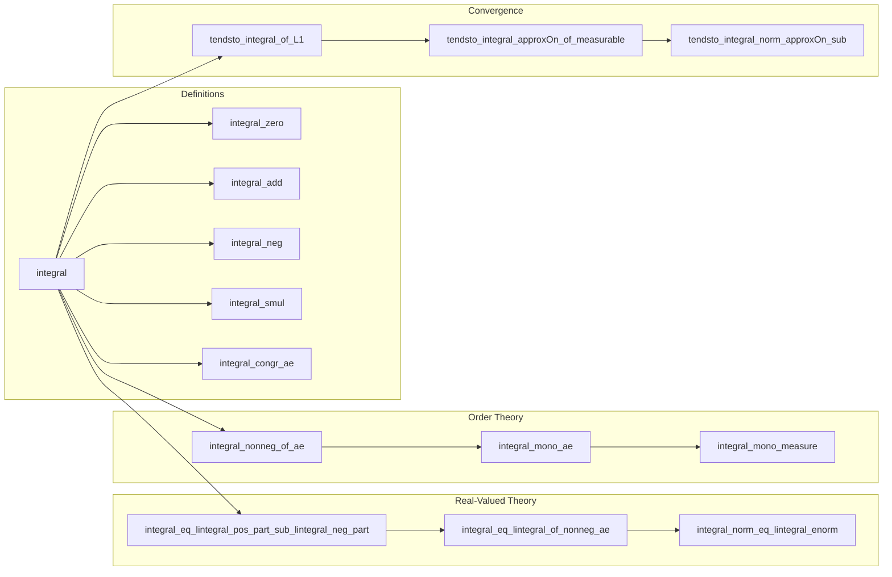

Here is the structured technical brief extracted from `Basic.lean`:

---

### **1. Key Definitions & Theorems**

| Name | Type / Signature | Purpose |
|------|------------------|---------|
| `integral` | `{α : MeasurableSpace} → (μ : Measure α) → (f : α → G) → G` | Bochner integral: defined as `L1.integral` if `f` is integrable and `G` is complete; otherwise `0`. |
| `integral_zero` | `∫ (_ : α), (0 : G) ∂μ = 0` | Integral of zero function is zero. |
| `integral_add` | `Integrable f μ → Integrable g μ → ∫ f + g ∂μ = ∫ f ∂μ + ∫ g ∂μ` | Additivity of integral. |
| `integral_neg` | `∫ -f ∂μ = -∫ f ∂μ` | Negation commutes with integral. |
| `integral_sub` | `Integrable f μ → Integrable g μ → ∫ f - g ∂μ = ∫ f ∂μ - ∫ g ∂μ` | Subtraction compatibility. |
| `integral_smul` | `∫ c • f ∂μ = c • ∫ f ∂μ` | Scalar multiplication commutes with integral (requires `𝕜` a normed division ring). |
| `integral_congr_ae` | `f =ᵐ[μ] g → ∫ f ∂μ = ∫ g ∂μ` | Integral respects almost-everywhere equality. |
| `norm_integral_le_lintegral_norm` | `‖∫ f ∂μ‖ ≤ ENNReal.toReal (∫⁻ ‖f‖ₑ ∂μ)` | Triangle inequality for Bochner integral. |
| `integral_eq_lintegral_pos_part_sub_lintegral_neg_part` | `Integrable f μ → ∫ f ∂μ = ∫⁻ f⁺ - ∫⁻ f⁻` | Bochner integral of real-valued `f` equals difference of extended integrals of positive/negative parts. |
| `integral_eq_lintegral_of_nonneg_ae` | `0 ≤ᵐ[μ] f → ∫ f ∂μ = ∫⁻ f ∂μ` | For nonnegative a.e. `f`, Bochner integral equals `lintegral`. |
| `integral_nonneg_of_ae` | `0 ≤ᵐ[μ] f → 0 ≤ ∫ f ∂μ` | Positivity of integral for nonnegative a.e. functions (ordered Banach space). |
| `integral_mono_ae` | `f ≤ᵐ[μ] g → ∫ f ∂μ ≤ ∫ g ∂μ` | Monotonicity of integral. |
| `continuous_integral` | `Continuous fun f : α →₁[μ] G ↦ ∫ f ∂μ` | Continuity of integral as a map on `L¹`. |
| `tendsto_integral_of_L1` | `L¹-convergence ⇒ integral convergence` | Integral is continuous w.r.t. `L¹`-convergence. |
| `SimpleFunc.integral_eq_integral` | `SimpleFunc f → Integrable f μ → f.integral μ = ∫ f ∂μ` | Agreement of simple function integral and Bochner integral. |
| `integral_indicator₂` | `∫ y, s.indicator (f · y) b ∂μ = s.indicator (fun x ↦ ∫ y, f x y ∂μ) b` | Fubini-type property for indicator functions. |

---

### **2. Naming Conventions**

- **Prefixes**:
  - `integral_`: core integral properties (`integral_zero`, `integral_add`, `integral_neg`, etc.)
  - `L1.integral_`: integral in `L¹` space (`L1.integral_eq_integral`, `L1.integral_of_fun_eq_integral`)
  - `SimpleFunc.integral_`: simple function integrals
  - `tendsto_integral_`: convergence theorems
  - `norm_integral_`, `enorm_integral_`: norm inequalities
  - `integral_nonneg`, `integral_mono`, `integral_nonpos`: order-theoretic properties

- **Suffixes**:
  - `_of_ae`: properties holding a.e.
  - `_of_nonneg`, `_of_nonpos`: sign assumptions
  - `_of_dominated`: dominated convergence setup
  - `_of_L1`: convergence in `L¹`
  - `_of_fun`: from function to `L¹` equivalence class

- **Notable patterns**:
  - `integral_smul`, `integral_const_mul`, `integral_mul_const`, `integral_div`: scalar algebra compatibility
  - `integral_congr_ae`, `integral_congr_ae₂`: congruence under a.e. equality

---

### **3. Tactic Stack**

Frequently used tactics in proofs:

| Tactic | Usage |
|--------|-------|
| `by_cases hG : CompleteSpace G` | Branch on completeness of target space (core to definition) |
| `simp only [integral, hG, L1.integral]` | Unfold definition and simplify using `L1.integral` |
| `exact setToFun_*` | Leverage properties of `setToFun` (e.g., `setToFun_add`, `setToFun_smul`) |
| `rw [← L1.norm_of_fun_eq_lintegral_norm]` | Translate between `L¹` norm and `lintegral` |
| `filter_upwards [...]` | Handle a.e. statements via filter arguments |
| `apply integral_congr_ae` | Reduce to a.e.-equal representatives |
| `simp_rw [...]` | Rewrite with `lintegral`/`ENNReal` conversions |
| `apply tendsto_of_tendsto_of_tendsto_of_le_of_le` | Sandwich arguments for convergence |
| `borelize E` | Make `E` a Borel space for measurable selection arguments |
| `convert ... with n` | Use `convert` for asymptotic equivalence (e.g., `tendsto_integral_norm_approxOn_sub`) |

---

### **4. Proof Logic**

**Typical proof structure** for Bochner integral properties:

1. **Case split on completeness** of target space `G` (via `by_cases hG : CompleteSpace G`)
2. **Reduce to `L¹` theory**:
   - Use `integral_eq` or `integral_eq_setToFun` to rewrite integral as `L1.integral`
   - Apply known `L¹`-space lemmas (`L1.integral_*`, `L1.norm_*`)
3. **Handle non-integrable case**:
   - Use `integral_undef` or `integral_non_aestronglyMeasurable` to reduce to `0`
4. **For real-valued functions**:
   - Use decomposition into positive/negative parts (`f⁺`, `f⁻`)
   - Apply `integral_eq_lintegral_pos_part_sub_lintegral_neg_part`
   - Simplify using `lintegral` properties (`lintegral_congr_ae`, `toReal_zero`, etc.)
5. **Approximation arguments**:
   - Approximate `f` by simple functions (`SimpleFunc.approxOn`)
   - Use density of simple functions in `L¹` or `C_c`
   - Apply `tendsto_integral_approxOn_of_measurable` or `tendsto_integral_of_L1`
6. **Order-theoretic properties**:
   - Use monotonicity of integral on simple functions
   - Extend via density and continuity (`integral_mono`, `integral_nonneg_of_ae`)

---

### **5. Imports**

| Import | Purpose |
|--------|---------|
| `Mathlib.MeasureTheory.Group.MeasurableEquiv` | Measurable equivalences for group actions |
| `Mathlib.MeasureTheory.Integral.Bochner.L1` | `L¹` Bochner integral (foundation for `integral`) |
| `Mathlib.MeasureTheory.Integral.IntegrableOn` | Integrability criteria and restrictions |
| `Mathlib.MeasureTheory.Measure.OpenPos` | Positivity of measures on open sets |
| `Mathlib.MeasureTheory.Measure.Real` | Real-valued measures, `volume`, etc. |

---

### **6. Notation Summary**

| Notation | Meaning |
|----------|---------|
| `α →ₛ E` | Simple functions `α → E` |
| `α →₁[μ] E` | `L¹` equivalence classes of integrable functions |
| `∫ a, f a ∂μ` | Bochner integral of `f` w.r.t. `μ` |
| `∫ a, f a` | Integral w.r.t. `volume` (default measure) |
| `∫ a in s, f a ∂μ` | Integral over measurable set `s` |
| `∫⁻ a, f a ∂μ` | Extended nonnegative integral (`lintegral`) |
| `f⁺`, `f⁻` | Positive/negative parts of real-valued `f` |
| `‖f‖ₑ` | Extended norm (`ENNReal`-valued norm) |

---

### **7. Mermaid Diagrams**

#### **Dependency Graph (High-Level)**

#### **Overview of `Basic.lean` Structure**

---

Let me know if you'd like a formalized dependency graph in Lean or a visualization of the proof strategy for a specific theorem (e.g., `integral_eq_lintegral_pos_part_sub_lintegral_neg_part`).
