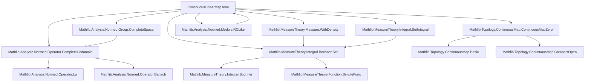

### Technical Brief: `ContinuousLinearMap.lean`

---

#### **1. Key Definitions & Theorems**

| Name | Type | Purpose |
|------|------|---------|
| `integral_compLp` | `L : E →SL[σ] F → φ : Lp E p μ → ∫ x, (L.compLp φ) x ∂μ = ∫ x, L (φ x) ∂μ` | Shows that integration commutes with `compLp`, i.e., the lift of `L` to `Lp` spaces. |
| `setIntegral_compLp` | `L : E →SL[σ] F → φ : Lp E p μ → MeasurableSet s → ∫ x in s, (L.compLp φ) x ∂μ = ∫ x, L (φ x) ∂μ` | Same as above, but for set integrals over measurable sets. |
| `continuous_integral_comp_L1` | `L : E →SL[σ] F → Continuous fun φ : X →₁[μ] E => ∫ x, L (φ x) ∂μ` | Continuity of the map `φ ↦ ∫ L ∘ φ` on `L¹`. |
| `integral_comp_commSL` | `L : E →SL[σ] F → Integrable φ μ → ∫ x, L (φ x) ∂μ = L (∫ x, φ x ∂μ)` | Main theorem: integration commutes with continuous linear maps over `σ`-linear maps, assuming integrability and completeness. |
| `integral_comp_comm` | `L : E →L[𝕜] Fₗ → Integrable φ μ → ∫ x, L (φ x) ∂μ = L (∫ x, φ x ∂μ)` | Special case of `integral_comp_commSL` for `𝕜`-linear maps (no `σ`). |
| `integral_apply` | `φ : X → H →L[𝕜] E → Integrable φ μ → v : H → (∫ φ) v = ∫ (λ x, φ x v)` | Evaluation commutes with integration for vector-valued continuous linear maps. |
| `ContinuousMultilinearMap.integral_apply` | `φ : X → ContinuousMultilinearMap 𝕜 M E → Integrable φ μ → m : ∀ i, M i → (∫ φ) m = ∫ (λ x, φ x m)` | Multilinear evaluation commutes with integration. |
| `integral_comp_comm'` | `L : E →L[𝕜] Fₗ → AntilipschitzWith K L → φ : X → E → ∫ L ∘ φ = L (∫ φ)` | Extends `integral_comp_comm` to non-integrable `φ` using antilipschitz condition. |
| `integral_comp_L1_comm` | `L : E →L[𝕜] Fₗ → φ : X →₁[μ] E → ∫ L ∘ φ = L (∫ φ)` | Applies `integral_comp_comm` to `L¹` representatives. |
| `integral_ofReal`, `integral_re`, `integral_im`, `integral_conj`, etc. | Various specialized cases for `ℝ`, `ℂ`, real/imag parts, conjugation | Derive scalar component-wise integration rules from general theorems. |
| `integral_pair`, `fst_integral`, `snd_integral`, `swap_integral` | Product space integration | Show that integration commutes with projections and swaps. |
| `integral_smul_const`, `integral_const_mul_of_integrable`, `integral_mul_const_of_integrable` | Scalar multiplication and ring multiplication | Derive linearity and module properties of integration. |
| `integral_withDensity_eq_integral_smul`, `setIntegral_withDensity_eq_integral_smul`, etc. | Change of measure via density | Relate integration w.r.t. `μ.withDensity f` to `f • g` w.r.t. `μ`. |

---

#### **2. Naming Conventions**

- **Prefixes**:
  - `integral_`: Integration-related lemmas.
  - `setIntegral_`: Integration over measurable sets.
  - `continuous_`: Continuity of integral-related maps.
  - `compLp`, `compL`: Composition with `Lp`/`L¹` lifts.
  - `ofReal`, `re`, `im`, `conj`: Real/complex structure operations.
  - `withDensity_`: Integration w.r.t. weighted measures.

- **Suffixes**:
  - `_comm`: Commutativity of two operations (e.g., `integral` and `L`).
  - `_comp`: Composition with a map.
  - `_L1`, `_Lp`: For `L¹`/`Lp` spaces.
  - `_smul`, `_mul`: For scalar/vector multiplication.
  - `_apply`: Application to a point (e.g., evaluation at `y : Y`).

- **Special**:
  - `swap_integral`: Symmetry under product swap.
  - `integral_comp_commSL`: `SL` suffix for `σ`-linear maps.

---

#### **3. Tactic Stack**

- **Core tactics**:
  - `rw`, `convert`, `congr`, `ext`, `apply`, `exact`
  - `simp`, `simp_rw`, `change`, `clear`, `cases`
  - `induction` (especially for integrable functions: `induction` on `Integrable`/`IntegrableOn`)
  - `filter_upwards`, `aesop`, `ring`, `linarith`

- **Analysis-specific**:
  - `exact integral_congr_ae`, `setIntegral_congr_ae`, `integral_undef`, `integral_zero`
  - `rwa`, `rw [← Function.comp_def]`, `rwa [LipschitzWith.integrable_comp_iff_of_antilipschitz]`
  - `rwa [SeparatingDual.completeSpace_continuousLinearMap_iff]`, etc.

- **Measure theory**:
  - `lintegral_coe_eq_integral`, `withDensity_apply`, `measureReal_def`
  - `integrable_withDensity_iff_integrable_smul`, `ae_withDensity_iff`

- **Topology/functional analysis**:
  - `isClosed_eq`, `continuous_integral.comp`, `continuous_integral`
  - `completeSpace_congr`, `fst_of_prod`, `Subsingleton.eq_zero`

---

#### **4. Proof Logic**

- **Inductive structure**:
  - Many proofs use `Integrable.induction` or `IntegrableOn.induction`, building up from simple functions (indicators of measurable sets), closing under addition, limits, and almost-everywhere convergence.

- **Completeness handling**:
  - Many theorems split on `CompleteSpace E` or `CompleteSpace F`, using:
    - `subsingleton_or_nontrivial` to handle degenerate cases.
    - `SeparatingDual.completeSpace_*_iff` to show non-completeness implies integrals vanish.

- **Antilipschitz trick**:
  - For non-integrable `φ`, use `integral_comp_comm'` with antilipschitz condition to reduce to integrable case.

- **Continuity + closed graph**:
  - Prove equality of two continuous functions by showing agreement on a dense subset (e.g., simple functions), then use `isClosed_eq`.

- **Change of measure**:
  - Prove equality for simple functions, then extend via continuity of both sides on `L¹`.

---

#### **5. Imports**

| Import | Purpose |
|--------|---------|
| `Mathlib.Analysis.Normed.Operator.CompleteCodomain` | Tools for continuous linear maps into complete spaces (e.g., `compLp`, `compLpL`). |
| `Mathlib.MeasureTheory.Integral.Bochner.Set` | Bochner integral over sets, `setIntegral`, integrability on sets. |
| `Mathlib.Topology.ContinuousMap.ContinuousMapZero` | Evaluation maps for `C₀(Y, E)` (continuous maps vanishing at infinity). |

---

#### **6. Theory Dependencies & Overview**

##### **Mermaid Diagram: Dependency Graph**



##### **Mermaid Diagram: Theoretical Overview**

```mermaid
graph LR
  subgraph Core
    A[ContinuousLinearMap] --> B[compLp / compL]
    A --> C[integral_compLp]
    A --> D[integral_comp_comm]
  end

  subgraph Lp/L¹ Theory
    B --> E[Lp spaces]
    D --> F[Integrable functions]
    D --> G[L¹ completion]
  end

  subgraph Measure Theory
    C --> H[withDensity]
    C --> I[setIntegral]
  end

  subgraph Special Cases
    D --> J[ℝ, ℂ, re/im/conj]
    D --> K[product spaces]
    D --> L[multilinear maps]
  end

  subgraph Applications
    J --> M[Scalar decomposition]
    K --> N[Vector-valued integration]
    L --> O[Tensor / multilinear integration]
  end

  A -->|generalizes| M
  A -->|specializes to| N
  A -->|extends to| O
```

---

#### **7. Summary**

This file formalizes the **commutation of integration with continuous linear maps**, both in abstract (`Lp`, `L¹`) and concrete (real/complex, product, multilinear) settings. It leverages:
- **Completeness** for extension arguments,
- **Antilipschitz conditions** to handle non-integrable inputs,
- **Density of simple functions** for inductive proofs,
- **Continuity + closed graph** to lift equalities from dense subsets.

It serves as a foundational module for Bochner integration theory in `Mathlib`, enabling later results on Fubini, Radon–Nikodym, and stochastic integration.

--- 

Let me know if you'd like a formal dependency graph (e.g., `.dot` format) or a summary of how this file fits into the broader `Mathlib` integration hierarchy.
