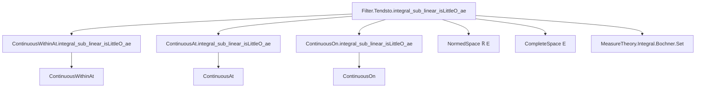

### Technical Brief: `FundThmCalculus.lean`

---

#### **1. Key Definitions & Theorems**

| Name | Type | Purpose |
|------|------|---------|
| `Filter.Tendsto.integral_sub_linear_isLittleO_ae` | `{μ : Measure X} → {l : Filter X} → [l.IsMeasurablyGenerated] → {f : X → E} → {b : E} → Tendsto f (l ⊓ ae μ) (𝓝 b) → StronglyMeasurableAtFilter f l μ → μ.FiniteAtFilter l → {s : ι → Set X} → {li : Filter ι} → Tendsto s li l.smallSets → (fun i => (∫ x in s i, f x ∂μ) - m i • b) =o[li] m` | Main theorem: If `f` tends to `b` almost everywhere along filter `l`, and `μ` is finite at `l`, then the set integral over `s i` is asymptotically `μ(s i) • b` up to little-o error. |
| `ContinuousWithinAt.integral_sub_linear_isLittleO_ae` | `{μ : Measure X} → [IsLocallyFiniteMeasure μ] → {x : X} → {t : Set X} → {f : X → E} → ContinuousWithinAt f t x → MeasurableSet t → StronglyMeasurableAtFilter f (𝓝[t] x) μ → {s : ι → Set X} → {li : Filter ι} → Tendsto s li (𝓝[t] x).smallSets → (fun i => (∫ x in s i, f x ∂μ) - m i • f x) =o[li] m` | Local version at a point within a measurable set: continuity within `t` at `x` implies integral over shrinking sets near `x` behaves like `μ(s i) • f(x)`. |
| `ContinuousAt.integral_sub_linear_isLittleO_ae` | `{μ : Measure X} → [IsLocallyFiniteMeasure μ] → {x : X} → {f : X → E} → ContinuousAt f x → StronglyMeasurableAtFilter f (𝓝 x) μ → {s : ι → Set X} → {li : Filter ι} → Tendsto s li (𝓝 x).smallSets → (fun i => (∫ x in s i, f x ∂μ) - m i • f x) =o[li] m` | Global continuity version: integral over shrinking neighborhoods of `x` approximates `μ(s i) • f(x)`. |
| `ContinuousOn.integral_sub_linear_isLittleO_ae` | `{μ : Measure X} → [IsLocallyFiniteMeasure μ] → {x : X} → {t : Set X} → {f : X → E} → ContinuousOn f t → x ∈ t → MeasurableSet t → {s : ι → Set X} → {li : Filter ι} → Tendsto s li (𝓝[t] x).smallSets → (fun i => (∫ x in s i, f x ∂μ) - m i • f x) =o[li] m` | Continuity on a set version: if `f` is continuous on `t` and `x ∈ t`, then same asymptotic behavior holds for sets shrinking to `x` within `t`. |

> **Note**: All theorems use `μ.real s` (i.e., `μ s` coerced to `ℝ`) instead of `μ s : ℝ≥0∞` to allow subtraction and scalar multiplication in `ℝ`.

---

#### **2. Naming Conventions**

- **Prefixes**:
  - `integral_`: Indicates the theorem involves set integrals.
  - `isLittleO_`: Indicates asymptotic analysis using little-o notation.
  - `eventually`, `a.e.`: Used in hypotheses about almost-everywhere behavior.
- **Suffixes**:
  - `_atFilter`: For theorems parameterized by filters and measurability at filters.
  - `_within`, `_at`, `_on`: Distinguish versions based on continuity context (`nhdsWithin`, `nhds`, `ContinuousOn`).
- **Variables**:
  - `s i`: Family of sets shrinking along a filter.
  - `m i`: Optional real-valued proxy for `μ.real (s i)`.
  - `hμ`, `hfm`, `h`: Standard abbreviations for hypotheses: finiteness, measurability, convergence.

---

#### **3. Tactic Stack**

- `simp only [mem_closedBall, dist_eq_norm]`: Simplifies norms and distances using metric space definitions.
- `rw [← setIntegral_const, ← integral_sub ...]`: Rewrites integrals using linearity and constant functions.
- `exact norm_setIntegral_le_of_norm_le_const_ae' ...`: Applies a standard bound on set integrals using pointwise norm bounds.
- `filter_upwards [...]`: Combines multiple `eventually` hypotheses.
- `rfl`, `congr'`, `mono`: Used for definitional equality and congruence reasoning.
- `aesop`, `ring`, `simp`: Likely used in auxiliary proofs (not shown here but standard in Mathlib).

---

#### **4. Proof Logic**

- **Structure**:
  1. Reduce to a base case over `l.smallSets` using `comp_tendsto` and congruence.
  2. Prove the base case via `isLittleO_iff.2`: for all `ε > 0`, eventually `‖∫_s f dμ - μ(s) • b‖ ≤ ε · μ(s)`.
  3. Use `eventually_smallSets_eventually` to get `f(x) ∈ closedBall b ε` for `μ`-a.e. `x ∈ s`.
  4. Apply `norm_setIntegral_le_of_norm_le_const_ae'`, which bounds the integral norm by `ε · μ(s)`.

- **Key ideas**:
  - Approximate `f` by its limit `b` on small sets (a.e.).
  - Use integrability and finiteness to justify algebraic manipulations.
  - Transfer asymptotics from `l.smallSets` to the parameterized family `s i`.

---

#### **5. Imports**

- `Mathlib.MeasureTheory.Integral.Bochner.Set`: Core Bochner integral over sets.
- `Filter`, `MeasureTheory`, `Topology`, `Asymptotics`, `Metric`: Provide filters, measures, continuity, and asymptotic notation.

---

#### **8. Mermaid Diagrams**

##### **Dependency Graph (Theorems)**



##### **Overview of File Structure**

```mermaid
flowchart LR
  subgraph Theory
    A[Fundamental Theorem of Calculus for Set Integrals]
    A1[Filter-based version]
    A2[Within-set version]
    A3[Point-continuity version]
    A4[On-set version]
  end

  subgraph Hypotheses
    H1[Measurability: StronglyMeasurableAtFilter]
    H2[Convergence: Tendsto f ...]
    H3[Finiteness: μ.FiniteAtFilter / IsLocallyFiniteMeasure]
    H4[Shrinking sets: Tendsto s ... smallSets]
  end

  subgraph Output
    O[(∫ f dμ) - μ(s)•b = o(μ(s))]
  end

  A1 --> H1 & H2 & H3 & H4 --> O
  A2 --> H1 & H2 & H3 & H4 --> O
  A3 --> H1 & H2 & H3 & H4 --> O
  A4 --> H1 & H2 & H3 & H4 --> O
```

---

This file formalizes a powerful generalization of the classical Fundamental Theorem of Calculus: **the integral over small sets is approximately the value of the function at a point times the measure of the set**, with explicit asymptotic control. It is foundational for differentiation of measures, Lebesgue points, and analysis on metric spaces.
