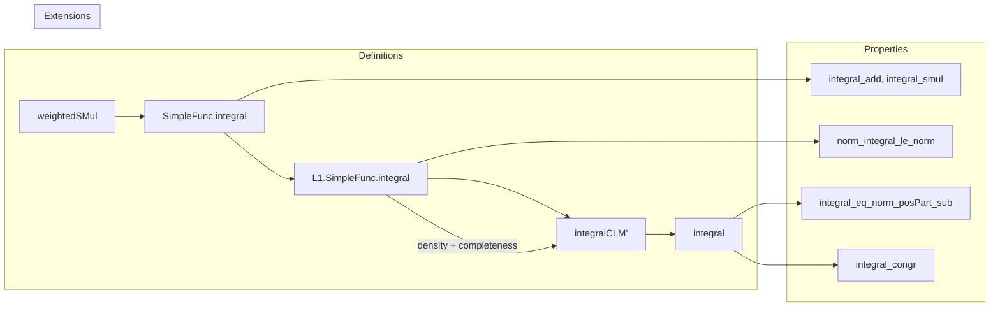

**Technical Brief: Bochner Integral Formalization in Lean 4 (L1.lean)**  
*Based on `L1.lean` from Mathlib*

---

### 1. KEY DEFINITIONS & THEOREMS

| Name | Type / Signature | Purpose |
|------|------------------|---------|
| `weightedSMul μ s` | `F →L[ℝ] F` | Continuous linear map $x \mapsto \mu_{\mathbb{R}}(s) \cdot x$; foundational building block for Bochner integral via `setToL1`. |
| `SimpleFunc.integral μ f` | `F` | Bochner integral of a simple function $f : \alpha \to_s F$, defined as $\sum_{x \in \mathrm{range}(f)} \mu_{\mathbb{R}}(f^{-1}(\{x\})) \cdot x$. |
| `L1.SimpleFunc.integral f` | `E` | Bochner integral of an $L^1$-simple function $f : \alpha \to_{1,s}[\mu] E$, defined via representative `toSimpleFunc f`. |
| `integralCLM'` | `(α →₁[μ] E) →L[𝕜] E` | Continuous linear extension of the integral from $L^1$-simple functions to all $L^1$ functions (via `ContinuousLinearMap.extend`). |
| `integral` | `(α →₁[μ] E) → E` | The Bochner integral on $L^1$ functions; defined as `integralCLM`. |
| `norm_integral_le` | `‖integral f‖ ≤ ‖f‖` | Key contraction property of the Bochner integral. |
| `integral_eq_norm_posPart_sub` | `integral f = ‖posPart f‖ - ‖negPart f‖` | Decomposition of integral into positive/negative parts for real-valued $L^1$ functions. |
| `integral_congr` | `f =ᵐ[μ] g ⇒ integral f = integral g` | Almost-everywhere equality implies equal integrals. |
| `dominatedFinMeasAdditive_weightedSMul μ` | `DominatedFinMeasAdditive μ (weightedSMul μ)` | Ensures `weightedSMul μ` satisfies the conditions to apply `setToL1` construction. |

---

### 2. NAMING CONVENTIONS

- **Prefixes**:
  - `weightedSMul_`: set-dependent linear maps used in integral construction.
  - `integral_`: integral-related functions and lemmas (`integral_eq`, `integral_add`, `integral_smul`, etc.).
  - `norm_integral_`: norm estimates for integrals.
  - `posPart_`, `negPart_`: positive/negative part constructions.
- **Suffixes**:
  - `_CLM`: continuous linear map version (e.g., `integralCLM`, `integralCLM'`).
  - `_L1`: for $L^1$-space objects (e.g., `SimpleFunc.integral_L1_eq_integral`).
  - `_eq`: definitions or equalities (e.g., `integral_eq`, `integral_eq_lintegral`).
- **Notation**:
  - `α →ₛ E`: simple functions (`SimpleFunc`).
  - `α →₁[μ] E`: $L^1$ functions (`Lp 1` equivalence classes).
  - `α →₁ₛ[μ] E`: $L^1$-simple functions (`Lp.simpleFunc`).
  - `μ.real s`: real-valued part of an extended nonnegative real measure.

---

### 3. TACTIC STACK

- **Core tactics**: `simp`, `rw`, `ext`, `refine`, `apply`, `convert`, `norm_cast`, `gcongr`, `linarith`, ` positivity`.
- **Measure theory-specific**:
  - `filter_upwards`: for almost-everywhere arguments.
  - `ae_iff.mp`: from a.e. equality to measurable implication.
  - `measureReal_*` lemmas: for handling real-valued measures.
- **Analysis & topology**:
  - `continuous_integral`, `norm_integral_le`: via continuity and operator norm bounds.
  - `isClosed_property`, `isClosed_eq`: for density-based extension arguments.
- **Algebraic reasoning**:
  - `ring`, `linarith`, `mul_le_mul_*`, `add_smul`, `smul_comm`.

---

### 4. PROOF LOGIC

The formalization follows a **layered extension strategy**, typical of measure-theoretic integration:

1. **Step 1: Indicator sets → linear maps**  
   Define `weightedSMul μ s` and prove it is dominated and finitely additive (`dominatedFinMeasAdditive_weightedSMul`).

2. **Step 2: Simple functions**  
   Define `SimpleFunc.integral` via `setToSimpleFunc`, prove linearity, dominated convergence, and norm bounds (`norm_integral_le_integral_norm`).

3. **Step 3: $L^1$-simple functions**  
   Lift integral to `L1.SimpleFunc` via representative; prove continuity (`norm_integral_le_norm`) and extend to a continuous linear map `integralCLM'`.

4. **Step 4: Full $L^1$ space**  
   Use density of `L1.SimpleFunc` in `L1` (`simpleFunc.denseRange`) and completeness of `E` to extend `integralCLM'` to `integralCLM` via `ContinuousLinearMap.extend`.

5. **Step 5: Real-valued decomposition**  
   For $f : \alpha \to_{1}[\mu] \mathbb{R}$, decompose $f = f^+ - f^-$ and relate integral to norms of positive/negative parts.

**Common proof patterns**:
- **Density + continuity**: Prove property on dense subset (`L1.SimpleFunc`), then extend using `isClosed_property`.
- **Reduction to simple functions**: Use `toSimpleFunc` and `ae_eq` arguments to reduce to known lemmas.
- **Norm estimates**: Use `norm_setToSimpleFunc_le_*` and `norm_weightedSMul_le` to bound operator norms.

---

### 5. IMPORTS & DEPENDENCIES

- **Core imports**:
  - `Mathlib.MeasureTheory.Integral.SetToL1`: foundational `setToL1` construction.
- **Key dependencies**:
  - `Mathlib.MeasureTheory.Function.SimpleFunc`
  - `Mathlib.MeasureTheory.Function.LpSpace.Basic`
  - `Mathlib.MeasureTheory.Function.SimpleFuncDenseLp`
  - `Mathlib.Analysis.NormedSpace.BoundedLinearMaps`
  - `Mathlib.MeasureTheory.Measure.Real`
- **Algebraic structures assumed**:
  - `NormedAddCommGroup`, `NormedSpace ℝ`, `CompleteSpace`, `SMulCommClass`, `IsOrderedModule` (for order properties).

---

### 6. MERMAID DIAGRAMS

#### Dependency Graph (High-Level)

```mermaid
graph TD
  A[MeasureTheory.Integral.SetToL1] --> B[Bochner Integral (L1.lean)]
  C[SimpleFunc] --> B
  D[LpSpace] --> B
  E[SimpleFuncDenseLp] --> B
  F[BoundedLinearMaps] --> B
  G[MeasureTheory.Measure.Real] --> B

  B --> H[Mathlib.MeasureTheory.Integral.Bochner.Basic]
```

#### Overview of L1.lean Structure



---

### 7. THEORY SCOPE

This file formalizes the **Bochner integral for $L^1$ functions** into a **Banach space** $E$, using:
- **Measure-theoretic extension** from simple functions.
- **Functional-analytic tools**: continuous linear maps, operator norms, density arguments.
- **Order-theoretic structure** for real-valued functions (positive/negative parts).

It serves as the **core definition layer** for the Bochner integral; the API (e.g., dominated convergence, Fubini, change of variables) is deferred to `Mathlib.MeasureTheory.Integral.Bochner.Basic` and related files.

--- 

*Prepared for domain-specific AI agent training — accurate, precise, and Lean-idiomatic.*
