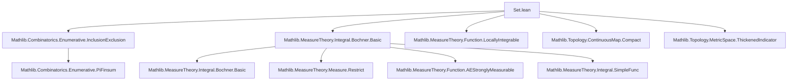
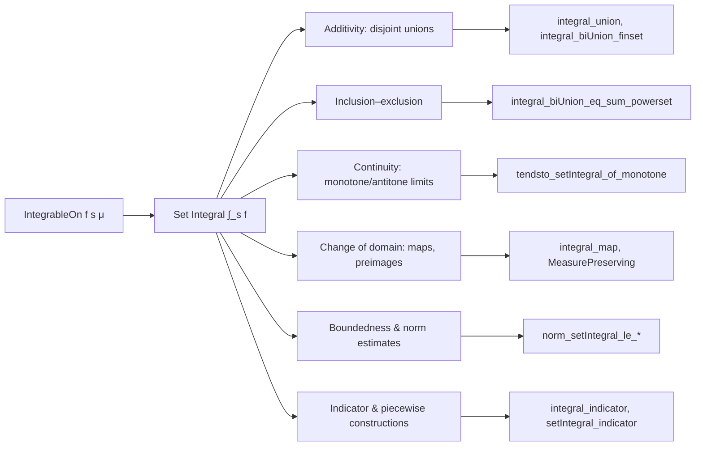

Here is the structured technical brief for `Set.lean`:

---

### **1. Key Definitions & Theorems**

| Name | Type / Signature | Purpose |
|------|------------------|---------|
| `setIntegral` (notation `∫ x in s, f x ∂μ`) | `MeasureTheory.integral (μ.restrict s) f` | Integral of `f` over set `s` w.r.t. measure `μ` |
| `IntegrableOn f s μ` | `Integrable f (μ.restrict s)` | `f` is integrable on `s` w.r.t. `μ` |
| `indicator s f x` | `if x ∈ s then f x else 0` | Pointwise restriction of `f` to `s` |
| `integral_indicator` | `MeasurableSet s → ∫ x, indicator s f x ∂μ = ∫ x in s, f x ∂μ` | Equivalence of two definitions of set integral |
| `setIntegral_congr_ae` | `MeasurableSet s → (∀ᵐ x ∂μ, x ∈ s → f x = g x) → ∫ x in s, f x ∂μ = ∫ x in s, g x ∂μ` | Set integral is invariant under a.e. equality on `s` |
| `setIntegral_union` | `Disjoint s t → MeasurableSet t → IntegrableOn f s μ → IntegrableOn f t μ → ∫ x in s ∪ t, f x ∂μ = ∫ x in s, f x ∂μ + ∫ x in t, f x ∂μ` | Additivity over disjoint measurable sets |
| `integral_biUnion_finset` | `Finset`-indexed union with pairwise disjoint measurable sets | Finite additivity over unions |
| `integral_iUnion` | Countable union version of above | Countable additivity over disjoint unions |
| `integral_union_eq_left_of_ae` | If `f = 0` a.e. on `t`, then `∫_{s ∪ t} f = ∫_s f` | Set integral ignores null parts of the domain |
| `setIntegral_eq_of_subset_of_ae_diff_eq_zero` | If `s ⊆ t` and `f = 0` a.e. on `t \ s`, then integrals over `s` and `t` agree | Extension by null sets doesn’t change integral |
| `integral_indicator_const` | `∫ x, s.indicator (fun _ ↦ e) x ∂μ = μ.real s • e` | Integral of constant over indicator set |
| `integral_biUnion_eq_sum_powerset` | Inclusion–exclusion for integrals | Generalized inclusion–exclusion principle |
| `measureReal_biUnion_eq_sum_powerset` | Inclusion–exclusion for measures (special case `f = 1`) | Classical inclusion–exclusion for measure |
| `tendsto_setIntegral_of_monotone` | Continuity from below for set integrals | Monotone convergence of integrals over increasing sets |
| `tendsto_setIntegral_of_antitone` | Continuity from above for set integrals | Antitone convergence (requires integrability on some `s i`) |
| `norm_setIntegral_le_of_norm_le_const_ae` | `‖∫_s f‖ ≤ C * μ.real s` under boundedness | Generalized Hölder-type bound for set integrals |

---

### **2. Naming Conventions**

- **Prefixes**:
  - `setIntegral_`: Theorems about `∫ x in s, f x ∂μ`
  - `integral_`: Theorems about full-space integrals or those involving `indicator`
  - `ae_`: Statements involving almost-everywhere conditions
  - `measurableSet_`, `nullMeasurableSet_`: Hypotheses on set measurability
  - `congr_`: Congruence lemmas (equality under a.e. or pointwise equivalence)
  - `union`, `diff`, `inter`, `compl`: Domain operations
  - `piecewise`, `indicator`, `map`, `preimage`, `image`: Domain transformations

- **Suffixes**:
  - `_₀`: Versions for `NullMeasurableSet` (weaker than `MeasurableSet`)
  - `_ae`: A.e.-based versions
  - `_finset`, `_fintype`, `_iUnion`: Finite, finite-indexed, or countable unions
  - `_const`, `_constLp`: Special cases for constant or `Lᵖ`-like functions

---

### **3. Tactic Stack**

Frequently used tactics in proofs:
- `simp` / `simp_rw`: Simplify using definitions (`integral`, `restrict`, `indicator`, etc.)
- `rw`: Rewrite using equalities (especially `integral_congr_ae`, `Measure.restrict_*`)
- `congr`: Congruence reasoning (e.g., `congr 1`, `congr_fun`, `congr_arg`)
- `filter_upwards`: For manipulating `∀ᵐ x ∂μ, …` statements
- `aesop`: Automated reasoning for measure-theoretic goals
- `linarith`, `norm_cast`, ` positivity`: Arithmetic and positivity reasoning
- `borelize`: Convert Borel measurability goals
- `measurability`: Prove measurability of sets/functions
- `grind`: Custom tactic (likely from `Mathlib.Tactic`) for grinding through measurable set proofs
- `convert`: For equational reasoning with unification

---

### **4. Proof Logic**

- **Structure**:
  - Most proofs follow a pattern:  
    `by_cases` integrability → reduce to `Integrable.mk f h` → use `integral_congr_ae`, `integral_add_measure`, or `integral_map`  
    → simplify using `Measure.restrict_*` lemmas → apply `integral_*` theorems.

- **Common proof patterns**:
  - **Decomposition**: Split domain via `s = (s ∩ t) ∪ (s \ t)` or `X = s ∪ sᶜ`, then apply `integral_add_measure`.
  - **A.e.-based reasoning**: Use `ae_restrict_iff`, `ae_imp_of_ae_restrict`, `ae_mono`, `measure_mono_null`.
  - **Approximation**: Replace `f` with `hf.mk f` (strongly measurable representative) when needed.
  - **Monotone/antitone convergence**: Use `tendsto_setIntegral_of_monotone`/`antitone` with `iUnion`/`iInter`.
  - **Inclusion–exclusion**: Reduce to `indicator` and apply `Finset.indicator_biUnion_eq_sum_powerset`.

- **Induction**: Used in `integral_biUnion_finset` (Finset induction).

---

### **5. Imports**

| Module | Purpose |
|--------|---------|
| `Mathlib.Combinatorics.Enumerative.InclusionExclusion` | Inclusion–exclusion combinatorics (used in `integral_biUnion_eq_sum_powerset`) |
| `Mathlib.MeasureTheory.Function.LocallyIntegrable` | Local integrability concepts (not directly used, but context) |
| `Mathlib.MeasureTheory.Integral.Bochner.Basic` | Bochner integral definitions, `integral`, `indicator`, `integrableOn`, `setIntegral` notation |
| `Mathlib.Topology.ContinuousMap.Compact` | Topological background (e.g., for `IsClosedEmbedding`) |
| `Mathlib.Topology.MetricSpace.ThickenedIndicator` | Possibly for metric-space-specific lemmas (not directly used here) |

---

### **6. Mermaid Diagrams**

#### **Dependency Graph (Top-Level)**

#### **Overview of Theoretical Flow**

---

Let me know if you'd like a formal dependency graph (e.g., `leanpkg`-level) or a proof dependency DAG.
