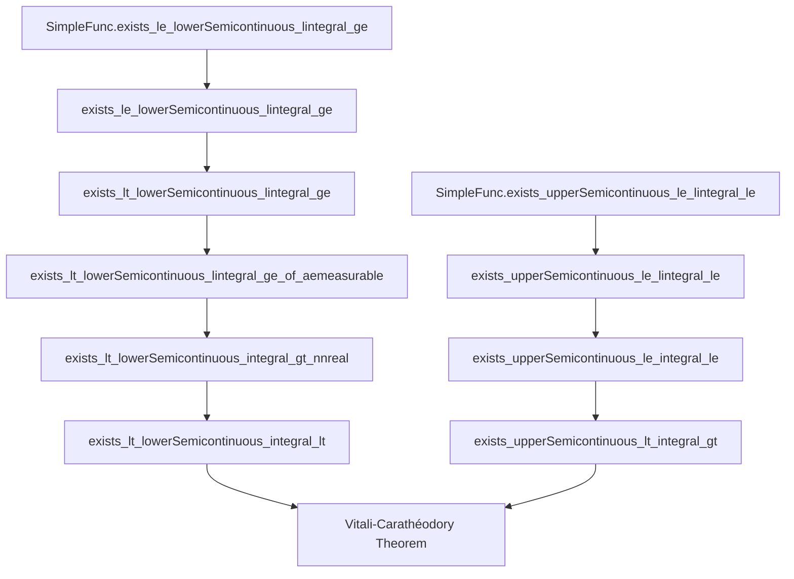

### Technical Brief: Vitali-Carathéodory Theorem in Lean 4 (`VitaliCaratheodory.lean`)

---

#### **1. Key Definitions & Theorems**

| Name | Type | Purpose |
|------|------|---------|
| `SimpleFunc.exists_le_lowerSemicontinuous_lintegral_ge` | `SimpleFunc α ℝ≥0 → ε ≠ 0 → ∃ g ≥ f, LowerSemicontinuous g, ∫⁻g ≤ ∫⁻f + ε` | Upper bound for simple functions via l.s.c. functions (nonnegative integral) |
| `exists_le_lowerSemicontinuous_lintegral_ge` | `Measurable f → ε ≠ 0 → ∃ g ≥ f, l.s.c., ∫⁻g ≤ ∫⁻f + ε` | Extension to general measurable nonnegative functions |
| `exists_lt_lowerSemicontinuous_lintegral_ge` | `[SigmaFinite μ] → Measurable f → ε ≠ 0 → ∃ g > f, l.s.c., ∫⁻g ≤ ∫⁻f + ε` | Strict upper bound for nonnegative measurable functions (requires σ-finiteness) |
| `exists_lt_lowerSemicontinuous_lintegral_ge_of_aemeasurable` | `[SigmaFinite μ] → AEMeasurable f → ε ≠ 0 → ∃ g > f a.e., l.s.c., ∫⁻g ≤ ∫⁻f + ε` | Handles a.e. measurable functions (null-set adjustment) |
| `exists_lt_lowerSemicontinuous_integral_gt_nnreal` | `[SigmaFinite μ] → Integrable f → 0 < ε → ∃ g > f, l.s.c., integrable, ∫g < ∫f + ε` | Strict upper bound for integrable nonnegative functions (Bochner integral) |
| `SimpleFunc.exists_upperSemicontinuous_le_lintegral_le` | `∫⁻f ≠ ∞ → ε ≠ 0 → ∃ g ≤ f, u.s.c., ∫⁻f ≤ ∫⁻g + ε` | Lower bound for simple functions via u.s.c. functions |
| `exists_upperSemicontinuous_le_lintegral_le` | `∫⁻f ≠ ∞ → ε ≠ 0 → ∃ g ≤ f, u.s.c., ∫⁻f ≤ ∫⁻g + ε` | Extension to integrable nonnegative functions |
| `exists_upperSemicontinuous_le_integral_le` | `Integrable f → 0 < ε → ∃ g ≤ f, u.s.c., ∫g ≥ ∫f − ε` | Lower bound for integrable nonnegative functions (Bochner integral) |
| `exists_lt_lowerSemicontinuous_integral_lt` | `[SigmaFinite μ] → Integrable f → 0 < ε → ∃ g > f, l.s.c., integrable, ∫g < ∫f + ε` | **Main theorem**: strict upper semicontinuous approximation (EReal-valued) |
| `exists_upperSemicontinuous_lt_integral_gt` | `[SigmaFinite μ] → Integrable f → 0 < ε → ∃ g < f, u.s.c., integrable, ∫g > ∫f − ε` | Symmetric lower bound via `−f` |

**Notation**:  
- `LowerSemicontinuous g`: $g$ is lower semicontinuous (l.s.c.)  
- `UpperSemicontinuous g`: $g$ is upper semicontinuous (u.s.c.)  
- `EReal`: extended reals $\overline{\mathbb{R}} = \mathbb{R} \cup \{-\infty, +\infty\}$  
- `lintegral`: nonnegative (extended) integral $\int^-$
- `integral`: Bochner (signed) integral $\int$

---

#### **2. Naming Conventions**

| Pattern | Meaning | Examples |
|--------|---------|----------|
| `exists_*_integral_*` | Existence of approximating function with integral control | `exists_lt_lowerSemicontinuous_integral_lt` |
| `*_Semicontinuous_*` | Semicontinuity type | `lowerSemicontinuous`, `upperSemicontinuous` |
| `*_gt_*`, `*_lt_*` | Inequality direction in conclusion | `gt` = greater than, `lt` = less than |
| `*_nnreal`, `*_ennreal`, `*_ereal` | Codomain of function | `integral_gt_nnreal`, `lintegral_ge_ereal` |
| `*_aemeasurable` | Handles almost-everywhere measurable functions | `exists_*_of_aemeasurable` |
| `SimpleFunc.*` | Lemmas for simple functions (inductive base) | `SimpleFunc.exists_le_lowerSemicontinuous_lintegral_ge` |
| `eapproxDiff` | Difference in simple function approximation (dyadic truncation) | Used in `exists_le_lowerSemicontinuous_lintegral_ge` |

---

#### **3. Tactic Stack**

| Tactic | Frequency | Purpose |
|--------|-----------|---------|
| `induction ... using ...` | High | Structural induction on simple functions |
| `rcases ... with ⟨...⟩` | Very high | Extract witnesses from existential quantifiers |
| `simp only [...]` | Very high | Simplify using precise lemmas (e.g., `lintegral_const`, `indicator`) |
| `grw [...]` | High | Rewrite using `gcongr` + `rw` (e.g., measure inequalities) |
| `convert ... using 1` | Medium | Match goals modulo definitional equality |
| `abel` | Medium | Simplify additive expressions (e.g., $\varepsilon/2 + \varepsilon/2 = \varepsilon$) |
| `filter_upwards [...]` | Medium | Handle almost-everywhere statements |
| `rw [ENNReal.*]` | High | Normalize extended nonnegative reals (e.g., `mul_div_cancel`, `toReal_add`) |
| `convert ...` | Medium | Transfer integrability/integral equalities via congruence |
| `ring` | Medium | Algebraic simplification (e.g., $2\delta = \varepsilon$) |

---

#### **4. Proof Logic**

**Overall Strategy**:
1. **Decompose** $f = f^+ - f^-$ (positive/negative parts).
2. **Approximate $f^+$ from above** by l.s.c. $g^+$ with $\int g^+ < \int f^+ + \varepsilon/2$.
3. **Approximate $f^-$ from below** by u.s.c. $g^-$ with $\int g^- > \int f^- - \varepsilon/2$.
4. **Combine**: $g = g^+ - g^-$ satisfies $f < g$, is l.s.c., and $\int g < \int f + \varepsilon$.

**Key Technical Steps**:
- **Simple functions**: Use regularity of $\mu$ to approximate measurable sets $s_n$ by open $u_n \supset s_n$ (for upper bound) or closed $F_n \subset s_n$ (for lower bound).
- **General nonnegative functions**: Approximate $f$ by simple functions $eapproxDiff\ f\ n$, then sum approximants $g_n$ via $g = \sum_n g_n$.
- **σ-finiteness**: Required to construct a "weight" function $w > 0$ with small integral (to enforce strict inequality $f < f + w \le g$).
- **EReal handling**: Avoid arithmetic pitfalls (e.g., $\infty - \infty$) by ensuring $g < \infty$ a.e. and using `toReal` carefully.

**Induction & Tsum Lemmas**:
- Induction on simple functions: base case (`const`), step (`add`).
- Use `lintegral_tsum` and `tsum_add` to pass from simple to general functions.
- For strict inequality: perturb $f$ by small $w > 0$ to ensure $f < f + w$.

---

#### **5. Imports & Dependencies**

| Module | Role |
|--------|------|
| `Mathlib.MeasureTheory.Measure.Regular` | Regularity: approximation of measurable sets by open/closed sets |
| `Mathlib.Topology.Semicontinuity.Basic` | Definitions & closure properties of (upper/lower) semicontinuous functions |
| `Mathlib.MeasureTheory.Integral.Bochner.Basic` | Bochner integral, integrability, linearity, convergence theorems |
| `Mathlib.Topology.Instances.EReal.Lemmas` | Extended reals arithmetic, continuity, order properties |

**Key auxiliary theories**:
- `SimpleFunc`, `eapproxDiff`, `lintegral`, `integral`, `AEMeasurable`, `SigmaFinite`
- `ENNReal`, `NNReal`, `Real`, `EReal` type classes and conversions

---

#### **6. Mermaid Diagrams**

##### **Dependency Graph (Core Lemmas)**



##### **Overview of File Structure**

```mermaid
flowchart LR
  subgraph "Preprocessing"
    A[Measure Theory Basics] --> B[Simple Functions]
    B --> C[Approximation by Open/Closed Sets]
  end

  subgraph "Upper Bounds (l.s.c.)"
    C --> D[SimpleFunc Upper Bound]
    D --> E[Measurable Upper Bound]
    E --> F[Strict Upper Bound (σ-finite)]
    F --> G[Bochner Integral Version]
  end

  subgraph "Lower Bounds (u.s.c.)"
    C --> H[SimpleFunc Lower Bound]
    H --> I[Measurable Lower Bound]
    I --> J[Bochner Integral Version]
  end

  subgraph "Main Theorem"
    G --> K[exists_lt_lowerSemicontinuous_integral_lt]
    J --> K
    K --> L[exists_upperSemicontinuous_lt_integral_gt]
  end

  style A fill:#f9f,stroke:#333
  style K fill:#9cf,stroke:#333,stroke-width:2px
```

---

#### **7. Notes on σ-Finiteness**

- **Why required?** To construct $w > 0$ with $\int w < \varepsilon$, enabling strict inequality $f < f + w \le g$.
- **Classical version**: Only needs $f \le g$ (no $w$), so σ-finiteness is unnecessary.
- **Trade-off**: Strict inequality is essential for applications (e.g., Fundamental Theorem of Calculus), and σ-finiteness holds in all standard cases (e.g., Radon measures on locally compact separable metric spaces).

---

#### **8. References**

- Rudin, *Real and Complex Analysis*, Theorem 2.24  
- Formalization emphasizes **constructive approximation** via open/closed sets and **careful handling of extended reals**.

--- 

This file exemplifies advanced measure-theoretic reasoning in Lean 4, balancing abstract theory (regular measures, semicontinuity) with concrete approximation techniques and robust handling of extended arithmetic.
