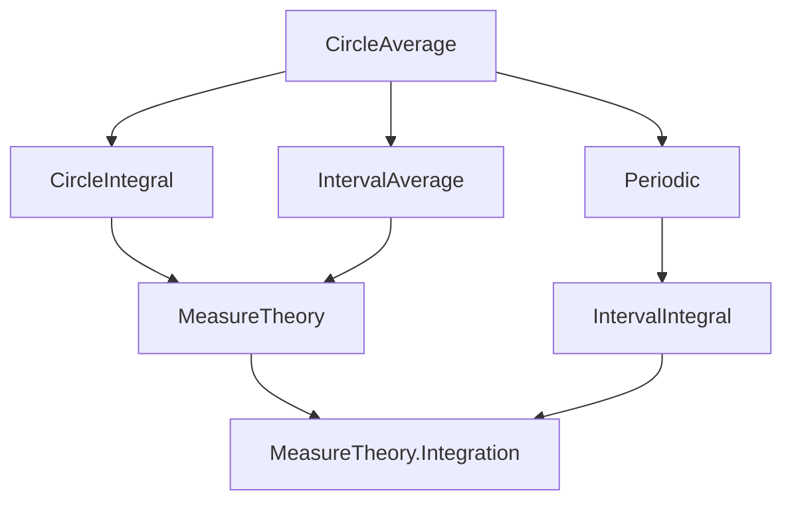
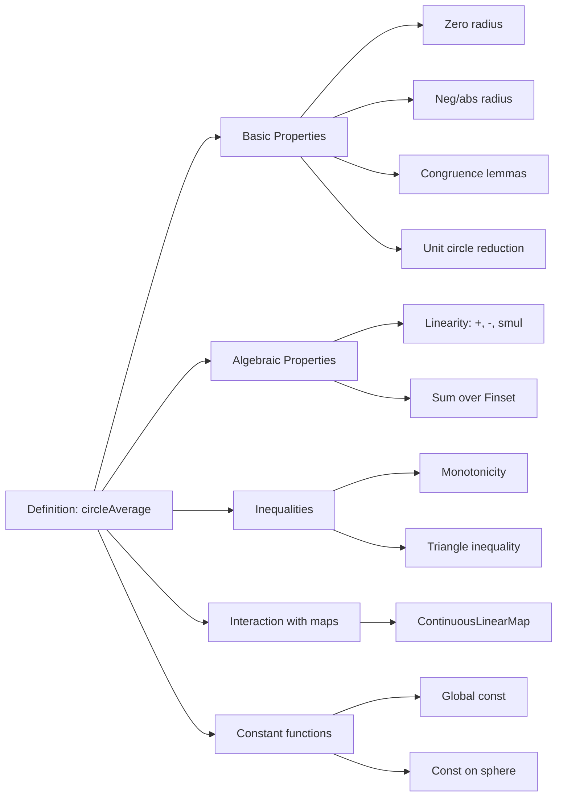

### Technical Brief: `CircleAverage.lean`

---

#### **1. Key Definitions & Theorems**

| Name | Type / Signature | Purpose |
|------|------------------|---------|
| `circleAverage` | `f : ℂ → E → c : ℂ → R : ℝ → E` | Defines the average of `f` over the circle centered at `c` with radius `R`, using rotation-invariant probability measure. |
| `circleAverage_def` | `circleAverage f c R = (2 * π)⁻¹ • ∫ θ in 0..2 * π, f (circleMap c R θ)` | Definitional equality for `circleAverage`. |
| `circleAverage.integral_undef` | `¬CircleIntegrable f c R → circleAverage f c R = 0` | Handles non-integrable case: average is zero by convention. |
| `circleAverage_zero` | `circleAverage f c 0 = f c` | Average over degenerate circle (radius 0) evaluates to `f c`. |
| `circleAverage_neg_radius` | `circleAverage f c (-R) = circleAverage f c R` | Sign of radius does not affect average. |
| `circleAverage_abs_radius` | `circleAverage f c |R| = circleAverage f c R` | Average depends only on absolute value of radius. |
| `circleAverage_eq_circleIntegral` | `R ≠ 0 → circleAverage f c R = (2 * π * I)⁻¹ • ∮ z in C(c, R), (z - c)⁻¹ • f z` | Relates measure-theoretic average to complex contour integral. |
| `circleAverage_congr_sphere` | `Set.EqOn f₁ f₂ (sphere c |R|) → circleAverage f₁ c R = circleAverage f₂ c R` | Averages agree if functions agree on the circle. |
| `circleAverage_const` | `circleAverage (fun _ ↦ a) c R = a` | Average of constant function is the constant. |
| `circleAverage_const_on_circle` | `(∀ x ∈ sphere c |R|, f x = a) → circleAverage f c R = a` | If `f` is constant on the circle, average equals that constant. |
| `circleAverage_mono` | `(∀ x ∈ sphere c |R|, f₁ x ≤ f₂ x) → circleAverage f₁ c R ≤ circleAverage f₂ c R` | Monotonicity of averages. |
| `abs_circleAverage_le_circleAverage_abs` | `|circleAverage f c R| ≤ circleAverage |f| c R` | Triangle inequality for circle averages. |
| `ContinuousLinearMap.circleAverage_comp_comm` | `L ∘ f` average = `L` applied to `f` average | Commutativity with continuous linear maps. |
| `circleAverage_smul`, `circleAverage_add`, `circleAverage_sub`, `circleAverage_sum` | Various algebraic compatibility lemmas | Ensures `circleAverage` is linear over integrable functions. |

---

#### **2. Naming Conventions**

- **Prefixes**:
  - `circleAverage_`: Core definitions and properties.
  - `circleMap_`: Helper lemmas about the parametrization of the circle.
- **Suffixes**:
  - `_def`: Definitional lemmas.
  - `_congr`: Congruence lemmas (equality under pointwise agreement).
  - `_comm`: Commutativity lemmas (e.g., with linear maps or arithmetic).
  - `_mono`: Monotonicity or inequality lemmas.
  - `_nonneg`, `_abs`: Special cases involving nonnegativity or absolute values.
- **Function variants**:
  - `circleAverage_fun_*`: Explicit lambda versions (e.g., `circleAverage_fun_add`).
- **Special cases**:
  - `_zero`, `_neg_radius`, `_abs_radius`, `_zero_one`: Simplifications for special inputs.

---

#### **3. Tactic Stack**

Frequently used tactics in proofs:

- `simp` / `simp_rw`: Simplify using definitions (`circleAverage_def`, `circleMap_*`, etc.).
- `congr`: Structural congruence (e.g., for function extensionality or integral equality).
- `rw`: Rewrite using lemmas (especially `circleAverage_*`, `intervalIntegral.*`).
- `match_scalars`, `field_simp`, `field`: Simplify scalar expressions and inverses.
- `intervalIntegral.*` lemmas: `integral_comp_add_right`, `integral_congr`, `integral_mono_on_of_le_Ioo`, `abs_integral_le_integral_abs`.
- `ae_restrict_le_codiscreteWithin`, `codiscreteWithin.mono`: Measure-theoretic congruence arguments.
- `ring`, `ring_nf`: Algebraic simplifications.
- `by_cases`, `by_contra`, `tauto`: Classical reasoning and case splits.
- `convert`, `ext`, `funext`: Extensionality and conversion steps.

---

#### **4. Proof Logic**

- **Structure**: Most proofs follow a pattern:
  1. **Unfold** `circleAverage` using `circleAverage_def`.
  2. **Reduce** to interval integrals via `circleMap`.
  3. **Apply** known interval integral lemmas (e.g., change of variables, monotonicity, linearity).
  4. **Simplify** using algebraic or measure-theoretic facts (e.g., periodicity of `circleMap`, measure normalization).
- **Common proof patterns**:
  - **Congruence**: Show integrands agree a.e. on `[0, 2π]` via `circleMap`’s image being the sphere.
  - **Linearity**: Pull scalars/sums through integral using `intervalIntegral.integral_smul`, `integral_add`, etc.
  - **Zero radius**: Reduce to constant integrals via `circleMap_zero_radius`.
  - **Negative radius**: Use periodicity and substitution `θ ↦ θ + π` or `θ ↦ -θ`.
  - **Unit circle reduction**: Use substitution `θ ↦ R * θ + c` or scaling.

---

#### **5. Imports**

| Module | Purpose |
|--------|---------|
| `Mathlib.MeasureTheory.Integral.CircleIntegral` | Defines `circleMap`, `circleIntegral`, `CircleIntegrable`. |
| `Mathlib.MeasureTheory.Integral.IntervalAverage` | Defines `intervalAverage`, used in `circleAverage_def`. |
| `Mathlib.MeasureTheory.Integral.IntervalIntegral.Periodic` | Provides lemmas about integrals of periodic functions (e.g., `intervalIntegral_add_eq`, `integral_comp_add_right`). |

---

#### **6. Mermaid Diagrams**

##### **Dependency Graph (Top-Level)**

##### **File Overview (Structure)**

---

#### **7. Theory Context**

- **Domain**: Measure-theoretic complex analysis.
- **Purpose**: Provide a robust, measure-theoretic notion of average over circles, parallel to `IntervalAverage`, but adapted to the complex plane and rotation-invariant geometry.
- **Distinction**: Not to be confused with `circleIntegral`, which is a *path integral* (with respect to `dz`), whereas `circleAverage` is a *mean value* (with respect to normalized arc-length measure).
- **Use cases**:
  - Harmonic analysis on the circle.
  - Proving mean-value properties of holomorphic/harmonic functions.
  - Simplifying expressions involving angular integrals.

---

#### **8. Implementation Notes**

- **Negative radii**: Handled via `circleMap_neg_radius` and `circleAverage_neg_radius`, ensuring consistency without case splits.
- **Zero radius**: Degenerate case handled via `circleMap_zero_radius`, yielding `f c`.
- **Integrability**: Non-integrable functions default to `0`, consistent with `intervalAverage`.
- **Normalization**: Factor `(2 * π)⁻¹` ensures total measure 1 (probability measure).
- **Scalability**: Designed to work in arbitrary complete normed spaces `E` over `ℝ`, with scalar field `𝕜` for generalization.

--- 

This file is a foundational component for geometric measure theory in complex analysis, enabling clean manipulation of circular averages in Lean.
