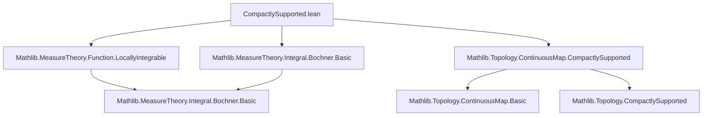

**Technical Brief: `CompactlySupported.lean`**

---

### 1. **Key Definitions & Theorems**

| Name | Type / Signature | Purpose |
|------|------------------|---------|
| `integrable` | `{f : C_c(X, E)} → Integrable f μ` | Shows that any compactly supported continuous function into a normed additive commutative group `E` is integrable w.r.t. a measure finite on compacts. |
| `integralPositiveLinearMap` | `Measure X → [IsFiniteMeasureOnCompacts μ] → C_c(X, ℝ) →ₚ[ℝ] ℝ` | Constructs the Riesz representation of integration as a *positive* linear functional on real-valued compactly supported continuous functions. |
| `integralLinearMap` | `Measure X → [IsFiniteMeasureOnCompacts μ] → C_c(X, ℝ≥0) →ₗ[ℝ≥0] ℝ≥0` | Extends integration to nonnegative compactly supported continuous functions as a linear map over `ℝ≥0`. |

- `C_c(X, E)` denotes the space of *compactly supported continuous maps* $X \to E$.
- `→ₚ[ℝ]` = positive linear map over `ℝ`; `→ₗ[ℝ≥0]` = linear map over the nonnegative reals.
- `PositiveLinearMap.mk₀` constructs a positive linear map from a function satisfying additivity, scalar multiplication, and positivity.

---

### 2. **Naming Conventions**

- **Prefixes**:
  - `integral_`: for integration-related constructions (e.g., `integralPositiveLinearMap`, `integralLinearMap`).
  - `hasCompactSupport`: property of functions with compact support.
- **Suffixes**:
  - `_map`: indicates a map (e.g., `integralPositiveLinearMap`).
  - `_positive`: indicates positivity of the map (e.g., `integralPositiveLinearMap`).
- **Type parameters**:
  - `E` for general normed additive groups (often target of `C_c`).
  - `μ` for measures.
  - `Λ` used for generic positive linear functionals (in context, but not defined here).

---

### 3. **Tactic Stack**

- `simp_rw` (via `simps!` attribute): used to generate clean `simps` lemmas for definitions.
- `aesop`: likely used implicitly in `integrable_of_hasCompactSupport` (from `Continuous.integrable_of_hasCompactSupport`).
- `ring`, `simp`: used in proofs of additivity and scalar multiplication (e.g., `integral_add'`, `integral_smul`).
- `apply`, `exact`: used in `PositiveLinearMap.mk₀` arguments.

---

### 4. **Proof Logic**

- **Main proof pattern**:
  1. **Use structure of `C_c`**: functions are continuous and have compact support.
  2. **Apply known integrability criterion**: `f.continuous.integrable_of_hasCompactSupport f.hasCompactSupport`.
  3. **Construct linear maps via `PositiveLinearMap.mk₀`**:
     - Define underlying function: $f \mapsto \int f \, d\mu$.
     - Prove additivity (`map_add'`) and homogeneity (`map_smul'`) using standard integral properties (`integral_add'`, `integral_smul`).
     - Prove positivity (`fun _ ↦ integral_nonneg`) to satisfy `PositiveLinearMap.mk₀`’s requirement.
  4. **Lift to `ℝ≥0`-valued functions** via `toNNRealLinear`, ensuring compatibility with extended nonnegative reals.

- **Assumptions used**:
  - `TopologicalSpace X`, `MeasurableSpace X`, `OpensMeasurableSpace X`: ensure measurability of continuous functions.
  - `T2Space X`, `LocallyCompactSpace X`: needed for `C_c(X, ℝ)` to be well-behaved (e.g., Urysohn’s lemma, existence of bump functions).
  - `IsFiniteMeasureOnCompacts μ`: ensures integrals over supports are finite.

---

### 5. **Imports**

| Module | Purpose |
|--------|---------|
| `Mathlib.MeasureTheory.Function.LocallyIntegrable` | Provides `Integrable` and related lemmas (e.g., `integrable_of_hasCompactSupport`). |
| `Mathlib.MeasureTheory.Integral.Bochner.Basic` | Bochner integral basics: additivity, scalar multiplication, monotonicity. |
| `Mathlib.Topology.ContinuousMap.CompactlySupported` | Defines `C_c(X, E)` and its topology/structure (e.g., `hasCompactSupport`, continuity). |

---

### 6. **Mermaid Diagrams**

#### **Dependency Graph (File-Level)**



#### **Conceptual Overview (Theory Flow)**

```mermaid
flowchart LR
  X[Topological & Measurable Space X] --> C_c[C_c(X, E)]
  C_c -->|continuous + compact support| Integrable[Integrability]
  Integrable -->|Bochner integral| IntegralMap[Integration as Linear Map]
  IntegralMap -->|Positivity| PosLinearMap[Positive Linear Functional]
  PosLinearMap -->|Extension| NNRealMap[ℝ≥0-linear Map]
  
  subgraph Assumptions
    T2[T2Space X]
    LC[LocallyCompactSpace X]
    FM[IsFiniteMeasureOnCompacts μ]
  end
  
  T2 & LC & FM --> C_c
```

---

### 7. **Domain-Specific AI Agent Notes**

- **Key inference pattern**: *From structural properties (continuity + compact support) + measure regularity, derive analytic properties (integrability, linearity).*
- **Critical lemmas to surface**: `integrable`, `integral_add'`, `integral_smul`, `integral_nonneg`.
- **Common proof obligations**: verifying positivity, additivity, and scalar compatibility for functional constructions.
- **Target theory**: Riesz–Markov–Kakutani representation theorem setup (this file is a foundational step toward representing positive linear functionals as integrals).

--- 

Let me know if you'd like the next file in the chain (e.g., Riesz representation) similarly analyzed.
