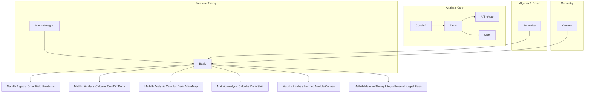
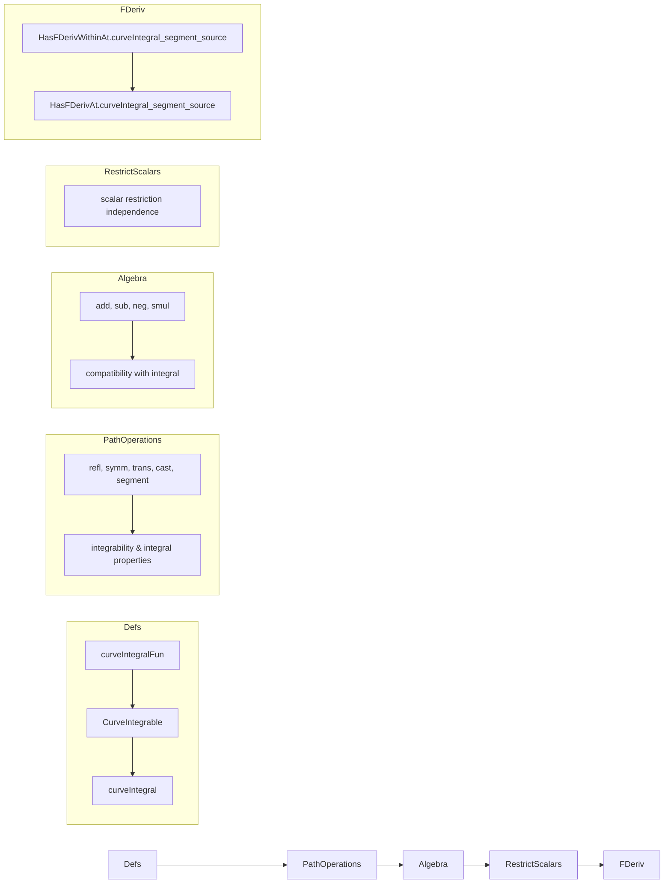

Here is the structured technical metadata extracted from `Basic.lean`:

---

### **1. Key Definitions & Theorems**

| Name | Type / Signature | Purpose |
|------|------------------|---------|
| `curveIntegralFun ω γ t` | `F` | Integrand function: $t \mapsto \omega(\gamma(t))(\gamma'(t))$, using `Path.extend` and `derivWithin`. |
| `CurveIntegrable ω γ` | `Prop` | Predicate asserting that `curveIntegralFun ω γ` is integrable on $[0,1]$. |
| `curveIntegral ω γ` | `F` | Curve integral: $\int_0^1 \omega(\gamma(t))(\gamma'(t))\,dt$, defined via Bochner integral. |
| `curveIntegral_refl` | `∫ᶜ x in .refl a, ω x = 0` | Integral over constant path is zero. |
| `curveIntegral_symm` | `∫ᶜ x in γ.symm, ω x = -∫ᶜ x in γ, ω x` | Reversing path orientation negates integral. |
| `curveIntegral_trans` | `∫ᶜ x in γab.trans γbc, ω x = ∫ᶜ x in γab, ω x + ∫ᶜ x in γbc, ω x` | Additivity over concatenation of paths. |
| `curveIntegral_segment` | `∫ᶜ x in .segment a b, ω x = ∫ t in 0..1, ω (lineMap a b t) (b - a)` | Reduces segment integral to standard interval integral. |
| `curveIntegral_segment_const` | `∫ᶜ _ in .segment a b, ω = ω (b - a)` | For constant 1-forms, integral equals evaluation on displacement. |
| `norm_curveIntegral_segment_le` | `‖∫ᶜ x in .segment a b, ω x‖ ≤ C * ‖b - a‖` | Norm bound for segment integrals under uniform bound on `ω`. |
| `HasFDerivWithinAt.curveIntegral_segment_source` | `HasFDerivWithinAt (fun b ↦ ∫ᶜ x in .segment a b, ω x) (ω a) s a` | Derivative of segment integral w.r.t. endpoint `b` at `b = a` is `ω a`. |
| `curveIntegral_add`, `curveIntegral_sub`, `curveIntegral_neg`, `curveIntegral_smul` | Various algebraic properties | Linearity and compatibility with scalar multiplication. |
| `curveIntegral_restrictScalars` | `∫ᶜ x in γ, (ω x).restrictScalars 𝕝 = ∫ᶜ x in γ, ω x` | Independence of base field scalar restriction (for compatible scalars). |

---

### **2. Naming Conventions**

- **Prefixes**:
  - `curveIntegralFun_`: helper function for integrand.
  - `curveIntegral_`: main integral definition or its properties.
  - `CurveIntegrable_`: integrability predicate.
  - `hasFDerivWithinAt.curveIntegral_`, `hasFDerivAt.curveIntegral_`: derivative lemmas.

- **Suffixes**:
  - `_def`, `_def'`: definition lemmas.
  - `_apply`, `_iff`: equivalence or application variants.
  - `_left`, `_right`, `_trans`: for concatenation-related lemmas.
  - `_segment`, `_refl`, `_symm`: path-specific variants.

- **Notation**:
  - `∫ᶜ x in γ, ω x`: notation for `curveIntegral ω γ`.

---

### **3. Tactic Stack**

Frequently used tactics:
- `simp` (with custom lemmas like `curveIntegralFun_def`, `curveIntegral_def`)
- `rw`, `apply`, `exact`
- `filter_upwards`, `aesop` (for measure-theoretic arguments)
- `intervalIntegral.integral_congr_ae_restrict`, `intervalIntegral.integral_add_adjacent_intervals`
- `norm_num`, `linarith`, ` positivity`
- `contDiffOn`, `continuousWithinAt`, `continuousAt` (for regularity assumptions)
- `convex_univ`, `convex_ball`, `segment_subset` (for convex geometry)

---

### **4. Proof Logic**

- **Induction / decomposition**:
  - Proofs often decompose paths (e.g., `trans`, `symm`, `segment`) and use change-of-variable lemmas for integrals (`integral_smul`, `integral_comp_mul_left`, etc.).
  - For `curveIntegral_trans`, split integral at $1/2$ and use change of variables on each half.

- **Measure-theoretic reasoning**:
  - Use `ae_restrict_mem`, `intervalIntegrable.congr_ae`, `intervalIntegrable.add`, etc., to handle almost-everywhere equal functions.

- **Differentiability arguments**:
  - Use `HasFDerivWithinAt`, `HasFDerivAt`, and `isLittleO` characterizations.
  - Estimate difference quotients via norm bounds (`norm_curveIntegral_segment_le`) and continuity of `ω`.

- **Path algebra**:
  - Leverage `Path.extend`, `Path.cast`, `Path.trans`, `Path.symm`, `Path.segment`, and their properties (`extend_trans_of_le_half`, `extend_symm`, etc.).

---

### **5. Imports**

Core dependencies defining the scope:

```lean
Mathlib.Algebra.Order.Field.Pointwise
Mathlib.Analysis.Calculus.ContDiff.Deriv
Mathlib.Analysis.Calculus.Deriv.AffineMap
Mathlib.Analysis.Calculus.Deriv.Shift
Mathlib.Analysis.Normed.Module.Convex
Mathlib.MeasureTheory.Integral.IntervalIntegral.Basic
```

These indicate:
- Ordered field and pointwise operations (`RCLike`, `NormedSpace`, etc.)
- Differentiability (`ContDiff`, `derivWithin`, `HasFDerivWithinAt`)
- Affine geometry (`lineMap`, `segment`)
- Convex analysis (`convex`, `segment_subset`)
- Bochner/interval integration (`IntervalIntegrable`, `intervalIntegral`)

---

### **6. Mermaid Diagrams**

#### **Dependency Graph (Module-Level)**



#### **Overview of File Structure**



---

Let me know if you'd like a formal dependency graph (e.g., for `leanpkg` or `lake`) or a theory graph for the Poincaré lemma (mentioned as WIP).
