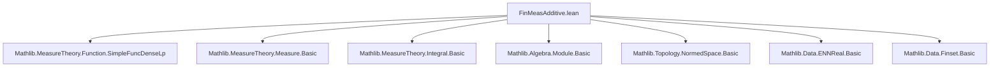
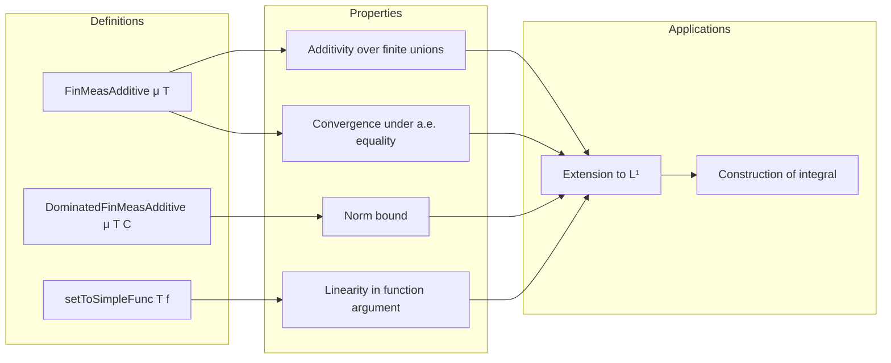

### Technical Brief: `FinMeasAdditive.lean`

---

#### **1. Key Definitions & Theorems**

| Name | Type | Purpose |
|------|------|---------|
| `FinMeasAdditive μ T` | `Prop` | States that `T : Set α → β` is additive over disjoint measurable sets of finite measure: `Disjoint s t → T (s ∪ t) = T s + T t`. |
| `DominatedFinMeasAdditive μ T C` | `Prop` | `FinMeasAdditive μ T` + uniform norm bound: `‖T s‖ ≤ C * μ.real s` for all measurable `s` with `μ s < ∞`. |
| `setToSimpleFunc T f` | `F'` | Extends `T : Set α → F →L[ℝ] F'` to simple functions: `∑ x ∈ f.range, T (f ⁻¹' {x}) x`. |
| `map_setToSimpleFunc` | theorem | Compatibility of `setToSimpleFunc` with function composition: `(f.map g).setToSimpleFunc T = ∑ x, T (f ⁻¹' {x}) (g x)`, assuming `g 0 = 0`. |
| `setToSimpleFunc_add` | theorem | Additivity of `setToSimpleFunc` in the function argument: `setToSimpleFunc T (f + g) = setToSimpleFunc T f + setToSimpleFunc T g`. |
| `setToSimpleFunc_congr` | theorem | If `f =ᵐ[μ] g`, then `f.setToSimpleFunc T = g.setToSimpleFunc T`, under `h_zero : T s = 0` when `μ s = 0`. |
| `norm_setToSimpleFunc_le_sum_mul_norm_of_integrable` | theorem | Norm bound: `‖f.setToSimpleFunc T‖ ≤ C * ∑ μ.real (f ⁻¹' {x}) * ‖x‖`, under domination by `C`. |
| `setToSimpleFunc_indicator` | theorem | Computes `setToSimpleFunc` on indicator-like simple functions: `T s x` when the simple function is `x • 1ₛ`. |
| `FinMeasAdditive.map_iUnion_fin_meas_set_eq_sum` | theorem | Finite additivity extends to disjoint finite unions: `T (⋃ i ∈ sι, S i) = ∑ i ∈ sι, T (S i)`. |

---

#### **2. Naming Conventions**

- **Prefixes**:
  - `FinMeasAdditive` / `DominatedFinMeasAdditive`: core properties.
  - `setToSimpleFunc`: extension from sets to simple functions.
  - `map_`, `norm_`, `congr`, `mono`: action descriptors.
- **Suffixes**:
  - `_left`: operations on the *left* argument (e.g., `add_left`, `smul_left`).
  - `_of_`: derived from a condition (e.g., `of_measure_le`, `of_smul_measure`).
  - `_iff`: equivalence statements (e.g., `smul_measure_iff`).
- **Variables**:
  - `T`, `T'`: set functions.
  - `μ`, `μ'`: measures.
  - `s`, `t`, `S i`: measurable sets.
  - `f`, `g`: simple functions.
  - `C`, `C'`: domination constants.

---

#### **3. Tactic Stack**

Frequent tactics used in proofs:

| Tactic | Role |
|--------|------|
| `simp` / `simp_rw` | Simplify using definitions, especially `FinMeasAdditive`, `setToSimpleFunc`, measure properties. |
| `rw` | Rewrite using hypotheses or lemmas (e.g., `hT s t hs ht hμs hμt hst`). |
| `gcongr` / `norm_sum_le` | Handle inequalities, especially in norm bounds. |
| `Finset.induction_on` | Induction over finite sets for finite additivity proofs. |
| `abel` / `ring` | Solve additive/linear equalities in abelian groups or rings. |
| `congr` / `convert` | Align goals with known lemmas. |
| `grind` | Solve measurable set / finite measure conditions (custom helper in this file). |
| `cases` / `obtain` | Decompose existential or disjunctive hypotheses. |
| `push_cast` | Push coercions (e.g., `ℝ≥0∞` → `ℝ`) through operations. |

---

#### **4. Proof Logic**

- **Structure of proofs**:
  1. **Induction** on finite index sets (`Finset.induction_on`) for finite additivity.
  2. **Case analysis** on whether sets are empty or not (`eq_empty_or_nonempty`, `eq_or_ne`).
  3. **Decomposition** of simple functions via range and fibers (`range`, `preimage`, `mem_range`).
  4. **Norm estimates** via `norm_sum_le`, `norm_smul_le`, and domination assumptions.
  5. **Measure-theoretic lemmas**:
     - `measure_preimage_lt_top_of_integrable`
     - `measure_biUnion_lt_top`
     - `ae_iff`, `measure_mono_null`
  6. **Equational reasoning** with `calc` blocks for chains of inequalities/equalities.

- **Typical flow**:
  > *Assume `h_add : FinMeasAdditive μ T`. Show `T (∪ S i) = ∑ T (S i)` by induction on `sι`. Base case uses `map_empty_eq_zero`. Step case uses `h_add` on `S a` and `∪_{i ∈ s} S i`, then applies `Finset.iSup_insert` and disjointness.*

---

#### **5. Imports**

- **Primary dependency**:
  ```lean
  import Mathlib.MeasureTheory.Function.SimpleFuncDenseLp
  ```
- **Implicit imports** (via `MeasureTheory` namespace and `SimpleFunc`):
  - `Mathlib.MeasureTheory.Measure.Basic`
  - `Mathlib.MeasureTheory.Integral.Basic`
  - `Mathlib.MeasureTheory.Function.SimpleFunc`
  - `Mathlib.Algebra.Module.Basic`
  - `Mathlib.Topology.NormedSpace.Basic`

---

#### **6. Mermaid Diagrams**

##### **Dependency Graph (Module-Level)**



##### **Conceptual Overview**



##### **Theoretical Scope**

- **Domain**: Measure theory on `α`, with measure `μ`.
- **Objects**: Set functions `T : Set α → E →L[ℝ] F`, simple functions `α →ₛ E`.
- **Goal**: Extend `T` from sets to integrable functions via simple functions, using finite additivity and domination.
- **Bridge**: `setToSimpleFunc` serves as the intermediate operator, with `DominatedFinMeasAdditive` ensuring continuity for extension to `L¹`.

---

#### **7. Summary**

This file formalizes the foundational theory of *finitely additive set functions* with respect to a measure `μ`, especially in preparation for extending such functionals to integrals over `L¹`. The key innovation is the `FinMeasAdditive` property, which captures finite additivity on measurable sets of finite measure, and `DominatedFinMeasAdditive`, which adds a norm control condition needed for continuity. The `setToSimpleFunc` construction provides the bridge from sets to simple functions, with extensive lemmas ensuring linearity, continuity, and congruence properties. This underpins the later development of the Bochner integral and Riesz representation-type results in `Mathlib/MeasureTheory/Integral/SetToL1.lean`.
