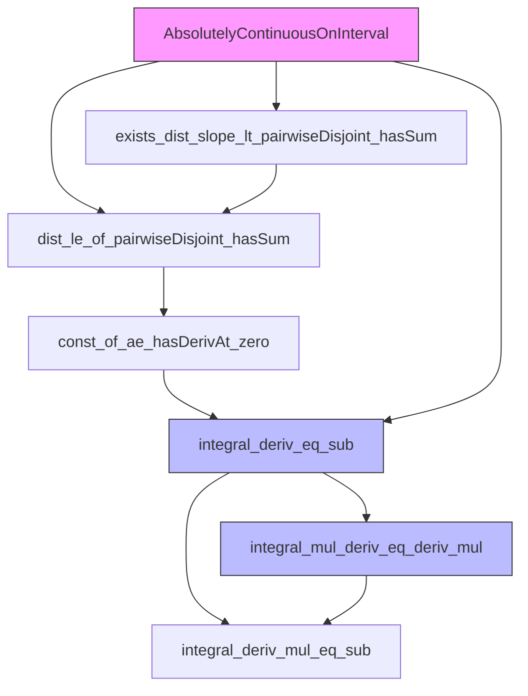
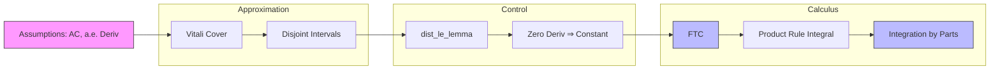

### Technical Brief: `AbsolutelyContinuousFun.lean`

---

#### **1. Key Definitions & Theorems**

| Name | Type / Signature | Purpose |
|------|------------------|---------|
| `AbsolutelyContinuousOnInterval` | `f : ℝ → X → Prop` | Defines absolute continuity of `f` on a closed interval `uIcc a b`. (Not shown in snippet but used throughout.) |
| `exists_dist_slope_lt_pairwiseDisjoint_hasSum` | `lemma` | Constructs a disjoint cover of subintervals where the slope of `f` approximates its a.e. derivative within `η`. |
| `AbsolutelyContinuousOnInterval.dist_le_of_pairwiseDisjoint_hasSum` | `lemma` | Bounds `dist (f d, f b)` by a sum of distances over a disjoint interval cover, under absolute continuity. |
| `AbsolutelyContinuousOnInterval.const_of_ae_hasDerivAt_zero` | `theorem` | If `f` is absolutely continuous and has zero derivative a.e., then `f` is constant. |
| `AbsolutelyContinuousOnInterval.integral_deriv_eq_sub` | `theorem` | **Fundamental Theorem of Calculus (FTC)**: For `f` absolutely continuous on `[a, b]`, $\int_a^b f'(x)\,dx = f(b) - f(a)$. |
| `AbsolutelyContinuousOnInterval.integral_deriv_mul_eq_sub` | `theorem` | Integral of derivative of product: $\int_a^b (f'g + fg') = f(b)g(b) - f(a)g(a)$. |
| `AbsolutelyContinuousOnInterval.integral_mul_deriv_eq_deriv_mul` | `theorem` | **Integration by Parts (IBP)**: $\int_a^b f g' = f(b)g(b) - f(a)g(a) - \int_a^b f' g$. |

---

#### **2. Naming Conventions**

- **Prefixes**:
  - `AbsolutelyContinuousOnInterval.`: All main theorems/lemmas are prefixed with this, indicating the domain of application.
  - `dist_`, `slope_`, `intervalGapsWithin`: Reflect geometric/analytic objects (distance, slope, gap decomposition).
- **Suffixes**:
  - `_eq_sub`: Indicates equality to a difference (e.g., `integral_deriv_eq_sub`).
  - `_le_`: Indicates inequality bound (e.g., `dist_le_of_pairwiseDisjoint_hasSum`).
  - `_zero`: Denotes zero-derivative case (`const_of_ae_hasDerivAt_zero`).
- **Other patterns**:
  - `ae_`: Almost-everywhere properties (`ae_hasDerivAt_zero`, `ae_differentiableAt`).
  - `intervalGapsWithin`: Used for finite approximations of interval complements.

---

#### **3. Tactic Stack**

| Tactic | Frequency | Role |
|--------|-----------|------|
| `grind` | Very high | Custom simplifier/automation for measure-theoretic and metric reasoning (likely a `simp` variant with `linarith`, `field_simp`, etc.). |
| `simp` / `simp_rw` | High | Simplification of set membership, sums, integrals, and metric expressions. |
| `rw` | High | Rewriting using equalities (e.g., `dist_comm`, `slope`, `intervalGapsWithin`). |
| `linarith` | High | Linear arithmetic over reals (e.g., bounding lengths, positivity). |
| `field_simp`, `rw [div_pos]`, `mul_comm` | Medium | Field simplifications and algebraic reordering. |
| `filter_upwards` | Medium | Handling almost-everywhere statements via `eventually`/`frequently`. |
| `convert` | Medium | Matching goals up to definitional equality (e.g., in FTC proof). |
| `abel` | Low | Abelian group simplification (e.g., in `integral_deriv_mul_eq_sub`). |
| `grw` | Medium | Likely a custom `rw` + `simp` combo (used in `dist_le_of_pairwiseDisjoint_hasSum`). |

---

#### **4. Proof Logic**

- **Structure**:
  1. **Approximation Lemma** (`exists_dist_slope_lt_pairwiseDisjoint_hasSum`):
     - Uses **Vitali covering theorem** (`Vitali.exists_disjoint_covering_ae'`) to extract disjoint intervals where slope ≈ derivative.
     - Handles edge cases (`d = b`) trivially.
  2. **Control Lemma** (`dist_le_of_pairwiseDisjoint_hasSum`):
     - Approximates complement of union of intervals via `Finset.intervalGapsWithin`.
     - Uses absolute continuity to control error on gaps.
     - Applies triangle inequality and limit arguments.
  3. **Zero-Derivative ⇒ Constant**:
     - Reduces to bounding `dist(f(d), f(b)) ≤ r` for all `r > 0`.
     - Applies previous lemmas with `η = r/(b-d)`.
  4. **FTC**:
     - Defines `g(x) = f(x) - ∫_a^x f'`.
     - Shows `g` is absolutely continuous and has zero derivative a.e.
     - Concludes `g` constant ⇒ FTC.
  5. **Integration by Parts**:
     - Derives from product rule and FTC.
     - Uses integrability and continuity of `f`, `g`, `f'`, `g'`.

- **Induction/Recursion**: Not used directly; relies on measure-theoretic approximation and compactness (via Vitali).

---

#### **5. Imports**

| Module | Role |
|--------|------|
| `Mathlib.Algebra.BigOperators.Group.Finset.Gaps` | `intervalGapsWithin`, finite gap decomposition. |
| `Mathlib.Analysis.Calculus.Deriv.Mul` | Product rule for derivatives (`hasDerivAt.mul`). |
| `Mathlib.MeasureTheory.Integral.IntervalIntegral.DerivIntegrable` | Integrability of derivatives under absolute continuity. |
| `Mathlib.MeasureTheory.Integral.IntervalIntegral.LebesgueDifferentiationThm` | Lebesgue differentiation (used implicitly in Vitali covering). |

---

#### **6. Mermaid Diagrams**

##### **Dependency Graph (High-Level Theory)**

##### **File Overview (Flow of Results)**

---

#### **7. Domain-Specific AI Agent Notes**

- **Key Concepts to Encode**:
  - Absolute continuity as a bridge between differentiability and integrability.
  - Vitali covering for local slope approximation.
  - Gap decomposition (`intervalGapsWithin`) for finite approximation of measure-zero sets.
  - Use of `dist` and `slope` to connect metric and differential structure.

- **Common Proof Patterns**:
  - Reduce to bounding `dist(f(a), f(b))` via interval covers.
  - Use `grind`/`simp` to handle measure-theoretic algebra.
  - Leverage `ae_` lemmas to switch between pointwise and a.e. reasoning.

- **Critical Lemmas for Automation**:
  - `exists_dist_slope_lt_pairwiseDisjoint_hasSum`
  - `AbsolutelyContinuousOnInterval.dist_le_of_pairwiseDisjoint_hasSum`
  - `const_of_ae_hasDerivAt_zero`

--- 

Let me know if you'd like a formalized dependency graph in Lean or a tactic-level trace of the FTC proof.
