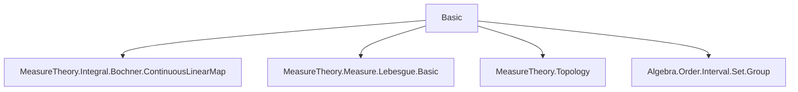

Here's the structured technical brief extracted from `Basic.lean`:

---

### **1. Key Definitions & Theorems**

| Name | Type / Signature | Purpose |
|------|------------------|---------|
| `IntervalIntegrable` | `f : ℝ → ε → μ : Measure ℝ → a b : ℝ → Prop` | Defines integrability over unordered interval `[a, b]` as integrability on both `(a, b]` and `(b, a]`. |
| `intervalIntegral` | `f : ℝ → E → a b : ℝ → μ : Measure ℝ → E` | Defines the interval integral as `∫_(Ioc a b) f dμ - ∫_(Ioc b a) f dμ`. |
| `intervalIntegrable_iff` | `IntervalIntegrable f μ a b ↔ IntegrableOn f (uIoc a b) μ` | Equivalence between interval integrability and integrability on the symmetric interval `uIoc a b = Ioc (min a b) (max a b)`. |
| `integral_of_le` | `a ≤ b → ∫_(a..b) f dμ = ∫_(Ioc a b) f dμ` | Reduces interval integral to standard integral over `(a, b]` when `a ≤ b`. |
| `integral_symm` | `∫_(b..a) f dμ = -∫_(a..b) f dμ` | Antisymmetry of interval integral under swapping endpoints. |
| `intervalIntegral_eq_integral_uIoc` | `∫_(a..b) f dμ = (if a ≤ b then 1 else -1) • ∫_(uIoc a b) f dμ` | Explicit piecewise expression of interval integral over symmetric interval. |
| `intervalIntegrable_const_iff` | `IntervalIntegrable (λ _ ↦ c) μ a b ↔ c = 0 ∨ μ (uIoc a b) < ∞` | Characterizes when constant functions are interval integrable. |
| `Continuous.intervalIntegrable` | `Continuous f → IntervalIntegrable f μ a b` | Continuous functions are interval integrable w.r.t. locally finite measures. |
| `Monotone.intervalIntegrable` | `Monotone f → IntervalIntegrable f μ a b` | Monotone functions are interval integrable w.r.t. locally finite measures. |
| `intervalIntegrable_of_even` / `intervalIntegrable_of_odd` | `∀ x, f x = f (-x)` / `∀ x, -f x = f (-x)` + integrability on `0..x` ⇒ integrability on all `a..b` | Parity-based integrability criteria for even/odd functions. |
| `Tendsto.eventually_intervalIntegrable_ae` | Under convergence of endpoints and a.e. limit of `f`, `IntervalIntegrable f μ (u t) (v t)` eventually | Ensures interval integrability in limit processes (e.g., approximations). |

---

### **2. Naming Conventions**

- **Prefixes**:
  - `intervalIntegrable_`: properties of `IntervalIntegrable`.
  - `intervalIntegral_`: properties of `intervalIntegral`.
  - `comp_`, `mono_`, `smul_`, `mul_`, `add_`, `sub_`, `neg_`, `div_`: algebraic operations on integrable functions.
  - `eventually_`: filter-theoretic statements (e.g., `eventually_intervalIntegrable`).
- **Suffixes**:
  - `_iff`: characterizations via `↔`.
  - `_of_le`, `_of_ge`, `_of_Icc`, `_of_Ioc`: specialized cases for order relations or interval types.
  - `_congr`, `_congr_ae`, `_congr_codiscreteWithin`: congruence lemmas under a.e. or pointwise equality.
  - `_symm`, `_refl`, `_trans`: symmetry/reflexivity/transitivity properties.
- **Notation**:
  - `∫ x in a..b, f x ∂μ` for `intervalIntegral f a b μ`.
  - `uIoc a b`, `uIcc a b`: symmetric intervals `(min a b, max a b]`, `[min a b, max a b]`.

---

### **3. Tactic Stack**

- **Core tactics**: `simp`, `rw`, `exact`, `intro`, `cases`, `split_ifs`, `convert`, `ext`.
- **Measure-theoretic**: `integrableOn_congr_fun_ae`, `integrableOn_union`, `integrableOn_Icc_iff_integrableOn_Ioc`, `ae_restrict_mem`, `measurableSet_uIoc`.
- **Algebraic**: `ring`, `linarith`, `field_simp`, `field`.
- **Topology/analysis**: `continuousOn`, `monotoneOn`, `isCompact_uIcc`, `Homeomorph.*`, `MeasurableEmbedding.integrableOn_map_iff`.
- **Filter-based**: `Tendsto.eventually`, `Filter.FiniteAtFilter`, `StronglyMeasurableAtFilter`.
- **Automation**: `aesop`, `tauto`, `conv`, `wlog`.

---

### **4. Proof Logic**

- **Structure**:
  - Most proofs reduce to properties of integrals over sets (`Ioc a b`, `Ioc b a`, `uIoc a b`) using `intervalIntegrable_iff`.
  - Cases on `a ≤ b` or `b ≤ a` are avoided via symmetric definitions (e.g., `intervalIntegral` as difference of two integrals).
  - Many results are proven via:
    - **Equivalence chaining**: `intervalIntegrable_iff` ↔ integrability on `uIoc a b`.
    - **Set inclusion**: `Ioc a b ⊆ uIcc a b`, `Ioc_subset_Icc_self`, etc.
    - **Filter convergence**: `eventually_intervalIntegrable_ae` uses `Tendsto` and `FiniteAtFilter`.
    - **Parity arguments**: splitting at `0`, using `comp_mul_left`, `comp_add_right`, `iff_comp_neg`.
- **Induction**: Used in `trans_iterate_Ico`, `trans_iterate` for finite chains of intervals.
- **Symmetry**: `symm`, `_iff` lemmas often rely on swapping `a ↔ b` and using `integral_symm`.

---

### **5. Imports & Dependencies**

| Module | Purpose |
|--------|---------|
| `Mathlib.MeasureTheory.Integral.Bochner.ContinuousLinearMap` | Bochner integral theory, continuity of linear maps. |
| `Mathlib.MeasureTheory.Measure.Lebesgue.Basic` | Lebesgue measure, locally finite measures. |
| `Mathlib.MeasureTheory.Topology` | Measurability, topology interplay (e.g., `uIcc`, `uIoc`). |
| `Mathlib.Algebra.Order.Interval.Set.Group` | Interval arithmetic, `uIoc`, `uIcc`, `min`, `max`. |

---

### **6. Mermaid Diagrams**

#### **Dependency Graph (Module-Level)**



#### **Conceptual Overview (Theory Flow)**

```mermaid
flowchart LR
  A[Interval Integrability] --> B[Definition via Ioc a b & Ioc b a]
  A --> C[Equivalence to IntegrableOn (uIoc a b)]
  C --> D[Algebraic Closure: +, -, smul, mul, etc.]
  C --> E[Topological Closure: Continuous, Monotone]
  C --> F[Parity & Symmetry: even/odd functions]
  D & E & F --> G[Interval Integral Definition]
  G --> H[Basic Properties: symmetry, additivity, change of vars]
  H --> I[Limit Theorems: Tendsto.eventually_intervalIntegrable]
```

#### **Key Equivalence Chain**

```mermaid
flowchart LR
  IntervalIntegrable f μ a b
    ↔ IntegrableOn f (uIoc a b) μ
    ↔ IntegrableOn f (Ioc (min a b) (max a b)) μ
    ↔ IntegrableOn f (Ioc a b) μ ∨ IntegrableOn f (Ioc b a) μ
```

---

This file formalizes the foundational theory of interval integrals in Lean, emphasizing *case-free* definitions and leveraging symmetric intervals to unify proofs across `a ≤ b` and `b ≤ a`. It serves as the basis for more advanced integral calculus (e.g., FTC, substitution) in Mathlib.
