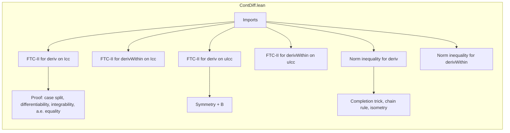

**Technical Brief: `ContDiff.lean` — Fundamental Theorem of Calculus for `C¹` Functions**

---

### 1. **Key Definitions & Theorems**

| Name | Type / Signature | Purpose |
|------|------------------|---------|
| `ContDiffOn ℝ k f s` | `ContDiffOn ℝ k f s` | `f` is $k$-times continuously differentiable on set `s` (here $k = 1$) |
| `deriv f x` | `deriv f x` | Classical derivative of `f` at `x`, defined when `f` is differentiable at `x` |
| `derivWithin f s x` | `derivWithin f s x` | Derivative of `f` *within* set `s` at `x`, used when domain is restricted |
| `integral_deriv_of_contDiffOn_Icc` | `ContDiffOn ℝ 1 f (Icc a b) → a ≤ b → ∫ x in a..b, deriv f x = f b - f a` | Second Fundamental Theorem of Calculus (FTC-II) on closed interval `[a, b]` for `C¹` functions |
| `integral_derivWithin_Icc_of_contDiffOn_Icc` | Same premise ⇒ `∫ x in a..b, derivWithin f (Icc a b) x = f b - f a` | FTC-II using *within*-derivative on `Icc a b` |
| `integral_deriv_of_contDiffOn_uIcc` | `ContDiffOn ℝ 1 f (uIcc a b) → ∫ x in a..b, deriv f x = f b - f a` | FTC-II for *unordered* interval `uIcc a b` (handles `a > b` via symmetry) |
| `integral_derivWithin_uIcc_of_contDiffOn_uIcc` | Same premise ⇒ equality with `derivWithin f (uIcc a b)` | Analogous to above, for within-derivative on unordered interval |
| `enorm_sub_le_lintegral_deriv_of_contDiffOn_Icc` | `ContDiffOn ℝ 1 f (Icc a b) → a ≤ b → ‖f b - f a‖ₑ ≤ ∫⁻ x in Icc a b, ‖deriv f x‖ₑ` | Norm inequality: $ \|f(b) - f(a)\| \le \int_{[a,b]} \|f'(x)\|\,dx $, using extended norm `‖·‖ₑ` and Bochner integral |
| `enorm_sub_le_lintegral_derivWithin_Icc_of_contDiffOn_Icc` | Same as above, but with `derivWithin f (Icc a b)` | Same inequality using within-derivative |

> **Note**: `E` is a complete normed space over `ℝ`, and integrals are taken with respect to Lebesgue measure (`volume`). The extended norm `‖·‖ₑ` lives in `ENNReal`.

---

### 2. **Naming Conventions**

- **Prefixes**:
  - `integral_...`: Indicates the theorem relates an integral to a difference `f b - f a`.
  - `enorm_sub_le_...`: Inequality bounding the *extended norm* of a difference by an integral of the norm of the derivative.
- **Suffixes**:
  - `_of_contDiffOn_Icc`: Hypothesis is `ContDiffOn ℝ 1 f (Icc a b)` and `a ≤ b`.
  - `_of_contDiffOn_uIcc`: Hypothesis is `ContDiffOn ℝ 1 f (uIcc a b)` (no ordering assumption).
  - `_Within`: Uses `derivWithin` instead of `deriv`.
- **Structure**:
  - `theorem <goal>_<context>_<hypothesis>`

---

### 3. **Tactic Stack**

Frequently used tactics in proofs:

| Tactic | Role |
|--------|------|
| `rcases` / `cases` | Decompose `le_or_gt`, `hab.eq_or_lt`, etc., to handle ordering cases |
| `simp` / `simp only` | Simplify using definitions (`uIcc_of_le`, `uIcc_of_ge`, `integral_of_le`, etc.) |
| `rw` | Rewrite using equalities (e.g., symmetry of integral, `integral_symm`) |
| `apply` / `apply _congr` | Apply lemmas or congruence rules (e.g., `integral_congr_ae`, `lintegral_congr_ae`) |
| `filter_upwards` | Prove almost-everywhere statements by filtering on measurable sets |
| `abel` | Solve linear combinations in abelian groups (used after symmetry to adjust signs) |
| `have` / `set` | Introduce intermediate facts (e.g., completion map `g`, isometry property) |
| `rw [fderiv_comp_deriv]` | Chain rule for Fréchet derivative (used in norm inequality proof) |
| `simp [this]` | Simplify using proven equalities (e.g., `fderiv ℝ g = g.toContinuousLinearMap`) |

---

### 4. **Proof Logic**

- **Structure of proofs**:
  1. **Case analysis** on `a ≤ b` or `a > b` (via `le_or_gt`, `hab.eq_or_lt`).
  2. **Reduction** to the standard interval case (`Icc a b`) using:
     - `uIcc_of_le`, `uIcc_of_ge`
     - `integral_symm` (to flip bounds when `a > b`)
  3. **Application of FTC-I** (via `hasDerivAt` from `ContDiffOn` ⇒ `DifferentiableWithinAt` ⇒ `DifferentiableAt`)
  4. **Verification of integrability**:
     - Use `ContDiffOn` ⇒ `derivWithin` continuous on `Icc` ⇒ integrable
     - Use `continuousOn` ⇒ `intervalIntegrable`
  5. **Equality up to a.e.**:
     - Show `deriv f = derivWithin f (Icc a b)` a.e. on `(a, b)` via `derivWithin_of_mem_nhds`
  6. **Norm inequality proofs**:
     - Embed into completion `g : E → completion E`
     - Use isometry to transfer norm identities
     - Apply `enorm_integral_le_lintegral_enorm`
     - Use chain rule (`fderiv_comp_deriv`) and simplify `fderiv g`

- **Key logical flow**:
  > *Induction-free*; relies on:
  > - Differentiability ⇒ existence of derivative a.e.
  > - Continuity of derivative ⇒ integrability
  > - Completion trick to handle non-complete `E` in norm inequalities

---

### 5. **Imports & Dependencies**

| Import | Purpose |
|--------|---------|
| `Mathlib.Analysis.Calculus.ContDiff.Deriv` | Core theory of `ContDiff`, `deriv`, `differentiableOn`, `differentiableWithinAt`, chain rule, `fderiv` |
| `Mathlib.MeasureTheory.Integral.IntervalIntegral.FundThmCalculus` | Previous FTC results (e.g., `integral_eq_sub_of_hasDerivAt_of_le`) |
| `MeasureTheory` | Integration theory: `integral`, `lintegral`, `enorm`, `ae_restrict`, `intervalIntegral` |
| `Set`, `Function`, `Asymptotics`, `Topology`, `ENNReal`, `Interval`, `NNReal` | Supporting libraries for sets, functions, filters, topology, extended reals |

> **Core assumptions**:
> - `E` is a **complete** normed additive commutative group and `ℝ`-normed space.
> - Integrals are with respect to `volume` (Lebesgue measure).

---

### 6. **Mermaid Diagrams**

#### **Dependency Graph (Theorems & Lemmas)**

```mermaid
graph TD
  A[ContDiffOn ℝ 1 f (Icc a b)] --> B[integral_deriv_of_contDiffOn_Icc]
  A --> C[integral_derivWithin_Icc_of_contDiffOn_Icc]
  A --> D[enorm_sub_le_lintegral_deriv_of_contDiffOn_Icc]
  A --> E[enorm_sub_le_lintegral_derivWithin_Icc_of_contDiffOn_Icc]

  F[ContDiffOn ℝ 1 f (uIcc a b)] --> G[integral_deriv_of_contDiffOn_uIcc]
  F --> H[integral_derivWithin_uIcc_of_contDiffOn_uIcc]

  B -->|uses| I[hasDerivAt_of_differentiableAt]
  C -->|uses| B
  D -->|uses| B
  G -->|uses| B
  H -->|uses| C

  D -->|uses| J[enorm_integral_le_lintegral_enorm]
  D -->|uses| K[UniformSpace.Completion.toComplₗᵢ]
  K --> L[isometry]
  K --> M[fderiv = toContinuousLinearMap]
```

#### **Overview of File Structure**



---

### 7. **Summary**

This module formalizes the **second fundamental theorem of calculus** for `C¹` functions into a complete normed space `E`, covering both standard and unordered intervals. It distinguishes between `deriv` and `derivWithin`, and provides both equality and inequality versions (norm of difference ≤ integral of norm). The proofs rely heavily on:
- Differentiability properties from `ContDiffOn`
- Integrability from continuity of derivative
- Completion to handle norm inequalities in possibly non-complete spaces

The formalization is clean, modular, and aligns with standard mathematical practice in analysis.
