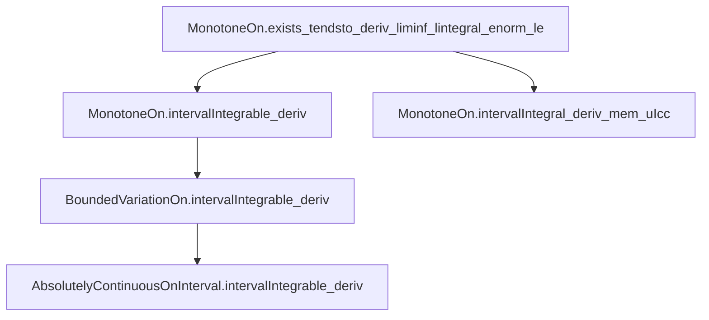
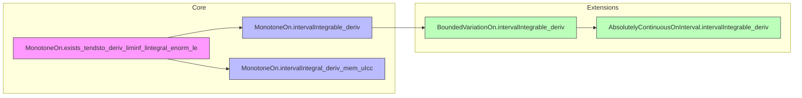

### Technical Brief: `DerivIntegrable.lean`

---

#### **1. Key Definitions & Theorems**

| Name | Type / Signature | Purpose |
|------|------------------|---------|
| `MonotoneOn.exists_tendsto_deriv_liminf_lintegral_enorm_le` | `∀ {f : ℝ → ℝ} {a b : ℝ}, a ≤ b → MonotoneOn f (Icc a b) → ∃ G : ℕ → ℝ → ℝ, ...` | Constructs a sequence of approximating functions `G n` converging a.e. to `f'`, with uniformly bounded liminf of integrals. Core technical lemma for all main theorems. |
| `MonotoneOn.intervalIntegrable_deriv` | `MonotoneOn f (uIcc a b) → IntervalIntegrable (deriv f) volume a b` | Proves that the derivative of a monotone function is interval integrable. |
| `MonotoneOn.intervalIntegral_deriv_mem_uIcc` | `MonotoneOn f (uIcc a b) → ∫ x in a..b, deriv f x ∈ uIcc 0 (f b - f a)` | Refines the previous result: the integral of `f'` lies between `0` and the total increase `f b - f a`. |
| `BoundedVariationOn.intervalIntegrable_deriv` | `BoundedVariationOn f (uIcc a b) → IntervalIntegrable (deriv f) volume a b` | Extends integrability to functions of bounded variation, using Jordan decomposition. |
| `AbsolutelyContinuousOnInterval.intervalIntegrable_deriv` | `AbsolutelyContinuousOnInterval f a b → IntervalIntegrable (deriv f) volume a b` | Derivative integrability for absolutely continuous functions, via bounded variation. |

---

#### **2. Naming Conventions**

- **Prefixes**:
  - `intervalIntegrable_deriv`: indicates integrability of derivative over an interval.
  - `intervalIntegral_deriv_mem_uIcc`: indicates membership of the integral in a symmetric interval (`uIcc`).
  - `exists_tendsto_deriv_liminf_lintegral_enorm_le`: descriptive, multi-part existential lemma naming.
- **Suffixes**:
  - `_deriv`: derivative-related.
  - `_mem_uIcc`: result about integral lying in a closed interval.
  - `_le`: inequality bound (often upper bound).
- **Variable naming**:
  - `G`: approximating sequence.
  - `g`: extension of `f` to all of `ℝ`.
  - `hab`, `hf`: standard hypotheses for `a ≤ b` and function property.

---

#### **3. Tactic Stack**

| Tactic | Frequency | Role |
|--------|-----------|------|
| `grind` | High | Simplifies set membership, neighborhood, and monotonicity goals using `grind`-enabled lemmas. |
| `simp` / `simp only` | Very High | Simplifies goals using measure-theoretic and order-theoretic facts (e.g., `ae_iff`, `measure_singleton`, `uIcc_of_le`). |
| `filter_upwards` | High | Handles almost-everywhere quantifiers by reducing to finite cases. |
| `convert` / `congr` | Medium | Aligns goals with known lemmas; `convert ... using n` for controlled unification. |
| `rw` | Very High | Rewrites using equalities, symmetry, and measure-theoretic equivalences (e.g., `intervalIntegral.integral_symm`, `ae_restrict_iff'`). |
| `linarith` | Medium | Solves linear arithmetic over reals (e.g., `a ≤ b`, `f a ≤ f b`). |
| `have` / `obtain` | High | Introduces intermediate lemmas (e.g., integrability, a.e. differentiability). |
| `calc` | Medium | Chains inequalities (e.g., liminf bounds). |
| `aesop` | Not present | — |
| `ring` | Not present | — |

---

#### **4. Proof Logic**

- **Structure**:
  1. **Approximation Lemma** (`exists_tendsto_deriv_liminf_lintegral_enorm_le`):
     - Extend `f` to `g` globally monotone.
     - Define `G c x = slope g x (x + c)`.
     - Show `G (1/n) x → f'(x)` a.e., each `G (1/n)` is a.e. strongly measurable, and liminf of integrals ≤ `f b - f a`.
  2. **Integrability via Dominated Convergence**:
     - Use `integrable_of_tendsto` (a version of Vitali convergence for Lebesgue integral).
     - Key: `liminf ∫ ‖G n‖ < ∞` ensures integrability of limit `f'`.
  3. **Bounds on Integral**:
     - Use `lintegral_enorm_le_liminf_of_tendsto` to bound `∫ ‖f'‖`.
     - Combine with monotonicity ⇒ `f' ≥ 0` a.e. ⇒ integral ≥ 0.
  4. **Jordan Decomposition** (for BV):
     - Write `f = p - q`, with `p, q` monotone.
     - Apply monotone case to `p`, `q`, and use linearity.
  5. **Absolutely Continuous ⇒ BV**:
     - Use `hf.boundedVariationOn` (from `AbsolutelyContinuousOnInterval` → `BoundedVariationOn`).
     - Apply BV case.

- **Common Flow**:
  ```
  [Assume a ≤ b] → [Construct approximants G n] → [Show a.e. convergence + uniform integrability bound] → [Apply convergence theorem] → [Conclude integrability] → [Refine with bounds if needed]
  ```

---

#### **5. Imports & Dependencies**

| Module | Role |
|--------|------|
| `Mathlib.Analysis.BoundedVariation` | Jordan decomposition, BV properties. |
| `Mathlib.MeasureTheory.Function.AbsolutelyContinuous` | AC ⇒ BV, definitions of absolute continuity. |
| `Mathlib.MeasureTheory.Integral.IntervalIntegral.Slope` | Key lemmas on slope functions, integrability of slopes over intervals. |
| `Mathlib.Algebra.Order.Interval.Set.Group` | Algebraic properties of intervals (`uIcc`, `uIoc`, etc.), group actions on intervals. |

---

#### **6. Mermaid Diagrams**

##### **Dependency Graph (Theorems)**



##### **Overview of Theory Flow**



- **Red**: Foundational approximation lemma (technical core).
- **Blue**: Direct monotone case (integrability + bounds).
- **Green**: Generalizations via structural decomposition (BV, AC).

---

#### **7. Summary**

This file establishes foundational regularity of derivatives for functions with ordered or regular variation: monotone, BV, and AC functions all have integrable derivatives on closed intervals. The proof strategy hinges on approximating the derivative by difference quotients (slopes), controlling their integrals, and applying convergence theorems. The results are critical for further development of the Fundamental Theorem of Calculus in measure-theoretic settings.

--- 

Let me know if you'd like a formalized dependency graph in `leanpkg` format or a visualization of the `G n` construction.
