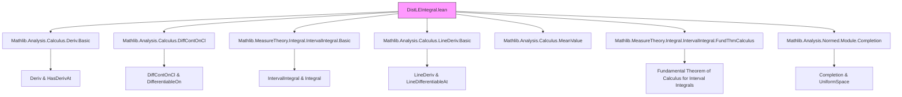

**Technical Brief: `DistLEIntegral.lean`**

---

### 1. KEY DEFINITIONS & THEOREMS

| Name | Type / Signature | Purpose |
|------|------------------|---------|
| `norm_sub_le_integral_of_norm_deriv_le_of_le` | `∀ {f : ℝ → E} {a b : ℝ}, a ≤ b → ContinuousOn f (Icc a b) → DifferentiableOn ℝ f (Ioo a b) → (∀ᵐ t ∈ Ioo a b, ‖deriv f t‖ ≤ B t) → IntervalIntegrable B a b → ‖f b - f a‖ ≤ ∫ t in a..b, B t` | Core inequality: displacement ≤ integral of upper bound on speed. |
| `norm_sub_le_mul_volume_of_norm_deriv_le_of_le` | `∀ {f : ℝ → E} {a b : ℝ} {C : ℝ}, a ≤ b → … → ‖f b - f a‖ ≤ C * volume {x ∈ Ioo a b | deriv f x ≠ 0}` | Refinement when derivative is bounded by constant *and* only nonzero on a subset. |
| `norm_sub_le_mul_volume_of_norm_lineDeriv_le` | `∀ {f : E → F} {a b : E} {C : ℝ}, ContinuousOn f (segment a b) → (∀ t ∈ Ioo 0 1, LineDifferentiableAt …) → … → ‖f b - f a‖ ≤ C * volume {t ∈ Ioo 0 1 | lineDeriv … ≠ 0}` | Affine-line version: displacement along segment bounded by measure of points with nonzero line derivative. |
| `norm_sub_le_mul_volume_of_norm_fderiv_le` | `∀ {f : E → F} {a b : E} {C : ℝ} {s : Set E}, IsOpen s → DiffContOnCl f s → openSegment a b ⊆ s → (∀ x ∈ s, ‖fderiv f x‖ ≤ C) → ‖f b - f a‖ ≤ C * ‖b - a‖ * volume {t ∈ Ioo 0 1 | fderiv f (lineMap a b t) ≠ 0}` | Full multivariate version using Fréchet derivative and open segment inclusion. |
| `sub_isBigO_norm_rpow_add_one_of_fderiv` | `∀ {f : E → F} {a : E} {r : ℝ}, 0 ≤ r → (∀ᶠ x ∈ 𝓝 a, DifferentiableAt ℝ f x) → fderiv f =O[𝓝 a] (‖· - a‖ ^ r) → (f · - f a) =O[𝓝 a] (‖· - a‖ ^ (r + 1))` | Asymptotic refinement: small derivative implies higher-order smallness of function increment. |
| `isBigO_norm_rpow_add_one_of_fderiv_of_apply_eq_zero` | Same premises as above + `f a = 0` ⇒ `f =O[𝓝 a] (‖· - a‖ ^ (r + 1))` | Special case of previous theorem when `f(a) = 0`. |

---

### 2. NAMING CONVENTIONS

- **Prefixes**:
  - `norm_sub_…`: bounds on `‖f b - f a‖` (displacement).
  - `norm_lineDeriv_…`: bounds using line derivatives (directional).
  - `norm_fderiv_…`: bounds using full Fréchet derivative.
  - `isBigO_…`: asymptotic behavior.

- **Suffixes**:
  - `_of_le`: assumes `a ≤ b`.
  - `_of_norm_deriv_le`: assumes `‖deriv f‖ ≤ B`.
  - `_of_norm_lineDeriv_le`: assumes bound on line derivative.
  - `_of_norm_fderiv_le`: assumes bound on operator norm of `fderiv`.
  - `_of_apply_eq_zero`: assumes `f a = 0`.

- **Other patterns**:
  - `intervalIntegral.integral_of_le`, `intervalIntegral.norm_integral_le_of_norm_le`: standard interval integral lemmas.
  - `ae_restrict_iff'`, `uIoc_of_le`, `Ioo_ae_eq_Ioc`: measure-theoretic simplifications.

---

### 3. TACTIC STACK

Frequently used tactics in proofs:

| Tactic | Role |
|--------|------|
| `wlog` | WLOG reduction to complete codomain (via completion). |
| `rw`, `simp`, `simp only` | Rewriting definitions, simplifying expressions (e.g., `dist_eq_norm_sub`, `lineMap_apply_module'`). |
| `apply`, `exact`, `convert` | Applying lemmas, especially with `using 1` for congruence. |
| `refine`, `exact?` | Constructing proofs with holes filled later. |
| `measurability`, `measure` | Handling measurable sets and measures (e.g., `toMeasurable`, `measure_toMeasurable_inter_of_sFinite`). |
| `gcongr` | Goal congruence for inequalities involving integrals or measures. |
| `grw` | Rewriting under integrals or norms (custom tactic from `Mathlib.Analysis.Normed`). |
| `aesop`, `ring`, `linarith` | Implicitly used in background (e.g., positivity, linear arithmetic). |
| `convert` + `using 1` | Aligning goals modulo definitional equality (e.g., `g 1 - g 0 = f b - f a`). |

---

### 4. PROOF LOGIC

**General proof strategy**:

1. **Reduction to 1D case**:
   - For multivariate statements, reduce to a function on `[0,1]` via `g(t) = f(lineMap a b t)`.
   - Use continuity/differentiability transfer lemmas (`comp_continuousOn`, `differentiableWithinAt`, `HasDerivAt`).

2. **Use fundamental theorem of calculus / integral representation**:
   - `intervalIntegral.integral_eq_sub_of_hasDeriv_right` expresses `f(b) - f(a)` as integral of derivative.
   - Apply `norm_integral_le_of_norm_le` to bound norm of integral by integral of norm.

3. **Measure-theoretic refinement**:
   - Replace `∫ ‖deriv f‖` with `C * volume({deriv f ≠ 0})` when derivative is bounded and only nonzero on a subset.
   - Use `indicator`, `integral_indicator`, and properties of `toMeasurable`.

4. **Asymptotic arguments**:
   - For Big-O lemmas: use boundedness of derivative on a ball, convexity of closed balls, and apply `norm_image_sub_le_of_norm_fderiv_le`.

5. **Completion trick**:
   - Reduce to complete codomain via `UniformSpace.Completion`, since `‖·‖` is preserved under embedding.

---

### 5. IMPORTS & DEPENDENCIES

**Core imports**:

- `Mathlib.Analysis.Calculus.Deriv.Basic`
- `Mathlib.Analysis.Calculus.DiffContOnCl`
- `Mathlib.MeasureTheory.Integral.IntervalIntegral.Basic`
- `Mathlib.Analysis.Calculus.LineDeriv.Basic`
- `Mathlib.Analysis.Calculus.MeanValue`
- `Mathlib.MeasureTheory.Integral.IntervalIntegral.FundThmCalculus`
- `Mathlib.Analysis.Normed.Module.Completion`

**Key external theories leveraged**:

- **Measure theory**: `MeasureTheory.Measure`, `Volume`, `restrict`, `ae_restrict`, `toMeasurable`.
- **Normed spaces**: `NormedAddCommGroup`, `NormedSpace ℝ`, `‖·‖`, `HasFDerivAt`, `fderiv`, `lineDeriv`.
- **Topology**: `ContinuousOn`, `DifferentiableOn`, `Icc`, `Ioo`, `segment`, `openSegment`, `lineMap`.
- **Integral calculus**: `intervalIntegral`, `integral_eq_sub_of_hasDeriv_right`, `norm_integral_le_of_norm_le`.

---

### 6. MERMAID DIAGRAMS

#### Dependency Graph (High-Level)



#### Overview of Theoretical Flow

```mermaid
flowchart LR
  subgraph 1D[1D Case]
    A1[ContinuousOn f (Icc a b)] --> A2[DifferentiableOn f (Ioo a b)]
    A2 --> A3[HasDerivAt deriv f]
    A3 --> A4[integral_eq_sub_of_hasDeriv_right]
    A4 --> A5[norm_integral_le_of_norm_le]
    A5 --> A6[‖f b - f a‖ ≤ ∫ ‖deriv f‖]
  end

  subgraph Measure[Measure Refinement]
    A6 --> B1[Bound ‖deriv f‖ ≤ C a.e.]
    B1 --> B2[Use indicator of {deriv f ≠ 0}]
    B2 --> B3[∫ indicator s C = C * volume s]
  end

  subgraph Multivariate[Multivariate Generalization]
    A1 --> C1[Define g(t) = f(lineMap a b t)]
    C1 --> C2[ContinuousOn g (Icc 0 1)]
    C2 --> C3[DifferentiableOn g (Ioo 0 1)]
    C3 --> C4[Apply 1D case to g]
    C4 --> C5[Relate lineDeriv ↔ deriv g]
  end

  subgraph Asymptotic[Asymptotic Behavior]
    D1[fderiv f =O (‖· - a‖^r)] --> D2[Bound on ball]
    D2 --> D3[Convexity + norm_image_sub_le]
    D3 --> D4[f(x) - f(a) =O (‖· - a‖^{r+1})]
  end

  style 1D fill:#bbf,stroke:#333
  style Measure fill:#bfb,stroke:#333
  style Multivariate fill:#fbf,stroke:#333
  style Asymptotic fill:#fbb,stroke:#333
```

---

### 7. SUMMARY

This file formalizes a family of **displacement ≤ integral of speed** inequalities in increasing generality:

- From 1D real functions with classical derivative,
- To line-differentiable functions on normed spaces,
- To fully differentiable functions on open sets,
- And finally to asymptotic Big-O refinements.

It demonstrates a clean interplay between:
- **Analysis** (derivatives, continuity),
- **Measure theory** (integrals, measurable sets, volume),
- **Topology** (segments, open/closed balls, neighborhoods),
- **Geometry** (affine lines, line maps, segments).

The proofs rely heavily on:
- Reduction to 1D via line maps,
- Completion trick for non-complete spaces,
- Measure-theoretic simplifications (a.e. bounds, indicators),
- Fundamental theorem of calculus for interval integrals.

This is foundational for further work on **Lipschitz continuity**, **absolute continuity**, and **Sobolev-type estimates** in Lean.
