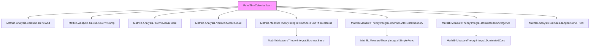
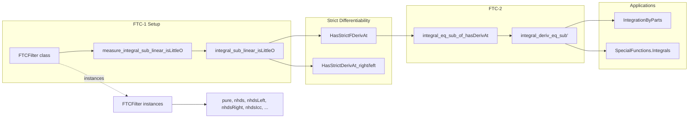

Here is the structured technical brief extracted from `FundThmCalculus.lean`:

---

### **1. Key Definitions & Theorems**

| Name | Type / Signature | Purpose |
|------|------------------|---------|
| `FTCFilter` | `class FTCFilter (a : ℝ) (outer : Filter ℝ) (inner : Filter ℝ)` | Typeclass encoding filter pairs `(l, l')` suitable for FTC-1; ensures `l` approximates `a`, `l'` refines `l` and is measurable-generated, and `Ioc` intervals lie eventually in sets of `l'`. |
| `measure_integral_sub_linear_isLittleO_of_tendsto_ae` | `∀ {f a la la' μ c u v}, [FTCFilter a la la'] → [IsLocallyFiniteMeasure μ] → ... → (∫ u..v f ∂μ - ∫ u..v c ∂μ) =o[lt] ∫ u..v 1 ∂μ` | Local FTC-1 for any locally finite measure: integral differs from constant approximation by little-o of measure of interval. |
| `measure_integral_sub_integral_sub_linear_isLittleO_of_tendsto_ae` | `∀ {f a b la la' lb lb' μ ca cb ua va ub vb}, ... → (∫ va..vb f - ∫ ua..ub f) - (∫ ub..vb cb - ∫ ua..va ca) =o[lt] ‖∫ ua..va 1‖ + ‖∫ ub..vb 1‖` | Full strict differentiability of $(u,v) \mapsto \int_u^v f$ in both endpoints for locally finite measures. |
| `integral_sub_linear_isLittleO_of_tendsto_ae` | `∀ {f a l l' c u v}, [FTCFilter a l l'] → ... → (∫ u..v f - (v - u) • c) =o[lt] (v - u)` | FTC-1 for Lebesgue measure: integral approximated by $(v-u) \cdot c$ with little-o error in $(v-u)$. |
| `integral_sub_integral_sub_linear_isLittleO_of_tendsto_ae` | `∀ {f a b la la' lb lb' ca cb ...}, ... → (∫ va..vb f - ∫ ua..ub f - ((vb-ub)•cb - (va-ua)•ca)) =o[lt] ‖va-ua‖ + ‖vb-ub‖` | Strict differentiability of $(u,v) \mapsto \int_u^v f$ w.r.t. Lebesgue measure under a.e. limits. |
| `integral_hasStrictFDerivAt_of_tendsto_ae` | `HasStrictFDerivAt (fun (u,v) ↦ ∫ u..v f) (fun (δu,δv) ↦ δv • cb - δu • ca) (a,b)` | FTC-1 in derivative form: strict Fréchet derivative of the interval integral map. |
| `integral_hasStrictDerivAt_right` | `HasStrictDerivAt (fun u ↦ ∫ a..u f) (f b) b` | Strict derivative of $u \mapsto \int_a^u f$ at $b$, assuming continuity of $f$ at $b$. |
| `integral_hasStrictDerivAt_left` | `HasStrictDerivAt (fun u ↦ ∫ u..b f) (-f a) a` | Strict derivative of $u \mapsto \int_u^b f$ at $a$, assuming continuity of $f$ at $a$. |
| `integral_eq_sub_of_hasDerivAt` | `HasDerivAt f f' x ∈ s → IntervalIntegrable f' volume a b → ... → ∫ a..b f' = f b - f a` | FTC-2: Fundamental theorem of calculus part 2 — integral of derivative recovers function difference. |
| `integral_deriv_eq_sub'` | `ContinuousOn f' (Icc a b) → ∀ x ∈ Icc a b, HasDerivAt f (f' x) x → ∫ a..b f' = f b - f a` | Practical FTC-2: if $f$ is $C^1$, then $\int_a^b f' = f(b)-f(a)$. |

---

### **2. Naming Conventions**

- **Prefixes**:
  - `integral_`: main function is the interval integral.
  - `measure_integral_`: version for arbitrary locally finite measure.
  - `hasStrictDeriv`, `hasStrictFDeriv`: strict differentiability (Fréchet or scalar).
  - `hasDeriv`, `hasFDeriv`: possibly non-strict (but in practice mostly strict).
  - `hasFDerivWithinAt`, `hasDerivWithinAt`: one-sided or constrained differentiability.

- **Suffixes**:
  - `_right`, `_left`: one-sided derivative at right/left endpoint.
  - `_of_tendsto_ae`: only assumes existence of a.e. limit, not continuity.
  - `_of_le`, `_of_ge`: variants for $u \le v$ or $v \le u$.
  - `_right`, `_left` also appear in filter names: `𝓝[≥]`, `𝓝[≤]`, `𝓝`, `pure`, `⊥`, etc.

- **Internal structure**:
  - `integral_hasStrictDerivAt_of_tendsto_ae_right` = strict derivative w.r.t. upper limit, a.e. limit, right endpoint.
  - `integral_hasStrictFDerivAt_of_tendsto_ae` = strict Fréchet derivative w.r.t. both endpoints, a.e. limits.

---

### **3. Tactic Stack**

Frequent tactics used in proofs:
- `simp`, `simp_rw`: simplify using `integral_const`, `integral_symm`, etc.
- `aesop`: for routine first-order reasoning and filter/tendsto goals.
- `abel`, `ring`: algebraic simplification of linear combinations.
- `filter_upwards`: handle filter-based almost-everywhere statements.
- `congr'`, `congr_left`: congruence for little-o equalities.
- `simpa using`: discharge goals by applying lemmas and simplifying.
- `cases le_total ...; simp [*]`: case analysis on order of terms.

---

### **4. Proof Logic**

- **Structure**:
  1. **Reduction to constant approximation**: Prove $\int_u^v f = \int_u^v c + o(\mu(Ioc_{u,v}))$ using `measure_integral_sub_linear_isLittleO_of_tendsto_ae`.
  2. **Combine two endpoints**: Use additivity of integrals and triangle inequality to get full FTC-1 for $(u,v)$.
  3. **Pass to strict differentiability**: Translate little-o statements into `HasStrictDerivAt`/`HasStrictFDerivAt` using definitions and linear algebra lemmas.
  4. **FTC-2 derivation**: Apply FTC-1 to $f'$, assuming integrability and differentiability, to get $\int_a^b f' = f(b)-f(a)$.

- **Induction**: Not used directly; proofs rely on filter calculus and measure-theoretic convergence theorems (e.g., dominated convergence, Vitali–Carathéodory).

- **Key logical flow**:
  - Assume $f$ measurable, integrable on $[a,b]$, and has a.e. limits $c_a, c_b$ at endpoints.
  - Use `FTCFilter` to unify one- and two-sided cases.
  - Prove little-o estimate for difference of integrals.
  - Conclude strict differentiability via definition.

---

### **5. Imports**

- `Mathlib.Analysis.Calculus.Deriv.Add`
- `Mathlib.Analysis.Calculus.Deriv.Comp`
- `Mathlib.Analysis.FDeriv.Measurable`
- `Mathlib.Analysis.Normed.Module.Dual`
- `Mathlib.MeasureTheory.Integral.Bochner.FundThmCalculus`
- `Mathlib.MeasureTheory.Integral.Bochner.VitaliCaratheodory`
- `Mathlib.MeasureTheory.Integral.DominatedConvergence`
- `Mathlib.Analysis.Calculus.TangentCone.Prod`

These indicate the module builds on:
- Calculus of derivatives (addition, composition, measurability).
- Bochner integration (measurability, convergence theorems).
- Normed space duality and product structures.

---

### **6. Mermaid Diagrams**

#### **Dependency Graph (Top-Level)**

#### **Overview of Theoretical Flow**

---

### **7. Summary**

This module formalizes the **Fundamental Theorem of Calculus (FTC)** for interval integrals on $\mathbb{R}$, with:
- **FTC-1**: Differentiability of $ (u,v) \mapsto \int_u^v f $ under minimal regularity (a.e. limits).
- **FTC-2**: Recovery of function values from integrable derivatives.
- **Generality**: Works for arbitrary locally finite measures, with a unified `FTCFilter` typeclass to handle one- and two-sided cases.
- **Naming discipline**: Highly systematic, encoding assumptions and variants in theorem names.
- **Proof strategy**: Reduce to constant approximation via little-o estimates, then lift to derivative statements.

The file is a cornerstone for real analysis in Mathlib, enabling later developments in integration by parts, special function integrals, and $C^k$-calculus.

---
