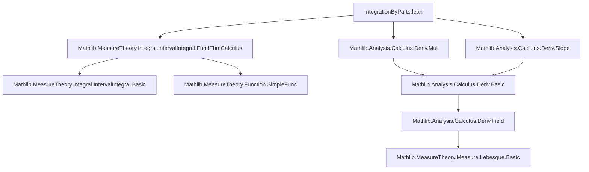
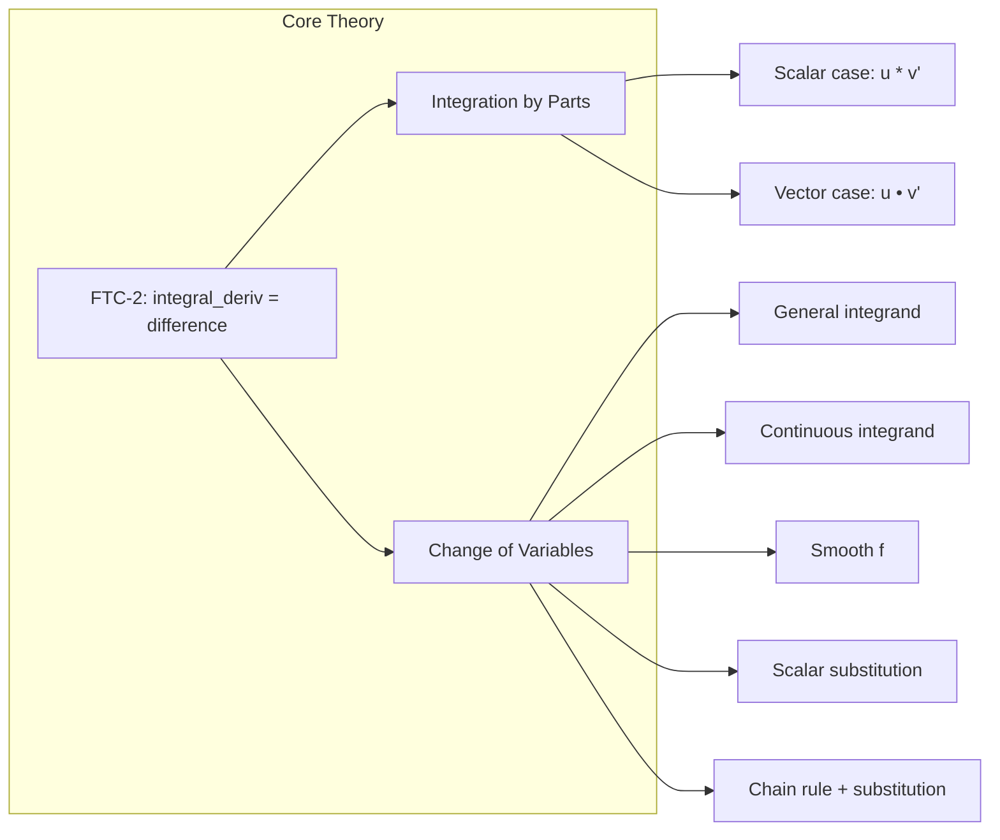

### Technical Brief: `IntegrationByParts.lean`

---

#### **1. Key Definitions & Theorems**

| Name | Type / Signature | Purpose |
|------|------------------|---------|
| `integral_deriv_mul_eq_sub_of_hasDeriv_right` | `ContinuousOn u [[a, b]] → … → ∫ x in a..b, u' x * v x + u x * v' x = u b * v b - u a * v a` | Fundamental identity for derivative of product under interval integral (right-derivative version). |
| `integral_deriv_mul_eq_sub_of_hasDerivAt` | Similar, with `HasDerivAt` (two-sided derivative in interior) | Special case of above with stronger differentiability. |
| `integral_deriv_mul_eq_sub_of_hasDerivWithinAt` | `HasDerivWithinAt` on closed interval | Handles one-sided derivatives at endpoints. |
| `integral_deriv_mul_eq_sub` | `HasDerivAt` on closed interval | Strongest differentiability assumption (full derivative everywhere). |
| `integral_mul_deriv_eq_deriv_mul_of_hasDeriv_right` | `∫ x in a..b, u x * v' x = u b * v b - u a * v a - ∫ x in a..b, u' x * v x` | **Integration by parts** (IBP), right-derivative version. |
| `integral_mul_deriv_eq_deriv_mul` | Same as above, full derivative on closed interval | Standard IBP formula used in calculus. |
| `integral_smul_deriv_eq_deriv_smul_of_hasDeriv_right` | Vector-valued IBP: `∫ u • v' = u b • v b - u a • v a - ∫ u' • v` | Generalizes IBP to normed space–valued functions. |
| `integral_smul_deriv_eq_deriv_smul` | Full-derivative vector IBP | Most commonly used vector IBP. |
| `integral_comp_smul_deriv'''` | `∫ x in a..b, f' x • (g ∘ f) x = ∫ u in f a..f b, g u` | General change of variables (substitution), minimal assumptions. |
| `integral_comp_smul_deriv''` | Same, assuming `f'`, `g` continuous on relevant sets | More practical version with continuity. |
| `integral_comp_smul_deriv'` | Assumes `f` differentiable on `uIcc a b`, `f'` continuous | Common smooth change of variables. |
| `integral_comp_smul_deriv` | `g` continuous (no restriction to image) | Most common substitution rule. |
| `integral_deriv_comp_smul_deriv'` | `∫ f' • (g' ∘ f) = (g ∘ f) b - (g ∘ f) a` | Chain rule + substitution → FTC for composite derivatives. |
| `integral_deriv_comp_smul_deriv` | Same, with full differentiability | Simplified chain-substitution version. |
| `integral_comp_mul_deriv'''` / `''` / `'` / `''''` | Scalar analogues of `integral_comp_smul_deriv*` | Same substitution theorems for scalar functions (using `*` instead of `•`). |
| `integral_deriv_comp_mul_deriv'` / `''''` | Scalar chain-substitution versions | Analogues of `integral_deriv_comp_smul_deriv*`. |

---

#### **2. Naming Conventions**

- **Prefixes**:
  - `integral_`: Indicates interval integral statements.
  - `deriv_`: Relates to derivatives (e.g., `deriv_mul`, `deriv_smul`, `deriv_comp`).
  - `mul_` / `smul_`: Distinguishes scalar multiplication vs. scalar–vector multiplication.
  - `comp_`: Composition (`g ∘ f`).
  - `sub_`: Substitution or subtraction terms (e.g., `sub_zero`, `integral_same`).
- **Suffixes**:
  - `_of_hasDeriv_right`: Right-derivative only on interior.
  - `_of_hasDerivAt`: Two-sided derivative on interior.
  - `_of_hasDerivWithinAt`: One-sided derivative at endpoints.
  - `''` / `'''`: Increasing generality (weaker assumptions).
  - No suffix (e.g., `integral_mul_deriv_eq_deriv_mul`) = strongest assumptions (full derivative on closed interval).
- **`uIcc` / `uIoo`**: Notation for *unordered* closed/open intervals: `[a, b]` or `(a, b)` regardless of order.

---

#### **3. Tactic Stack**

- **Core tactics**:
  - `rw`, `simp_rw`, `simp`: Rewriting using definitions and lemmas.
  - `exact`, `refine`, `apply`: Goal-directed proof construction.
  - `by_cases`, `swap`: Control flow for case analysis.
  - `have`, `obtain`: Intermediate lemma introduction.
  - `convert`, `congr'`: Equality chaining.
- **Analysis-specific**:
  - `intervalIntegral.integrableOn_Icc`, `intervalIntegrable_iff'`: Integrability checks.
  - `continuousOn_primitive_interval'`: Continuity of integral primitives.
  - `HasDerivAt.continuousOn`, `HasDerivWithinAt.continuousWithinAt`: Regularity from differentiability.
  - `image_uIcc`, `uIcc_of_le`, `Icc_subset_Ioo`: Interval set manipulations.
  - `nonempty_Ioo.mpr`: Existence of points in open intervals.
- **Algebraic simplification**:
  - `add_sub_cancel_left`, `sub_zero`, `mul_comm`, `smul_comm`: Simplify expressions.
  - `rfl`, `intermediate_value_uIcc`: Trivial or IVT-based equalities.

---

#### **4. Proof Logic**

- **Structure**:
  - Most proofs follow a **two-step pattern**:
    1. **Derive a primitive identity** (e.g., `integral_deriv_mul_eq_sub_*`) using `integral_eq_sub_of_hasDeriv_right`, which itself relies on FTC-2 (`HasDerivRight` ⇒ integral of derivative = difference of endpoints).
    2. **Rearrange** to isolate the desired term (e.g., subtract `∫ u' * v` to get IBP).
- **Induction**: Not used — all proofs are direct applications of FTC-2 and chain rules.
- **Case analysis**:
  - `by_cases hE : CompleteSpace E` handles completeness for vector-valued integrals.
  - `by_cases` on interval order (e.g., `min a b`, `max a b`) to unify notation.
- **Substitution proofs**:
  - Construct primitive `F(u) = ∫_{f(a)}^u g`, show it has derivative `f'(x) • g(f(x))` via chain rule + FTC-1.
  - Apply `integral_eq_sub_of_hasDeriv_right` to `F ∘ f`.
- **Key lemmas reused**:
  - `integral_eq_sub_of_hasDeriv_right`: Core FTC-2 engine.
  - `HasDerivWithinAt.mul`, `smul`, `scomp`: Derivative calculus rules.
  - `image_uIcc`, `hf.image_uIcc`: Interval mapping under continuous `f`.

---

#### **5. Imports**

| Module | Purpose |
|--------|---------|
| `Mathlib.Analysis.Calculus.Deriv.Mul` | Derivative rules for products, scalar multiplication. |
| `Mathlib.Analysis.Calculus.Deriv.Slope` | Derivative definitions (`HasDerivAt`, `HasDerivWithinAt`). |
| `Mathlib.MeasureTheory.Integral.IntervalIntegral.FundThmCalculus` | FTC-1 & FTC-2 for interval integrals (`integral_eq_sub_of_hasDeriv_right`, primitives, etc.). |

---

#### **6. Theory Dependencies & Overview**

##### **Mermaid: Dependency Graph (Top-Level)**

##### **Mermaid: File Overview**

##### **Theoretical Scope**

- **Scope**: Interval integrals on `ℝ`, extending FTC-2 to:
  - Product rule → integration by parts (scalar & vector).
  - Chain rule + substitution → change of variables.
- **Limitations**:
  - Only 1-dimensional intervals (`ℝ`).
  - No improper integrals here (handled in `MeasureTheory.Function.JacobianOneDim`).
  - Assumes continuity of functions or derivatives on relevant intervals.
- **Position in Mathlib**:
  - Part of `Mathlib.Analysis.Calculus.IntervalIntegral`.
  - Builds on `FundThmCalculus`, used later in ODE, Fourier analysis, and geometric measure theory.

---

#### **7. Notable Design Choices**

- **Uniform treatment of `a ≤ b` and `b ≤ a`** via `uIcc a b`, `uIoo a b`.
- **Hierarchy of assumptions**: From weakest (`HasDerivWithinAt` on `Ioi x`) to strongest (`HasDerivAt` on `uIcc`).
- **Scalar vs. vector separation**: `Mul` and `SMul` sections mirror algebraic structure (ring vs. module).
- **Duality of substitution and IBP**: Both derived from same FTC-2 core, emphasizing unification of calculus techniques.

--- 

Let me know if you'd like a formalized dependency tree (e.g., `leanpkg` graph) or a tactic-level proof trace for a specific theorem.
