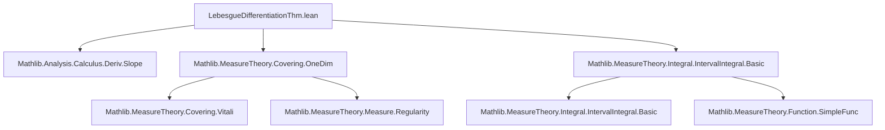

**Technical Brief: `LebesgueDifferentiationThm.lean`**

---

### 1. **Key Definitions & Theorems**

| Name | Type / Signature | Purpose |
|------|------------------|---------|
| `LocallyIntegrable` | `Class` (implicit) | `f : ℝ → ℝ` is integrable on every compact interval (i.e., locally integrable w.r.t. `volume`). |
| `IntervalIntegrable` | `Class` (implicit) | `f` is integrable on the specific interval `a..b`. |
| `ae_hasDerivAt_integral` (global) | `LocallyIntegrable f → ∀ᵐ x, ∀ c, HasDerivAt (λ x ↦ ∫ t in c..x, f t) (f x) x` | Global Lebesgue Differentiation Theorem: a.e. differentiability of the indefinite integral. |
| `ae_hasDerivAt_integral` (local) | `IntervalIntegrable f a b → ∀ᵐ x, x ∈ uIcc a b → ∀ c ∈ uIcc a b, HasDerivAt (λ x ↦ ∫ t in c..x, f t) (f x) x` | Local version: holds a.e. on a fixed interval `a..b`. |

---

### 2. **Naming Conventions**

- **Prefixes**:
  - `ae_`: almost-everywhere statements (`∀ᵐ x`).
  - `hasDerivAt_`: derivative existence at a point.
  - `integral_`: interval integrals (`integral_Icc_eq_integral_Ioc`, `integral_of_ge`, `integral_of_le`).
- **Suffixes**:
  - `_left`, `_right`: left/right limits in derivative proofs.
  - `_vitaliFamily_left`, `_vitaliFamily_right`: associated with Vitali family convergence.
- **Structure methods**:
  - `hf.integrableOn_isCompact`, `hf.left`, `hf.symm`: standard `Class` field accessors.

---

### 3. **Tactic Stack**

| Tactic | Usage Frequency | Purpose |
|--------|-----------------|---------|
| `grind` | Very High | Simplification + ordering reasoning (e.g., `hy : y ≤ x`), often with `-order` modifier. |
| `simp` / `simp_rw` | High | Simplify expressions involving `slope`, `average`, integrals over intervals. |
| `filter_upwards` | High | Handle almost-everywhere quantifiers via filter arguments. |
| `rw` | High | Rewrite using lemmas like `integral_Icc_eq_integral_Ioc`, `integral_of_ge`, etc. |
| `congr'` | Medium | Prove equality of filters/functions via congruence. |
| `tendsto_congr'` | Medium | Replace filters with equivalent ones (e.g., Vitali families). |
| `have`, `let` | High | Introduce auxiliary functions (`g`) or facts (`h₁`, `h₂`). |
| `wlog` | Medium | WLOG assumption for symmetry (e.g., `a ≤ b`). |
| `apply ... <;>` | Medium | Multi-goal tactic chaining (e.g., `intervalIntegral.integral_congr_ae'`). |

---

### 4. **Proof Logic**

- **Global version**:
  1. Use `LocallyIntegrable` to get integrability on all compact intervals.
  2. Apply the **Vitali Differentiation Theorem** (`vitaliFamily volume 1`).ae_tendsto_average` to get a.e. convergence of averages → derivative.
  3. Reduce derivative existence to left/right slope limits via `hasDerivAt_iff_tendsto_slope_left_right`.
  4. Use `tendsto_congr'` to match slopes with averages over `Icc`/`Ioc` intervals.
  5. Simplify using integral identities (`integral_interval_sub_left`, `integral_of_ge`, `integral_of_le`).

- **Local version**:
  1. WLOG assume `a ≤ b`, reducing to `uIcc a b = Icc a b`.
  2. Exclude endpoints `a`, `b` (measure-zero sets).
  3. Extend `f` to a globally locally integrable function `g` by zero outside `Ioc a b`.
  4. Apply global theorem to `g`, then restrict back to `Icc a b`.
  5. Use `HasDerivWithinAt.hasDerivAt` and `congr` lemmas to match integrals of `f` and `g` a.e.

---

### 5. **Imports**

| Module | Role |
|--------|------|
| `Mathlib.Analysis.Calculus.Deriv.Slope` | Slope-based derivative characterizations (`hasDerivAt_iff_tendsto_slope_left_right`). |
| `Mathlib.MeasureTheory.Covering.OneDim` | Vitali covering theorems, `vitaliFamily`, `ae_tendsto_average`. |
| `Mathlib.MeasureTheory.Integral.IntervalIntegral.Basic` | Interval integral definitions, properties (`integral_Icc_eq_integral_Ioc`, `integral_of_ge`, etc.). |

---

### 6. **Mermaid Diagrams**

#### **Dependency Graph (File-Level)**



#### **Theoretical Overview (Module Scope)**

```mermaid
flowchart LR
  subgraph Theory
    A[Locally Integrable f] --> B[Global AE Differentiability]
    C[Interval Integrable f on a..b] --> D[Local AE Differentiability on a..b]
    B --> E[Lebesgue Differentiation Thm (Global)]
    D --> F[Lebesgue Differentiation Thm (Local)]
  end

  subgraph Tools
    G[Vitali Covering] --> B
    H[Interval Integral Identities] --> B & D
    I[Slope Deriv Criterion] --> B & D
  end
```

---

### 7. **Notes**

- The proof leverages **measure-theoretic convergence** (Vitali) to deduce **calculus-level differentiability**.
- The local version is derived from the global one via **extension by zero**, a standard technique in measure theory.
- The `grind -order` usage reflects Lean 4.7+ improvements in ordering reasoning (see adaptation note in code).

--- 

*End of Technical Brief.*
