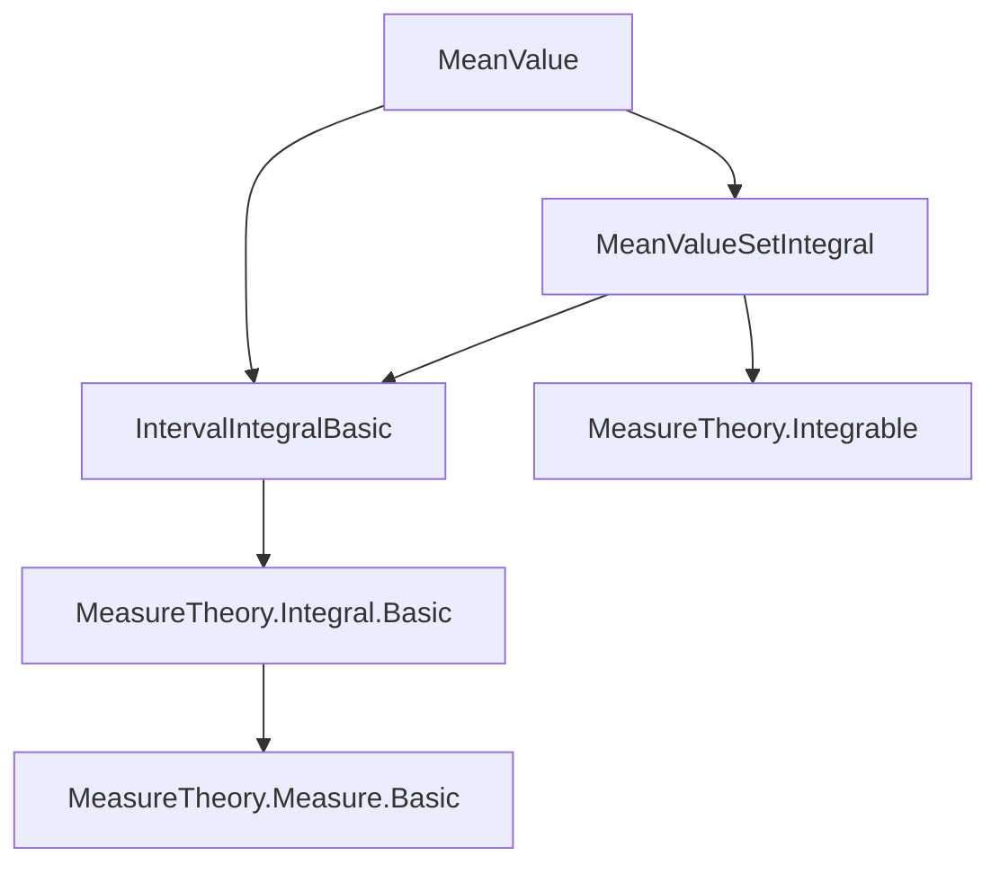

**Technical Brief: `MeanValue.lean` — First Mean Value Theorem for Interval Integrals**

---

### 1. **Key Definitions & Theorems**

| Name | Type | Purpose |
|------|------|---------|
| `exists_eq_const_mul_intervalIntegral_of_ae_nonneg` | `theorem` | Proves existence of $c \in [a,b]$ such that $\int_a^b f g \, d\mu = f(c) \cdot \int_a^b g \, d\mu$, assuming $g \ge 0$ **almost everywhere** on $(a,b)$ w.r.t. $\mu|_{(a,b)}$, $f$ continuous on $[a,b]$, and $g$ interval integrable. |
| `exists_eq_const_mul_intervalIntegral_of_nonneg` | `theorem` | Same conclusion as above, but assumes **pointwise** nonnegativity of $g$ on $(a,b)$ (stronger hypothesis). Derived via `ae_of_all` from the a.e. version. |

Both theorems formalize the **first mean value theorem for integrals** in the setting of interval integrals with respect to an arbitrary measure $\mu$ on $\mathbb{R}$.

---

### 2. **Naming Conventions**

- **Prefixes**:
  - `exists_eq_const_mul_...`: Indicates existence of a constant multiple representation of an integral.
- **Suffixes**:
  - `_of_ae_nonneg`: Hypothesis involves *almost everywhere* nonnegativity.
  - `_of_nonneg`: Hypothesis involves *pointwise* nonnegativity.
- **Other conventions**:
  - `uIcc`, `uIoc`, `Ι`: Notation for closed, open-closed, and open intervals (depending on order of endpoints).
  - `intervalIntegral`, `IntervalIntegrable`: Standardized terminology for interval integrals in Mathlib.

---

### 3. **Tactic Stack**

- `by_cases h : a = b` — case analysis on equality of endpoints.
- `subst h` — simplifies using equality.
- `wlog hab : a < b generalizing a b` — well-ordering / symmetry reduction (without loss of generality).
- `rwa [...]` — rewrite + assumption.
- `simp only [...]` / `simp` — simplification with specific lemmas.
- `aesop` — automated reasoning for basic logic and order.
- `obtain ⟨c, hc, h⟩ := ...` — destruct existential quantifier.
- `simpa [...] using h` — simplify using a hypothesis.
- `rw [...]` — rewrite using equality.
- `exact ...` — finish proof with a term.

---

### 4. **Proof Logic**

- **Case split** on whether $a = b$ (trivial case).
- **WLOG assumption** $a < b$ (symmetry handles $b < a$).
- Define $s = (a,b)$ (open interval), show it is connected and measurable.
- Use `intervalIntegrable_iff` to translate integrability conditions.
- Apply the **set-integral version** (`exists_eq_const_mul_setIntegral_of_ae_nonneg`) on $s$.
- Translate back to interval integral using `integral_of_le` and interval notation.
- For the pointwise version, lift pointwise nonnegativity to a.e. via `ae_of_all`.

---

### 5. **Imports & Dependencies**

| Import | Role |
|--------|------|
| `Mathlib.MeasureTheory.Integral.IntervalIntegral.Basic` | Provides basic definitions: `intervalIntegral`, `IntervalIntegrable`, `uIcc`, `uIoc`, `Ι`, etc. |
| `Mathlib.MeasureTheory.Integral.MeanValue` | Contains the set-integral mean value theorem (`exists_eq_const_mul_setIntegral_of_ae_nonneg`) used as a lemma. |

**Core dependencies**:
- Measure theory (integration, restriction, a.e. statements).
- Real analysis (continuity, connectedness, intervals).
- Order theory (total order on $\mathbb{R}$, interval properties).

---

### 6. **Mermaid Diagrams**

#### **Dependency Graph (File-Level)**



#### **Overview of Theoretical Flow**

```mermaid
flowchart LR
  A[Interval Integral Setup] --> B[IntervalIntegrable g μ a b]
  A --> C[ContinuousOn f [a,b]]
  A --> D[g ≥ 0 a.e. or pointwise]
  B & C & D --> E[Apply set-integral MVT on (a,b)]
  E --> F[Translate back to interval integral]
  F --> G[∃ c ∈ [a,b], ∫ f g = f(c) ∫ g]
```

---

### 7. **Mathematical Summary**

Let $f, g : \mathbb{R} \to \mathbb{R}$, $\mu$ a measure on $\mathbb{R}$, and $a, b \in \mathbb{R}$.  
If:
- $f$ is continuous on $[a,b]$,
- $g$ is interval integrable on $[a,b]$ w.r.t. $\mu$,
- $g \ge 0$ a.e. (or everywhere) on $(a,b)$ w.r.t. $\mu$,

then:
$$
\exists c \in [a,b], \quad \int_a^b f(x) g(x) \, d\mu = f(c) \cdot \int_a^b g(x) \, d\mu.
$$

This is the **first mean value theorem for integrals**, generalized to arbitrary measures and interval integrals.

--- 

Let me know if you'd like a formalized dependency graph (e.g., for `leanpkg`), or a proof sketch in natural language.
