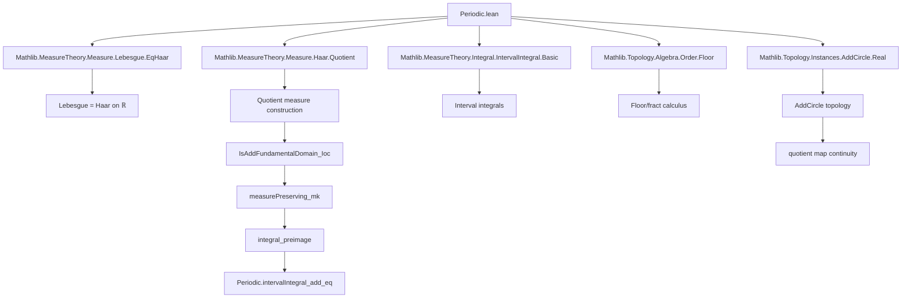

**Technical Brief: `Periodic.lean` — Integrals of Periodic Functions and Measure Theory on the Additive Circle**

---

### 1. KEY DEFINITIONS & THEOREMS

| Name | Type / Signature | Purpose |
|------|------------------|---------|
| `isAddFundamentalDomain_Ioc` | `{T : ℝ} → 0 < T → t : ℝ → IsAddFundamentalDomain (AddSubgroup.zmultiples T) (Ioc t (t + T)) μ` | Shows that the half-open interval `Ioc t (t + T)` is a fundamental domain for the action of the subgroup `ℤ ∙ T` on `ℝ`. |
| `isAddFundamentalDomain_Ioc'` | Same as above, but for the opposite subgroup `AddSubgroup.op (zmultiples T)` | Technical variant needed for quotient construction. |
| `AddCircle.measureSpace` | `MeasureSpace (AddCircle T)` | Defines the standard measure on the additive circle `ℝ ⧸ (ℤ ∙ T)` as Haar measure scaled to total mass `T`. |
| `AddCircle.measure_univ` | `volume univ = ENNReal.ofReal T` | Confirms total mass of the Haar measure on the circle is `T`. |
| `AddCircle.measurePreserving_mk` | `MeasurePreserving ((↑) : ℝ → AddCircle T) (volume.restrict (Ioc t (t + T)))` | The quotient map `ℝ → AddCircle T` is measure-preserving when restricted to any fundamental domain `Ioc t (t + T)`. |
| `AddCircle.lintegral_preimage` | `∫⁻ a in Ioc t (t + T), f a = ∫⁻ b : AddCircle T, f b` | Lifts nonnegative measurable functions from the circle to `ℝ` without changing the lower integral. |
| `AddCircle.integral_preimage` | `∫ a in Ioc t (t + T), f a = ∫ b : AddCircle T, f b` | Same as above for Bochner integrals (vector-valued functions). |
| `AddCircle.intervalIntegral_preimage` | `∫ a in t..t + T, f a = ∫ b : AddCircle T, f b` | Special case for interval integrals (i.e., `uIoc` → `Ioc`). |
| `Function.Periodic.intervalIntegral_add_eq` | `Periodic f T → ∫ x in t..t + T, f x = ∫ x in s..s + T, f x` | The integral of a periodic function over one period is independent of the starting point. |
| `Function.Periodic.intervalIntegrable` | `Periodic f T → 0 < T → … → IntervalIntegrable f a₁ a₂` | If a periodic function is integrable over one period, it is integrable over *any* interval. |
| `Function.Periodic.intervalIntegral_add_zsmul_eq` | `∫ x in t..t + n • T, f x = n • ∫ x in t..t + T, f x` | Integrals scale linearly over integer multiples of the period. |
| `Function.Periodic.tendsto_atTop_intervalIntegral_of_pos` | `0 < ∫ x in 0..T, g x → Tendsto (∫ x in 0..t, g x) atTop atTop` | If the average over one period is positive, the cumulative integral diverges to `+∞`. |

---

### 2. NAMING CONVENTIONS

- **Prefixes**:
  - `isAddFundamentalDomain_`: asserts a set is a fundamental domain for an additive subgroup.
  - `measurePreserving_`: asserts a map preserves measure.
  - `intervalIntegrable`, `intervalIntegral_`: interval integrability / integral properties.
  - `memLp_liftIoc`: membership in `L^p` via lift to circle.

- **Suffixes**:
  - `_eq`: equality of integrals or measures.
  - `_preimage`: relates integrals on base and quotient spaces.
  - `_of_pos`: assumes positivity of period or integral.
  - `_zsmul`: involves integer scaling.

- **Other patterns**:
  - `liftIoc`, `equivIoc`, `measurableEquivIoc`: constructions involving lifting or equivalence via `Ioc`.
  - `AddCircle`, `UnitAddCircle`: modules for circle groups of period `T` and `1`, respectively.

---

### 3. TACTIC STACK

Frequently used tactics in proofs:

| Tactic | Role |
|--------|------|
| `simp` / `simp_rw` | Simplification using definitional equalities and lemmas (e.g., `measure_univ`, `integral_of_le`). |
| `rw` / `congr!` | Rewriting goals using equalities, often after `have` or `suffices`. |
| `exact`, `apply`, `convert` | Goal-directed proof construction, especially for equality chains. |
| `linarith` | Linear arithmetic over reals and integers (e.g., bounding intervals, positivity). |
| `existsUnique_iff.2`, `exists_unique_iff.2` | Constructing unique representatives in fundamental domains. |
| `measurable_*` | Proving measurability (e.g., `measurable_mk'`, `measurableEquivIoc`). |
| `intervalIntegrable.mono_set`, `IntervalIntegrable.trans_iterate` | Propagating integrability across sets or iterations. |
| `continuousOn_iff_continuous_restrict`, `continuousAt_equivIoc` | Continuity arguments for equivariances. |
| `filter` / `tendsto_*` | Asymptotic analysis (e.g., divergence of integrals). |
| `by_cases`, `rcases`, `obtain` | Case analysis and destructuring (e.g., trichotomy on `0 < T`). |

---

### 4. PROOF LOGIC

The logical flow across the file follows a **two-phase structure**:

#### **Phase I: Measure-theoretic foundation on the circle**
1. **Fundamental domain identification**  
   Prove `Ioc t (t + T)` is a fundamental domain for `ℤ ∙ T` using `existsUnique_add_zsmul_mem_Ioc`.
2. **Quotient measure construction**  
   Define Haar measure on `AddCircle T` with total mass `T`, verify it’s a left-invariant Radon measure.
3. **Measure-preserving quotient map**  
   Show the projection `ℝ → AddCircle T` restricted to `Ioc t (t + T)` is measure-preserving.
4. **Equivalences with intervals**  
   Construct measurable isomorphisms `AddCircle T ≃ᵐ Ioc a (a + T)` and prove they preserve measure.

#### **Phase II: Applications to periodic functions**
1. **Integrability propagation**  
   Use fundamental domain + invariance to lift integrability from one period to all intervals.
2. **Period-independence of integrals**  
   Show integrals over any length-`T` interval are equal via fundamental domain uniqueness.
3. **Scaling over integer multiples**  
   Prove `∫_{t}^{t + nT} f = n ∫_{t}^{t + T} f` by induction and symmetry.
4. **Asymptotic behavior**  
   Use floor decomposition `t = ⌊t/T⌋·T + fract(t/T)·T` and continuity of primitive integrals to bound and diverge.

**Typical proof skeleton**:
- *Induction* on `n : ℕ` for natural multiples.
- *Case analysis* on sign of `T` or `n : ℤ`.
- *Reduction* to canonical interval (e.g., `0..T`) via `intervalIntegral_add_eq`.
- *Pullback/pushforward* of integrals via `measurePreserving_mk` and `measurableEquivIoc`.

---

### 5. IMPORTS (PRIMARY DEPENDENCIES)

| Module | Role |
|--------|------|
| `Mathlib.MeasureTheory.Measure.Lebesgue.EqHaar` | Equivalence of Lebesgue and Haar measure on `ℝ`. |
| `Mathlib.MeasureTheory.Measure.Haar.Quotient` | Construction of quotient measures for additive subgroups. |
| `Mathlib.MeasureTheory.Integral.IntervalIntegral.Basic` | Interval integrals (`∫ x in a..b, f x`). |
| `Mathlib.Topology.Algebra.Order.Floor` | Floor and fractional part functions (`⌊x⌋`, `fract x`). |
| `Mathlib.Topology.Instances.AddCircle.Real` | Topological structure of `AddCircle T = ℝ / (ℤ ∙ T)`. |

---

### 6. MERMAID DIAGRAMS

#### **Dependency Graph (High-Level)**



#### **Overview of File Structure**

```mermaid
flowchart LR
  subgraph MeasureTheory
    A[isAddFundamentalDomain_Ioc] --> B[AddCircle.measureSpace]
    B --> C[measurePreserving_mk]
    C --> D[measurableEquivIoc]
    D --> E[integral_preimage]
  end

  subgraph PeriodicFunctions
    E --> F[Periodic.intervalIntegrable]
    F --> G[Periodic.intervalIntegral_add_eq]
    G --> H[Periodic.intervalIntegral_add_zsmul_eq]
    H --> I[RealValued.tendsto_atTop_intervalIntegral]
  end

  subgraph Applications
    I --> J[Asymptotics of cumulative integrals]
    E --> K[Fourier analysis (implicit)]
  end
```

---

### 7. SUMMARY

This file formalizes the foundational relationship between periodic functions on `ℝ` and integrable functions on the additive circle `ℝ / (ℤ ∙ T)`. It establishes:

- **Geometric**: `Ioc t (t + T)` is a fundamental domain for the action of `ℤ ∙ T`.
- **Measure-theoretic**: The quotient map is measure-preserving, enabling integration on the circle via intervals.
- **Analytic**: Integrals of periodic functions over one period are independent of basepoint and scale linearly over integer multiples.
- **Asymptotic**: Positive average over a period implies divergence of the cumulative integral.

These results are essential for Fourier analysis on the circle, ergodic theory, and the study of differential equations with periodic coefficients.

--- 

*End of Technical Brief.*
