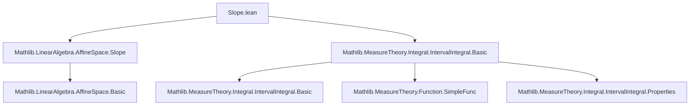
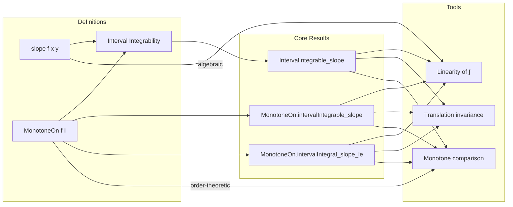

**Technical Brief: `Slope.lean`**

---

### 1. **Key Definitions & Theorems**

| Name | Type / Signature | Purpose |
|------|------------------|---------|
| `slope` | `slope f x y := (f y - f x) / (y - x)` (for `x ≠ y`) | Standard difference quotient; used to define instantaneous rate of change. |
| `IntervalIntegrable.intervalIntegrable_slope` | `∀ f a b c, IntervalIntegrable f a (b + c) → a ≤ b → 0 ≤ c → IntervalIntegrable (fun x ↦ slope f x (x + c)) a b` | Shows integrability of the *shifted slope function* under integrability of `f`. |
| `MonotoneOn.intervalIntegrable_slope` | `∀ f a b c, MonotoneOn f (Icc a (b + c)) → a ≤ b → 0 ≤ c → IntervalIntegrable (fun x ↦ slope f x (x + c)) a b` | Extends integrability to monotone functions (which may not be a priori integrable). |
| `MonotoneOn.intervalIntegral_slope_le` | `∀ f a b c, MonotoneOn f (Icc a (b + c)) → a ≤ b → 0 ≤ c → ∫ x in a..b, slope f x (x + c) ≤ f (b + c) - f a` | Bounds the integral of the shifted slope by the net change of `f`. |

> Note: `slope f x (x + c)` simplifies to `(f (x + c) - f x) / c` when `c ≠ 0`, and to `0` when `c = 0`.

---

### 2. **Naming Conventions**

- **Prefixes**:
  - `intervalIntegrable_`: Theorems about integrability of interval integrals.
  - `intervalIntegral_`: Theorems about properties of the interval integral itself.
- **Suffixes**:
  - `_slope`: Pertains to the `slope` function.
  - `_le`: Inequality conclusions (≤).
- **Pattern**: `TypeClass.property_description` (e.g., `MonotoneOn.intervalIntegral_slope_le`).

---

### 3. **Tactic Stack**

Frequently used tactics in proofs:
- `simp only [...]`: Simplify using precise lemmas (e.g., `slope`, `vsub_eq_sub`, `add_sub_cancel_left`).
- `grind` / `grw`: Custom tactic (likely from `Mathlib.Tactic`) for automated rewriting and solving goals involving intervals and monotonicity.
- `field_simp; rfl`: Simplify field expressions and close trivial equalities.
- `intervalIntegral.integral_*`: Tactics from `Mathlib.MeasureTheory.Integral.IntervalIntegral` for manipulating interval integrals.
- `mono_set`: Monotonicity of measure under set inclusion.
- `comp_add_right`: Composition with `add_right c`.
- `intervalIntegral.integral_comp_add_right`: Change-of-variable for translation.
- `intervalIntegral.integral_interval_sub_interval_comm'`: Rearrangement of integrals over adjacent intervals.

---

### 4. **Proof Logic**

- **Structure**:
  1. **Reduction**: Simplify `slope` to `(f (x + c) - f x) / c`.
  2. **Integrability**:
     - For `IntervalIntegrable.intervalIntegrable_slope`: Use closure properties of interval integrability under linear operations and set restrictions.
     - For `MonotoneOn.intervalIntegrable_slope`: Reduce to previous theorem via `MonotoneOn.intervalIntegrable`.
  3. **Inequality** (`intervalIntegral_slope_le`):
     - Split into cases `c = 0` and `c > 0`.
     - For `c > 0`, rewrite the integral using:
       - Linearity: `∫ (f(x + c) - f(x)) / c = (1/c)(∫ f(x + c) - ∫ f(x))`
       - Translation invariance: `∫_{a}^{b} f(x + c) dx = ∫_{a + c}^{b + c} f(x) dx`
     - Bound each piece using monotonicity:
       - Upper bound: `∫_{b}^{b + c} f ≤ c · f(b + c)`
       - Lower bound: `c · f(a) ≤ ∫_{a}^{a + c} f`
     - Combine to get `∫_{a}^{b} slope f x (x + c) ≤ f(b + c) - f(a)`.

- **Induction**: Not used.
- **Case analysis**: On `c = 0` vs `c > 0`.
- **Monotonicity reasoning**: Via `intervalIntegral.integral_mono_on`.

---

### 5. **Imports**

- `Mathlib.LinearAlgebra.AffineSpace.Slope`: Defines `slope` in affine geometry context (used for algebraic properties).
- `Mathlib.MeasureTheory.Integral.IntervalIntegral.Basic`: Core interval integral theory (integrability, linearity, monotonicity, change of variables).

> These imports indicate the file sits at the intersection of **affine geometry** and **real analysis**, specifically in the theory of **Lebesgue interval integrals**.

---

### 6. **Mermaid Diagrams**

#### **Dependency Graph (File-Level)**

#### **Theoretical Overview (Conceptual Flow)**

---

### 7. **Summary**

This file formalizes a key analytical fact: for monotone (or integrable) real functions `f`, the *average rate of change over a fixed step `c`*, i.e., `x ↦ slope f x (x + c)`, is integrable over any interval `[a, b]`, and its integral is bounded above by the total increment `f(b + c) - f(a)`. This is foundational for connecting discrete difference quotients with continuous integration, especially in contexts like convex analysis or absolutely continuous functions.

--- 

Let me know if you'd like a formalized dependency graph (e.g., `.dot` format) or a proof sketch in natural deduction style.
