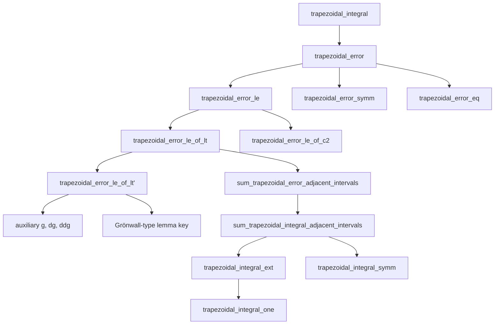
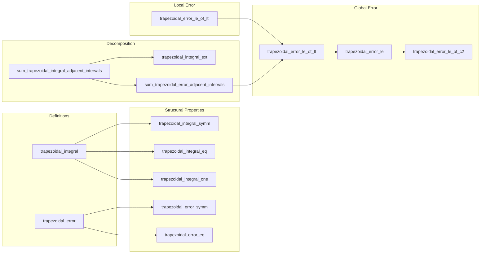

### Technical Brief: `TrapezoidalRule.lean`

---

#### **1. Key Definitions & Theorems**

| Name | Type / Signature | Purpose |
|------|------------------|---------|
| `trapezoidal_integral` | `f : ℝ → ℝ → N : ℕ → a b : ℝ → ℝ` | Approximates $\int_a^b f(x)\,dx$ using the trapezoidal rule with $N$ subintervals (i.e., $N$ trapezoids, $N+1$ evaluations). |
| `trapezoidal_error` | `f : ℝ → ℝ → N : ℕ → a b : ℝ → ℝ` | Defines the signed error: $\text{trapezoidal\_integral} - \int_a^b f$. |
| `trapezoidal_integral_symm` | `0 < N ⇒ trapezoidal_integral f N a b = -trapezoidal_integral f N b a` | Symmetry under endpoint swap (like exact integral). |
| `trapezoidal_error_symm` | `0 < N ⇒ trapezoidal_error f N a b = -trapezoidal_error f N b a` | Error changes sign under endpoint swap. |
| `trapezoidal_integral_eq` | `trapezoidal_integral f N a a = 0` | Zero width ⇒ zero approximation. |
| `trapezoidal_error_eq` | `trapezoidal_error f N a a = 0` | Zero width ⇒ zero error. |
| `trapezoidal_integral_one` | `trapezoidal_integral f 1 a b = (b-a)/2 · (f a + f b)` | Single-trapezoid case (midpoint rule). |
| `sum_trapezoidal_integral_adjacent_intervals` | Decomposes integral over $[a, a+Nh]$ into sum over $N$ unit-step trapezoids. | Enables induction and decomposition proofs. |
| `trapezoidal_integral_ext` | Recursive extension: $T_N + T_1 = T_{N+1}$. | Used for inductive step in proofs. |
| `sum_trapezoidal_error_adjacent_intervals` | Error decomposes like exact integral: $\sum \text{error}_1 = \text{error}_N$. | Key for reducing global error to local error. |
| `trapezoidal_error_le_of_lt'` | Local error bound for $N=1$, $a < b$: $|\text{error}| \le \frac{(b-a)^3 ζ}{12}$ | Core lemma for error analysis. |
| `trapezoidal_error_le_of_lt` | General $N$ error bound for $a < b$: $|\text{error}| \le \frac{(b-a)^3 ζ}{12 N^2}$ | Main technical lemma (hard part). |
| `trapezoidal_error_le` | Full general-case error bound: $|\text{error}| \le \frac{|b-a|^3 ζ}{12 N^2}$ | **Main theorem** of the file. |
| `trapezoidal_error_le_of_c2` | Special case when $f \in C^2$: same bound under $C^2$ regularity. | Practical corollary for smooth functions. |

---

#### **2. Naming Conventions**

- **Prefixes**:
  - `trapezoidal_`: all definitions and theorems related to the trapezoidal approximation.
  - `sum_`: decomposition lemmas over adjacent intervals.
  - `eq`: simplifications at degenerate points (e.g., $a = b$).
  - `symm`: symmetry properties (endpoint swap).
- **Suffixes**:
  - `_le`: error upper bounds.
  - `_of_lt`: assumptions include $a < b$.
  - `_adjacent_intervals`: decomposition over subintervals.
  - `_ext`: extension/extensibility lemmas (e.g., $N \to N+1$).
- **Internal helpers**:
  - `g`, `dg`, `ddg`: auxiliary functions for Taylor-like expansion in local error proof.
  - `ak(k)`: partition points $a + k h$.

---

#### **3. Tactic Stack**

| Tactic | Frequency | Role |
|--------|-----------|------|
| `simp` / `simp_rw` | Very high | Simplify definitions, sums, arithmetic, `Icc`, `uIcc`. |
| `rw` | High | Rewrite using lemmas, definitions, equalities (e.g., `hb`, `h0`). |
| `field` / `push_cast` | Medium | Handle division, rational arithmetic, cast simplifications. |
| `ring` / `ring_nf` | Medium | Simplify polynomial expressions (especially in error bounds). |
| `grw` | Medium | `grw` = `rw` + `norm_cast` + `linarith`; used for ordered field reasoning. |
| `cases` / `rcases` | Medium | Split on `lt_trichotomy`, `eq_or_ne`, `le_total`. |
| `exact`, `refine`, `apply` | Medium | Apply lemmas with missing hypotheses filled via `have`/`suffices`. |
| `have`, `suffices`, `calc` | High | Build intermediate claims (e.g., bounds on derivatives, subset inclusions). |
| `norm_cast` | Medium | Cast naturals to reals, simplify inequalities. |
| `fun_prop`, `measurableSet_Icc` | Low | Measure-theoretic properties (integrability, measurability). |

---

#### **4. Proof Logic**

The proof strategy follows a **divide-and-conquer + induction** pattern:

1. **Local error analysis** (`trapezoidal_error_le_of_lt'`):
   - Define $g(t) = \text{error on } [a,t]$.
   - Compute $g'$, $g''$ explicitly using calculus lemmas (`HasDerivWithinAt`).
   - Apply a **generalized Grönwall-type lemma** (`key`) to bound $|g(b)|$ using bound on $|g''|$.
   - This yields the $O((b-a)^3)$ local error.

2. **Global error via decomposition** (`trapezoidal_error_le_of_lt`):
   - Partition $[a,b]$ into $N$ equal subintervals of width $h = (b-a)/N$.
   - Use `sum_trapezoidal_error_adjacent_intervals` to reduce global error to sum of local errors.
   - Apply the local bound to each subinterval and sum:  
     $$
     \left|\sum_{k=0}^{N-1} \text{error}_k\right| \le \sum_{k=0}^{N-1} \frac{ζ h^3}{12} = \frac{ζ (b-a)^3}{12 N^2}
     $$

3. **General interval $[[a,b]]$** (`trapezoidal_error_le`):
   - Use trichotomy: $a < b$, $a = b$, $a > b$.
   - For $a > b$, apply symmetry lemmas to reduce to $a < b$ case.

4. **$C^2$ regularity** (`trapezoidal_error_le_of_c2`):
   - From `ContDiffOn ℝ 2 f`, derive differentiability of $f$ and $f'$, integrability of $f''$.
   - Apply main theorem.

---

#### **5. Imports & Dependencies**

| Module | Role |
|--------|------|
| `Mathlib.Analysis.SpecialFunctions.Integrals.Basic` | Interval integrals, `intervalIntegral`, basic properties. |
| `Mathlib.Tactic.Field` | Field arithmetic simplifications (division, multiplication). |
| `MeasureTheory` (via `open MeasureTheory`) | Measurability, integrability, `IntervalIntegrable`, `volume`. |
| `Interval`, `Finset`, `Set`, `HasDerivWithinAt` | Interval arithmetic, finite sums, set theory, derivative theory. |

Key underlying theories:
- **Interval integration** (`intervalIntegral`)
- **Differentiability within sets** (`DifferentiableOn`, `derivWithin`, `iteratedDerivWithin`)
- **Measure theory** (integrability, absolute continuity)
- **Ordered field arithmetic** (`ℝ` as a linearly ordered field)

---

#### **6. Mermaid Diagrams**

##### **Dependency Graph (High-Level)**

##### **File Overview (Data Flow)**

---

#### **7. Summary**

This file formalizes the **trapezoidal rule** and its **error analysis** in Lean 4, following a rigorous calculus-based approach. It establishes:

- A clean, inductive definition of the trapezoidal approximation.
- Symmetry, additivity, and degenerate-case properties.
- A sharp $O(N^{-2})$ error bound under a bound on the second derivative.
- A practical corollary for $C^2$ functions.

The proof leverages:
- **Local Taylor expansion** (via derivatives of auxiliary function $g$),
- **Interval decomposition** (additivity of error),
- **Ordered field arithmetic** (handling $a < b$, $a = b$, $a > b$),
- **Measure-theoretic integrability** (to justify derivative-integral interchange).

It exemplifies modern Lean formalization: combining symbolic computation (`ring`, `field`), calculus (`HasDerivWithinAt`, `iteratedDerivWithin`), and measure theory (`IntervalIntegrable`) to prove a classical numerical analysis result.
