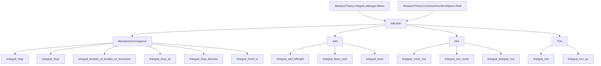
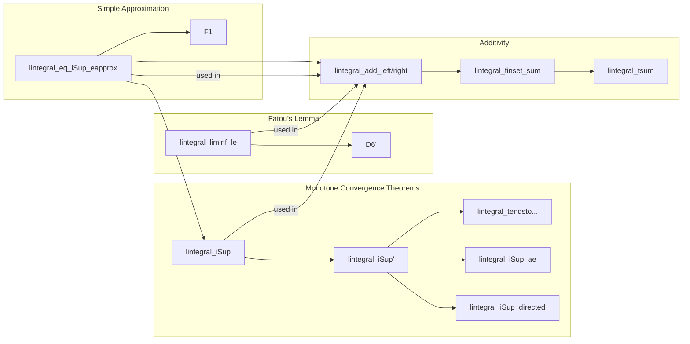

**Technical Brief: `Add.lean` — Monotone Convergence and Additivity of Lebesgue Integral**

---

### 1. KEY DEFINITIONS & THEOREMS

| Name | Type / Signature | Purpose |
|------|------------------|---------|
| `lintegral_iSup` | `(f : ℕ → α → ℝ≥0∞) → (∀ n, Measurable (f n)) → Monotone f → ∫⁻ ⨆ n, f n ∂μ = ⨆ n, ∫⁻ f n ∂μ` | Monotone convergence theorem (MCT) for *measurable* functions. |
| `lintegral_iSup'` | `(f : ℕ → α → ℝ≥0∞) → (∀ n, AEMeasurable (f n) μ) → (∀ᵐ x ∂μ, Monotone (f n x)) → ∫⁻ ⨆ n, f n ∂μ = ⨆ n, ∫⁻ f n ∂μ` | MCT for *a.e. measurable* functions (uses `aeSeq`). |
| `lintegral_tendsto_of_tendsto_of_monotone` | `(f : ℕ → α → ℝ≥0∞) → F : α → ℝ≥0∞ → ... → Tendsto (∫⁻ f n ∂μ) atTop (𝓝 (∫⁻ F ∂μ))` | MCT in terms of convergence of integrals (limit version). |
| `lintegral_iSup_ae` | `(f : ℕ → α → ℝ≥0∞) → (∀ n, Measurable (f n)) → (∀ n, ∀ᵐ a, f n a ≤ f n.succ a) → ...` | Weaker MCT: monotonicity only *a.e.* and *successor-wise*. |
| `lintegral_iSup_directed_of_measurable` | `[Countable β] → (f : β → α → ℝ≥0∞) → (∀ b, Measurable (f b)) → Directed (· ≤ ·) f → ...` | MCT over *directed* families indexed by countable types. |
| `lintegral_iSup_directed` | Same as above, but for `AEMeasurable`. | Extends previous to a.e. measurable case. |
| `lintegral_liminf_le` / `lintegral_liminf_le'` | `(∀ n, Measurable / AEMeasurable (f n) μ) → ∫⁻ liminf f n ∂μ ≤ liminf ∫⁻ f n ∂μ` | Fatou’s lemma (measurable / a.e. measurable). |
| `lintegral_eq_iSup_eapprox_lintegral` | `Measurable f → ∫⁻ f ∂μ = ⨆ n, (eapprox f n).lintegral μ` | Integral as supremum of simple approximants. |
| `le_lintegral_add` | `(f g : α → ℝ≥0∞) → ∫⁻ f ∂μ + ∫⁻ g ∂μ ≤ ∫⁻ (f + g) ∂μ` | Subadditivity of integral (no measurability needed). |
| `lintegral_add_aux` | `(f g : α → ℝ≥0∞) → Measurable f → Measurable g → ∫⁻ (f + g) ∂μ = ∫⁻ f ∂μ + ∫⁻ g ∂μ` | Additivity for *measurable* functions (via simple approximants + MCT). |
| `lintegral_add_left` | `Measurable f → ∫⁻ (f + g) ∂μ = ∫⁻ f ∂μ + ∫⁻ g ∂μ` | Additivity when *first* argument is measurable. |
| `lintegral_add_left'` | `AEMeasurable f μ → ∫⁻ (f + g) ∂μ = ∫⁻ f ∂μ + ∫⁻ g ∂μ` | Additivity when *first* argument is a.e. measurable. |
| `lintegral_add_right` / `lintegral_add_right'` | Symmetric versions of above (second argument measurable / a.e. measurable). |
| `lintegral_finset_sum` / `lintegral_finset_sum'` | Finite additivity over `Finset`, measurable / a.e. measurable summands. |
| `lintegral_tsum` | `[Countable β] → (∀ i, AEMeasurable (f i) μ) → ∫⁻ ∑' i, f i ∂μ = ∑' i, ∫⁻ f i ∂μ` | Countable additivity (σ-additivity) of integral. |
| `lintegral_const_mul` / `lintegral_const_mul''` | `Measurable / AEMeasurable f → ∫⁻ r • f ∂μ = r • ∫⁻ f ∂μ` | Homogeneity for measurable / a.e. measurable functions. |
| `lintegral_const_mul'` | `r ≠ ∞ → ∫⁻ r • f ∂μ = r • ∫⁻ f ∂μ` | Homogeneity without measurability, assuming `r ≠ ∞`. |
| `lintegral_mul_const` / `lintegral_mul_const''` | Right-multiplication version of homogeneity. |
| `lintegral_lintegral_mul` | Product of integrals = double integral of product for a.e. measurable factors. |
| `lintegral_trim` / `lintegral_trim_ae` | Integral unchanged under restriction of σ-algebra (via `trim`). |

---

### 2. NAMING CONVENTIONS

- **Prefixes**:
  - `lintegral_`: Lebesgue integral (nonnegative extended reals).
  - `eapprox`: *Exponential approximation* — standard simple function approximants.
  - `aeSeq`, `aeSeqSet`: constructions for handling a.e. properties via measurable selectors.
  - `measurable_mk`, `aemeasurable`: coercion from `AEMeasurable` to measurable functions.
  - `trim`, `restrict`: operations on measures/sets.

- **Suffixes**:
  - `'` (prime): usually indicates a.e. measurable version (`lintegral_add_left'`).
  - `''` (double prime): often used for variants with `AEMeasurable` and no extra assumptions (`lintegral_const_mul''`).
  - `le`, `eq`: inequality vs equality statements.
  - `aux`: auxiliary lemmas used in proofs of main theorems.

- **Logical structure**:
  - `iSup`, `iInf`, `liminf`, `tendsto`: used for suprema/limits in MCT and Fatou.
  - `directed`, `Finset.sum`, `tsum`: for finite/countable additivity.

---

### 3. TACTIC STACK

| Tactic | Usage Frequency | Purpose |
|--------|-----------------|---------|
| `rw` / `simp_rw` | Very High | Rewriting definitions, e.g., `lintegral`, `eapprox`, `iSup`, `aeSeq`. |
| `congr` / `ext` | High | Proving equality of functions/integrals via extensionality. |
| `gcongr` | High | Goal-directed congruence for inequalities (e.g., monotonicity of integral). |
| `exact`, `apply`, `intro` | High | Basic proof steps. |
| `rcases`, `cases` | Medium | Decomposing existential/universal hypotheses. |
| `filter_upwards` | Medium | Handling `∀ᵐ` (almost everywhere) quantifiers. |
| `aesop` | Low | Not used here — file is highly manual. |
| `ring`, `linarith` | Low | Rarely needed due to ENNReal arithmetic. |
| `simp +contextual` | Medium | Contextual simplification for indicator functions, piecewise definitions. |
| `measure_iUnion`, `mul_iSup`, `Finset.sum_iSup` | Medium | ENNReal-specific simplifications. |

---

### 4. PROOF LOGIC

**General proof strategy**:

1. **Approximation**: Replace functions with simple functions via `eapprox f n`, using:
   - `iSup_eapprox_apply` (pointwise convergence),
   - `lintegral_eq_iSup_eapprox_lintegral` (integral as sup of simple integrals).

2. **Monotonicity**: Show monotonicity of approximants:
   - `monotone_eapprox f` ensures `eapprox f n ≤ eapprox f (n+1)`.

3. **Apply MCT variants**:
   - Use `lintegral_iSup` (measurable case) or `lintegral_iSup'` (a.e. case).
   - For directed families: `lintegral_iSup_directed`.

4. **Handle a.e. properties**:
   - Use `aeSeq` to lift pointwise a.e. properties to measurable sequences.
   - Prove properties for `aeSeq hf p`, then transfer back via `lintegral_congr_ae`.

5. **INEquality direction**:
   - For subadditivity (`le_lintegral_add`): use definition of integral as sup over simple functions.
   - For equality (`lintegral_add_aux`, `lintegral_add_left`): combine subadditivity with reverse inequality via truncation (`φ - f`) and monotonicity.

6. **Countable additivity**:
   - Reduce to finite sums via `Finset.sum`, then use `lintegral_iSup_directed` over finite subsets.

7. **Homogeneity**:
   - Use `mul_iSup` and `const_mul_lintegral` for simple functions.
   - For `r ≠ ∞`, use inversion trick (`r⁻¹`) to reduce to inequality direction.

---

### 5. IMPORTS

| Module | Purpose |
|--------|---------|
| `Mathlib.MeasureTheory.Constructions.BorelSpace.Real` | Real numbers as standard Borel space; measurable structure. |
| `Mathlib.MeasureTheory.Integral.Lebesgue.Basic` | Core definitions: `lintegral`, `SimpleFunc`, `eapprox`, `AEMeasurable`, `aeSeq`, `trim`, etc. |

---

### 6. MERMAID DIAGRAMS

#### Dependency Graph (High-Level)

#### Overview of `Add.lean`

---

### 7. DOMAIN-SPECIFIC INSIGHTS

- **Key abstraction**: `eapprox` provides a canonical sequence of simple functions converging pointwise to any measurable `f : α → ℝ≥0∞`.
- **a.e. handling**: The `aeSeq` machinery is central to lifting pointwise a.e. properties to measurable ones — avoids needing choice principles.
- **ENNReal arithmetic**: All proofs rely heavily on properties of `ℝ≥0∞` (e.g., `mul_iSup`, `iSup_add_iSup_of_monotone`, `Finset.sum_iSup_of_monotone`).
- **Measurability hierarchy**: The file distinguishes between `Measurable`, `AEMeasurable`, and `Measurable[m]` (relative to sub-σ-algebras), with careful propagation via `trim`, `restrict`, and `ae_eq_mk`.

---

Let me know if you'd like:
- A formalized dependency graph (e.g., `.lean`-level imports),
- Extraction of proof-term skeletons,
- Translation to natural deduction or tactic-style proof scripts.
