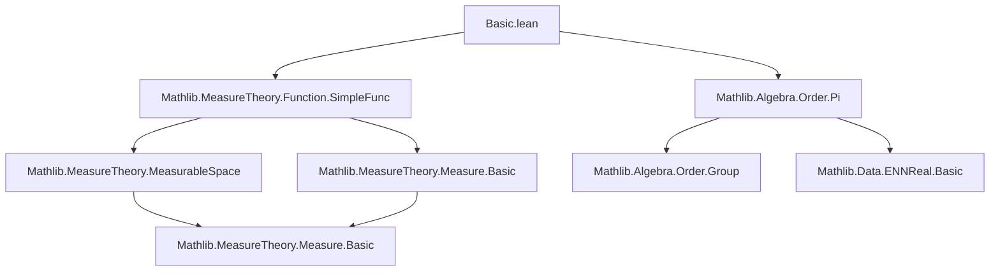

Here is the structured technical brief for `Basic.lean`, extracted with precision and aligned with Lean 4 formalization conventions.

---

### **1. Key Definitions & Theorems**

| Name | Type / Signature | Purpose |
|------|------------------|---------|
| `lintegral` | `Measure α → (α → ℝ≥0∞) → ℝ≥0∞` | **Lower Lebesgue integral** of an `ℝ≥0∞`-valued function w.r.t. a measure; defined as supremum over integrals of simple functions bounded by `f`. |
| `SimpleFunc.lintegral` | `SimpleFunc α ℝ≥0∞ → Measure α → ℝ≥0∞` | Integral of a simple function; coincides with `lintegral` on simple functions (`SimpleFunc.lintegral_eq_lintegral`). |
| `setLIntegral` | Notation for `lintegral (μ.restrict s)` | Integral over a subset `s`; defined via restriction of measure. |
| `exists_measurable_le_lintegral_eq` | `∃ g, Measurable g ∧ g ≤ f ∧ ∫⁻ g ∂μ = ∫⁻ f ∂μ` | For any `f`, there exists a measurable `g ≤ f` with equal integral — key for approximation. |
| `lintegral_eq_zero_iff'` | `AEMeasurable f → (∫⁻ f ∂μ = 0 ↔ f =ᵐ[μ] 0)` | Characterization of zero integral via a.e. vanishing (requires a.e. measurability). |
| `lintegral_mono_ae` | `f ≤ᵐ[μ] g → ∫⁻ f ∂μ ≤ ∫⁻ g ∂μ` | Monotonicity of integral w.r.t. a.e. inequality. |
| `lintegral_congr_ae` | `f =ᵐ[μ] g → ∫⁻ f ∂μ = ∫⁻ g ∂μ` | Equality of integrals under a.e. equality. |
| `exists_pos_setLIntegral_lt_of_measure_lt` | Finite integral ⇒ absolute continuity: `μ s < δ ⇒ ∫⁻[s] f < ε` | Quantitative absolute continuity of integral w.r.t. measure of set. |
| `tendsto_setLIntegral_zero` | `μ(s i) → 0 ⇒ ∫⁻[s i] f → 0` | Continuity of integral over shrinking sets. |
| `Measure.ext_iff_lintegral` | `μ = ν ↔ ∀ f measurable, ∫⁻ f ∂μ = ∫⁻ f ∂ν` | Extensionality of measures via integrals of measurable functions. |
| `lintegral_indicator` | `MeasurableSet s ⇒ ∫⁻ s.indicator f ∂μ = ∫⁻[s] f ∂μ` | Indicator functions reduce to set integrals. |
| `lintegral_sum_measure` | `∫⁻ f ∂(∑ μ i) = ∑ ∫⁻ f ∂μ i` | Countable additivity of integral over sum of measures. |
| `lintegral_iUnion` | Disjoint countable union ⇒ integral splits as sum | Countable additivity over disjoint measurable sets. |

---

### **2. Naming Conventions**

- **Prefixes**:
  - `lintegral_`: core integral properties (e.g., `lintegral_mono`, `lintegral_zero`, `lintegral_const`).
  - `setLIntegral_`: integrals over subsets (e.g., `setLIntegral_const`, `setLIntegral_eq_zero_iff`).
  - `exists_`: existence lemmas (e.g., `exists_measurable_le_lintegral_eq`, `exists_simpleFunc_forall_lintegral_sub_lt_of_pos`).
  - `iSup_`, `iInf_`: behavior under suprema/infima (e.g., `iSup_lintegral_le`, `le_iInf_lintegral`).
  - `ae_`: almost-everywhere variants (e.g., `lintegral_mono_ae`, `lintegral_congr_ae`).
  - `zero_`, `one_`: constants 0 and 1 (e.g., `lintegral_zero`, `lintegral_one`, `setLIntegral_one`).

- **Suffixes**:
  - `_fn`: functional version for `gcongr` (e.g., `lintegral_mono_fn'`).
  - `_le`, `_ge`: inequality direction (e.g., `le_iInf_lintegral`, `lintegral_le_iSup_mul`).
  - `_eq_zero`: characterizations of zero integral.
  - `__iff`: biconditional characterizations (e.g., `lintegral_eq_zero_iff'`).
  - `_measure`: dependence on measure (e.g., `lintegral_smul_measure`, `lintegral_add_measure`).

- **Notation**:
  - `∫⁻ x, f x ∂μ`: full integral.
  - `∫⁻ x in s, f x ∂μ`: integral over set `s`.
  - `→ₛ`: notation for `SimpleFunc`.

---

### **3. Tactic Stack**

Frequently used tactics in proofs:

| Tactic | Role |
|--------|------|
| `rw` / `rwa` / `erw` | Rewriting definitions, especially `lintegral`, `restrict`, `ae_restrict_iff₀`, etc. |
| `simp` / `simp only` | Simplifying using `@[simp]` lemmas (e.g., `lintegral_zero`, `setLIntegral_const`). |
| `gcongr` | Proving inequalities under monotone operators (e.g., integrals, suprema). |
| `exact`, `le_of_eq`, `le_antisymm` | Closing goals via equality or antisymmetry. |
| `convert` / `congr` | Aligning goal structure with known lemmas. |
| `rcases` / `obtain` / `choose` | Extracting witnesses from existential statements (e.g., sequences, simple functions). |
| `rwa`, `rw [← ...]` | Rewriting with reversed equalities (e.g., to introduce integrals from constants). |
| `tsub_add_cancel_of_le` | Handling subtraction in `ℝ≥0∞`. |
| `iSup_le`, `iSup₂_le`, `le_iSup` | Managing suprema over simple functions or measurable functions. |
| `ae_of_all`, `ae_restrict_iff₀`, `ae_restrict_iff'` | Moving between pointwise and a.e. statements. |
| `measure_iUnion_null_iff.mpr` | Handling null unions in zero-integral proofs. |

---

### **4. Proof Logic**

The logical flow across most proofs follows this pattern:

1. **Unfold definition**: Expand `lintegral` as `⨆ (g : SimpleFunc), g.lintegral μ` over `g ≤ f`.
2. **Approximate**: Use existence lemmas (e.g., `exists_measurable_le_lintegral_eq`, `exists_simpleFunc_forall_lintegral_sub_lt_of_pos`) to replace `f` by simple or measurable functions.
3. **Reduce to simple functions**: Prove properties for simple functions first (e.g., via `SimpleFunc.lintegral_eq_lintegral`, `SimpleFunc.lintegral_add`).
4. **Apply monotonicity/continuity**: Use `lintegral_mono`, `lintegral_mono_ae`, `monotone_lintegral`, or continuity lemmas (`tendsto_setLIntegral_zero`) to pass to limits.
5. **Handle null sets**: Use `ae_restrict_iff₀`, `nullMeasurableSet`, and `Measure.restrict_congr_set` to manage sets of measure zero.
6. **Use measure extensionality**: For uniqueness proofs, apply `Measure.ext_iff_lintegral`.

**Example**: Proof of `lintegral_eq_zero_iff'`:
- Expand integral as sup over measurable `g ≤ f`.
- Use Markov-type inequality (inlined): `μ({ε ≤ f}) ≤ (1/ε) ∫⁻ f`.
- Show `{f ≠ 0} = ⋃ₙ {uₙ ≤ f}` for a decreasing sequence `uₙ → 0`.
- Conclude measure-zero via countable union.

---

### **5. Imports**

| Module | Role |
|--------|------|
| `Mathlib.MeasureTheory.Function.SimpleFunc` | Simple functions, their integrals, algebraic ops (`+`, `-`, `sup`, `const`, `restrict`, `map`). |
| `Mathlib.Algebra.Order.Pi` | Lattice and order structure on `Π`-types, needed for pointwise sup/inf and monotonicity. |
| `Set`, `Filter`, `ENNReal`, `Topologie`, `NNReal` | Used for measure-theoretic constructions, topology of `ℝ≥0∞`, and convergence. |

---

### **6. Mermaid Diagrams**

#### **Dependency Graph (Top-Level)**



#### **Overview of Theory Flow**

```mermaid
flowchart LR
  subgraph Definitions
    SF[SimpleFunc α ℝ≥0∞]
    LF[lintegral μ f := ⨆_{g ≤ f} g.lintegral μ]
  end

  subgraph Approximation
    EX1[exists_measurable_le_lintegral_eq]
    EX2[exists_simpleFunc_forall_lintegral_sub_lt_of_pos]
  end

  subgraph Properties
    MONO[lintegral_mono_ae, setLIntegral_mono_ae]
    CONG[lintegral_congr_ae]
    ADD[lintegral_add_measure, lintegral_iUnion]
    ZERO[lintegral_eq_zero_iff']
  end

  subgraph Applications
    EXT[Measure.ext_iff_lintegral]
    ABS[exists_pos_setLIntegral_lt_of_measure_lt]
    TEND[tendsto_setLIntegral_zero]
  end

  SF -->|define| LF
  EX1 -->|approximate| MONO
  EX2 -->|ε-δ control| ABS
  MONO & CONG & ADD -->|combine| ZERO
  ZERO & CONG -->|uniqueness| EXT
  ABS -->|continuity| TEND
```

---

### **7. Notes**

- **Non-measurable counterexamples** are explicitly acknowledged (e.g., Vitali set) — hence the repeated `AEMeasurable`/`Measurable` assumptions.
- **`ℝ≥0∞`-valued functions** are central; all integrals are *lower* Lebesgue integrals (no measurability required in definition).
- **Absolute continuity** (`tendsto_setLIntegral_zero`) is a key technical tool for dominated convergence later.
- **Indicator functions** and **piecewise definitions** are heavily used to reduce to set integrals.

--- 

Let me know if you'd like the next module (`SimpleFunc.lean`) or the full dependency tree for `Mathlib.MeasureTheory`.
