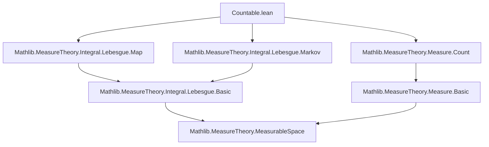
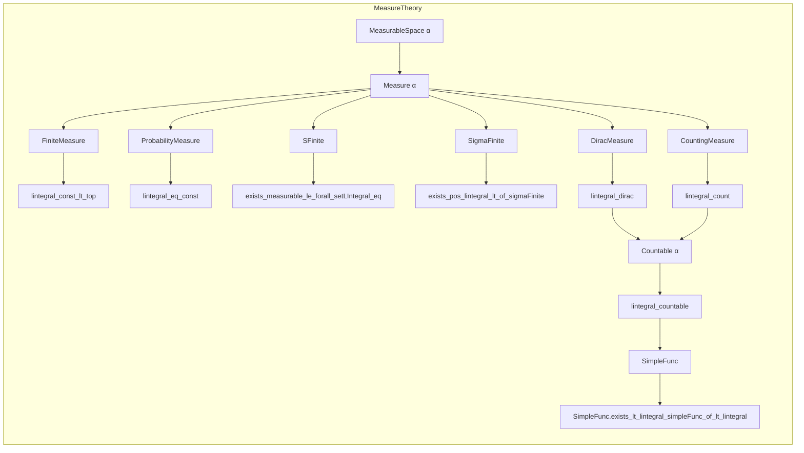

### Technical Brief: `Countable.lean` — Lebesgue Integration over Finite and Countable Types

---

#### **1. Key Definitions & Theorems**

| Name | Type / Signature | Purpose |
|------|------------------|---------|
| `setLIntegral_const_lt_top` | `[IsFiniteMeasure μ] → s : Set α → c : ℝ≥0∞ → c ≠ ∞ → ∫⁻ _ in s, c ∂μ < ∞` | Bounded constant integral over any set is finite under finite measures. |
| `lintegral_const_lt_top` | `[IsFiniteMeasure μ] → c ≠ ∞ → ∫⁻ _, c ∂μ < ∞` | Global constant integral finite under finite measures. |
| `lintegral_eq_const` | `[IsProbabilityMeasure μ] → (∀ᵐ x ∂μ, f x = c) → ∫⁻ x, f x ∂μ = c` | Integral of a.e.-constant function equals constant under probability measure. |
| `lintegral_le_const` | `[IsProbabilityMeasure μ] → (∀ᵐ x ∂μ, f x ≤ c) → ∫⁻ x, f x ∂μ ≤ c` | Upper bound on a.e. values gives upper bound on integral under probability measure. |
| `iInf_le_lintegral` | `[IsProbabilityMeasure μ] → ⨅ x, f x ≤ ∫⁻ x, f x ∂μ` | Infimum ≤ integral under probability measure. |
| `lintegral_le_iSup` | `[IsProbabilityMeasure μ] → ∫⁻ x, f x ∂μ ≤ ⨆ x, f x` | Integral ≤ supremum under probability measure. |
| `lintegral_dirac` | `[MeasurableSingletonClass α] → ∫⁻ a, f a ∂dirac a = f a` | Integral w.r.t. Dirac measure evaluates function at atom. |
| `setLIntegral_dirac` | `[MeasurableSingletonClass α] → ∫⁻ x in s, f x ∂dirac a = if a ∈ s then f a else 0` | Restricted integral over set `s` under Dirac is `f a` iff `a ∈ s`. |
| `lintegral_count'` / `lintegral_count` | `[MeasurableSingletonClass α] → ∫⁻ a, f a ∂count = ∑' a, f a` | Integral w.r.t. counting measure equals tsum (extended non-negative reals). |
| `ENNReal.count_const_le_le_of_tsum_le` | Markov inequality for counting measure: `∑' i, a i ≤ c → count {i | ε ≤ a i} ≤ c / ε` | Generalizes Markov’s inequality to counting measure via tsum. |
| `lintegral_countable'` | `[Countable α] → ∫⁻ a, f a ∂μ = ∑' a, f a * μ {a}` | Integral over countable space = weighted sum over atoms. |
| `lintegral_singleton` | `[MeasurableSingletonClass α] → ∫⁻ x in {a}, f x ∂μ = f a * μ {a}` | Integral over singleton = value × measure of singleton. |
| `lintegral_countable` | `[MeasurableSingletonClass α] → s.Countable → ∫⁻ a in s, f a ∂μ = ∑' a : s, f a * μ {(a : α)}` | Integral over countable set = sum over elements. |
| `lintegral_finset` | `[MeasurableSingletonClass α] → ∫⁻ x in s, f x ∂μ = ∑ x ∈ s, f x * μ {x}` | Integral over finite set = finite sum. |
| `lintegral_unique` | `[Unique α] → ∫⁻ x, f x ∂μ = f default * μ univ` | Integral over unique type reduces to single point. |
| `exists_measurable_le_forall_setLIntegral_eq` | `[SFinite μ] → ∃ g ≤ f, measurable g, ∀ s, ∫⁻ s f = ∫⁻ s g` | Approximation of non-measurable functions by measurable ones preserving integrals (s-finite case). |
| `exists_pos_lintegral_lt_of_sigmaFinite` | `[SigmaFinite μ] → ∃ g > 0, measurable, ∫⁻ g < ε` | Existence of positive integrable function with arbitrarily small integral (σ-finite case). |
| `lintegral_le_of_forall_fin_meas_le` | `[SigmaFinite μ] → (∀ s, μ s < ∞ → ∫⁻ s f ≤ C) → ∫⁻ f ≤ C` | Global integral bounded if all finite-measure restrictions are. |
| `SimpleFunc.exists_lt_lintegral_simpleFunc_of_lt_lintegral` | `[SigmaFinite μ] → L < ∫⁻ f → ∃ g ≤ f, simple, ∫⁻ g < ∞ ∧ L < ∫⁻ g` | Approximation from below by simple functions with finite integral. |

---

#### **2. Naming Conventions**

- **Prefixes**:
  - `lintegral_`, `setLIntegral_`: Lebesgue integral (full space / restricted).
  - `is_`, `Exists_`, `exists_`: Properties or existence statements.
  - `dirac_`, `count_`, `countable_`: Specific measures or structures.
  - `measurable_`, `meas_`: Measurability-related.
  - `finset_`, `fintype_`, `unique_`: Finite-type-specific lemmas.

- **Suffixes**:
  - `_lt_top`: Result is finite (< ∞).
  - `_eq_const`: Equality with constant.
  - `_dirac`, `_count`, `_singleton`: Measure-specific.
  - `_le_const`, `_le_iSup`, `_le_iInf`: Inequalities with sup/inf.
  - `_of_...`: Hypothesis-driven naming (e.g., `of_tsum_le`, `of_sigmaFinite`).
  - `_toMeasurable`, `_trim`: Measure-theoretic constructions.

---

#### **3. Tactic Stack**

Frequently used tactics in proofs:

| Tactic | Usage |
|--------|-------|
| `simp` / `simp only` | Simplification using definitional equalities, measure properties, `if`-splitting. |
| `rw` / `convert` / `ext` | Rewriting using lemmas, extensionality, congruence. |
| `exact`, `refine`, `apply` | Direct proof steps, especially for existence claims. |
| `split_ifs` | Handling `if-then-else` expressions. |
| `gcongr` | For monotonicity in ENNReal-valued integrals. |
| `aesop` / `linarith` | Rare; mostly manual reasoning due to ENNReal arithmetic. |
| `rcases`, `obtain`, `choose` | Existential elimination and choice. |
| `convert` + `simp_rw` | For coercions (e.g., `NNReal → ENNReal`). |
| `induction` + `SimpleFunc.induction` | Structural induction on simple functions. |
| `wlog` | Without loss of generality reductions (e.g., finite case). |
| `rwa` | Rewrite + assumption. |
| `gcongr`, `gcongr with`, `gcongr*` | For inequalities under integrals. |
| `mod_cast` | Type coercion simplification. |

---

#### **4. Proof Logic**

- **Inductive/constructive style** for simple functions and countable decompositions.
- **Decomposition strategy**:
  - Reduce to singleton integrals via `lintegral_singleton`, `lintegral_countable`.
  - Use `lintegral_biUnion` or `lintegral_sum_measure` for countable unions.
  - For general measures, reduce to finite/s-finite cases via trimming or spanning sets.
- **Approximation lemmas**:
  - Use `exists_measurable_le_*` to lift properties from measurable to arbitrary functions.
  - Use `SimpleFunc.exists_lt_lintegral_simpleFunc_of_lt_lintegral` to approximate integrals from below.
- **Measure-theoretic reductions**:
  - `trim`, `restrict`, `toMeasurable`, `spanningSets`, `disjointed`.
  - Use `Measure.restrict_apply'`, `lintegral_add_compl`, `lintegral_sum_measure`.
- **ENNReal arithmetic**:
  - Heavy use of `ENNReal.div_lt_iff`, `mul_lt_top`, `tsum_le_tsum`, `exists_lt_add_of_lt_add`.

---

#### **5. Imports**

| Import | Purpose |
|--------|---------|
| `Mathlib.MeasureTheory.Integral.Lebesgue.Map` | Change-of-variables, pushforward measures. |
| `Mathlib.MeasureTheory.Integral.Lebesgue.Markov` | Markov/Chebyshev inequalities. |
| `Mathlib.MeasureTheory.Measure.Count` | Counting measure, Dirac measure definitions. |

---

#### **6. Mermaid Diagrams**

##### **Dependency Graph (Module-Level)**

##### **Overview of Theory Flow**

---

#### **7. Domain-Specific AI Agent Insights**

- **Focus Areas**:
  - Integration over discrete/countable structures.
  - Handling of `ℝ≥0∞`-valued functions and extended non-negative reals.
  - Approximation techniques (measurable/simple functions).
  - Interplay between measure finiteness conditions (finite, s-finite, σ-finite).

- **Common Proof Patterns**:
  - Decompose space into atoms/singletons.
  - Use `lintegral_countable` to reduce to sums.
  - Apply `exists_*` lemmas to lift properties from simple/measurable functions.
  - Use `ENNReal` arithmetic lemmas for inequalities.

- **Key Challenges for AI**:
  - Managing `if-then-else` in `setLIntegral_dirac`.
  - Coercion handling (`NNReal → ENNReal`, `Finset → Set`).
  - Non-trivial ENNReal arithmetic (e.g., `a < b + c` with `c = ∞`).

---

Let me know if you'd like a **proof sketch generator** or ** tactic recommendation engine** for this module.
