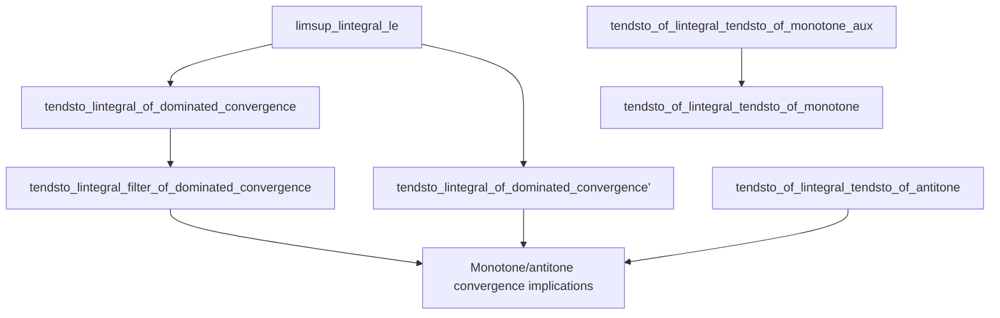

### Technical Brief: `DominatedConvergence.lean`

---

#### **1. Key Definitions & Theorems**

| Name | Type | Purpose |
|------|------|---------|
| `limsup_lintegral_le` | `∀ f g, (∀ n, Measurable (f n)) → (∀ n, f n ≤ᵐ[μ] g) → ∫⁻ g ∂μ ≠ ∞ → limsup (∫⁻ f n ∂μ) ≤ ∫⁻ limsup (f n) ∂μ` | Upper bound on limsup of integrals via limsup of functions; key technical lemma for dominated convergence. |
| `tendsto_lintegral_of_dominated_convergence` | `∀ F f bound, (∀ n, Measurable (F n)) → (∀ n, F n ≤ᵐ[μ] bound) → ∫⁻ bound ∂μ ≠ ∞ → (∀ᵐ a, F n a → f a) → ∫⁻ F n ∂μ → ∫⁻ f ∂μ` | **Dominated Convergence Theorem (DCT)** for *measurable* nonnegative functions. |
| `tendsto_lintegral_of_dominated_convergence'` | Same as above, but with `AEMeasurable` instead of `Measurable`. | Extension of DCT to *almost everywhere measurable* functions. |
| `tendsto_lintegral_filter_of_dominated_convergence` | DCT for filters `l` with countable basis. | Generalizes DCT beyond sequences (e.g., nets indexed by countably generated filters). |
| `tendsto_of_lintegral_tendsto_of_monotone_aux` | Monotone sequence with integral convergence ⇒ a.e. pointwise convergence. | Auxiliary lemma for monotone convergence implications. |
| `tendsto_of_lintegral_tendsto_of_monotone` | Same as above, but without assuming `AEMeasurable` for each `f n`. | Full monotone convergence implication (a.e. convergence from integral convergence). |
| `tendsto_of_lintegral_tendsto_of_antitone` | Antitone version of monotone implication. | Dual result for decreasing sequences. |

---

#### **2. Naming Conventions**

- **Prefixes**:
  - `tendsto_`: Convergence of integrals or functions.
  - `limsup_`, `liminf_`: Limsup/liminf-related lemmas.
  - `ae_`, `aemeasurable`: Almost everywhere properties.
  - `lintegral_`: Lebesgue integral (nonnegative extended reals).
- **Suffixes**:
  - `_of_dominated_convergence`: DCT variants.
  - `_of_monotone`, `_of_antitone`: Monotonicity-based lemmas.
  - `_aux`: Auxiliary lemmas used in proofs of main theorems.
- **Other patterns**:
  - `mk`: Construction of measurable representative for `AEMeasurable` functions.
  - `h_`: Hypothesis naming (e.g., `h_bound`, `h_fin`, `h_lim`).
  - `F`, `f`, `g`, `bound`: Standard function names for sequences, limits, and dominating functions.

---

#### **3. Tactic Stack**

| Tactic | Usage Frequency | Purpose |
|--------|------------------|---------|
| `filter_upwards` | Very High | Manipulate `∀ᵐ a ∂μ` statements (almost everywhere quantifiers). |
| `aesop` / `simp` | High | Simplify measurable/a.e. goals and hypotheses. |
| `lintegral_congr_ae` | High | Replace integrands equal a.e. |
| `iInf_mono`, `iSup₂_lintegral_le` | Medium | Handle limsup/liminf via inf/sup characterizations. |
| `lintegral_iInf`, `lintegral_mono_ae` | Medium | Move integrals past infima or monotone limits. |
| `tendsto_of_le_liminf_of_limsup_le` | Medium | Prove convergence by bounding liminf and limsup. |
| `rw [tendsto_iff_seq_tendsto]` | Medium | Reduce filter convergence to sequential convergence (for countably generated filters). |
| `rcases`, `obtain`, `have`: | High | Extract witnesses and intermediate facts. |
| `simp_rw` | Medium | Rewrite using definitional equalities (e.g., `lintegral_congr_ae`). |
| `exact`, `refine`, `apply` | High | Apply lemmas with partial instantiation. |

---

#### **4. Proof Logic**

- **Structure of DCT proofs**:
  1. **Reduce to liminf/limsup bounds** using `tendsto_of_le_liminf_of_limsup_le`.
  2. **Lower bound**: Use `lintegral_liminf_le` (Fatou-type inequality).
  3. **Upper bound**: Use `limsup_lintegral_le` (main technical lemma).
  4. **Equality of limsup/liminf limits** via pointwise convergence hypothesis (`h_lim`).
- **Monotone/antitone implications**:
  - Construct candidate limit `F'` from pointwise limits (using choice).
  - Show `F' =ᵐ[μ] F` by comparing integrals and using `ae_eq_of_ae_le_of_lintegral_le`.
  - Use auxiliary lemmas (`tendsto_of_lintegral_tendsto_of_monotone_aux`) to handle `AEMeasurable` case.
- **Countable basis generalization**:
  - Reduce to sequences via `tendsto_iff_seq_tendsto`.
  - Shift sequences to satisfy hypotheses (e.g., `tendsto_add_atTop_iff_nat`).
- **Measurability handling**:
  - `AEMeasurable` → `Measurable` via `mk` construction and `ae_eq_mk`.
  - Use `lintegral_congr_ae` to replace functions with measurable representatives.

---

#### **5. Imports**

| Import | Role |
|--------|------|
| `Mathlib.MeasureTheory.Integral.Lebesgue.Markov` | Markov inequality, basic properties of `lintegral`. |
| `Mathlib.MeasureTheory.Integral.Lebesgue.Sub` | Subtraction and positivity lemmas for integrals. |

> **Note**: The file builds on foundational measure theory in `Mathlib`, especially `MeasureTheory.Integral.Lebesgue`, and assumes:
> - `α` is a measurable space,
> - `μ` is a measure on `α`,
> - Functions map into `ℝ≥0∞` (extended nonnegative reals),
> - All integrals are Lebesgue integrals (`lintegral`).

---

#### **6. Mermaid Diagrams**

##### **Dependency Graph (Theorems & Lemmas)**



##### **Overview of File Structure**

```mermaid
flowchart LR
  subgraph Theory
    A[Measure Theory Foundations] --> B[Lebesgue Integral (lintegral)]
    B --> C[Almost Everywhere (a.e.) Properties]
    C --> D[Dominated Convergence Theorem (DCT)]
    C --> E[Monotone Convergence Implications]
    D --> F[Measurable Case]
    D --> G[AEMeasurable Case]
    D --> H[Filter Generalization]
    E --> I[Monotone Sequence]
    E --> J[Antitone Sequence]
  end

  subgraph Proofs
    D -->|Uses| A
    I -->|Uses| A
    J -->|Uses| A
  end
```

---

#### **7. Summary**

This file formalizes **Lebesgue’s Dominated Convergence Theorem** and related convergence results in `Mathlib`. It covers:
- DCT for measurable and a.e. measurable functions,
- Generalization to countably generated filters,
- Converse implications: integral convergence + monotonicity ⇒ a.e. pointwise convergence.

The proofs rely heavily on:
- `lintegral` properties (monotonicity, continuity from below/above),
- `ENNReal` arithmetic,
- Filter convergence techniques (`tendsto`, `limsup`, `liminf`),
- A.e. reasoning (`filter_upwards`, `ae_all_iff`).

It serves as a cornerstone for further analysis (e.g., `Lp` spaces, Fubini, Radon–Nikodym) in `Mathlib`.
