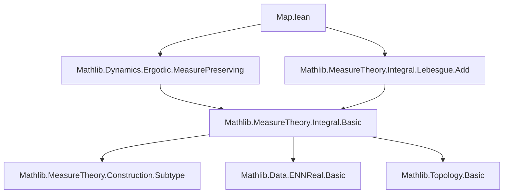
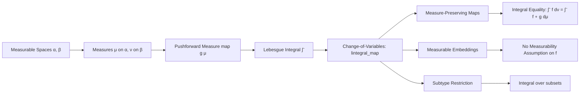

### Technical Brief: `Map.lean` — Lebesgue Integral Transformation Under Maps

---

#### **1. Key Definitions & Theorems**

| Name | Type / Signature | Purpose |
|------|------------------|---------|
| `lintegral_map` | `{f : β → ℝ≥0∞} {g : α → β} → Measurable f → Measurable g → ∫⁻ a, f a ∂map g μ = ∫⁻ a, f (g a) ∂μ` | Fundamental change-of-variables formula for the *nonnegative extended real-valued* Lebesgue integral under a measurable map `g`. |
| `lintegral_map'` | `{f : β → ℝ≥0∞} {g : α → β} → AEMeasurable f (map g μ) → AEMeasurable g μ → ∫⁻ a, f a ∂map g μ = ∫⁻ a, f (g a) ∂μ` | Extension of `lintegral_map` to *almost everywhere measurable* functions (via representatives). |
| `lintegral_map_le` | `(f : β → ℝ≥0∞) (g : α → β) → ∫⁻ a, f a ∂map g μ ≤ ∫⁻ a, f (g a) ∂μ` | General inequality (no measurability assumed on `g`); equality holds iff `g` is a.e. measurable. |
| `lintegral_comp` | `{f : β → ℝ≥0∞} {g : α → β} → Measurable f → Measurable g → lintegral μ (f ∘ g) = ∫⁻ a, f a ∂map g μ` | Restates `lintegral_map` in terms of composition; often used for rewriting. |
| `setLIntegral_map` | `{f : β → ℝ≥0∞} {g : α → β} {s : Set β} → MeasurableSet s → Measurable f → Measurable g → ∫⁻ y in s, f y ∂map g μ = ∫⁻ x in g ⁻¹' s, f (g x) ∂μ` | Change-of-variables for *restricted* integrals over measurable subsets. |
| `lintegral_indicator_const_comp` | `{f : α → β} {s : Set β} → Measurable f → MeasurableSet s → c : ℝ≥0∞ → ∫⁻ a, s.indicator (fun _ => c) (f a) ∂μ = c * μ (f ⁻¹' s)` | Integral of a constant indicator composed with `f` equals constant times preimage measure. |
| `_root_.MeasurableEmbedding.lintegral_map` | `(g : α → β) → MeasurableEmbedding g → (f : β → ℝ≥0∞) → ∫⁻ a, f a ∂map g μ = ∫⁻ a, f (g a) ∂μ` | Change-of-variables for *measurable embeddings* (not necessarily surjective), even when `f` is not measurable. |
| `lintegral_map_equiv` | `(f : β → ℝ≥0∞) (g : α ≃ᵐ β) → ∫⁻ a, f a ∂map g μ = ∫⁻ a, f (g a) ∂μ` | Special case of above for measurable equivalences (`≃ᵐ`). |
| `lintegral_subtype_comap` | `(s : Set α) → MeasurableSet s → (f : α → ℝ≥0∞) → ∫⁻ x : s, f x ∂(μ.comap (↑)) = ∫⁻ x in s, f x ∂μ` | Compatibility of integral with subtype inclusion (i.e., restriction to measurable subset). |
| `MeasurePreserving.lintegral_map_equiv` | `(hg : MeasurePreserving g μ ν) → (f : β → ℝ≥0∞) → ∫⁻ a, f a ∂ν = ∫⁻ a, f (g a) ∂μ` | When `g` pushes `μ` to `ν`, integral over `ν` equals integral over `μ` after pullback. |
| `MeasurePreserving.lintegral_comp` | `(hg : MeasurePreserving g μ ν) → (f : β → ℝ≥0∞) → Measurable f → ∫⁻ a, f (g a) ∂μ = ∫⁻ b, f b ∂ν` | Direct formulation of measure-preserving property for integrals. |
| `MeasurePreserving.setLIntegral_comp_preimage` | `(hs : MeasurableSet s) → (hf : Measurable f) → ∫⁻ a in g ⁻¹' s, f (g a) ∂μ = ∫⁻ b in s, f b ∂ν` | Integral over image set equals integral over preimage under measure-preserving map. |

---

#### **2. Naming Conventions**

- **Prefixes**:
  - `lintegral_`: Nonnegative extended real-valued integral (`∫⁻`).
  - `setLIntegral_`: Restricted integral over a set (`∫⁻ x in s, ...`).
  - `map`, `comap`: Pushforward (`map g μ`) and pullback (`comap f μ`) of measures.
  - `comp`, `comp_preimage`, `comp_emb`: Composition with `g` or preimage under `g`.
  - `equiv`, `emb`: For `≃ᵐ` (measurable equivalence) and `MeasurableEmbedding`.

- **Suffixes**:
  - `_map`: Change-of-variables under pushforward.
  - `_equiv`: Special case for measurable equivalences.
  - `_emb`: Special case for measurable embeddings.
  - `_subtype`: Restriction to subtypes (subsets).
  - `_comp`: Integration of compositions.

---

#### **3. Tactic Stack**

- **Core tactics**:
  - `rw`, `congr`, `ext1`, `convert`, `simp only`, `simp`, `exact`, `refine`, `le_antisymm`, `le_of_sub_nonneg`, `le_iSup_of_le`, `iSup_le`, `iSup₂_le`, `ae_eq_mk`, `ae_eq_comp`, `lintegral_congr_ae`, `lintegral_mono`, `lintegral_mono_ae`, `measurable_const.indicator`, `measurable_mk`, `measurableEmbedding.measurable`, `MeasurableEmbedding.injective`, `MeasurableEmbedding.ae_map_iff`, `extend_apply`, `Set.preimage_image_eq`, `inter_eq_right`, `Subtype.coe_image_subset`.

- **Domain-specific simplifications**:
  - `eapprox_comp`, `coe_comp`, `hf.measurable_mk`, `hg.measurable_mk`, `hf.ae_eq_mk`, `hg.ae_eq_mk`, `hf.ae_eq_mk.symm`, `hf.measurable`, `hg.measurable`, `hs`, `hf₀`, `hge`, `hg.measurable`.

- **Key automation**:
  - `aesop` (not explicitly used, but `rw` + `simp` + `exact` dominate).
  - `ring` (not used — arithmetic handled via `ENNReal` lemmas).
  - `linarith` (not used — inequalities handled via monotonicity lemmas).

---

#### **4. Proof Logic**

- **Induction/Approximation Strategy**:
  - For `lintegral_map`: Approximate `f` by simple functions (`eapprox`), reduce to `SimpleFunc.lintegral_map`, then use continuity of `lintegral` under monotone convergence.
  - For `lintegral_map'`: Lift to a.e.-measurable functions via representatives (`hf.mk`, `hg.mk`) and apply `lintegral_map` + congruence lemmas (`lintegral_congr_ae`).
  - For `MeasurableEmbedding.lintegral_map`: Use definition of `lintegral` as supremum over simple functions; prove both inequalities via extension (`extend_apply`) and monotonicity.

- **Common Logical Flow**:
  1. Reduce to measurable/simple cases (via approximation or representatives).
  2. Apply known lemmas for simple functions (`SimpleFunc.lintegral_map`).
  3. Use continuity (monotone convergence, a.e.-congruence) to lift back.
  4. For measure-preserving maps: Replace `map g μ` with `ν` using `hg.map_eq`.

---

#### **5. Imports & Dependencies**

- **Primary imports**:
  ```lean
  Mathlib.Dynamics.Ergodic.MeasurePreserving
  Mathlib.MeasureTheory.Integral.Lebesgue.Add
  ```

- **Core dependencies** (via `open` statements and usage):
  - `MeasureTheory.Measure` (for `map`, `comap`, `restrict`, `ae`, `AEMeasurable`)
  - `MeasureTheory.Integral.Basic` (for `lintegral`, `SimpleFunc.lintegral`)
  - `MeasureTheory.Function.Measurable` (for `Measurable`, `AEMeasurable`, `ae_eq_mk`)
  - `MeasureTheory.Function.SimpleFunc` (for `SimpleFunc`, `eapprox`, `extend`)
  - `MeasureTheory.Construction.Subtype` (for `subtype_coe`, `comap_subtype_coe`)
  - `Mathlib.Data.ENNReal.Basic` (for `ℝ≥0∞`, `ENNReal` arithmetic)
  - `Mathlib.Topology.Basic` (for `preimage`, `image`, `measurableEmbedding`)

---

#### **6. Mermaid Diagrams**

##### **Dependency Graph (Module-Level)**



##### **Overview of Theory Flow**



---

#### **7. Summary**

This file formalizes the transformation law for the Lebesgue integral under measurable maps, embeddings, and equivalences. It distinguishes between:
- **Measurable maps** (`lintegral_map`, `lintegral_map'`): Require `f` measurable.
- **Measurable embeddings** (`MeasurableEmbedding.lintegral_map`): Allow arbitrary `f`, using injectivity and measurability of inverse on image.
- **Measure-preserving maps** (`MeasurePreserving.lintegral_*`): Equate integrals over target and source via pushforward.

The proofs rely heavily on approximation by simple functions, a.e.-congruence, and monotonicity — hallmarks of the nonnegative integral theory in `Mathlib`.
