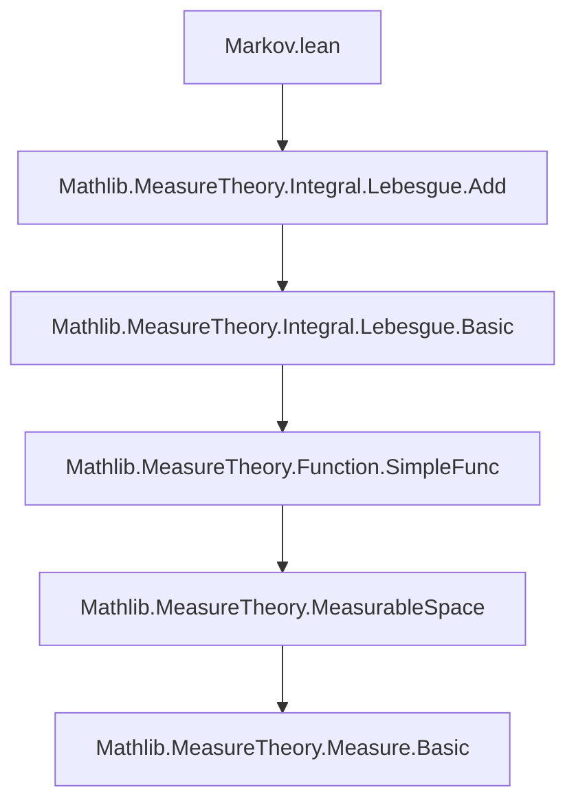
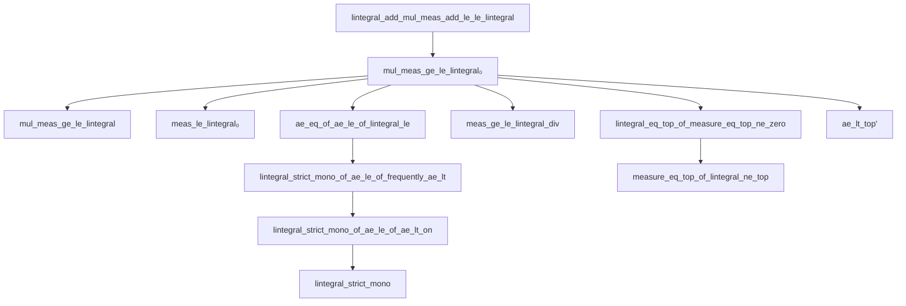

### Technical Brief: `Markov.lean` — Measure-Theoretic Markov Inequality and Related Results

---

#### **1. Key Definitions & Theorems**

| Name | Type | Purpose |
|------|------|---------|
| `lintegral_add_mul_meas_add_le_le_lintegral` | `f ≤ᵐ[μ] g → AEMeasurable g μ → ε : ℝ≥0∞ → ∫⁻ f + ε * μ({f + ε ≤ g}) ≤ ∫⁻ g` | Generalized Markov inequality for two functions; foundational lemma. |
| `mul_meas_ge_le_lintegral₀` | `AEMeasurable f μ → ε : ℝ≥0∞ → ε * μ({ε ≤ f}) ≤ ∫⁻ f` | Standard Markov inequality (essential supremum version). |
| `mul_meas_ge_le_lintegral` | `Measurable f → ε : ℝ≥0∞ → ε * μ({ε ≤ f}) ≤ ∫⁻ f` | Measurable version of Markov inequality. |
| `meas_le_lintegral₀` | `AEMeasurable f μ → (∀ x ∈ s, 1 ≤ f x) → μ s ≤ ∫⁻ f` | Lower bound on measure via integral (indicator-like). |
| `lintegral_le_meas` | `(∀ a, f a ≤ 1) → (∀ a ∈ sᶜ, f a = 0) → ∫⁻ f ≤ μ s` | Upper bound on integral via measure (bounded support). |
| `setLIntegral_le_meas` | `MeasurableSet s → (∀ a ∈ s, a ∈ t → f a ≤ 1) → (∀ a ∈ s, a ∉ t → f a = 0) → ∫⁻[a ∈ s] f ≤ μ t` | Restricted version of previous. |
| `lintegral_eq_top_of_measure_eq_top_ne_zero` | `AEMeasurable f μ → μ({f = ∞}) ≠ 0 → ∫⁻ f = ∞` | Integral infinite if function is infinite on a positive-measure set. |
| `setLIntegral_eq_top_of_measure_eq_top_ne_zero` | `AEMeasurable f (μ.restrict s) → μ({x ∈ s | f x = ∞}) ≠ 0 → ∫⁻[x ∈ s] f = ∞` | Restricted version. |
| `measure_eq_top_of_lintegral_ne_top` | `AEMeasurable f μ → ∫⁻ f ≠ ∞ → μ({f = ∞}) = 0` | Converse: finite integral ⇒ function finite a.e. |
| `measure_eq_top_of_setLIntegral_ne_top` | `AEMeasurable f (μ.restrict s) → ∫⁻[x ∈ s] f ≠ ∞ → μ({x ∈ s | f x = ∞}) = 0` | Restricted version. |
| `meas_ge_le_lintegral_div` | `AEMeasurable f μ → ε ≠ 0 → ε ≠ ∞ → μ({ε ≤ f}) ≤ (∫⁻ f) / ε` | Classical normalized Markov inequality (division form). |
| `ae_eq_of_ae_le_of_lintegral_le` | `f ≤ᵐ[μ] g → ∫⁻ f ≠ ∞ → AEMeasurable g → ∫⁻ g ≤ ∫⁻ f → f =ᵐ[μ] g` | Equality criterion: if `f ≤ g` a.e. and integrals equal, then `f = g` a.e. |
| `lintegral_strict_mono_of_ae_le_of_frequently_ae_lt` | `AEMeasurable g → ∫⁻ f ≠ ∞ → f ≤ᵐ[μ] g → ∃ᵐ x, f x ≠ g x → ∫⁻ f < ∫⁻ g` | Strict monotonicity of integral under a.e. strict inequality on a positive-measure set. |
| `lintegral_strict_mono_of_ae_le_of_ae_lt_on` | `AEMeasurable g → ∫⁻ f ≠ ∞ → f ≤ᵐ[μ] g → μ s ≠ 0 → ∀ᵐ x ∈ s, f x < g x → ∫⁻ f < ∫⁻ g` | Strict monotonicity on a subset. |
| `lintegral_strict_mono` | `μ ≠ 0 → AEMeasurable g → ∫⁻ f ≠ ∞ → ∀ᵐ x, f x < g x → ∫⁻ f < ∫⁻ g` | Global strict monotonicity. |
| `setLIntegral_strict_mono` | `MeasurableSet s → μ s ≠ 0 → Measurable g → ∫⁻[x ∈ s] f ≠ ∞ → ∀ᵐ x ∈ s, f x < g x → ∫⁻[x ∈ s] f < ∫⁻[x ∈ s] g` | Restricted strict monotonicity. |
| `ae_lt_top'` | `AEMeasurable f → ∫⁻ f ≠ ∞ → ∀ᵐ x, f x < ∞` | Functions with finite integral are finite a.e. |
| `ae_lt_top` | `Measurable f → ∫⁻ f ≠ ∞ → ∀ᵐ x, f x < ∞` | Measurable version of above. |

---

#### **2. Naming Conventions**

- **Prefixes**:
  - `lintegral_`, `setLIntegral_`: for integrals over full space or restricted sets.
  - `mul_meas_`, `meas_`: relate measure of level sets to integrals.
  - `ae_`, `aemeasurable`: almost-everywhere properties and measurability.
  - `strict_mono`: strict monotonicity of integral.

- **Suffixes**:
  - `_0`: for `AEMeasurable` versions (weaker assumption).
  - `_div`: division form of inequality.
  - `_top`: statements about infinity (e.g., `eq_top`, `ne_top`, `lt_top`).
  - `_on`: restricted to a set.

- **Logical structure**:
  - `le`, `ge`, `lt`, `eq` in names indicate inequality direction.
  - `mono` in names indicates monotonicity or strict monotonicity.

---

#### **3. Tactic Stack**

Frequently used tactics:
- `rcases`, `cases`, `split_ifs`, `simp`, `simp_all`, `rw`, `exact`, `refine`, `gcongr`, `apply`, `contrapose!`, `of_not_not`, `tendsto_*`, `tendsto_const_nhds.add`, `tendsto_inv_iff.2`, `eq_top_iff.mpr`, `calc`, `lintegral_mono`, `lintegral_mono_ae`, `measure_mono`, `ae_of_all`, `ae_all_iff.2`, `ae_iff`, `ae_restrict_iff'`, `setLIntegral_const`, `lintegral_indicator₀`, `lintegral_add_left`, `mul_comm`, `ENNReal.*` lemmas (`le_div_iff_mul_le`, `cancel_of_ne`, `inv_ne_zero`, `natCast_ne_top`, `nonpos_iff_eq_zero`, `mul_eq_zero`), `antisymm`, `ge_of_tendsto'`.

---

#### **4. Proof Logic**

- **Induction/Approximation**: Many proofs use approximation by simple functions (`exists_measurable_le_lintegral_eq`).
- **Case analysis on sets**: `split_ifs` and `by_cases` for indicator functions and set membership.
- **Almost-everywhere reasoning**: Heavy use of `ae_iff`, `ae_all_iff`, `frequently_ae_mem_iff`, `ae_le_of_ae_lt`.
- **Contrapositive reasoning**: `contrapose!`, `of_not_not`, `of_not_all` for negated goals.
- **Chain of inequalities (`calc`)**: Especially in Markov-type inequalities.
- **Limit arguments**: For `ae_eq_of_ae_le_of_lintegral_le`, use convergence of `f + 1/n` to `f`.
- **Restriction to subsets**: Use of `lintegral_indicator`, `setLIntegral`, `μ.restrict`.

---

#### **5. Imports**

- `Mathlib.MeasureTheory.Integral.Lebesgue.Add`: Provides foundational integration theory (nonnegative extended-real-valued functions, monotone convergence, etc.).
- `MeasureTheory` namespace imports:
  - `Set`, `Filter`, `ENNReal`, `Topology`: For measure-theoretic constructs, convergence, extended reals.

---

#### **6. Mermaid Diagrams**

##### **Dependency Graph (Module-Level)**



##### **Overview of Theory Flow**

```mermaid
graph LR
  A[Measure Theory Basics] --> B[Integration of ℝ≥0∞-valued functions]
  B --> C[Markov Inequality (mul_meas_ge_le_lintegral₀)]
  C --> D[Applications: measure bounds, integral finiteness ⇒ a.e. finiteness]
  C --> E[Strict Monotonicity (lintegral_strict_mono)]
  E --> F[Equality criteria (ae_eq_of_ae_le_of_lintegral_le)]
  D --> G[Infinity analysis (lintegral_eq_top_of_measure_eq_top_ne_zero)]
```

##### **Key Lemma Dependencies**



---

#### **7. Domain-Specific AI Agent Insights**

- **Focus**: Measure theory, especially integration of extended nonnegative reals, almost-everywhere properties, and inequalities.
- **Common Goals**: Prove integral bounds, show equality a.e., analyze behavior at infinity.
- **Key Patterns**:
  - Approximate by measurable simple functions.
  - Use `lintegral_add_mul_meas_add_le_le_lintegral` as a base for Markov-type bounds.
  - Switch between `Measurable` and `AEMeasurable` via `.aemeasurable`.
  - Use `ENNReal` arithmetic lemmas for division, multiplication, and comparison with `∞`.
- **Typical Proof Strategy**:
  1. Reduce to simple functions or indicator functions.
  2. Apply `lintegral_mono_ae` or `lintegral_add_left`.
  3. Use `ae_iff` or `frequently_ae_mem_iff` to handle null sets.
  4. Conclude via `antisymm`, `ge_of_tendsto'`, or `eq_top_iff.mpr`.

--- 

Let me know if you'd like a **proof automation strategy** or ** tactic suggestion generator** for this module.
