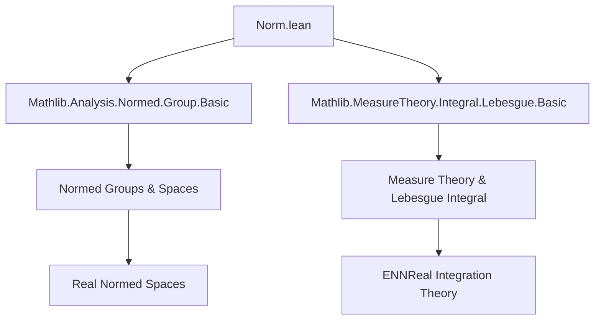

**Technical Brief: `Norm.lean` — Interactions between Lebesgue Integral and Norms**

---

### 1. **Key Definitions & Theorems**

| Name | Type / Signature | Purpose |
|------|------------------|---------|
| `lintegral_ofReal_le_lintegral_enorm` | `∀ f : α → ℝ, ∫⁻ x, ENNReal.ofReal (f x) ∂μ ≤ ∫⁻ x, ‖f x‖ₑ ∂μ` | Shows that integrating the nonnegative extension (`ofReal`) of a real-valued function is bounded above by integrating its extended norm (`‖·‖ₑ`). |
| `lintegral_enorm_of_ae_nonneg` | `∀ f : α → ℝ, 0 ≤ᵐ[μ] f → ∫⁻ x, ‖f x‖ₑ ∂μ = ∫⁻ x, .ofReal (f x) ∂μ` | Equates the integral of the extended norm with `ofReal` when the function is almost everywhere nonnegative. |
| `lintegral_enorm_of_nonneg` | `∀ f : α → ℝ, 0 ≤ f → ∫⁻ x, ‖f x‖ₑ ∂μ = ∫⁻ x, .ofReal (f x) ∂μ` | Special case of the above for *everywhere* nonnegative functions (via `of_forall`). |

**Auxiliary notation used**:
- `‖f x‖ₑ`: Extended norm on `ℝ`, defined as `ENNReal.ofReal (|f x|)`.
- `ENNReal.ofReal`: Embedding `ℝ≥0` into `ENNReal`.
- `0 ≤ᵐ[μ] f`: “$f$ is nonnegative $\mu$-almost everywhere”.

---

### 2. **Naming Conventions**

- **Prefixes**:
  - `lintegral_`: Indicates the theorem involves the *Lebesgue integral* (`∫⁻`).
- **Suffixes**:
  - `_ofReal`: Refers to use of `ENNReal.ofReal`.
  - `_enorm`: Refers to the *extended norm* (`‖·‖ₑ`).
  - `_ae`: Indicates almost-everywhere conditions.
  - `_nonneg`: Indicates nonnegativity assumptions.

**Pattern**: `lintegral_<target>_<condition>`.

---

### 3. **Tactic Stack**

Frequently used tactics in this file:

| Tactic | Role |
|--------|------|
| `simp_rw` | Rewriting using definitional equalities (e.g., `← ofReal_norm_eq_enorm`). |
| `refine` / `exact` | Construct proofs via intermediate lemmas or direct application. |
| `filter_upwards` | Handles almost-everywhere reasoning (e.g., deducing equality a.e. from pointwise equality on a full-measure set). |
| `rw` | Standard rewriting (e.g., `Real.norm_eq_abs`, `Real.enorm_eq_ofReal`). |
| `exact` / `apply` | Used for applying lemmas or hypotheses directly. |

No heavy automation (e.g., `aesop`, `linarith`) is used—proofs are mostly definitional and rely on measure-theoretic properties.

---

### 4. **Proof Logic**

- **Structure**:
  1. **Reduction to pointwise inequality** (via `lintegral_mono`).
  2. **Use of `ofReal_norm_eq_enorm`** to relate norm and `ofReal`.
  3. **Elementary real analysis**: `le_abs_self` (i.e., $x ≤ |x|$) for the inequality case.
  4. **Almost-everywhere reasoning**:
     - For equality, use `lintegral_congr_ae` + `enorm_eq_ofReal` on the almost-everywhere nonnegative set.
  5. **Lift pointwise nonnegativity to a.e.** via `of_forall`.

- **Flow**:
  > *Start with pointwise inequality → lift to integral inequality*  
  > *For equality, show integrands agree a.e. → apply congruence of integrals.*

---

### 5. **Imports**

| Import | Purpose |
|--------|---------|
| `Mathlib.Analysis.Normed.Group.Basic` | Provides `‖·‖ₑ`, normed group structure, basic norm properties (e.g., `Real.enorm_eq_ofReal`, `Real.norm_eq_abs`). |
| `Mathlib.MeasureTheory.Integral.Lebesgue.Basic` | Defines the Lebesgue integral (`∫⁻`), `ENNReal.ofReal`, and basic properties like `lintegral_mono`, `lintegral_congr_ae`. |

---

### 6. **Mermaid Diagrams**

#### **Dependency Graph (Module-Level)**



#### **Overview of Theoretical Flow**

```mermaid
flowchart LR
  subgraph Definitions
    D1[Real Norm = |·|]
    D2[Extended Norm ‖·‖ₑ]
    D3[ENNReal.ofReal]
    D4[Almost-everywhere ≤]
  end

  subgraph Theorems
    T1[lintegral_ofReal_le_lintegral_enorm]
    T2[lintegral_enorm_of_ae_nonneg]
    T3[lintegral_enorm_of_nonneg]
  end

  D1 -->|def| D2
  D2 -->|def| D3
  D4 -->|used in| T2
  T1 -->|uses| D2 & D3
  T2 -->|uses| D2 & D3 & D4
  T3 -->|reduces to| T2
```

---

### 7. **Domain & Scope**

- **Domain**: Measure theory + functional analysis (normed spaces over `ℝ`).
- **Scope**: Bridges real-valued functions, their absolute value/norm, and integration in the extended nonnegative reals (`ENNReal`).  
- **Use case**: Foundational for defining $L^p$ spaces, Bochner integration, and normed function spaces in `Mathlib`.

--- 

Let me know if you'd like a formalized dependency graph of the `Mathlib` modules involved or a proof sketch in natural deduction style.
