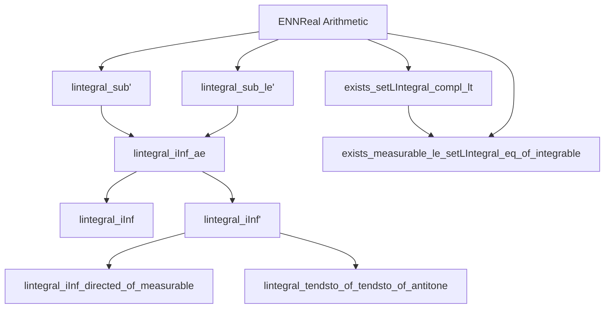
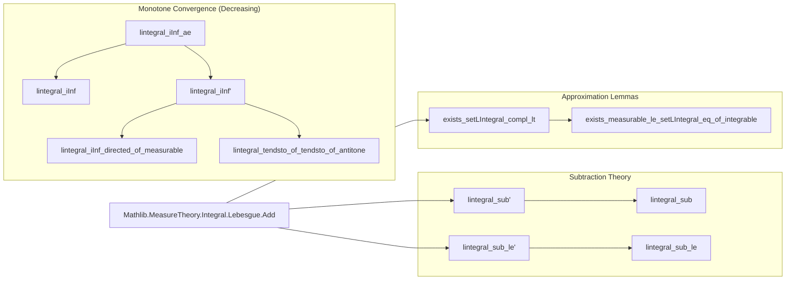

### Technical Brief: Subtraction of Lebesgue Integrals in Lean 4 (`Sub.lean`)

---

#### **1. Key Definitions & Theorems**

| Name | Type | Purpose |
|------|------|---------|
| `lintegral_sub'` | `(hg : AEMeasurable g μ) → (hg_fin : ∫⁻ g ∂μ ≠ ∞) → (h_le : g ≤ᵐ[μ] f) → ∫⁻ (f - g) ∂μ = ∫⁻ f ∂μ - ∫⁻ g ∂μ` | Equality of integral of difference and difference of integrals for a.e. measurable `g`, finite integral, and `g ≤ f` a.e. |
| `lintegral_sub` | `(hg : Measurable g) → (hg_fin : ∫⁻ g ∂μ ≠ ∞) → (h_le : g ≤ᵐ[μ] f) → ∫⁻ (f - g) ∂μ = ∫⁻ f ∂μ - ∫⁻ g ∂μ` | Measurable version of `lintegral_sub'` (uses `aemeasurable` coercion). |
| `lintegral_sub_le'` | `(hf : AEMeasurable f μ) → ∫⁻ g ∂μ - ∫⁻ f ∂μ ≤ ∫⁻ (g - f) ∂μ` | Subadditivity inequality: difference of integrals ≤ integral of difference (no ordering assumption). |
| `lintegral_sub_le` | `(hf : Measurable f) → ∫⁻ g ∂μ - ∫⁻ f ∂μ ≤ ∫⁻ (g - f) ∂μ` | Measurable version of `lintegral_sub_le'`. |
| `lintegral_iInf_ae` | `(∀ n, Measurable (f n)) → (∀ n, f n.succ ≤ᵐ[μ] f n) → (∫⁻ f 0 ∂μ ≠ ∞) → ∫⁻ (⨅ n, f n) ∂μ = ⨅ n, ∫⁻ f n ∂μ` | Monotone Convergence Theorem (MCT) for *nonincreasing* sequences (a.e.), with finite initial integral. |
| `lintegral_iInf` | `(∀ n, Measurable (f n)) → (Antitone f) → (∫⁻ f 0 ∂μ ≠ ∞) → ∫⁻ (⨅ n, f n) ∂μ = ⨅ n, ∫⁻ f n ∂μ` | MCT for *strictly* antitone sequences (everywhere). |
| `lintegral_iInf'` | `(∀ n, AEMeasurable (f n) μ) → (∀ᵐ a ∂μ, Antitone (f · a)) → (∫⁻ f 0 ∂μ ≠ ∞) → ∫⁻ (⨅ n, f n) ∂μ = ⨅ n, ∫⁻ f n ∂μ` | A.e. version of MCT for antitone sequences (uses `aeSeq` construction). |
| `lintegral_iInf_directed_of_measurable` | `[Countable β] → (μ ≠ 0) → (∀ b, Measurable (f b)) → (∀ b, ∫⁻ f b ∂μ ≠ ∞) → (Directed (≥) f) → ∫⁻ (⨅ b, f b) ∂μ = ⨅ b, ∫⁻ f b ∂μ` | MCT for infima over *directed* families indexed by countable types. |
| `lintegral_tendsto_of_tendsto_of_antitone` | `(∀ n, AEMeasurable (f n) μ) → (∀ᵐ x, Antitone (f · x)) → (∫⁻ f 0 ∂μ ≠ ∞) → (∀ᵐ x, f n x → F x) → ∫⁻ f n ∂μ → ∫⁻ F ∂μ` | Continuity of integral under pointwise a.e. convergence + antitone sequences. |
| `exists_setLIntegral_compl_lt` | `(∫⁻ f ∂μ ≠ ∞) → (ε ≠ 0) → ∃ s, MeasurableSet s ∧ μ s < ∞ ∧ ∫⁻[sᶜ] f ∂μ < ε` | Approximation of integrable functions by functions supported on finite-measure sets. |
| `exists_measurable_le_setLIntegral_eq_of_integrable` | `(∫⁻ f ∂μ ≠ ∞) → ∃ g ≤ f, Measurable g, ∀ s, ∫⁻[s] f = ∫⁻[s] g` | Existence of measurable minorant with identical integrals over all measurable sets. |

---

#### **2. Naming Conventions**

- **Prefixes**:
  - `lintegral_`: All theorems pertain to the *nonnegative extended real-valued* Lebesgue integral (`∫⁻`).
  - `ae_`: Pertains to *almost everywhere* statements (e.g., `aemeasurable`, `ae_of_all`, `aeSeq`).
  - `sub_`: Pertains to subtraction properties of integrals.
  - `iInf_`: Pertains to infima over countable/indexed families (monotone convergence for decreasing sequences/families).
- **Suffixes**:
  - `'` (prime): Usually denotes a more general or a.e.-based variant (e.g., `lintegral_sub'` vs `lintegral_sub`).
  - `directed_of_measurable`: Indicates use of directedness + measurability assumptions.
- **Other**:
  - `tendsto_of_tendsto_of_antitone`: Combines convergence and monotonicity.

---

#### **3. Tactic Stack**

| Tactic | Usage Frequency | Purpose |
|--------|-----------------|---------|
| `rw` | High | Rewriting equalities (especially `lintegral_congr_ae`, `tsub_add_cancel_of_le`, `ENNReal.sub_iInf`, etc.). |
| `exact` / `apply` | High | Applying lemmas like `lintegral_sub`, `ENNReal.eq_sub_of_add_eq`, `le_antisymm`. |
| `gcongr` | Medium | Generalized congruence for inequalities (e.g., in `lintegral_sub_le'`, `exists_setLIntegral_compl_lt`). |
| `simp_rw` | Medium | Simplifying with rewrite rules (e.g., `simp_rw [← iInf_apply]`). |
| `aesop` | Low | Not used here — proofs are mostly constructive and rely on `ENNReal` arithmetic. |
| `ring` / `linarith` | Low | Rarely needed; arithmetic handled via `ENNReal` lemmas. |
| `filter_upwards` | Medium | For a.e. statements (e.g., in `lintegral_tendsto_of_tendsto_of_antitone`). |
| `induction` | Medium | Structural induction on `ℕ` (e.g., in `lintegral_iInf'`). |
| `congr` / `congr_arg` | Medium | Proving equality of expressions (e.g., `congr rfl (funext ...)`). |
| `calc` | High | Structured chain of equalities/inequalities (e.g., in `lintegral_iInf_ae`). |

---

#### **4. Proof Logic**

- **Core Strategy**: Reduce subtraction identities to additive ones using `ENNReal` arithmetic (e.g., `ENNReal.eq_sub_of_add_eq`, `sub_right_inj`).
- **Induction & Approximation**:
  - For MCT variants, proofs often:
    1. Use `lintegral_sub` to rewrite `∫ (f₀ - fₙ)` as `∫ f₀ - ∫ fₙ`.
    2. Express `f₀ - fₙ` as `⨆ₖ (f₀ - fₖ)` (via `ENNReal.sub_iInf`).
    3. Apply `lintegral_iSup_ae` (MCT for increasing sequences) to swap `∫` and `⨆`.
    4. Use `ENNReal.sub_iInf` again to get back to `∫ f₀ - ⨅ₙ ∫ fₙ`.
- **A.E. Handling**:
  - Use `ae_of_all` to lift pointwise facts to a.e. facts.
  - Use `aeSeq` to construct a measurable sequence agreeing a.e. with a given a.e. sequence.
- **Finite Integral Assumption**:
  - Crucial for subtraction: `∫ g ≠ ∞` ensures `∫ f - ∫ g` is defined in `ℝ≥0∞`.
  - Used in `ne_top_of_le_ne_top`, `sub_right_inj`, etc.

---

#### **5. Imports**

- `Mathlib.MeasureTheory.Integral.Lebesgue.Add`: Core theory of Lebesgue integral for nonnegative functions (`∫⁻`), including:
  - Measurability (`AEMeasurable`, `Measurable`)
  - Integral properties (`lintegral_add_right'`, `lintegral_mono`, `lintegral_congr_ae`)
  - Monotone convergence for *increasing* sequences (`lintegral_iSup_ae`, `lintegral_iSup`)

> **Note**: This file builds on `Add.lean`, extending it to subtraction and decreasing sequences.

---

#### **6. Mermaid Diagrams**

##### **Dependency Graph (Theorems)**

##### **Overview of File Structure**

---

#### **7. Domain-Specific AI Agent Insights**

- **Key Reasoning Patterns**:
  - *Subtraction via addition*: Always try to convert `∫ (f - g)` to `∫ f - ∫ g` using `lintegral_sub`.
  - *Finite integral is essential*: Check `∫ f 0 ≠ ∞` before applying MCT for decreasing sequences.
  - *A.E. → everywhere*: Use `aeSeq` to lift a.e. monotonicity to a measurable sequence.
- **Common Pitfalls**:
  - `∞ - ∞` is undefined in `ℝ≥0∞`; lemmas require `∫ g ≠ ∞`.
  - `g ≤ f` a.e. is needed for `lintegral_sub`, not just `g ≤ f`.
- **Suggested Tactics for Automation**:
  - `rw [lintegral_sub]` when `g ≤ᵐ[μ] f` and `∫ g ≠ ∞`.
  - `rw [lintegral_sub_le]` for inequality goals.
  - `apply lintegral_iInf_ae` when dealing with decreasing sequences.

--- 

Let me know if you'd like a formalized tactic automation script or a proof sketch generator for this theory.
