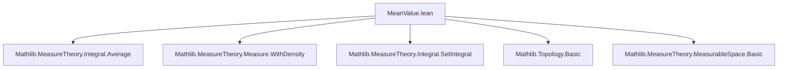
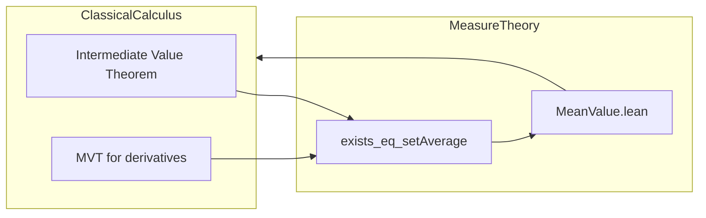

**Technical Brief: `MeanValue.lean` — First Mean Value Theorem for Set Integrals**

---

### 1. KEY DEFINITIONS & THEOREMS

| Name | Type / Signature | Purpose |
|------|------------------|---------|
| `ρ` (local def) | `ρ := fun x ↦ ENNReal.ofReal (g x)` | Construct an extended nonnegative real-valued density from `g` to define a new measure `ν = μ.withDensity ρ`. |
| `ν` (local def) | `ν := μ.withDensity ρ` | New measure absolutely continuous w.r.t. `μ`, used to transform the weighted integral `∫ f * g ∂μ` into an unweighted integral `∫ f ∂ν`. |
| `exists_eq_const_mul_setIntegral_of_ae_nonneg` | `theorem` | First mean value theorem under *almost everywhere* nonnegativity of `g` on `s`. Guarantees existence of `c ∈ s` such that $\int_s f g \, d\mu = f(c) \cdot \int_s g \, d\mu$. |
| `exists_eq_const_mul_setIntegral_of_nonneg` | `theorem` | Pointwise version of the above, assuming $g(x) \ge 0$ for all $x \in s$. Reduces to the a.e. version via `ae_of_all`. |

---

### 2. NAMING CONVENTIONS

- **Prefixes**:
  - `exists_eq_const_mul_...`: Indicates existence of a point where the integral factorizes as a constant (`f c`) times a scalar (`∫ g`).
  - `setIntegral_...`: Refers to integrals over a *set* `s`, not the whole space.
- **Suffixes**:
  - `_of_ae_nonneg`: Hypothesis uses *a.e.* nonnegativity.
  - `_of_nonneg`: Hypothesis uses *pointwise* nonnegativity.
- **Helper variable names**:
  - `ρ`, `ν`: Standard notation for density and induced measure.
  - `hν0`, `hν0'`, `hν0''`: Chain of equivalent nonzero/finiteness conditions on `ν s`.

---

### 3. TACTIC STACK

| Tactic | Usage Frequency | Purpose |
|--------|-----------------|---------|
| `calc` | High | Chain equalities in multi-step algebraic/analytic derivations. |
| `simp` / `simp only` | Very High | Simplify goals using definitional equalities, `integral_const`, `setAverage_eq`, etc. |
| `rw` | High | Rewrite using lemmas like `setIntegral_withDensity_eq_setIntegral_toReal_smul₀`, `integral_congr_ae`. |
| `field_simp` | Medium | Simplify field expressions (e.g., division by nonzero reals). |
| `have`, `rcases`, `obtain` | High | Introduce intermediate facts or extract witnesses from existential statements. |
| `intro`, `apply`, `exact` | Medium | Standard proof scripting. |
| `aesop` | Not present | Not used — this proof is highly constructive and measure-theoretic. |
| `rwa`, `rfl` | Medium | Rewriting with assumptions or reflexivity. |

---

### 4. PROOF LOGIC

**High-level structure** (for `exists_eq_const_mul_setIntegral_of_ae_nonneg`):

1. **Density construction**: Define `ρ = ofReal ∘ g` and `ν = μ.withDensity ρ`.
2. **Measure-theoretic equivalences**:
   - Show `∫_s f g dμ = ∫_s f dν` and `∫_s g dμ = ∫_s 1 dν` using `setIntegral_withDensity_eq_setIntegral_toReal_smul₀`.
3. **Case split on `ν s = 0`**:
   - **Case 1 (`ν s = 0`)**:
     - Show both integrals vanish.
     - Pick any `c ∈ s` (using `hs_conn.nonempty`) — equality holds trivially.
   - **Case 2 (`ν s ≠ 0`)**:
     - Prove `f` is integrable w.r.t. `ν` using equivalence of integrability under density.
     - Apply `exists_eq_setAverage` (a version of the intermediate value theorem for averages) to get `c ∈ s` with  
       $\int_s f \, d\nu = f(c) \cdot \nu(s)$.
     - Translate back to original measure using the earlier equivalences.

**Key logical flow**:  
`Density → Change of measure → Split on total mass → Apply average theorem or trivial case`.

---

### 5. IMPORTS & DEPENDENCIES

| Module | Role |
|--------|------|
| `MeasureTheory.Integral.Average` | Provides `exists_eq_setAverage`, the core “mean value” lemma for integrals (analog of IVT for integrals). |
| `MeasureTheory.Measure.WithDensity` | Implicit via `withDensity`, `setIntegral_withDensity_eq_setIntegral_toReal_smul₀`, etc. |
| `MeasureTheory.Integral.Basic`, `MeasureTheory.Integral.SetIntegral` | Implicit via `∫ x in s, ...`, `IntegrableOn`, `aestronglyMeasurable`, `ae_restrict_iff'`. |
| `TopologicalSpace`, `MeasurableSpace` | Underlying typeclass context for continuity (`ContinuousOn`) and measurability. |

---

### 6. MERMAID DIAGRAMS

#### Dependency Graph (Module-Level)



#### Proof Structure Overview

```mermaid
flowchart TD
  Start[Assumptions: s connected, measurable, f continuous, g integrable, f·g integrable, g ≥ 0 a.e.] --> BuildDensity[Define ρ = ofReal ∘ g, ν = μ.withDensity ρ]
  BuildDensity --> Equiv1[Show ∫ f g dμ = ∫ f dν]
  BuildDensity --> Equiv2[Show ∫ g dμ = ∫ 1 dν]
  Equiv1 & Equiv2 --> Split{Case: ν s = 0?}
  Split -- Yes --> TrivialCase[Both integrals = 0 ⇒ pick any c ∈ s]
  Split -- No --> AvgCase[Integrability of f w.r.t. ν ⇒ apply exists_eq_setAverage]
  AvgCase --> Final[Obtain c ∈ s with ∫ f dν = f(c)·ν(s) ⇒ translate back]
  TrivialCase & Final --> End[∃ c ∈ s, ∫_s f g dμ = f(c)·∫_s g dμ]
```

#### Theory Context (Mean Value Theorems)



---

### 7. FORMULA SUMMARY

Let $s \subseteq \alpha$ be a connected measurable set, $f, g : \alpha \to \mathbb{R}$, and $\mu$ a measure.

- **Conclusion (both theorems)**:  
  $$
  \exists c \in s,\quad \int_{x \in s} f(x) g(x) \, d\mu = f(c) \cdot \int_{x \in s} g(x) \, d\mu
  $$

- **Key transformation**:  
  Define $\rho(x) = g(x)^+$ (a.e. nonnegative), $\nu = \mu \ll \rho$, then  
  $$
  \int_s f g \, d\mu = \int_s f \, d\nu,\quad \int_s g \, d\mu = \nu(s)
  $$

- **Average theorem used**:  
  $$
  \int_s f \, d\nu = f(c) \cdot \nu(s) \quad \text{if } f \text{ continuous, } \nu(s) \ne 0, \nu(s) < \infty
  $$

---

### 8. NOTES

- The proof is *constructive* in the sense of Lean’s logic (non-constructive choice only via `exists`), but relies heavily on measure-theoretic lemmas (e.g., `setIntegral_withDensity_eq_setIntegral_toReal_smul₀`).
- The pointwise version (`_of_nonneg`) is a corollary of the a.e. version via `ae_of_all`.
- No use of `classical.choice` is explicit — the witness `c` is obtained via `exists_eq_setAverage`, which itself uses connectedness and continuity.

--- 

*End of Technical Brief.*
