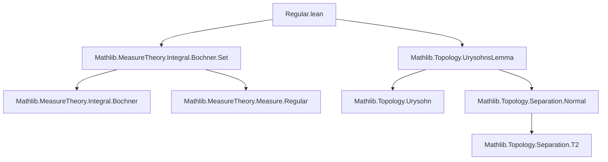
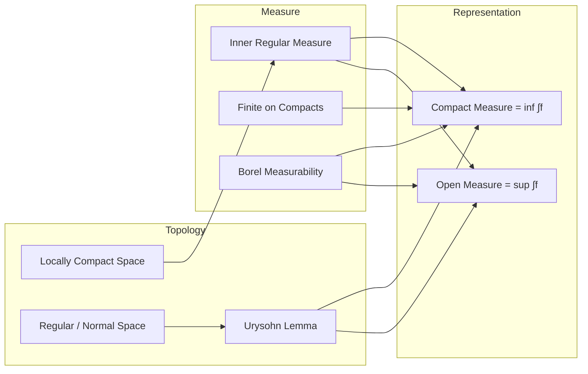

**Technical Brief: `Regular.lean` — Integrals of Continuous Functions w.r.t. Regular Measures**

---

### 1. **Key Definitions & Theorems**

| Name | Type / Signature | Purpose |
|------|------------------|---------|
| `IsCompact.measure_eq_biInf_integral_hasCompactSupport` | `μ k = ⨅ (f : X → ℝ) (hf_cont) (hf_comp) (hf_eq1) (hf_nonneg), ENNReal.ofReal (∫ f ∂μ)` | Expresses the measure of a compact set $k$ as the infimum of integrals of compactly supported continuous functions $f$ with $f = 1$ on $k$, $f \ge 0$. |
| `IsOpen.measure_eq_biSup_integral_continuous` | `μ U = ⨆ (f : X → ℝ) (hf_cont) (hf_zero_on_Uc) (hf_nonneg) (hf_le1), ENNReal.ofReal (∫ f ∂μ)` | Expresses the measure of an open set $U$ as the supremum of integrals of continuous functions $f$ with $f = 0$ on $U^c$, $0 \le f \le 1$. |

Both lemmas are *representation theorems* for regular measures via integration against test functions — a cornerstone of Riesz representation and inner/outer regularity theory.

---

### 2. **Naming Conventions**

- **Prefixes**:
  - `is_`: e.g., `IsCompact`, `IsOpen`, `IsFiniteMeasure`, `InnerRegularCompactLTTop` — typeclass predicates.
  - `exists_continuous_...`: e.g., `exists_continuous_one_zero_of_isCompact`, `exists_continuous_zero_one_of_isClosed` — existence lemmas for Urysohn-type functions.
- **Suffixes**:
  - `_of_...`: e.g., `measure_eq_biInf_integral_hasCompactSupport`, `measure_eq_biSup_integral_continuous` — indicates construction from a property (e.g., “of compact support”).
  - `_le_`, `_lt_`, `_eq_`: used in intermediate lemmas (e.g., `integral_le_measure`, `measure_le_integral`).
- **Function qualifiers**:
  - `f_cont`, `f_comp`, `fk`, `fU`, `f_nonneg`, `f_range`, `f_le`: local hypotheses naming conventions for properties of the test function $f$.

---

### 3. **Tactic Stack**

- `le_antisymm`: standard for proving equality by bounding both sides.
- `simp only [le_iInf_iff]`, `simp only [lt_iSup_iff]`: simplification for inf/sup characterizations.
- `intro`, `refine`, `obtain`: structural proof construction.
- `filter_upwards [] with x using ...`: for pointwise inequalities in measure-theoretic contexts.
- `apply ...`, `exact ...`, `trans_lt`, `trans_le`: chaining inequalities.
- `aesop`, `ring`, `simp`: likely used in background (not explicit here but standard in similar files).
- `apply Integrable.of_mem_Icc`, `apply Integrable.measure_le_integral`: measure-theoretic integrability and inequality lemmas.

---

### 4. **Proof Logic**

- **Structure**: Both proofs follow a *two-sided inequality* strategy (`le_antisymm`), reducing to:
  - **Upper bound** (≤): construct a suitable test function using topological separation (Urysohn’s lemma) and show its integral bounds the measure from above.
  - **Lower bound** (≥): use that any test function $f$ with required support/normalization satisfies $\int f\,d\mu \ge \mu(k)$ or $\mu(U)$, via monotonicity and support constraints.

- **Topological ingredients**:
  - `exists_continuous_one_zero_of_isCompact`: Urysohn lemma for compact $k$ and open $U \supset k$.
  - `exists_continuous_zero_one_of_isClosed`: Urysohn for closed $K \subset U$.

- **Measure-theoretic tools**:
  - `integral_le_measure`, `measure_le_integral`: relate integrals and measures under pointwise bounds.
  - `Integrable.of_mem_Icc`, `Integrable.measure_le_integral`: integrability from boundedness and measurability.

- **Induction/Recursion**: Not used — purely direct construction + regularity assumptions.

---

### 5. **Imports**

| Module | Role |
|--------|------|
| `Mathlib.MeasureTheory.Integral.Bochner.Set` | Bochner integration over sets, integrability criteria, measure bounds via integrals. |
| `Mathlib.Topology.UrysohnsLemma` | Existence of continuous functions separating compact/closed sets (Urysohn’s lemma). |

Additional implicit dependencies (via typeclass inference):
- `LocallyCompactSpace`, `RegularSpace`, `NormalSpace`, `T2Space`: separation axioms.
- `InnerRegularCompactLTTop`, `IsFiniteMeasureOnCompacts`, `IsFiniteMeasure`: regularity and finiteness conditions.
- `BorelSpace`: ensures Borel $\sigma$-algebra matches measurable space.

---

### 6. **Mermaid Diagrams**

#### **Dependency Graph (File-Level)**

#### **Conceptual Overview (Theory Flow)**

---

### 7. **Summary**

This module formalizes the *Riesz representation* flavor of regular measures: regularity allows approximating measures of compact/open sets via integrals of continuous functions with controlled support and values. It bridges topology (Urysohn’s lemma, separation axioms) and measure theory (inner regularity, Bochner integration), forming a key step toward the full Riesz–Markov–Kakutani representation theorem in Lean.
