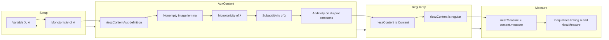

**Technical Brief: `Basic.lean` — Riesz–Markov–Kakutani Representation Theorem Preparation**

---

### 1. KEY DEFINITIONS & THEOREMS

| Name | Type / Signature | Purpose |
|------|------------------|---------|
| `rieszContentAux Λ K` | `Compacts X → ℝ≥0` | Defines a *content* on compact subsets via `λ(K) = inf {Λ f | f ≥ 1 on K}` |
| `rieszContent Λ` | `Content X` | Promotes `rieszContentAux` to a full `Content`, using monotonicity, finite subadditivity, and additivity on disjoint compacts |
| `rieszMeasure Λ` | `Measure X` | The Radon measure induced by `rieszContent Λ` via Carathéodory extension |
| `CompactlySupportedContinuousMap.monotone_of_nnreal` | `Monotone Λ` | Shows positivity of `Λ` implies monotonicity on `C_c(X, ℝ≥0)` |
| `rieszContentAux_mono` | `K₁ ⊆ K₂ → λ(K₁) ≤ λ(K₂)` | Monotonicity of the auxiliary content |
| `rieszContentAux_sup_le` | `λ(K₁ ∪ K₂) ≤ λ(K₁) + λ(K₂)` | Finite subadditivity of `λ` |
| `rieszContentAux_union` | `Disjoint K₁ K₂ → λ(K₁ ⊔ K₂) = λ(K₁) + λ(K₂)` | Additivity of `λ` on disjoint compacts (key for Carathéodory extension) |
| `contentRegular_rieszContent` | `(rieszContent Λ).ContentRegular` | Regularity of the content: inner regularity by compacts, outer regularity by opens |
| `le_rieszMeasure_of_isCompact_tsupport_subset` | `Λ f ≤ λ(K)` under support condition | Links `Λ` to the measure via test functions |
| `exists_lt_rieszContentAux_add_pos` | Approximation of `λ(K)` by `Λ f` | Key technical lemma for regularity and uniqueness proofs |

---

### 2. NAMING CONVENTIONS

- **Prefixes**:
  - `rieszContentAux_`: auxiliary content (pre-measure on compacts)
  - `rieszContent_`: full content (post-promotion)
  - `rieszMeasure_`: final measure (post-extension)
- **Suffixes**:
  - `_mono`: monotonicity
  - `_sup_le`: subadditivity over union
  - `_union`: additivity over disjoint union
  - `_le`: upper bound lemma
  - `_exists_...`: existence of approximating functions
- **Helper lemmas**:
  - `exists_continuous_add_one_of_isCompact_nnreal`: partition-of-unity style construction for bump functions
  - `monotone_of_nnreal`, `monotone_of_nonneg`: positivity ⇒ monotonicity

---

### 3. TACTIC STACK

Frequently used tactics in this file:

| Tactic | Role |
|--------|------|
| `intro`, `rintro`, `intro x hx` | Standard intro/cases for quantifiers and membership |
| `rw [← ...]`, `simp only [...]`, `simp` | Rewriting and simplification using definitional equalities |
| `apply`, `exact`, `refine` | Goal-directed proof construction |
| `gcongr`, `apply le_of_forall_pos_le_add`, `apply le_antisymm` | Inequality proofs, especially for infima/suprema |
| `cases`, `fin_cases`, `by_cases` | Case analysis on finite types or boolean conditions |
| `lift ... to ... using ...` | Lifting reals to extended nonnegative reals or NNReals |
| `apply csInf_le`, `apply le_csInf` | Working with infima in `ℝ≥0 ∪ {∞}` |
| `apply monotone_of_nnreal`, `apply rieszContentAux_le` | Reusing previously proven lemmas |
| `aesop`, `ring`, `linarith` | Not heavily used here; mostly manual inequality reasoning |
| `ext x`, `funext` | Extensionality for functions |

---

### 4. PROOF LOGIC

The logical flow follows a standard *constructive measure theory* pattern:

1. **Positivity ⇒ Monotonicity**  
   - Use `exists_add_of_le` to decompose `f₂ = f₁ + g`, then `Λ f₂ = Λ f₁ + Λ g ≥ Λ f₁`.

2. **Well-definedness of `λ(K)`**  
   - Show the set `{Λ f | f ≥ 1 on K}` is nonempty via Urysohn-type lemma (`exists_tsupport_one_of_isOpen_isClosed`), using local compactness and T₂.

3. **Monotonicity & Subadditivity of `λ`**  
   - Monotonicity: inclusion of function sets ⇒ infimum comparison.  
   - Subadditivity: approximate `λ(K₁)`, `λ(K₂)` by `Λ f₁`, `Λ f₂`, then use `f₁ + f₂` as test function for `K₁ ∪ K₂`.

4. **Additivity on Disjoint Compacts**  
   - Use partition-of-unity lemma (`exists_continuous_add_one_of_isCompact_nnreal`) to split a test function `f` for `K₁ ⊔ K₂` into `g₁ f + g₂ f`, each dominating 1 on respective compacts.

5. **Regularity**  
   - Prove inner regularity via monotonicity and approximation.  
   - Outer regularity via approximation by functions supported in open neighborhoods, using `tsupport f ⊆ V ⇒ Λ f ≤ λ(V)`.

6. **Measure Construction**  
   - Promote `rieszContentAux` to `Content`, then to `Measure` via `Content.measure`.

---

### 5. IMPORTS & SCOPE

**Primary Dependencies**:
```lean
Mathlib.MeasureTheory.Measure.Content
Mathlib.Topology.ContinuousMap.CompactlySupported
Mathlib.Topology.PartitionOfUnity
```

**Scope**:  
This file sets up the *technical foundation* for the Riesz–Markov–Kakutani representation theorem on a **locally compact Hausdorff space** `X`. It constructs a content (pre-measure) from a positive linear functional `Λ` on `C_c(X, ℝ≥0)`, proves its regularity, and defines the associated Radon measure.

**Not included here** (handled in separate files):
- Linearity over `ℝ`, `ℂ`, or `ℝ≥0` variants
- Representation theorem (`Λ f = ∫ f dμ`)
- Uniqueness of the representing measure

---

### 6. MERMAID DIAGRAMS

#### Dependency Graph (High-Level)

```mermaid
graph TD
  A[TopologicalSpace X] --> B[LocallyCompactSpace X]
  A --> C[T2Space X]
  B & C --> D[C_c(X, ℝ≥0)]
  D --> E[LinearMap Λ : C_c →ₗ[ℝ≥0] ℝ≥0]
  E --> F[rieszContentAux Λ]
  F --> G[rieszContent Λ : Content X]
  G --> H[rieszMeasure Λ : Measure X]
  H --> I[MeasureTheory.RieszMarkovKakutani.*]
  D --> J[PartitionOfUnity]
  B & C --> J
```

#### Overview of File Structure



---

### 7. SUMMARY

This file formalizes the *first half* of the Riesz–Markov–Kakutani representation theorem:  
> **Given** a positive linear functional `Λ` on `C_c(X, ℝ≥0)` over a locally compact Hausdorff space `X`,  
> **Construct** a regular Borel measure `μ` such that `Λ f = ∫ f dμ` for all `f ∈ C_c(X, ℝ≥0)`.

It does so by:
- Defining a content via infima over test functions,
- Proving it satisfies the axioms of a content (monotonicity, additivity on disjoint compacts),
- Showing it is regular,
- Extending it to a Radon measure.

The remaining steps (linearity over `ℝ`, `ℂ`, uniqueness, integral equality) are deferred to specialized files.

--- 

Let me know if you'd like the corresponding Lean code annotations or a formalization roadmap for the full theorem.
