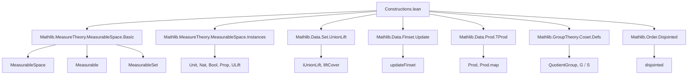
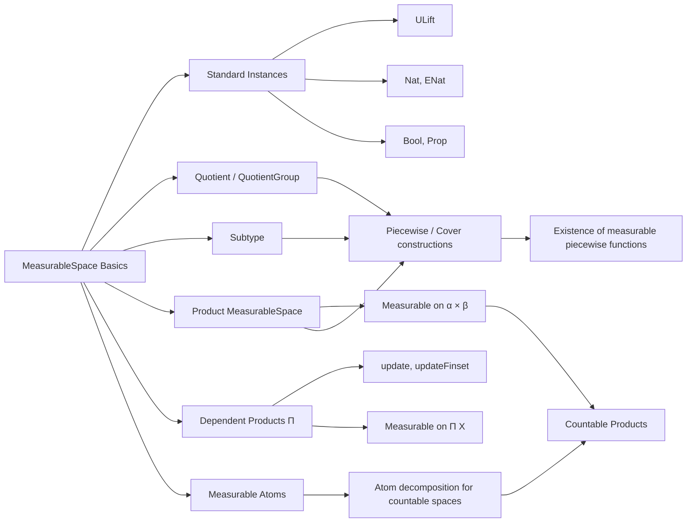

### Technical Brief: `Constructions.lean`

---

#### **1. Key Definitions & Theorems**

| Name | Type / Signature | Purpose |
|------|------------------|---------|
| `measurable_to_countable` | `[MeasurableSpace α] [Countable α] [MeasurableSpace β] → (∀ y, MeasurableSet (f ⁻¹' {f y})) → Measurable f` | Proves measurability of functions into countable spaces by checking preimages of singletons of *values*, not arbitrary points. |
| `measurable_to_countable'` | Same as above, but assumes `∀ x, MeasurableSet (f ⁻¹' {x})` | A more convenient variant: checks preimages of *all* singletons. |
| `ENat.measurable_iff` | `{f : α → ℕ∞} → Measurable f ↔ ∀ n : ℕ, MeasurableSet (f ⁻¹' {↑n})` | Characterizes measurability of extended-natural-valued functions via preimages of finite naturals. |
| `measurable_unit` | `(f : Unit → α) → Measurable f` | All functions from `Unit` are measurable. |
| `ULift.instMeasurableSpace` | `MeasurableSpace (ULift α)` | Pushforward measurable structure via `ULift.up`. |
| `measurable_down`, `measurable_up` | `Measurable (ULift.down)` and `Measurable (ULift.up)` | Equivalence of measurable structures on `α` and `ULift α`. |
| `Quot.instMeasurableSpace`, `Quotient.instMeasurableSpace` | `MeasurableSpace (Quot r)`, `MeasurableSpace (Quotient s)` | Pushforward measurable structure via quotient maps. |
| `measurableSet_quotient` | `MeasurableSet t ↔ MeasurableSet (Quotient.mk'' ⁻¹' t)` | Definition of measurable sets in quotient. |
| `measurable_from_quotient` | `Measurable f ↔ Measurable (f ∘ Quotient.mk'')` | Universal property of quotient measurability. |
| `Subtype.instMeasurableSpace` | `MeasurableSpace (Subtype p)` | Pullback measurable structure via inclusion. |
| `measurable_subtype_coe` | `Measurable ((↑) : Subtype p → α)` | Inclusion map is measurable. |
| `Measurable.subtype_mk` | `Measurable f → (∀ x, p (f x)) → Measurable fun x => ⟨f x, h x⟩` | Construct measurable maps into subtypes. |
| `measurable_find` | `(hp : ∀ x, ∃ N, p x N) → (∀ k, MeasurableSet {x | p x k}) → Measurable fun x => Nat.find (hp x)` | Measurability of `Nat.find` under measurable predicate. |
| `measurable_findGreatest` | `(∀ k ≤ N, MeasurableSet {x | p x k}) → Measurable fun x => Nat.findGreatest (p x) N` | Measurability of `Nat.findGreatest`. |
| `measurableAtom` | `β → Set β` | Intersection of all measurable sets containing a point; measurable under countability. |
| `measurableAtom_of_countable` | `[Countable β] → MeasurableSet (measurableAtom x)` | Measurable atoms are measurable in countable spaces. |
| `measurableAtom_eq_of_mem` | `x ∈ measurableAtom y → measurableAtom x = measurableAtom y` | Measurable atoms partition the space. |
| `MeasurableSpace.prod` | `MeasurableSpace α × MeasurableSpace β → MeasurableSpace (α × β)` | Product measurable space: generated by projections. |
| `measurable_fst`, `measurable_snd` | `Measurable Prod.fst`, `Measurable Prod.snd` | Projections are measurable. |
| `Measurable.prod` | `Measurable f.1 ∧ Measurable f.2 → Measurable f` | Pairing of measurable functions is measurable. |
| `measurable_from_prod_countable_left` | `[Countable β] [MeasurableSingletonClass β] → (∀ y, Measurable fun x => f (x, y)) → Measurable f` | Measurability of functions on product when second factor is countable and singletons measurable. |
| `measurable_iUnionLift`, `measurable_liftCover` | Measurability of piecewise-defined functions over countable covers. |
| `exists_measurable_piecewise` | Existence of a global measurable function agreeing with a family on a countable cover. |
| `MeasurableSpace.pi` | `∀ a, MeasurableSpace (X a) → MeasurableSpace (∀ a, X a)` | Product over dependent functions: generated by evaluation maps. |
| `measurable_pi_iff` | `Measurable g ↔ ∀ a, Measurable fun x => g x a` | Measurability of dependent functions ↔ all evaluations measurable. |
| `measurable_update'`, `measurable_update`, `measurable_updateFinset'` | Measurability of `update`, `updateFinset`, etc. | Key for measurable dependent functions with finite modifications. |
| `MeasurableSet.pi` | `[s.Countable] → (∀ i ∈ s, MeasurableSet (t i)) → MeasurableSet (s.pi t)` | Measurability of dependent products of sets. |

---

#### **2. Naming Conventions**

- **Prefixes**:
  - `measurable_`: proves `Measurable f`.
  - `measurableSet_`: proves `MeasurableSet s`.
  - `measurable_from_`, `measurable_to_`: directionality (e.g., from quotient, to countable).
  - `measurable_?_left`, `measurable_?_right`: for product/dependent cases.
  - `instMeasurableSpace`: instance definitions.
  - `of_`, `subtype_`, `quotient_`, `prod_`, `pi_`: structural origin.

- **Suffixes**:
  - `_iff`: characterizations (`↔`).
  - `_left`, `_right`: for left/right components or arguments.
  - `_mk`, `_map`, `_lift`, `_restrict`: construction patterns.
  - `_preimage`, `_image`: preimage/image lemmas.

- **Special**:
  - `measurable_find`, `measurable_findGreatest`: use of classical choice.
  - `disjointed`, `measurableAtom`: specialized constructions.

---

#### **3. Tactic Stack**

- **Core tactics**:
  - `measurability`: custom tactic for proving `Measurable` goals.
  - `simp`, `simp only`, `simp_rw`: heavy use of simplification, especially with `preimage`, `image`, `measurableSet`, `measurable`.
  - `rw [← preimage_...]`, `rw [preimage_comp]`, `rw [measurableSet_quotient]`: structural rewrites.
  - `apply_rules [...] <;> try intros`: automated rule application.
  - `convert`, `ext`, `intro`, `cases`, `by_cases`, `rcases`, `obtain`, `choose!`: standard proof scripting.
  - `exact`, `refine`, `apply`, `assumption`: basic proof steps.
  - `aesop`: not used here — lean on `measurability` and manual simplification.
  - `ring`, `linarith`: not used — no arithmetic reasoning beyond `ℕ`, `ℕ∞`.

- **Key idioms**:
  - `by measurability`: for trivial measurable goals.
  - `by simp +contextual`: for contextual simplification (e.g., `measurableAtom` simplifications).
  - `Subset.antisymm ...` for equality of sets.
  - `iInter₂_subset_of_subset`, `iUnion`, `compl`, `inter`, `diff`: set-theoretic reasoning.

---

#### **4. Proof Logic**

- **Induction**: Not used directly (no inductive types beyond `ℕ`, `Finset`, `Fin`).
- **Case analysis**:
  - On `Decidable` instances (`by_cases`, `split_ifs`).
  - On `eq_or_ne`, `eq_empty_or_nonempty`, `nonempty_or_empty`.
- **Dependent reasoning**:
  - Use of `congr_arg`, `cast`, `Equiv.piCongrLeft`, `update`, `updateFinset`.
- **Covering arguments**:
  - `measurable_of_measurable_on_compl_finite`, `of_union_cover`, `liftCover`, `iUnionLift`.
- **Atom-based decomposition**:
  - `measurableAtom`, `disjoint_measurableAtom_of_notMem`, `measurableAtom_eq_of_mem`.
- **Countability arguments**:
  - `to_countable`, `biInter`, `iUnion` over countable index sets.
- **Pullback/pushforward**:
  - `comap`, `map`, `map_comp`, `comap_le_iff_le_map`.

---

#### **5. Imports**

| Module | Purpose |
|--------|---------|
| `Mathlib.Data.Finset.Update` | `updateFinset`, `Finset.restrict`, etc. |
| `Mathlib.Data.Prod.TProd` | `TProd`, product constructions. |
| `Mathlib.Data.Set.UnionLift` | `iUnionLift`, `liftCover`, piecewise definitions. |
| `Mathlib.GroupTheory.Coset.Defs` | `QuotientGroup.measurableSpace`, `measurable_coe`. |
| `Mathlib.MeasureTheory.MeasurableSpace.Basic` | Core definitions: `MeasurableSpace`, `Measurable`, `MeasurableSet`. |
| `Mathlib.MeasureTheory.MeasurableSpace.Instances` | Standard instances: `Unit`, `Nat`, `Bool`, `Prop`, `ULift`. |
| `Mathlib.Order.Disjointed` | `disjointed`, used in `measurable_find`. |

---

#### **6. Mermaid Diagrams**

##### **Dependency Graph (High-Level)**

##### **Overview of Theory Flow**

---

#### **7. Summary**

This file provides a foundational toolkit for constructing measurable spaces and functions in Lean 4, with heavy emphasis on:

- **Quotients & subtypes** (via pushforward/pullback),
- **Products & dependent products** (via projections, evaluation, update),
- **Piecewise definitions** (via countable covers and lifts),
- **Atoms & countable decomposition** (for handling non-atomic spaces),
- **Measurability criteria** for functions into/from countable or singleton-generated spaces.

It is a central module in the `measure_theory` library, enabling higher-level constructions like product measures, conditional expectations, and stochastic processes.

--- 

Let me know if you'd like a formal dependency graph (e.g., `.dot` format) or a module dependency tree for import analysis.
