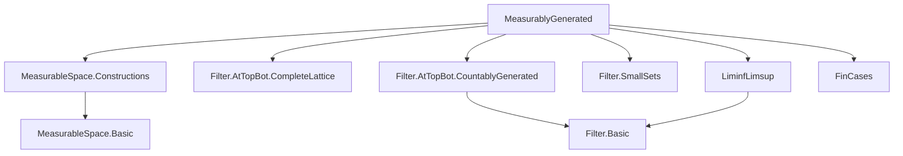
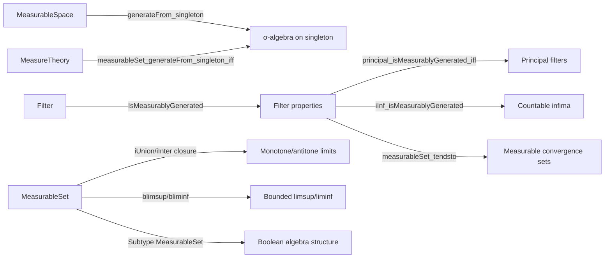

### Technical Brief: `MeasurablyGenerated.lean`

---

#### **1. Key Definitions & Theorems**

| Name | Type / Signature | Purpose |
|------|------------------|---------|
| `IsMeasurablyGenerated` | `class IsMeasurablyGenerated (f : Filter α) : Prop` | Defines that every set in filter `f` contains a measurable set from `f`. |
| `measurableSet_generateFrom_singleton_iff` | `MeasurableSet[generateFrom {s}] t ↔ t = ∅ ∨ t = s ∨ t = sᶜ ∨ t = univ` | Characterizes measurable sets in the σ-algebra generated by a singleton `{s}`. |
| `generateFrom_singleton` | `generateFrom {s} = comap (· ∈ s) ⊤` | Identifies the σ-algebra generated by a single set `s` as the pullback of the discrete σ-algebra along membership in `s`. |
| `Eventually.exists_measurable_mem` | `∀ᶠ x in f, p x → ∃ s ∈ f, MeasurableSet s ∧ ∀ x ∈ s, p x` | Extracts a measurable witness for an eventually property under `IsMeasurablyGenerated`. |
| `principal_isMeasurablyGenerated_iff` | `IsMeasurablyGenerated (𝓟 s) ↔ MeasurableSet s` | Principal filter `𝓟 s` is measurably generated iff `s` is measurable. |
| `iInf_isMeasurablyGenerated` | `[∀ i, IsMeasurablyGenerated (f i)] → IsMeasurablyGenerated (⨅ i, f i)` | Countable infimum of measurably generated filters is measurably generated. |
| `measurableSet_tendsto` | `MeasurableSet { x | Tendsto (fun n ↦ f n x) l l' }` | Convergence set of measurable functions is measurable, under countable generation and `IsMeasurablyGenerated`. |
| `MeasurableSet.iUnion_of_monotone`, `MeasurableSet.iInter_of_antitone` | Monotone/antitone sequences with frequently measurable terms have measurable unions/intersections. | Enables closure under countable monotone limits. |
| `measurableSet_limsup`, `measurableSet_liminf` | `MeasurableSet (limsup s atTop)`, `MeasurableSet (liminf s atTop)` | Standard limsup/liminf of measurable sets are measurable. |

---

#### **2. Naming Conventions**

- **Prefixes**:
  - `isMeasurablyGenerated_`: for instances/properties of the `IsMeasurablyGenerated` class.
  - `measurableSet_`: for theorems asserting measurability of sets.
  - `generateFrom_`: for constructions involving generated σ-algebras.
  - `coe_`: for coercion lemmas from `Subtype (MeasurableSet _)` to sets.

- **Suffixes**:
  - `_iff`: biconditional characterizations.
  - `_le`: inclusion lemmas (e.g., `generateFrom_singleton_le`).
  - `_iff`: equivalence characterizations (e.g., `principal_isMeasurablyGenerated_iff`).

- **Notable patterns**:
  - `iUnion`, `iInter`: indexed unions/intersections.
  - `blimsup`, `bliminf`: bounded limsup/liminf (parameterized by a predicate).
  - `compl`, `union`, `inter`, `sdiff`, `himp`: Boolean algebra operations on measurable sets.

---

#### **3. Tactic Stack**

Frequently used tactics in proofs:

| Tactic | Usage |
|--------|-------|
| `simp_rw` / `simp` | Rewriting with definitional equalities and lemmas (e.g., `generateFrom_singleton`, `compl_iff`). |
| `rcases` / `rintro` | Destructuring existential/universal hypotheses. |
| `exact`, `refine`, `apply` | Constructing proofs via known lemmas. |
| `by_cases`, `fin_cases` | Case analysis on booleans or finite types. |
| `grind` | Custom tactic (likely from Mathlib’s `Grind` module) for simplifying equality chains. |
| `rw [← ...]` | Rewriting using reverse equalities (e.g., `← blimsup_true`). |
| `convert` / `congr` | Implicitly used via `measurability` attribute. |
| `measurability` | Attribute applied to lemmas to enable automatic measurability solving. |

---

#### **4. Proof Logic**

- **Structure of proofs**:
  - **Induction / case analysis**: Often on finite types (`fin_cases`) or boolean conditions (`by_cases`).
  - **Decomposition**: Using `rcases` to unpack existential/universal quantifiers.
  - **Set-theoretic reasoning**: Exploiting lattice properties (`inter_subset_inter`, `iInter_mono`, etc.).
  - **Measurability closure**: Leveraging `MeasurableSet` closure under countable unions/intersections, complements, and preimages.
  - **Filter basis extraction**: Using `exists_antitone_basis`, `hasBasis_self`, and `smallSets` to reduce to countable bases.

- **Typical flow**:
  1. Reduce to countable operations via `IsCountablyGenerated`.
  2. Extract measurable subsets via `IsMeasurablyGenerated.exists_measurable_subset`.
  3. Apply closure properties (`iUnion`, `iInter`, `preimage`, etc.).
  4. Conclude via `measurability` or `measurableSet_` lemmas.

---

#### **5. Imports**

| Module | Role |
|--------|------|
| `Mathlib.MeasureTheory.MeasurableSpace.Constructions` | Core constructions: `generateFrom`, `comap`, `MeasurableSet`. |
| `Mathlib.Order.Filter.AtTopBot.CompleteLattice` | Lattice structure of filters, especially `atTop`, `atBot`. |
| `Mathlib.Order.Filter.AtTopBot.CountablyGenerated` | Countable generation of `atTop`/`atBot`. |
| `Mathlib.Order.Filter.SmallSets` | Theory of `f.smallSets`, used in `Eventually.exists_measurable_mem_of_smallSets`. |
| `Mathlib.Order.LiminfLimsup` | Definitions and properties of liminf/limsup for filters. |
| `Mathlib.Tactic.FinCases` | For case analysis on finite types (e.g., `True`, `False`). |

---

#### **6. Mermaid Diagrams**

##### **Dependency Graph (High-Level)**

##### **Overview of File Structure**

---

#### **7. Theory Context**

This file formalizes the notion of **measurably generated filters**, a key technical device in measure theory to ensure that “eventually” statements can be witnessed by measurable sets. It connects:

- **Filter theory** (`IsMeasurablyGenerated`, `smallSets`, `tendsto`)
- **Measurable space constructions** (`generateFrom`, `comap`)
- **Countable generation** (`IsCountablyGenerated`, `atTop`)
- **Boolean algebra of measurable sets** (`Subtype (MeasurableSet _)`)

It serves as a foundational module for:
- Measurable selection theorems
- Almost-everywhere properties with measurable witnesses
- Integration theory where measurable approximations are needed

The `measurableSet_tendsto` lemma is especially important for proving that pointwise limits of measurable functions are measurable, under appropriate conditions.

--- 

Let me know if you'd like a formalized dependency graph in `leanpkg` format or a visualization of the `Subtype MeasurableSet` Boolean algebra structure.
