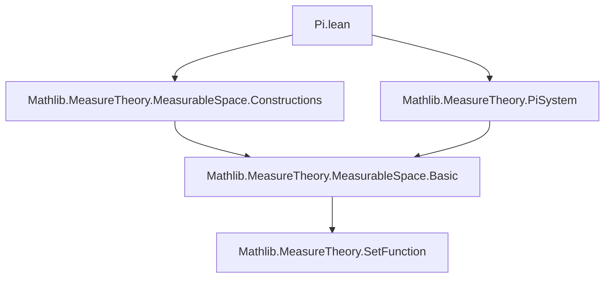
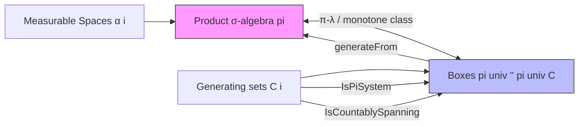

**Technical Brief: `Pi.lean` — Bases of the Indexed Product σ-Algebra**

---

### 1. **Key Definitions & Theorems**

| Name | Type / Statement | Purpose |
|------|------------------|---------|
| `pi_eq_generateFrom_projections` | `pi = generateFrom {B | ∃ i A, MeasurableSet A ∧ eval i ⁻¹' A = B}` | Shows the product σ-algebra is generated by cylinder sets (preimages of measurable sets under projections). |
| `IsPiSystem.pi` | `∀ i, IsPiSystem (C i) → IsPiSystem (pi univ '' pi univ C)` | Boxes formed from π-systems form a π-system. |
| `isPiSystem_pi` | `IsPiSystem (pi univ '' pi univ fun i => { s | MeasurableSet s })` | Special case: measurable rectangles form a π-system. |
| `IsCountablySpanning.pi` | `∀ i, IsCountablySpanning (C i) → IsCountablySpanning (pi univ '' pi univ C)` | Boxes from countably spanning families remain countably spanning (key for second-countability arguments). |
| `generateFrom_pi_eq` | `(@MeasurableSpace.pi _ _ fun i => generateFrom (C i)) = generateFrom (pi univ '' pi univ C)` | Main theorem: product of generated σ-algebras equals σ-algebra generated by boxes, under countable spanning assumption. |
| `generateFrom_eq_pi` | `generateFrom (pi univ '' pi univ C) = MeasurableSpace.pi` | Corollary when each `generateFrom (C i)` equals the given σ-algebra. |
| `generateFrom_pi` | `generateFrom (pi univ '' pi univ fun i => { s | MeasurableSet s }) = MeasurableSpace.pi` | Product σ-algebra is generated by measurable rectangles (standard result). |

---

### 2. **Naming Conventions**

- **Prefixes**:
  - `pi_`: relates to product constructions (`pi`, `pi_eq_generateFrom_projections`, `pi_univ`, `pi_inter_distrib`).
  - `generateFrom_`: for results about σ-algebras generated from sets (`generateFrom_pi_eq`, `generateFrom_eq_pi`, `generateFrom_pi`).
- **Suffixes**:
  - `_eq`: equality lemmas (`pi_eq_generateFrom_projections`, `generateFrom_pi_eq`).
  - `_pi`: product-specific variants (`isPiSystem_pi`, `generateFrom_pi`).
- **Helper notation**:
  - `pi univ '' pi univ C`: image of boxes over `univ` (full index set), used consistently.

---

### 3. **Tactic Stack**

Frequent tactics used in proofs:

| Tactic | Role |
|--------|------|
| `simp_rw` | Rewriting with simplification (e.g., rewriting `pi`, `eval_preimage`, `iUnion_univ_pi`). |
| `grind` | Automated closing of measurable set membership goals (used in `generateFrom_pi_eq` proof). |
| `intro`, `rintro`, `cases`, `by_cases` | Standard intro/case analysis. |
| `ext` | Extensionality for set equality. |
| `apply`, `rw`, `apply measurableSet_generateFrom`, `apply MeasurableSet.iUnion` | Measurability reasoning. |
| `exact`, `refine`, `apply le_antisymm` | Proof structure (especially for equality of σ-algebras). |
| `classical` | Used to assume choice for encodability arguments. |

---

### 4. **Proof Logic**

The logical flow of the main results follows a standard pattern for generating σ-algebras:

1. **π-System Argument**:
   - Show boxes form a π-system (`IsPiSystem.pi`, `isPiSystem_pi`).
2. **Countable Spanning**:
   - Show boxes from countably spanning families remain countably spanning (`IsCountablySpanning.pi`).
3. **Inclusion via Monotone Class / π-λ Theorem**:
   - Prove inclusion both ways:
     - `≤`: Show each generator of the product σ-algebra (cylinders) is measurable w.r.t. boxes → use `comap_generateFrom`, `iUnion`, `update`, `iUnion_univ_pi`.
     - `≥`: Show boxes are measurable in the product σ-algebra → use `univ_pi_eq_iInter`, `MeasurableSet.iInter`, `measurable_pi_apply`.
4. **Equality**:
   - Conclude via `le_antisymm`.
5. **Special Cases**:
   - Derive corollaries for standard measurable rectangles (`generateFrom_pi`), using `generateFrom_measurableSet` and `isCountablySpanning_measurableSet`.

Induction is not used; instead, the finite-index assumption (`[Finite ι]`) enables direct manipulation of finite products and encodability of `ι → ℕ`.

---

### 5. **Imports**

| Import | Purpose |
|--------|---------|
| `Mathlib.MeasureTheory.MeasurableSpace.Constructions` | Basic constructions on measurable spaces (e.g., `pi`, `comap`, `generateFrom`). |
| `Mathlib.MeasureTheory.PiSystem` | Theory of π-systems and their role in σ-algebra generation (e.g., `IsPiSystem`, `piSystem_measurableSet`). |

---

### 6. **Mermaid Diagrams**

#### **Dependency Graph (Module-Level)**



#### **Overview of Theoretical Flow**



#### **Proof Structure of `generateFrom_pi_eq`**

```mermaid
graph TD
  A[Assume: ∀ i, IsCountablySpanning (C i)] --> B[Show: pi = generateFrom boxes]
  B --> C[≤: boxes ⊆ pi]
  B --> D[≥: pi ⊆ generateFrom boxes]
  C --> C1[eval i ⁻¹' A = univ_pi (update ...)]
  C1 --> C2[MeasurableSet.iUnion]
  C2 --> C3[mem_image_of_mem + grind]
  D --> D1[univ_pi_eq_iInter]
  D1 --> D2[MeasurableSet.iInter]
  D2 --> D3[measurable_pi_apply]
  C3 & D3 --> E[le_antisymm]
```

---

### 7. **Domain-Specific AI Agent Insights**

- **Focus Area**: Measure theory, especially product σ-algebras and generation by rectangles.
- **Common Proof Patterns**:
  - Use of `pi`/`univ_pi` to encode product sets.
  - Interplay between `generateFrom`, `pi`, and `comap`.
  - Leveraging `IsPiSystem` + `IsCountablySpanning` for uniqueness of measures (via π-λ or monotone class).
- **Automation Opportunities**:
  - `grind` is heavily used for measurable set membership — could be automated further.
  - Pattern matching on `pi univ '' pi univ C` suggests a macro or tactic for box generation.
- **Key Lemmas to Cache**:
  - `generateFrom_pi_eq`
  - `generateFrom_pi`
  - `isPiSystem_pi`
  - `IsCountablySpanning.pi`

--- 

Let me know if you'd like a formalization of the π-λ theorem used implicitly here, or a tactic for generating box lemmas automatically.
