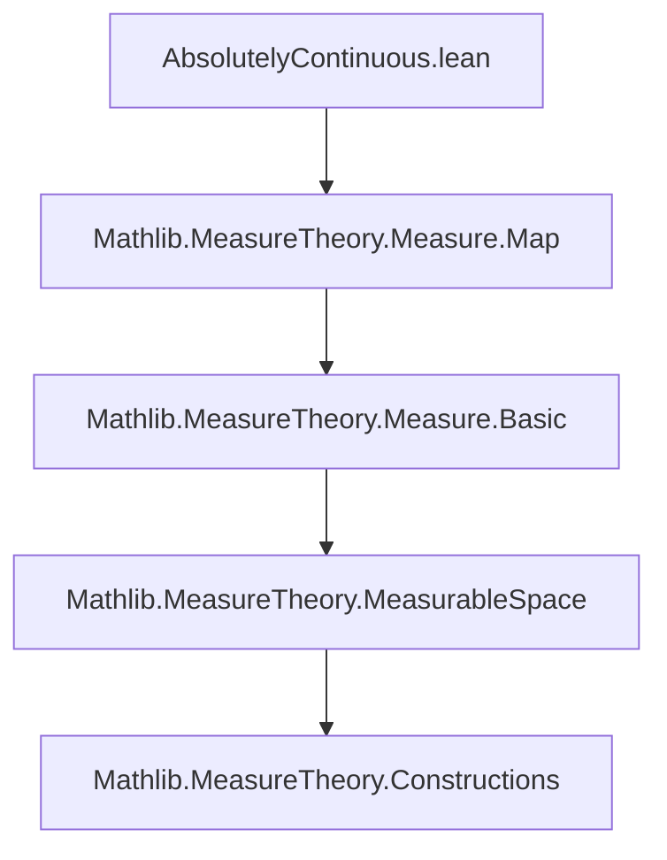
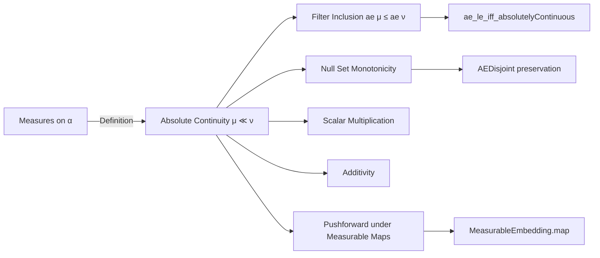
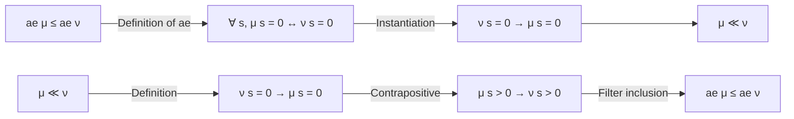

### Technical Brief: `AbsolutelyContinuous.lean`

---

#### **1. Key Definitions & Theorems**

| Name | Type | Purpose |
|------|------|---------|
| `AbsolutelyContinuous μ ν` | `Prop` | Defines absolute continuity: `μ ≪ ν` iff `∀ s, ν s = 0 → μ s = 0`. |
| `infixl " ≪ "` | `MeasureTheory.Measure.AbsolutelyContinuous` | Notation for absolute continuity. |
| `absolutelyContinuous_of_le` | `μ ≤ ν → μ ≪ ν` | Shows that measure domination implies absolute continuity. |
| `absolutelyContinuous_of_eq` | `μ = ν → μ ≪ ν` | Equality implies absolute continuity. |
| `AbsolutelyContinuous.refl` / `rfl` | `μ ≪ μ` | Reflexivity of `≪`. |
| `AbsolutelyContinuous.trans` | `μ₁ ≪ μ₂ → μ₂ ≪ μ₃ → μ₁ ≪ μ₃` | Transitivity of `≪`. |
| `AbsolutelyContinuous.map` | `μ ≪ ν → Measurable f → μ.map f ≪ ν.map f` | Pushforward preserves absolute continuity. |
| `AbsolutelyContinuous.smul_left` | `μ ≪ ν → c • μ ≪ ν` | Scalar multiplication on the left preserves absolute continuity. |
| `AbsolutelyContinuous.smul` | `μ ≪ ν → c • μ ≪ c • ν` | Scalar multiplication on both sides preserves absolute continuity (for `c ≠ 0`). |
| `AbsolutelyContinuous.add` | `μ₁ ≪ ν → μ₂ ≪ ν' → μ₁ + μ₂ ≪ ν + ν'` | Additivity of absolute continuity. |
| `add_left_iff` | `μ₁ + μ₂ ≪ ν ↔ μ₁ ≪ ν ∧ μ₂ ≪ ν` | Characterization of absolute continuity for sums. |
| `null_mono` | `μ ≪ ν → ν t = 0 → μ t = 0` | Immediate consequence of definition. |
| `pos_mono` | `μ ≪ ν → 0 < μ t → 0 < ν t` | Contrapositive of `null_mono`. |
| `ae_le_iff_absolutelyContinuous` | `ae μ ≤ ae ν ↔ μ ≪ ν` | Core equivalence linking absolute continuity to filter inclusion. |
| `AbsolutelyContinuous.ae_le` | `μ ≪ ν → ae μ ≤ ae ν` | One direction of the above equivalence. |
| `absolutelyContinuous_zero_iff` | `μ ≪ 0 ↔ μ = 0` | Characterization of absolute continuity w.r.t. zero measure. |
| `absolutelyContinuous_sum_left/right` | Summability lemmas for `≪`. | Generalizes `add` to countable sums. |
| `absolutelyContinuous_smul` | `c ≠ 0 → μ ≪ c • μ` | Inverse scalar domination. |
| `AEDisjoint.of_absolutelyContinuous` | `AEDisjoint μ s t → ν ≪ μ → AEDisjoint ν s t` | Preserves almost everywhere disjointness under domination. |
| `MeasurableEmbedding.absolutelyContinuous_map` | `MeasurableEmbedding f → μ ≪ ν → μ.map f ≪ ν.map f` | Pushforward under measurable embeddings preserves `≪`. |

---

#### **2. Naming Conventions**

- **Prefixes**:
  - `absolutelyContinuous_`: for lemmas about `≪`.
  - `null_mono`, `pos_mono`: monotonicity properties related to null sets and positivity.
  - `smul_left`, `smul`: scalar multiplication variants.
  - `add`, `add_left`, `add_right`: additive behavior.
  - `sum_left`, `sum_right`: for infinite sums.

- **Suffixes**:
  - `_iff`: characterizations involving equivalence.
  - `_rfl`, `_refl`: reflexivity lemmas.
  - `_trans`: transitivity lemmas.
  - `_mono`: monotonicity lemmas.

- **Aliases**:
  - `absolutelyContinuous_of_le`, `absolutelyContinuous_of_eq`, `ae_mono'`, etc., provide convenient back-refs.

---

#### **3. Tactic Stack**

Frequently used tactics in proofs:
- `intro`, `rcases`, `exact`, `rw`, `simp`, `simp only`, `simpa`
- `contrapose!`: for contrapositive reasoning (e.g., `pos_mono`)
- `measure_mono_null`: for reasoning about null sets
- `ENNReal.tsum_eq_zero`, `ENNReal.tsum_eq_zero_iff`: for sum-related null-set reasoning
- `nonpos_iff_eq_zero.1`: for converting inequalities to equalities in `ℝ≥0∞`
- `aesop`: likely used in automation (not explicit here, but common in Mathlib)

---

#### **4. Proof Logic**

- **Structure**:
  - Most proofs follow a *definition-first* pattern: start with `intro s hs`, then apply assumptions.
  - Use of `mk` lemma to reduce to measurable sets when needed (`exists_measurable_superset_of_null`).
  - `ENNReal` arithmetic is heavily used: `smul`, `mul_eq_zero`, `add_eq_zero`, `tsum_eq_zero`.
  - `ae_le_iff_absolutelyContinuous` is proven via `measure_eq_zero_iff_ae_notMem`, linking measure-theoretic and filter-theoretic notions.
  - Monotonicity and scalar multiplication lemmas often use `simp` + `smul` simplifications.

- **Induction/Recursion**: Not used directly; relies on structural properties of measures and `ENNReal`.

- **Case analysis**: Used in `add_left_iff`, `absolutelyContinuous_zero_iff`, and `absolutelyContinuous_smul`.

---

#### **5. Imports**

- `Mathlib.MeasureTheory.Measure.Map`: for `map`, pushforward measures.
- Core dependencies: `MeasureTheory.Measure`, `Set`, `ENNReal`, `NNReal`.

---

#### **6. Mermaid Diagrams**

##### **Dependency Graph (Module-Level)**

##### **Conceptual Overview of Theory**

##### **Proof Strategy Flow (Example: `ae_le_iff_absolutelyContinuous`)**

---

#### **7. Summary**

This file formalizes the foundational theory of absolute continuity of measures in Lean 4. It establishes:
- The core definition (`≪`) and its basic properties (reflexivity, transitivity, monotonicity).
- Interaction with measure operations: scalar multiplication, addition, pushforward, sums.
- Equivalence with filter-theoretic domination (`ae μ ≤ ae ν`).
- Applications to almost everywhere disjointness and measurable embeddings.

It serves as a foundational module for Radon–Nikodym theory, disintegration, and conditional expectation in `Mathlib`.
