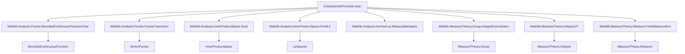
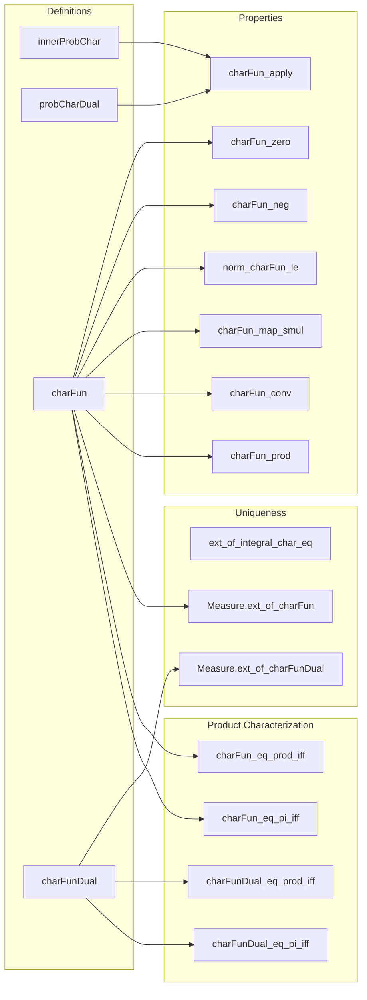

### Technical Brief: `CharacteristicFunction.lean`

---

#### **1. Key Definitions & Theorems**

| Name | Type / Signature | Purpose |
|------|------------------|---------|
| `innerProbChar` | `t : E ↦ E →ᵇ ℂ` | Bounded continuous function $x \mapsto \exp(\langle x, t \rangle \cdot i)$ in an inner product space. |
| `probCharDual` | `L : StrongDual ℝ E ↦ E →ᵇ ℂ` | Bounded continuous function $x \mapsto \exp(L(x) \cdot i)$ for a continuous linear functional $L$. |
| `charFun` | `μ : Measure E, t : E ↦ ℂ` | Characteristic function: $\int x, \exp(\langle x, t \rangle i) \, d\mu(x)$. |
| `charFunDual` | `μ : Measure E, L : StrongDual ℝ E ↦ ℂ` | Dual characteristic function: $\int x, \exp(L(x) i) \, d\mu(x)$. |
| `ext_of_integral_char_eq` | `(he : Continuous e) → (he' : e ≠ 1) → (hL' : ∀ v ≠ 0, L v ≠ 0) → (hL : Continuous L) → (∀ w, ∫ char w ∂P = ∫ char w ∂P') → P = P'` | Uniqueness of finite measures via integrals of `char`. |
| `Measure.ext_of_charFun` | `[CompleteSpace E] → [SecondCountableTopology E] → charFun μ = charFun ν → μ = ν` | Uniqueness of finite measures on complete separable inner product spaces via `charFun`. |
| `Measure.ext_of_charFunDual` | `[CompleteSpace E] → charFunDual μ = charFunDual ν → μ = ν` | Uniqueness of finite measures on Banach spaces via `charFunDual`. |
| `charFun_conv`, `charFunDual_conv` | `charFun (μ ∗ ν) t = charFun μ t * charFun ν t` | Characteristic function of convolution = product of characteristic functions. |
| `charFun_prod`, `charFunDual_prod` | `charFun (μ.prod ν) t = charFun μ t₁ * charFun ν t₂` | Characteristic function of product measure = product of characteristic functions (Hilbert/Banach versions). |
| `charFun_eq_prod_iff`, `charFunDual_eq_prod_iff` | Equivalence between factorization of `charFun`/`charFunDual` and being a product measure. | Characterization of product measures via factorization of characteristic functions. |

---

#### **2. Naming Conventions**

- **Prefixes**:
  - `innerProbChar`: `inner` + `Prob` (probability-like exponential) + `Char` (character).
  - `probCharDual`: `prob` (probability exponential) + `Char` + `Dual` (dual space argument).
  - `charFun`, `charFunDual`: `char` + `Fun`ction (standard abbreviation for characteristic function).
- **Suffixes**:
  - `_apply`: Lemma stating definition evaluation on arguments.
  - `_zero`: Simplification at zero argument.
  - `_neg`, `_map`, `_conv`, `_prod`, `_pi`: Behavior under negation, pushforward, convolution, product, and pi-product.
  - `_eq_iff`: Equivalence between functional property and structural property (e.g., product measure).
- **Pattern**:
  - `charFun` for inner product spaces (Hilbert), `charFunDual` for general Banach spaces.
  - `_map_smul`, `_map_add_const`, `_map_const_add`: pushforward behavior under linear/affine maps.

---

#### **3. Tactic Stack**

Frequent tactics used:
- `simp` / `simp_rw`: Simplification with definitional equalities, especially for integrals, exponentials, inner products.
- `rw`: Rewriting using lemmas like `charFun_apply`, `integral_map`, `integral_dirac`.
- `congr`: Congruence for functional equality (e.g., in `charFun_map_add_const`).
- `exact`, `refine`, `apply`: Goal-directed proof construction.
- `fun_prop`, `measurable_set_preimage`, `aestronglyMeasurable`: Measurability/continuity propagation.
- `integral_map`, `integral_conv`, `integral_dirac`, `integral_prod_mul`: Integral calculus lemmas.
- `ring`, `norm_num`: Algebraic simplification in ℂ or ℝ.
- `ext_of_integral_char_eq` uses `ext_of_forall_mem_subalgebra_integral_eq_of_pseudoEMetric_complete_countable` (advanced uniqueness lemma).
- `funext`, `funext_iff`: Functional extensionality.

---

#### **4. Proof Logic**

- **Uniqueness proofs** (`ext_of_integral_char_eq`, `Measure.ext_of_charFun`, `Measure.ext_of_charFunDual`):
  1. Reduce to equality of integrals over a separating class (e.g., `charPoly` or `innerProbChar`).
  2. Use linearity of integral to reduce to finite sums.
  3. Apply hypothesis that integrals agree on all `char` functions.
  4. Conclude via measure extension theorems.

- **Product/convolution properties**:
  - Use `integral_conv`, `integral_prod_mul`, `integral_fintype_prod_eq_prod`.
  - Apply exponential addition law: `exp(a + b) = exp(a) * exp(b)`.
  - Use bilinearity of inner product or evaluation map.

- **Pushforward/affine transformations**:
  - Use `integral_map` + algebraic simplifications (`inner_smul_right`, `inner_add_left`).
  - Often combine with `congr` + `ring` to match target expressions.

- **Measurability/continuity**:
  - `fun_prop`, `measurable_charFun`, `stronglyMeasurable_charFun`: Propagate structure via `fun_prop` and known lemmas.

---

#### **5. Imports**

| Module | Purpose |
|--------|---------|
| `Mathlib.Analysis.Fourier.BoundedContinuousFunctionChar` | `char`, `bounded continuous characters`, `probChar`. |
| `Mathlib.Analysis.Fourier.FourierTransform` | `VectorFourier.fourierIntegral`, Fourier integral framework. |
| `Mathlib.Analysis.InnerProductSpace.Dual` | `toDualMap`, Riesz representation, dual pairing. |
| `Mathlib.Analysis.InnerProductSpace.ProdL2` | `WithLp 2`, `toLp`, product structure in Hilbert spaces. |
| `Mathlib.Analysis.Normed.Lp.MeasurableSpace` | Measurable structure on `Lp` spaces. |
| `Mathlib.MeasureTheory.Group.IntegralConvolution` | Convolution of measures, `integral_conv`. |
| `Mathlib.MeasureTheory.Integral.Pi` | Integrals over product spaces (`fintype`, `Pi`), `integral_fintype_prod_eq_prod`. |
| `Mathlib.MeasureTheory.Measure.FiniteMeasureExt` | Uniqueness lemmas for finite measures (e.g., `ext_of_forall_mem_subalgebra_integral_eq_of_pseudoEMetric_complete_countable`). |

---

#### **6. Mermaid Diagrams**

##### **Dependency Graph (High-Level)**

##### **Overview of Theory Flow**

---

#### **7. Domain-Specific AI Agent Insights**

- **Primary domain**: Probability theory on topological vector spaces, especially characteristic functions and measure uniqueness.
- **Key mathematical themes**:
  - Fourier analysis on locally compact abelian groups (via additive characters).
  - Duality theory (Riesz representation, strong dual).
  - Measure-theoretic uniqueness via integral transforms.
  - Product structure (Hilbert vs Banach).
- **Common proof patterns**:
  - Reduce to known uniqueness theorems (`ext_of_integral_char_eq`).
  - Use exponential algebra and bilinearity to factor integrals.
  - Leverage `fun_prop` and `measurable` infrastructure for technical lemmas.
- **Critical lemmas for automation**:
  - `charFun_eq_integral_innerProbChar`, `charFunDual_apply`, `charFun_map_smul`, `charFun_conv`, `Measure.ext_of_charFun`.

--- 

Let me know if you'd like a ** tactic inference model ** or ** lemma recommendation engine ** built from this metadata.
