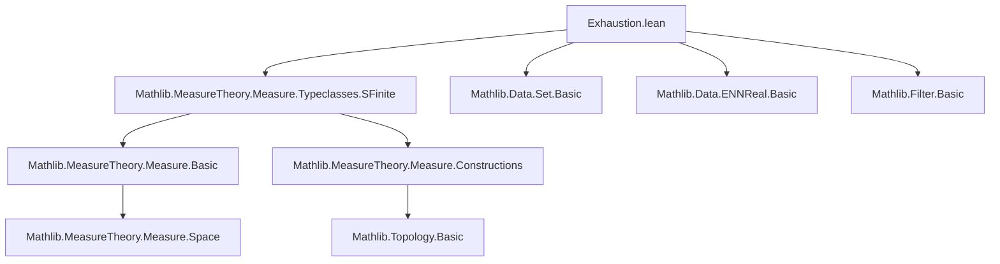
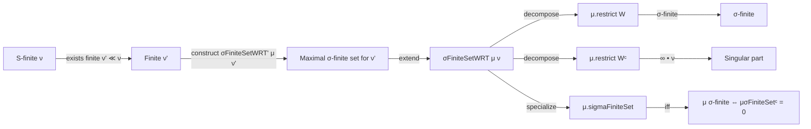

### Technical Brief: Exhaustion.lean — Method of Exhaustion in Measure Theory

---

#### **1. Key Definitions & Theorems**

| Name | Type / Signature | Purpose |
|------|------------------|---------|
| `Measure.sigmaFiniteSetWRT μ ν` | `Set α` | A measurable set `s` such that `μ.restrict s` is σ-finite and for all `t ⊆ sᶜ`, `ν t ≠ 0 → μ t = ∞`. Defined via Hilbert choice if such `s` exists; else `∅`. |
| `Measure.sigmaFiniteSet μ` | `Set α` | Special case: `μ.sigmaFiniteSetWRT μ`. Used to isolate the σ-finite part of an s-finite measure. |
| `Measure.sigmaFiniteSetGE μ ν n` | `Set α` (for `IsFiniteMeasure ν`) | A measurable set achieving near-maximal `ν`-measure among sets where `μ` is σ-finite, within `1/n`. |
| `Measure.sigmaFiniteSetWRT' μ ν` | `Set α` (for `IsFiniteMeasure ν`) | Union over `n` of `σFiniteSetGE μ ν n`; maximal σ-finite support w.r.t. `ν`. |
| `measure_eq_top_of_subset_compl_sigmaFiniteSetWRT` | `s ⊆ (μ.sigmaFiniteSetWRT ν)ᶜ → ν s ≠ 0 → μ s = ∞` | Core exhaustion property: outside the σ-finite part, any set with positive `ν`-measure has infinite `μ`-measure. |
| `restrict_compl_sigmaFiniteSetWRT` | `μ ≪ ν → μ.restrict (μ.sigmaFiniteSetWRT ν)ᶜ = ∞ • ν.restrict (μ.sigmaFiniteSetWRT ν)ᶜ` | Structural decomposition: the singular part is a scalar multiple (`∞`) of `ν`. |
| `restrict_compl_sigmaFiniteSet_eq_zero_or_top` | `μ.restrict μ.sigmaFiniteSetᶜ s ∈ ({0, ∞} : Set ENNReal)` | For s-finite `μ`, the singular part only takes values `0` or `∞`. |
| `measure_compl_sigmaFiniteSet_eq_zero_iff_sigmaFinite` | `μ μ.sigmaFiniteSetᶜ = 0 ↔ SigmaFinite μ` | Characterization of σ-finiteness via the complement of `μ.sigmaFiniteSet`. |

---

#### **2. Naming Conventions**

- **Prefixes**:
  - `sigmaFiniteSet`: indicates sets isolating σ-finite behavior.
  - `sigmaFiniteSetWRT`: “with respect to” another measure (`ν`).
  - `sigmaFiniteSetGE`: “greater or equal” — approximating the supremum of `ν` over σ-finite `μ`-sets.
  - `sigmaFiniteSetWRT'`: auxiliary maximal set for finite `ν`, used in proofs before generalizing to s-finite.

- **Suffixes**:
  - `WRT`: *With Respect To* (standard LeanMathlib convention).
  - `GE`: *Greater or Equal* (for lower bounds in approximations).
  - `'` (prime): auxiliary or intermediate construction (e.g., `WRT'` → `WRT`).

- **Other**:
  - `compl_`: refers to complements (e.g., `restrict_compl_sigmaFiniteSetWRT`).
  - `measure_`: often relates to values of measures on specific sets.

---

#### **3. Tactic Stack**

Frequently used tactics in this file:

| Tactic | Role |
|--------|------|
| `split_ifs` | Handles `if ... then ... else ...` definitions (e.g., `sigmaFiniteSetWRT`). |
| `rw [ Measure.sigmaFiniteSetWRT ]` | Rewriting definitions. |
| `split_ifs with h` + `h.choose_spec` | Extracting witnesses from existential choices. |
| `by_contra`, `simp at`, `simp only [...] at` | Eliminating contradictions and simplifying goals. |
| `exact`, `refine`, `apply` | Direct proof steps, especially for `SigmaFinite` instances. |
| `tendsto_of_tendsto_of_tendsto_of_le_of_le` | Proving convergence via squeeze theorem (for `tendsto_measure_sigmaFiniteSetGE`). |
| `apply le_antisymm` | Proving equality of ENNReals via two inequalities. |
| `rw [ Measure.restrict_apply' ...]`, `rw [ Measure.smul_apply]` | Unfolding measure restrictions and scalar multiplication. |
| `set_tac` (via `Set.` lemmas like `union_iUnion`, `compl_inter_self`) | Set-theoretic manipulations. |
| `infer_instance` | Solving typeclass goals (e.g., `SigmaFinite`). |
| `simp_rw` + `iSup_eq_zero`, `ENNReal.iSup_eq_zero` | Simplifying suprema over measurable sets. |

---

#### **4. Proof Logic**

The logical flow follows a **constructive exhaustion strategy**, inspired by Halmos:

1. **Finite case (`IsFiniteMeasure ν`)**:
   - Define `C = ⨆ {s : Measurable, σ-finite μ|s} ν s`.
   - Approximate `C` from below using `σFiniteSetGE μ ν n`, ensuring `ν tₙ ≥ C - 1/n`.
   - Show `tₙ` converges (in `ν`-measure) to a maximal set `σFiniteSetWRT' μ ν`.
   - Prove maximality: any set outside it with positive `ν`-measure must have infinite `μ`-measure.

2. **S-finite case (`SFinite ν`)**:
   - Reduce to finite case via absolute continuity: pick finite `ν' ≪ ν`.
   - Use `σFiniteSetWRT' μ ν'` as candidate for `σFiniteSetWRT μ ν`.
   - Show it satisfies the defining property for `ν` (using `μ ≪ ν` and monotonicity).

3. **Decomposition & characterizations**:
   - Use the exhaustion set to split `μ` into:
     - σ-finite part: `μ.restrict μ.sigmaFiniteSetWRT ν`
     - singular part: `μ.restrict (μ.sigmaFiniteSetWRT ν)ᶜ = ∞ • ν.restrict (μ.sigmaFiniteSetWRT ν)ᶜ`
   - Derive consequences: only `0` or `∞` on the complement, equivalence of σ-finiteness and null complement.

4. **Specialization to `μ = ν`**:
   - Define `μ.sigmaFiniteSet` as `μ.sigmaFiniteSetWRT μ`.
   - Prove `μ` is σ-finite iff `μ μ.sigmaFiniteSetᶜ = 0`.

---

#### **5. Imports & Dependencies**

- **Core imports**:
  ```lean
  Mathlib.MeasureTheory.Measure.Typeclasses.SFinite
  ```
  - Provides `SFinite`, `SigmaFinite`, and basic properties of measures.

- **Implicit dependencies** (via `open scoped ENNReal Topology`, `open Filter`, `Classical`):
  - `ENNReal` arithmetic, topology on `ENNReal`, filter convergence (`tendsto`), classical choice.

- **Key typeclasses used**:
  - `SigmaFinite`, `SFinite`, `IsFiniteMeasure`, `Measure.AbsolutelyContinuous (≪)`

---

#### **6. Mermaid Diagrams**

##### **Dependency Graph (Module-Level)**



##### **Conceptual Overview of the Theory**



##### **Proof Structure (High-Level)**

```mermaid
flowchart TD
  Start[Start: μ, ν measures, ν s-finite] --> FiniteCase[Finite ν case]
  FiniteCase --> Approx[Approximate sup ν(s) via σFiniteSetGE]
  Approx --> Union[Define σFiniteSetWRT' = ⋃ₙ σFiniteSetGEₙ]
  Union --> Maximal[Prove maximality & exhaustion property]
  SFiniteCase[S-finite ν] --> Reduce[Reduce to finite ν' ≪ ν]
  Reduce --> Apply[Apply finite case to ν']
  Apply --> Generalize[Show property holds for ν]
  Generalize --> Decompose[Decompose μ = μ|_W + μ|_Wᶜ]
  Decompose --> Corollaries[Corollaries: 0/∞-valued, σ-finiteness iff null complement]
```

---

#### **7. References**

- **Primary**:  
  [P. R. Halmos, *Measure Theory*, 17.3 and 30.11] — the method of exhaustion and decomposition of measures.

- **LeanMathlib context**:  
  - `Mathlib.MeasureTheory.Measure.Typeclasses.SFinite` — s-finiteness and its closure properties.
  - `Mathlib.MeasureTheory.Measure.Basic` — restrictions, absolute continuity, `iSup` over measurable sets.

--- 

This file formalizes a foundational decomposition theorem in measure theory, enabling fine-grained analysis of singular vs. σ-finite components of measures — a key tool in Radon–Nikodym theory and disintegration.
