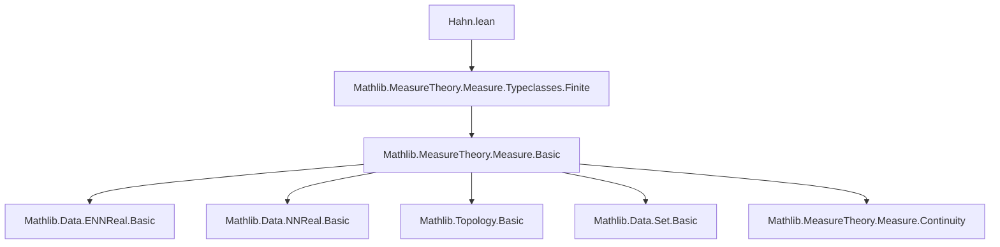
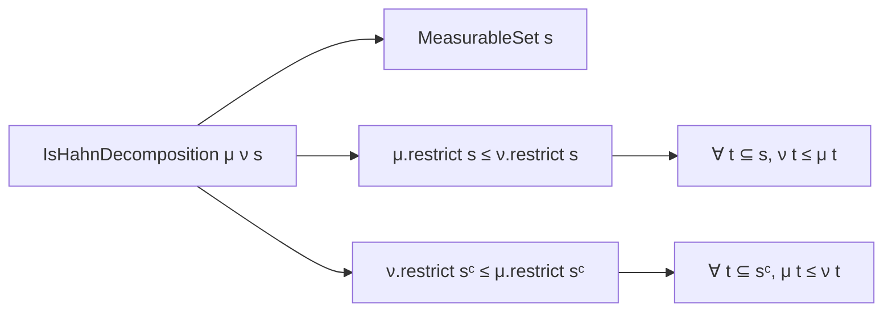

### Technical Brief: Hahn Decomposition in Lean 4 (Mathlib)

---

#### **1. Key Definitions & Theorems**

| Name | Type / Signature | Purpose |
|------|------------------|---------|
| `MeasureTheory.IsHahnDecomposition` | `Measure α → Measure α → Set α → Prop` | Characterizes a set `s` where `μ ≤ ν` on `s` and `ν ≤ μ` on `sᶜ`, via measure restrictions. |
| `hahn_decomposition` | `μ ν : Measure α → [IsFiniteMeasure μ] → [IsFiniteMeasure ν] → ∃ s, MeasurableSet s ∧ (∀ t ⊆ s, ν t ≤ μ t) ∧ (∀ t ⊆ sᶜ, μ t ≤ ν t)` | Main theorem: existence of a Hahn decomposition for finite measures. |
| `IsHahnDecomposition.compl` | `IsHahnDecomposition μ ν s → IsHahnDecomposition ν μ sᶜ` | Symmetry: complement of a Hahn decomposition for `(μ, ν)` is one for `(ν, μ)`. |
| `exists_isHahnDecomposition` | `μ ν : Measure α → [IsFiniteMeasure μ] → [IsFiniteMeasure ν] → ∃ s, IsHahnDecomposition μ ν s` | Reformulation of `hahn_decomposition` using the `IsHahnDecomposition` structure. |

---

#### **2. Naming Conventions**

- **Prefixes**:
  - `is_`: for predicate structures (`IsHahnDecomposition`)
  - `le_`, `ge_`: for inequality lemmas (`le_on`, `ge_on_compl`)
  - `d_`, `f_`, `e_`: internal helper functions/sets in the proof (e.g., `d`, `f n m`, `e n`)
- **Suffixes**:
  - `_on`, `_on_compl`: specify domain of inequality (e.g., `le_on`, `ge_on_compl`)
  - `_compl`: for complement-related lemmas (`IsHahnDecomposition.compl`)
- **Variables**:
  - `α`: type parameter for the space
  - `μ`, `ν`: measures
  - `s`, `t`, `u`: sets
  - `d`: signed difference of measures (`μ.toNNReal - ν.toNNReal`)
  - `γ`: supremum of `d` over measurable sets

---

#### **3. Tactic Stack**

Frequently used tactics in this file:

| Tactic | Role |
|--------|------|
| `simp_rw` | Rewriting with simplification (e.g., set identities) |
| `abel` | Solving linear arithmetic over abelian groups (used for algebraic simplifications of sums/diffs) |
| `rw` | Basic rewriting |
| `gcongr` | Congruence for inequalities (used in `calc` blocks) |
| `grw` | `gcongr` + `rw` (custom alias in Mathlib for inequality rewriting) |
| `linarith` | Linear arithmetic solver (e.g., for bounding `γ - (1/2)^n < d s`) |
| `exacts`, `exact` | Providing exact proof terms |
| `tendsto_*` lemmas | For continuity arguments (e.g., `tendsto_measure_iUnion_atTop`) |
| `cases`, `rcases`, `obtain` | Existential elimination and destructuring |
| `intro`, `refine`, `apply` | Proof construction |
| `simpa` | Simplify using assumptions and discharge goals |

---

#### **4. Proof Logic**

The proof follows a **measure-theoretic supremum construction**:

1. **Define signed difference** `d s = μ(s) - ν(s)` (via `toNNReal` to avoid `∞ - ∞`).
2. **Collect image** `c = d '' {measurable sets}` and define `γ = sup c`.
3. **Approximate supremum**: For each `n`, pick measurable `e n` with `γ - (1/2)^n < d (e n)`.
4. **Build nested intersections**: Define `f n m = ⋂_{i ∈ [n, m]} e i`, ensuring monotonicity and measurability.
5. **Lower bound on `d (f m n)`**: Prove `γ - 2·(1/2)^m + (1/2)^n ≤ d (f m n)` by induction.
6. **Define candidate set**: `s = ⋃_m ⋂_n f m n`.
7. **Show `γ ≤ d s`** using continuity of measure (via `tendsto` lemmas for unions/intersections).
8. **Verify decomposition properties**:
   - For `t ⊆ s`: Show `0 ≤ d t` ⇒ `ν t ≤ μ t`.
   - For `t ⊆ sᶜ`: Show `d t ≤ 0` ⇒ `μ t ≤ ν t`.

The proof leverages:
- **Continuity from below/above** for finite measures.
- **Supremum approximation** via sequences.
- **Measure algebra** (e.g., `measure_inter_add_diff`, `union_diff` identities).
- **ENNReal/NNReal coercion lemmas** to handle extended nonnegative reals.

---

#### **5. Imports & Dependencies**

- **Core imports**:
  ```lean
  Mathlib.MeasureTheory.Measure.Typeclasses.Finite
  ```
- **Key dependencies**:
  - `MeasureTheory.Measure.Basic`: measures, restrictions, monotonicity.
  - `MeasureTheory.Measure.ContinuityFromAbove/Below`: continuity of measures.
  - `Data.ENNReal.Basic`: extended nonnegative reals, `toNNReal`, `coe`, arithmetic.
  - `Data.Set.Basic`: set operations, `biInter`, `iUnion`, `iInter`.
  - `Topology.Basic`: filters, `tendsto`, neighborhoods.
  - `Data.NNReal.Basic`: nonnegative reals, coercion to `ℝ`, arithmetic.

---

#### **6. Mermaid Diagrams**

##### **Dependency Graph (Module-Level)**



##### **Theoretical Overview (Hahn Decomposition)**

```mermaid
flowchart LR
  A[Finite Measures μ, ν] --> B[Define d s = μ(s) - ν(s)]
  B --> C[Supremum γ = sup d(measurable sets)]
  C --> D[Approximate γ with sequence e n]
  D --> E[Build nested sets f n m = ⋂_{i∈[n,m]} e i]
  E --> F[Define s = ⋃_m ⋂_n f m n]
  F --> G[Prove γ ≤ d s via continuity]
  G --> H[Verify μ ≤ ν on s and ν ≤ μ on sᶜ]
  H --> I[IsHahnDecomposition μ ν s]
  I --> J[exists_isHahnDecomposition]
```

##### **Structure of `IsHahnDecomposition`**



---

#### **7. Summary**

This file formalizes the **unsigned Hahn decomposition theorem** for finite measures in Lean 4. It constructs a measurable set `s` where `μ` dominates `ν` on `s` and `ν` dominates `μ` on `sᶜ`. The proof is constructive in the sense of classical logic (uses ` Classical.axiom_of_choice`), relying on supremum approximation and measure continuity. The `IsHahnDecomposition` structure provides a reusable abstraction for reasoning about such decompositions, especially useful in later developments like the Radon–Nikodym theorem.

--- 

Let me know if you'd like a formalized dependency graph for the entire `Mathlib.MeasureTheory` hierarchy or a comparison with signed/complex Hahn decompositions.
