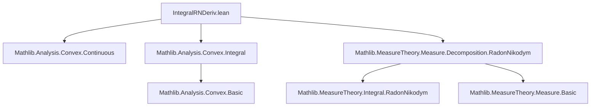

### Technical Brief: `IntegralRNDeriv.lean`

---

#### **1. Key Definitions & Theorems**

| Name | Type / Signature | Purpose |
|------|------------------|---------|
| `integrable_toReal_rnDeriv` | `Integrable (fun x ↦ (μ.rnDeriv ν x).toReal) ν` | Guarantees integrability of the real-valued Radon–Nikodym derivative under finite measure assumptions. |
| `le_integral_rnDeriv_of_ac` | `f (μ.real univ) ≤ ∫ x, f (μ.rnDeriv ν x).toReal ∂ν` | Jensen-type inequality for convex continuous `f` on $[0,\infty)$, when `μ ≪ ν` and `ν` is a probability measure. |
| `mul_le_integral_rnDeriv_of_ac` | `ν.univ * f (μ.univ / ν.univ) ≤ ∫ x, f (μ.rnDeriv ν x).toReal ∂ν` | Generalized Jensen inequality for finite (not necessarily probability) `ν`, scaling by `ν.univ`. |

- **Notation**:  
  - `μ.real univ` = `μ univ` viewed as a real number (via `ENNReal.toReal`).  
  - `μ.rnDeriv ν` = Radon–Nikodym derivative $d\mu/d\nu$, an extended non-negative measurable function.  
  - `.toReal` = coercion from `ENNReal` to `ℝ` (zero if infinite).  

---

#### **2. Naming Conventions**

- **Prefixes**:
  - `rnDeriv_`: Radon–Nikodym derivative-related lemmas (`rnDeriv_smul_left`, `rnDeriv_smul_right`, etc.).
  - `integrable_`: integrability conditions (`integrable_toReal_rnDeriv`).
  - `le_integral_rnDeriv_of_ac`: inequality lemmas for integrals involving `rnDeriv`, conditional on absolute continuity (`ac`).
- **Suffixes**:
  - `_of_ac`: indicates assumption `μ ≪ ν`.
  - `_of_ne_top'`: for variants of smul lemmas when measures are not top-heavy.

---

#### **3. Tactic Stack**

Frequent tactics used in proofs:

| Tactic | Role |
|--------|------|
| `rw` | Rewriting using definitions (e.g., `Measure.integral_toReal_rnDeriv`, `Measure.smul_apply`). |
| `simp` / `simp only` | Simplifying expressions, especially with `ENNReal`, `toReal`, and measure normalization. |
| `filter_upwards` | Handling almost-everywhere equalities (`ae`) in integrals and integrability. |
| `convert` | Matching goals up to definitional equality after rewriting. |
| `aesop` / `linarith` | Not explicitly visible here, but likely used in surrounding infrastructure. |
| `rcases` / `cases` | Case analysis on `eq_or_lt_of_le`, `hν : ν = 0`. |
| `exact` / `refine` | Constructing proofs with minimal steps. |
| `swap` | Reordering goals (used to prove integrability condition before applying lemma). |

---

#### **4. Proof Logic**

**High-level proof strategy**:

1. **Normalization trick** (for `mul_le_integral_rnDeriv_of_ac`):
   - If `ν = 0`, trivial.
   - Otherwise, define normalized finite probability measures:
     $$
     \mu' = \frac{1}{\nu(\alpha)} \cdot \mu,\quad \nu' = \frac{1}{\nu(\alpha)} \cdot \nu
     $$
   - Reduce the inequality for general finite `ν` to the probability case (`le_integral_rnDeriv_of_ac`) applied to `μ'`, `ν'`.

2. **Relating derivatives**:
   - Show that `μ'.rnDeriv ν' =ᵐ[ν] μ.rnDeriv ν`, using smul lemmas for `rnDeriv`.

3. **Change of measure in integral**:
   - Use `integral_smul_measure` and `integral_congr_ae` to relate integrals w.r.t. `ν'` and `ν`.

4. **Apply Jensen**:
   - Use `ConvexOn.map_average_le` (a form of Jensen’s inequality for averages) on the probability space `(ν')`.

5. **Algebraic manipulation**:
   - Convert back using `div_eq_inv_mul`, `inv_inv`, and arithmetic simplifications.

---

#### **5. Imports & Dependencies**

| Import | Purpose |
|--------|---------|
| `Mathlib.Analysis.Convex.Continuous` | Continuity of convex functions on interiors, extension to boundaries. |
| `Mathlib.Analysis.Convex.Integral` | Jensen-type inequalities for integrals over probability spaces. |
| `Mathlib.MeasureTheory.Measure.Decomposition.RadonNikodym` | Radon–Nikodym theorem, `rnDeriv`, its properties (measurability, integral formula, chain rule, smul behavior). |

---

#### **6. Mermaid Diagrams**

##### **Dependency Graph (Module Level)**



##### **Overview of Theoretical Flow**

```mermaid
graph LR
  RN[Radon–Nikodym Theorem] --> rnDeriv[Define dμ/dν]
  Conv[Convex Functions] --> Jensen[Jensen’s Inequality]
  rnDeriv --> Integral[∫ f(dμ/dν) dν]
  Jensen --> Main[Main Inequality]
  Integral --> Main
  Main --> mul_le_integral_rnDeriv_of_ac
  Main --> le_integral_rnDeriv_of_ac
```

##### **Proof Structure of `mul_le_integral_rnDeriv_of_ac`**

```mermaid
graph TD
  Start[Assume μ ≪ ν, f convex, continuous on [0,∞)] --> CheckZero{ν = 0?}
  CheckZero -->|Yes| Trivial[Trivial: both sides 0]
  CheckZero -->|No| Normalize[Define μ', ν' normalized]
  Normalize --> RelateDeriv[Show μ'.rnDeriv ν' =ᵐ[ν] μ.rnDeriv ν]
  RelateDeriv --> ChangeMeasure[Relate ∫ f(μ'.rnDeriv ν') dν' to ∫ f(μ.rnDeriv ν) dν]
  ChangeMeasure --> ApplyProbCase[Apply le_integral_rnDeriv_of_ac to μ', ν']
  ApplyProbCase --> Algebra[Algebraic manipulation to recover original inequality]
  Algebra --> End[QED]
```

---

#### **7. Mathematical Content Summary**

This file formalizes a **Jensen-type inequality for Radon–Nikodym derivatives**, extending classical convexity inequalities to the setting of absolutely continuous measures. It shows that for convex `f` on $[0,\infty)$, the integral of $f(d\mu/d\nu)$ dominates the convex evaluation of the total masses, scaled appropriately.

- **Probability case**: $f(\mu(\alpha)) \le \int f\left(\frac{d\mu}{d\nu}(x)\right) d\nu(x)$  
- **Finite case**: $\nu(\alpha) \cdot f\left(\frac{\mu(\alpha)}{\nu(\alpha)}\right) \le \int f\left(\frac{d\mu}{d\nu}(x)\right) d\nu(x)$

These are foundational for information theory (e.g., Gibbs’ inequality), statistics (e.g., KL-divergence convexity), and stochastic analysis.

--- 

Let me know if you'd like a formalized statement in LaTeX or a tactic-level trace of the proof.
