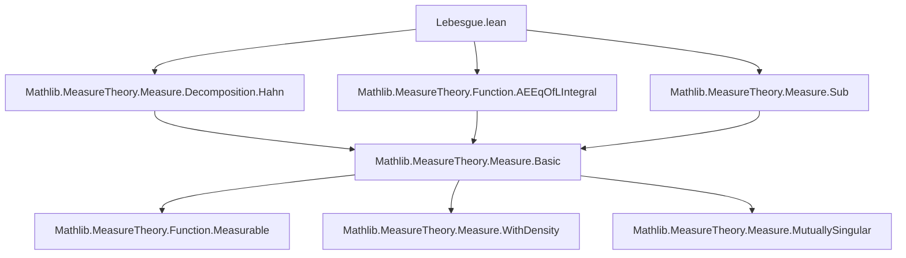
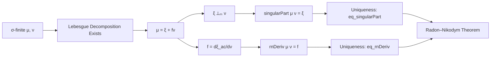
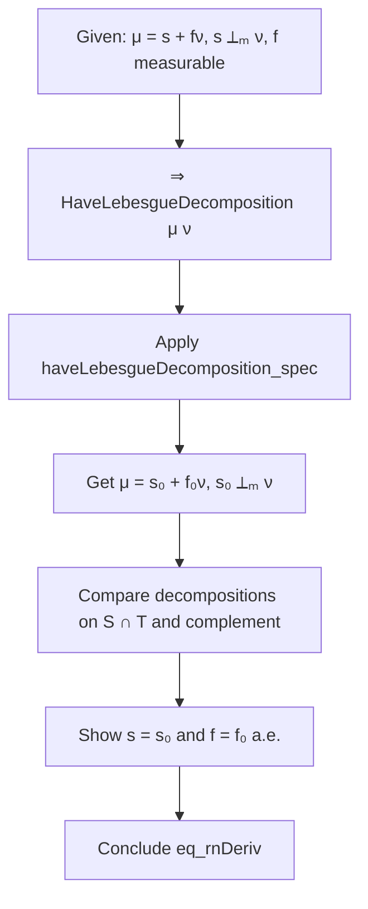

### Technical Brief: Lebesgue Decomposition in Lean 4 (Mathlib)

---

#### **1. Key Definitions & Theorems**

| Name | Type / Signature | Purpose |
|------|------------------|---------|
| `HaveLebesgueDecomposition μ ν` | `Prop` | States that $ \mu = \xi + \nu \llcorner f $ for some measure $ \xi \perp \nu $ and measurable $ f \ge 0 $. |
| `singularPart μ ν` | `Measure α` | The *singular part* of $ \mu $ w.r.t. $ \nu $: the unique $ \xi \perp \nu $ in the decomposition. |
| `rnDeriv μ ν` | `α → ℝ≥0∞` | The *Radon–Nikodym derivative* $ f = \frac{d\mu_{\text{ac}}}{d\nu} $, where $ \mu_{\text{ac}} \ll \nu $. |
| `haveLebesgueDecomposition_spec` | `h : HaveLebesgueDecomposition μ ν ⊢ ...` | Extracts the witness: $ \mu = \mu.singularPart\ \nu + \nu.withDensity\ (\mu.rnDeriv\ \nu) $, with measurability and mutual singularity. |
| `haveLebesgueDecomposition_of_sigmaFinite` | `σ-finite μ → σ-finite ν → HaveLebesgueDecomposition μ ν` | **Main theorem**: Lebesgue decomposition holds for σ-finite measures. |
| `eq_singularPart` | `μ = s + ν.withDensity f ∧ s ⟂ₘ ν ∧ f measurable ⊢ s = μ.singularPart ν` | Uniqueness of the singular part. |
| `eq_rnDeriv` | `μ = s + ν.withDensity f ∧ s ⟂ₘ ν ∧ f measurable ⊢ f =ᵐ[ν] μ.rnDeriv ν` | Uniqueness of the RN derivative a.e. w.r.t. $ \nu $. |
| `rnDeriv_withDensity` | `[σ-finite ν] ⊢ (ν.withDensity f).rnDeriv ν =ᵐ[ν] f` | RN derivative of a density w.r.t. its base measure is the density itself (a.e.). |
| `rnDeriv_self` | `[σ-finite μ] ⊢ μ.rnDeriv μ =ᵐ[μ] 1` | RN derivative of a measure w.r.t. itself is 1 a.e. |
| `singularPart_eq_zero_of_ac` | `μ ≪ ν ⊢ μ.singularPart ν = 0` | If $ \mu \ll \nu $, then the singular part vanishes. |
| `withDensity_rnDeriv_eq_zero` | `[HaveLebesgueDecomposition μ ν] ⊢ ν.withDensity (μ.rnDeriv ν) = 0 ↔ μ ⟂ₘ ν` | Characterizes when the absolutely continuous part vanishes. |

---

#### **2. Naming Conventions**

- **Prefixes**:
  - `haveLebesgueDecomposition_`: properties of the `HaveLebesgueDecomposition` predicate.
  - `singularPart_`: properties of `singularPart`.
  - `rnDeriv_`: properties of `rnDeriv`.
  - `eq_`: uniqueness theorems (e.g., `eq_singularPart`, `eq_rnDeriv`).
  - `withDensity_`: lemmas about `withDensity`.
- **Suffixes**:
  - `_left`, `_right`: indicate which argument is varied (e.g., `singularPart_smul_right`).
  - `_ae`: almost-everywhere statements (e.g., `rnDeriv_lt_top` → `rnDeriv_lt_top_ae` is implicit).
  - `_of_`: conditional versions (e.g., `singularPart_eq_zero_of_ac`).
  - `_restrict`: behavior under restriction to measurable sets.
- **Special**:
  - `inst_`: typeclass instances (e.g., `instHaveLebesgueDecompositionZeroLeft`).
  - `aemeasurable_`, `ae_`: almost-everywhere measurable or equality.

---

#### **3. Tactic Stack**

| Tactic | Frequency | Role |
|--------|-----------|------|
| `by_cases` | Very High | Split on `HaveLebesgueDecomposition μ ν` (decidable via `Classical`). |
| `rw [...]` | Very High | Rewrite using definitions (`singularPart`, `rnDeriv`, `haveLebesgueDecomposition_spec`, etc.). |
| `simp` / `simp only` | High | Simplify using `withDensity`, `add`, `zero`, `restrict`, `indicator`, `ae`-lemmas. |
| `exact` / `assumption` | Medium | Apply known facts (e.g., `measurable_zero`, `mutuallySingular.zero_left`). |
| `fun_prop` | Medium | Prove measurability (e.g., of `rnDeriv`, sums, indicators). |
| `filter_upwards` | Medium | Handle almost-everywhere quantifiers. |
| `aesop` | Low | Used sparingly; mostly manual automation. |
| `conv_rhs => rw [...]` | Medium | Focused rewriting on one side of an equation. |
| `rwa [...]` | Medium | Rewrite + apply (e.g., in `rnDeriv_self`). |
| `ext1` / `ext` | High | Extensionality for measures/functions. |
| `linarith`, `interval_cases` | Low | Rare; mostly algebraic manipulations via `ring`/`norm_num`. |

---

#### **4. Proof Logic**

The proofs follow a **structured case analysis** on whether $ \mu, \nu $ admit a Lebesgue decomposition (guaranteed for σ-finite measures). Key logical patterns:

1. **Case split on `HaveLebesgueDecomposition μ ν`**  
   - If true: use `haveLebesgueDecomposition_spec` to get the decomposition.
   - If false: reduce to trivial cases (`rnDeriv = 0`, `singularPart = 0`).

2. **Uniqueness via mutual singularity & absolute continuity**  
   - Given two decompositions $ \mu = s + f\nu = s' + f'\nu $, with $ s, s' \perp \nu $,  
     show $ s = s' $ and $ f = f' $ a.e. by restricting to the disjoint support sets from mutual singularity.

3. **Almost-everywhere reasoning**  
   - Use `ae_restrict_iff'`, `ae_eq_iff`, `withDensity_absolutelyContinuous`, and `measure_mono_null` to handle null sets.

4. **σ-finiteness exploitation**  
   - Used in key results like `rnDeriv_lt_top`, `rnDeriv_self`, `rnDeriv_withDensity`, and `withDensity_eq_iff_of_sigmaFinite`.

5. **Monotonicity & domination**  
   - Lemmas like `singularPart_le`, `withDensity_rnDeriv_le` let us transfer properties (finiteness, σ-finiteness, local finiteness) from $ \mu $ to its components.

---

#### **5. Imports & Dependencies**

| Module | Role |
|--------|------|
| `Mathlib.MeasureTheory.Measure.Decomposition.Hahn` | Hahn decomposition & Jordan decomposition (foundation for singularity). |
| `Mathlib.MeasureTheory.Function.AEEqOfLIntegral` | Tools for almost-everywhere equality via integrals (used in `withDensity_eq_iff`). |
| `Mathlib.MeasureTheory.Measure.Sub` | Submeasure theory, restrictions, and monotonicity lemmas. |

**Core dependencies**:  
- `MeasureTheory.Measure.Basic` (via imports)  
- `MeasureTheory.Measure.WithDensity` (implicit via `withDensity`)  
- `MeasureTheory.Measure.MutuallySingular` (via `perp_m`)  
- `MeasureTheory.Function.Measurable` (for `measurable_rnDeriv`, `measurable_zero`, etc.)

---

#### **6. Mermaid Diagrams**

##### **Dependency Graph (Module-Level)**

##### **Theoretical Overview (Lebesgue Decomposition)**

##### **Proof Strategy Flow (Uniqueness of `rnDeriv`)**

---

#### **7. Summary**

This file formalizes the **Lebesgue decomposition theorem** and derives the **Radon–Nikodym derivative** as a corollary. It introduces:
- A *predicate* `HaveLebesgueDecomposition` capturing the decomposition,
- *Selectors* `singularPart` and `rnDeriv` (using `Classical.choice`),
- A rich theory of their properties (uniqueness, monotonicity, behavior under operations),
- And crucially proves existence for σ-finite measures.

The formalization is highly structured, with careful attention to:
- Measurability (`fun_prop`),
- Almost-everywhere reasoning (`filter_upwards`, `ae_`),
- σ-finiteness as a key hypothesis for nontrivial RN calculus.

It serves as a foundational module for integration theory, probability (conditional expectation), and geometric measure theory in Mathlib.
