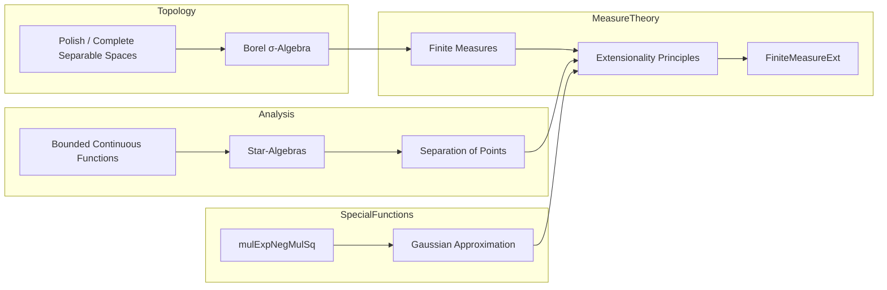

**Technical Brief: `FiniteMeasureExt.lean`**

---

### 1. **Key Definitions & Theorems**

| Name | Type / Signature | Purpose |
|------|------------------|---------|
| `ext_of_forall_mem_subalgebra_integral_eq_of_pseudoEMetric_complete_countable` | `∀ {P P' : Measure E}, [IsFiniteMeasure P] → [IsFiniteMeasure P'] → {A : StarSubalgebra 𝕜 (E →ᵇ 𝕜)} → (A.map …).SeparatesPoints → (∀ g ∈ A, ∫ g ∂P = ∫ g ∂P') → P = P'` | Main extensionality result: if two finite Borel measures agree on integrals over a *-subalgebra of bounded continuous functions that separates points (and the space is complete, separable, pseudo-EMetric), then the measures are equal. |
| `ext_of_forall_mem_subalgebra_integral_eq_of_polish` | Same as above, but assumes `PolishSpace E` instead of `CompleteSpace E` + `SecondCountableTopology E` | Corollary for Polish spaces (using `upgradeIsCompletelyMetrizable`). |

**Auxiliary constructions**:
- `A_toReal`: Real subalgebra of real-valued elements in `A`, obtained via `restrictScalars ℝ` and `comap` along the canonical map `ofRealAm`.
- `hA_toReal`: Proof that `A_toReal` separates points (via `RCLike.restrict_toContinuousMap_eq_toContinuousMapStar_restrict` and `SeparatesPoints.rclike_to_real`).
- `heq'`: Extension of integral equality from `A` to `A_toReal`, using `integral_ofReal` and injectivity of `ofReal`.

---

### 2. **Naming Conventions**

- **Prefixes**:
  - `ext_`: Extensionality theorems (`ext_of_…`).
  - `h_`: Hypothesis names (`hA`, `heq`, `h0`, `lim1`, `lim2`).
  - `A_`, `P_`, `P'_`: Variable-related names (`A_toReal`, `heq'`).
- **Suffixes**:
  - `_of_…`: Conditions or assumptions (e.g., `of_pseudoEMetric_complete_countable`, `of_IsFiniteMeasure`).
  - `_comp`: Composition with a function (e.g., `mulExpNegMulSq ε (f x)`).
- **Function names**:
  - `mulExpNegMulSq`: Special function $x \mapsto e^{-\varepsilon x^2}$ (used in approximation argument).
  - `toContinuousMapStarₐ`, `toContinuousMapₐ`: Canonical maps from algebraic structures to continuous maps.
  - `ofRealAm`, `ofReal`: Embedding of reals into `𝕜` (ℂ or ℝ).
  - `restrictScalars`, `comap`, `map`: Standard algebra/map operations.

---

### 3. **Tactic Stack**

- `rw`: Rewriting using definitional equalities and lemmas (e.g., `integral_ofReal`, `ofReal_inj`).
- `exact`: Final proof step using a hypothesis or theorem.
- `apply`: Applying a theorem with unification (e.g., `ext_of_forall_integral_eq_of_IsFiniteMeasure`).
- `intro`: Introducing variables/hypotheses.
- `nth_rewrite`: Controlled rewriting at specific positions.
- `tendsto_*` tactics: `squeeze_zero'`, `tendsto_nhdsWithin_of_tendsto_nhds`, `Tendsto.abs`, `Tendsto.sub`, `Tendsto.const_mul`, `tendsto_nhds_unique`.
- `exact fun x hx => …`: Constructing functions extensionally.
- `have`: Introducing intermediate lemmas (`h0`, `lim1`, `lim2`).
- `let` / `letI`: Introducing definitions and instances (`A_toReal`, `↑P`, `↑P'`).

---

### 4. **Proof Logic**

The proof proceeds in the following logical flow:

1. **Reduction to real case**:
   - Extract real subalgebra `A_toReal` from complex `A`.
   - Show `A_toReal` separates points.
   - Extend integral equality to `A_toReal`.

2. **Approximation via Gaussian kernels**:
   - For arbitrary bounded measurable `f`, consider $g_\varepsilon(x) = e^{-\varepsilon f(x)^2}$.
   - Use properties of `mulExpNegMulSq` and the separating algebra to approximate indicator functions.

3. **Two limiting arguments**:
   - Show that the difference of integrals of $g_\varepsilon$ w.r.t. $P$ and $P'$ tends to 0 as $\varepsilon \to 0^+$ (`lim1`), using a quantitative estimate (`dist_integral_mulExpNegMulSq_comp_le`).
   - Show that the same difference tends to $|\int f \, dP - \int f \, dP'|$ (`lim2`), via continuity of the integral.

4. **Conclusion**:
   - Uniqueness of limits implies the difference is zero.
   - Apply `eq_of_abs_sub_eq_zero` to conclude $\int f \, dP = \int f \, dP'$ for all bounded measurable $f$, hence $P = P'$.

The second theorem (`polish`) reduces to the first by upgrading the topology to a complete metric one.

---

### 5. **Imports & Dependencies**

| Module | Role |
|--------|------|
| `Mathlib.Analysis.RCLike.BoundedContinuous` | Provides `BoundedContinuousFunction`, `StarSubalgebra`, and maps like `toContinuousMapStarₐ`. |
| `Mathlib.Analysis.SpecialFunctions.MulExpNegMulSqIntegral` | Contains lemmas about $x \mapsto e^{-\varepsilon x^2}$ and its integral behavior. |
| `Mathlib.MeasureTheory.Measure.HasOuterApproxClosed` | Supplies `ext_of_forall_integral_eq_of_IsFiniteMeasure`, the core extensionality criterion. |

**Core underlying theories**:
- Measure theory (finite Borel measures, integration).
- Functional analysis (algebras of continuous functions, separation of points).
- Topology (Polish, complete, separable spaces, Borel σ-algebras).
- Real/complex analysis (RCLike fields, embeddings of ℝ, continuity, limits).

---

### 6. **Mermaid Diagrams**

#### **Dependency Graph (Module-Level)**


#### **Theoretical Flow (Proof Structure)**

```mermaid
graph TD
  A[Start: Two finite measures P, P'] --> B[Reduce to real subalgebra A_toReal]
  B --> C[Show A_toReal separates points]
  C --> D[Extend integral equality to A_toReal]
  D --> E[Consider Gaussian approximations g_ε = exp(-ε f²)]
  E --> F[Show ∫g_ε dP - ∫g_ε dP' → 0 as ε → 0⁺]
  E --> G[Show ∫g_ε dP → ∫f dP as ε → 0⁺]
  F & G --> H[Uniqueness of limit ⇒ ∫f dP = ∫f dP']
  H --> I[Conclude P = P']
```

#### **Overview of Theory Context**



--- 

This module formalizes a functional-analytic extensionality principle for finite measures, leveraging approximation by Gaussian kernels and the Stone–Weierstrass-type separation property.
