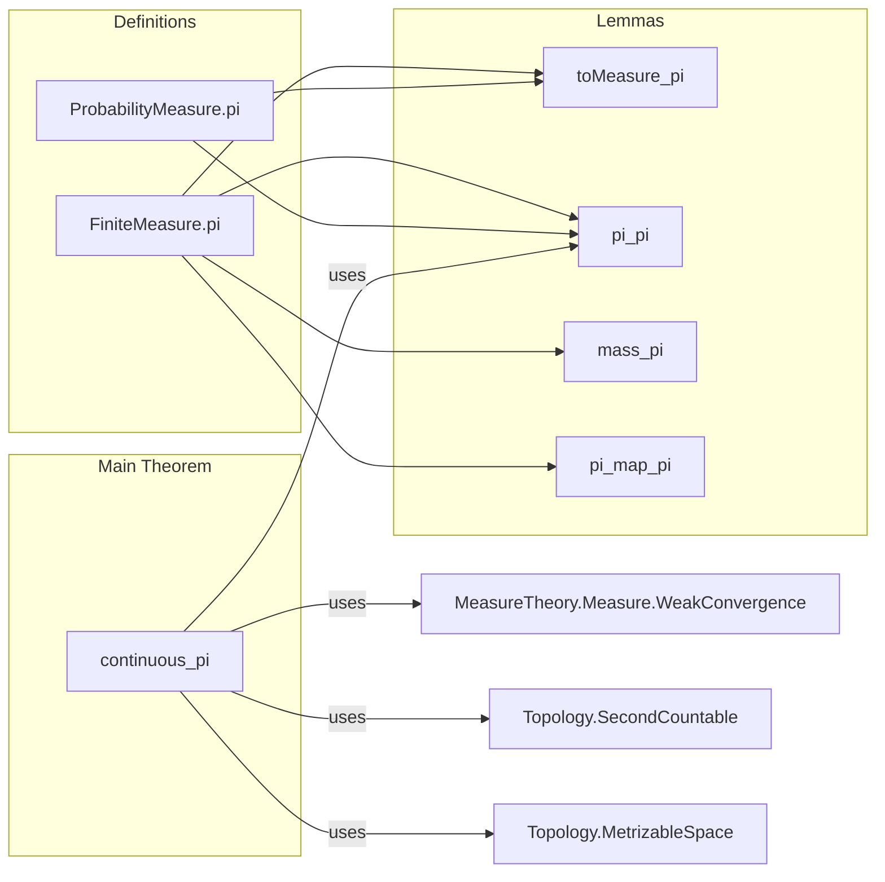
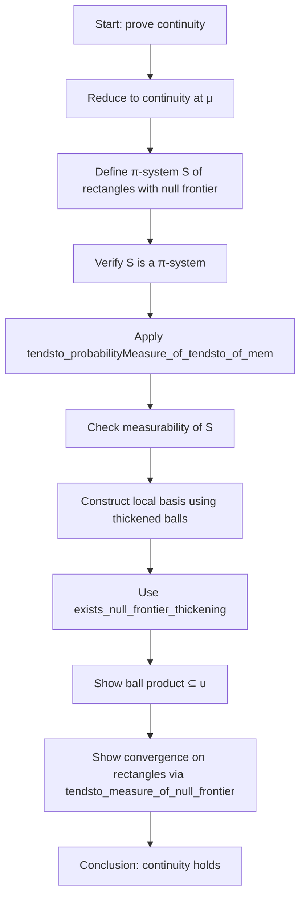

**Technical Brief: `FiniteMeasurePi.lean`**

---

### 1. KEY DEFINITIONS & THEOREMS

| Name | Type / Signature | Purpose |
|------|------------------|---------|
| `FiniteMeasure.pi` | `(μ : Π i, FiniteMeasure (α i)) → FiniteMeasure (Π i, α i)` | Constructs the product of finitely many finite measures over a dependent product space. |
| `ProbabilityMeasure.pi` | `(μ : Π i, ProbabilityMeasure (α i)) → ProbabilityMeasure (Π i, α i)` | Constructs the product of finitely many probability measures. |
| `toMeasure_pi` | `(FiniteMeasure.pi μ).toMeasure = Measure.pi (fun i ↦ μ i)` | Relates the product finite measure to the underlying measure-theoretic product. |
| `pi_pi` | `(FiniteMeasure.pi μ) (Set.pi univ s) = ∏ i, μ i (s i)` | Evaluates the product measure on a measurable rectangle (product of sets). |
| `mass_pi` | `(FiniteMeasure.pi μ).mass = ∏ i, (μ i).mass` | Computes the total mass of the product finite measure. |
| `pi_map_pi` | `(FiniteMeasure.pi μ).map (fun x i ↦ f i (x i)) = FiniteMeasure.pi (fun i ↦ (μ i).map (f i))` | Commutes product with pushforward under measurable maps (a.e. measurable). |
| `continuous_pi` | `Continuous (fun μ ↦ ProbabilityMeasure.pi μ)` | Shows that the product operation on probability measures is continuous in the weak topology (under metrizable, separable assumptions). |

---

### 2. NAMING CONVENTIONS

- **Prefixes**:
  - `pi_`: for lemmas about the product operation (`pi_pi`, `pi_map_pi`, `toMeasure_pi`).
  - `mass_`: for total mass-related properties (`mass_pi`).
- **Suffixes**:
  - `_pi`: indicates product-related behavior.
  - `_map_pi`: indicates interaction with pushforward (`map`) and product.
- **General style**:
  - `pi` used as a noun/verb in definitions (`pi`, `pi_map_pi`).
  - `univ.pi s` for Cartesian product over `univ : Finset ι`.

---

### 3. TACTIC STACK

Frequently used tactics in this file:

| Tactic | Role |
|--------|------|
| `simp` / `simp only` | Simplify using definitional equalities and lemmas like `pi_pi`, `toMeasure_pi`. |
| `rw` | Rewrite using lemmas (e.g., `← pi_univ`, `pi_pi`). |
| `apply Subtype.ext` | Prove equality of subtype values (e.g., finite measures) by extensionality. |
| `exact` / `refine` | Construct proofs stepwise, especially in `continuous_pi`. |
| `gcongr` | Handle inequalities in products (e.g., bounding balls). |
| `have`, `obtain`, `choose!` | Introduce intermediate facts and choice functions (e.g., `rpos`, `hr`). |
| `simpa` | Simplify with assumptions (e.g., `simpa using hr i`). |
| `tendsto_probabilityMeasure_of_tendsto_of_mem` | Key lemma for weak convergence proofs via π-systems. |
| `IsPiSystem` / `pi_inter_distrib` | Verify π-system properties for convergence arguments. |

---

### 4. PROOF LOGIC

**Structure of `continuous_pi`** (main nontrivial proof):

1. **Goal**: Show continuity of `μ ↦ ProbabilityMeasure.pi μ` in the weak topology.
2. **Reduction**: Use `continuous_iff_continuousAt` and reduce to showing:
   $$
   \text{If } \mu^{(n)}_i \to \mu_i \text{ weakly for each } i, \text{ then } \bigotimes_i \mu^{(n)}_i \to \bigotimes_i \mu_i \text{ weakly}.
   $$
3. **π-system selection**:
   - Define $S = \{ \prod_i s_i \mid \forall i,\ \mu_i(\partial s_i) = 0,\ \text{Measurable}(s_i) \}$.
   - Show $S$ is a π-system (closed under finite intersections).
4. **Apply convergence criterion**:
   - Use `tendsto_probabilityMeasure_of_tendsto_of_mem`, which requires:
     - $S$ is a π-system.
     - Sets in $S$ are measurable.
     - For any neighborhood $U$ of $x$, there exists $V \in S$ with $x \in V \subseteq U$.
     - For each $V = \prod_i s_i \in S$, $\mu^{(n)}(V) \to \mu(V)$.
5. **Construction of $V$**:
   - Use `exists_null_frontier_thickening` to pick radii $r_i$ such that $\mu_i(\partial B(x_i, r_i)) = 0$.
   - Define $V = \prod_i B(x_i, r_i)$, which lies in $S$ and fits inside $U$.
6. **Convergence on rectangles**:
   - Use `tendsto_measure_of_null_frontier_of_tendsto` on each factor, then product continuity (`tendsto_finset_prod`).

**Inductive or case-based reasoning is not used**; the proof is analytic, relying on measure-theoretic convergence theorems and topology.

---

### 5. IMPORTS & DEPENDENCIES

**Primary imports**:
- `Mathlib.MeasureTheory.Measure.LevyProkhorovMetric`: Provides tools for weak convergence and the Lévy–Prokhorov metric.
- `Mathlib.MeasureTheory.Measure.PiMeasure`: Implicitly used via `Measure.pi` (product measure).
- `Mathlib.Topology.Bases.SecondCountable`, `Mathlib.Topology.Metrizable`, `Mathlib.Topology.MeasurableSpace.BorelSpace`: For topological assumptions (second countable, pseudo-metrizable, Borel measurable).

**Key dependencies**:
- `MeasureTheory.Measure.PiMeasure`
- `MeasureTheory.Measure.WeakConvergence`
- `Topology.MetrizableSpace`
- `Topology.BoundedContinuousFunction` (for `BoundedContinuousFunction` scoped notation)

---

### 6. MERMAID DIAGRAMS

#### Dependency Graph (Module-Level)

#### Overview of File Structure

#### Proof Strategy Flow (for `continuous_pi`)

--- 

This file formalizes foundational product measure theory for finite families, with emphasis on continuity in the weak topology — a key ingredient for probabilistic limit theorems (e.g., law of large numbers, central limit theorems) in dependent settings.
