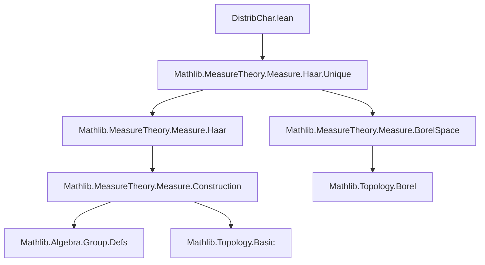

### Technical Brief: `DistribChar.lean`

---

#### **1. Key Definitions & Theorems**

| Name | Type | Purpose |
|------|------|---------|
| `distribHaarChar` | `G →* ℝ≥0` | Group homomorphism assigning to each `g : G` the *distributive Haar scaling factor* — the unique $ r \in \mathbb{R}_{\ge 0} $ such that $ \mu(g \bullet s) = r \cdot \mu(s) $ for all Haar measures $ \mu $ and measurable $ s \subseteq A $. |
| `addHaarScalarFactor` | (implicit, from `Mathlib.MeasureTheory.Measure.Haar.Unique`) | Given two Haar measures $ \nu, \mu $, returns the unique $ r \in \mathbb{R}_{\ge 0} $ with $ \nu = r \cdot \mu $. Used to define `distribHaarChar`. |
| `distribHaarChar_pos` | `0 < distribHaarChar A g` | Positivity of the scaling factor (nonzero, hence strictly positive). |
| `addHaarScalarFactor_smul_eq_distribHaarChar` | `addHaarScalarFactor (g • μ) μ = distribHaarChar A g` | Relates the scalar factor of the pulled-back measure $ g \bullet \mu $ to `distribHaarChar`. |
| `addHaarScalarFactor_smul_inv_eq_distribHaarChar` | `addHaarScalarFactor μ ((g⁻¹) • μ) = distribHaarChar A g` | Shows invariance under inverse action. |
| `addHaarScalarFactor_smul_eq_distribHaarChar_inv` | `addHaarScalarFactor μ (g • μ) = (distribHaarChar A g)⁻¹` | Scaling factor for pushing forward via $ g $ is inverse of pullback factor. |
| `distribHaarChar_mul` | `distribHaarChar A g * μ s = μ (g • s)` | Fundamental identity: scaling factor times measure of set equals measure of scaled set. |
| `distribHaarChar_eq_div` | `distribHaarChar A g = μ(g • s) / μ(s)` (under finiteness/nonzero assumptions) | Explicit formula for scaling factor via ratio of measures. |
| `distribHaarChar_eq_of_measure_smul_eq_mul` | If $ \mu(g \bullet s) = r \cdot \mu(s) $, then $ \text{distribHaarChar}\, g = r $ | Uniqueness: scaling factor is the only $ r $ satisfying the measure identity. |

---

#### **2. Naming Conventions**

- **Prefixes**:
  - `distribHaarChar_`: for properties of the distributive Haar character.
  - `addHaarScalarFactor_`: for lemmas about the scalar factor between Haar measures.
- **Suffixes**:
  - `_smul`, `_smul_eq`, `_smul_inv`: indicate action via scalar multiplication (`•`) or its inverse.
  - `_mul`: indicates multiplicative behavior (e.g., `distribHaarChar_mul`).
  - `_eq_div`, `_eq_of_...`: indicate equality derived via division or uniqueness.

---

#### **3. Tactic Stack**

- `simp`, `simp_rw`: heavily used for rewriting definitions and simplifying expressions involving `•`, `smul`, `addHaar`, etc.
- `rw`: for applying lemmas and rewriting goals.
- `congr 1`: to reduce equality of functions to equality on arguments.
- `borelize A`: to upgrade topological assumptions to Borel space structure.
- `exact`, `refine`: for direct proof completion.
- `have : ... := by ...`: intermediate lemmas.
- `pos_iff_ne_zero.mpr ...`: to prove positivity via nonzeroness (via `isUnit`).
- `ENNReal.mul_div_cancel_right`, `ENNReal.coe_injective`: for handling extended nonnegative reals and coercion to $ \mathbb{R}_{\ge 0} $.

---

#### **4. Proof Logic**

- **Structure**:
  1. **Definition**: Define `distribHaarChar` as a group homomorphism using `addHaarScalarFactor`, leveraging uniqueness of Haar measures.
  2. **Homomorphism proof**:
     - `map_one'`: trivial via `simp`.
     - `map_mul'`: uses `addHaarScalarFactor_eq_mul`, `mul_smul`, and `addHaarScalarFactor_domSMul`.
  3. **Key lemmas**:
     - Derive action on measures (`distribHaarChar_mul`) using `isAddLeftInvariant_eq_smul_of_regular`.
     - Derive ratio formulas (`distribHaarChar_eq_div`, `distribHaarChar_eq_of_measure_smul_eq_mul`) using `ENNReal` arithmetic.
  4. **Inverses & positivity**: Use group-theoretic facts (`isUnit`) and `ENNReal` properties.

- **Common pattern**:
  - Reduce to known facts about `addHaar` and `addHaarScalarFactor`.
  - Use `borelize` to ensure Borel measurability.
  - Leverage regularity of $ \mu $ for measure-theoretic identities.

---

#### **5. Imports**

- `Mathlib.MeasureTheory.Measure.Haar.Unique`: core source of Haar measure uniqueness and `addHaarScalarFactor`.
- Implicit dependencies:
  - `Mathlib.MeasureTheory.Measure.Haar` (via `addHaar`)
  - `Mathlib.MeasureTheory.Measure.BorelSpace`
  - `Mathlib.Algebra.Group.Defs` (for `Group`, `DistribMulAction`)
  - `Mathlib.Topology.Basic` (for `TopologicalSpace`, `LocallyCompactSpace`, `IsTopologicalAddGroup`)
  - `Mathlib.MeasureTheory.Measure.Construction` (for `smul`, `domSMul`, `DomMulAct`)

---

#### **6. Mermaid Diagrams**

##### **Dependency Graph (Module-Level)**



##### **Conceptual Overview (Theory Flow)**

```mermaid
flowchart LR
  subgraph Setup
    G[Group G] -->|DistribMulAction| A[AddCommGroup A]
    A -->|LocallyCompact| T[TopologicalSpace A]
    T -->|IsTopologicalAddGroup| I[IsTopologicalAddGroup A]
    I -->|ContinuousConstSMul| C[Continuous action]
  end

  subgraph HaarMeasure
    C -->|pullback| μ[Haar measure μ]
    μ -->|g • ·| gμ[Pullback g • μ]
    gμ -->|uniqueness| r[∃! r : ℝ≥0, gμ = r • μ]
  end

  subgraph Definition
    r -->|define| Δ[distribHaarChar : G →* ℝ≥0]
  end

  subgraph Properties
    Δ -->|distribHaarChar_mul| MeasureAction[μ(g • s) = Δ(g)·μ(s)]
    Δ -->|distribHaarChar_pos| Pos[Δ(g) > 0]
    Δ -->|homomorphism| Hom[Δ(gg') = Δ(g)Δ(g')]
  end

  MeasureAction --> Ratio[μ(g•s)/μ(s) = Δ(g)]
  Ratio --> Uniqueness[If μ(g•s) = r·μ(s), then r = Δ(g)]
```

---

#### **7. Summary**

This module formalizes the *distributive Haar character*, a canonical group homomorphism $ G \to \mathbb{R}_{>0} $ describing how a group acting by additive morphisms scales Haar measure. It leverages uniqueness of Haar measures to define the scaling factor, then proves key algebraic and measure-theoretic properties (positivity, multiplicativity, ratio formulas). The development mirrors the *modular character* in the multiplicative case (`modularCharacter`), but adapts to additive actions via `DistribMulAction`.
